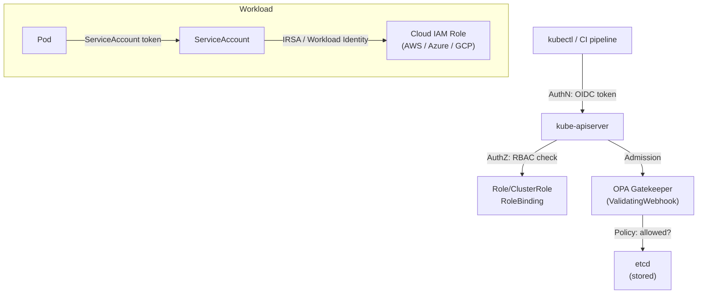

# Kubernetes RBAC & Security

## Category
Security, IAM, Kubernetes

## Context

Kubernetes security has four enforcement layers:

| Layer | Mechanism | Scope |
|-------|-----------|-------|
| **Authentication** | X.509 certs, OIDC tokens, Service Account tokens | Who you are |
| **Authorisation** | RBAC (Role, ClusterRole, Binding) | What you can do |
| **Admission control** | OPA/Gatekeeper, Kyverno, PSA | What you can create |
| **Runtime** | Falco, seccomp, AppArmor | What runs can do |

**RBAC components:**
| Resource | Scope | Purpose |
|----------|-------|---------|
| `Role` | Namespaced | Grant permissions within one namespace |
| `ClusterRole` | Cluster-wide | Grant cluster-level or reusable permissions |
| `RoleBinding` | Namespaced | Bind a Role/ClusterRole to a subject in a namespace |
| `ClusterRoleBinding` | Cluster-wide | Bind a ClusterRole to a subject across the cluster |

**Pod Security Admission (PSA)** — replaced PodSecurityPolicies in k8s 1.25+:
| Level | What it restricts |
|-------|------------------|
| `privileged` | No restrictions |
| `baseline` | Prevents known privilege escalation (no hostPID, hostNetwork, privileged containers) |
| `restricted` | Enforces best practices (drop ALL capabilities, non-root, read-only rootfs) |

Modes: `enforce` (reject), `audit` (log), `warn` (warn but allow).

---

## Pros

- **RBAC least privilege**: Grant only what's needed per service account/user/group.
- **Namespaced Roles**: Operators in one namespace cannot affect another.
- **PSA**: Built-in, no extra controller; prevents common container escape vectors.
- **OPA/Gatekeeper**: Policy as code (Rego); enforced at admission time; auditable.
- **IRSA / Workload Identity**: Pod-level cloud IAM credentials — no long-lived credentials on nodes.

---

## Cons

- **RBAC complexity**: `ClusterRoleBinding` is cluster-wide — easy to over-grant by accident.
- **Service account default**: Pre-1.24, all pods auto-mounted a service account token — disable for workloads that don't need it.
- **PSA limited granularity**: Namespace-level only; no per-pod policy without Gatekeeper/Kyverno.
- **OPA/Gatekeeper**: Rego learning curve; must carefully avoid breaking admission webhooks (set `failurePolicy: Ignore` on non-critical policies).
- **Audit only**: PSA `audit` mode logs violations but does not prevent them — easy to miss in practice.

---

## Design Diagram



---

## Code Sample

### Least-privilege Role for a service

```yaml
# rbac/order-service-role.yaml
apiVersion: v1
kind: ServiceAccount
metadata:
  name: order-service
  namespace: production
  annotations:
    eks.amazonaws.com/role-arn: "arn:aws:iam::123456789:role/order-service-role"  # IRSA
automountServiceAccountToken: false   # Disable unless the pod needs API access
---
apiVersion: rbac.authorization.k8s.io/v1
kind: Role
metadata:
  name: order-service-role
  namespace: production
rules:
  - apiGroups: [""]
    resources: ["configmaps"]
    verbs: ["get", "list", "watch"]
  - apiGroups: [""]
    resources: ["secrets"]
    resourceNames: ["order-service-secrets"]   # Restrict to a specific secret
    verbs: ["get"]
---
apiVersion: rbac.authorization.k8s.io/v1
kind: RoleBinding
metadata:
  name: order-service-binding
  namespace: production
subjects:
  - kind: ServiceAccount
    name: order-service
    namespace: production
roleRef:
  kind: Role
  name: order-service-role
  apiGroup: rbac.authorization.k8s.io
```

### Read-only ClusterRole for CI/monitoring

```yaml
# rbac/readonly-cluster-role.yaml
apiVersion: rbac.authorization.k8s.io/v1
kind: ClusterRole
metadata:
  name: read-only-viewer
rules:
  - apiGroups: ["", "apps", "batch", "extensions"]
    resources: ["*"]
    verbs: ["get", "list", "watch"]
  - apiGroups: [""]
    resources: ["secrets"]
    verbs: []                  # Explicitly deny secret access
---
apiVersion: rbac.authorization.k8s.io/v1
kind: ClusterRoleBinding
metadata:
  name: ci-read-only
subjects:
  - kind: Group
    name: github-actions-readers   # OIDC group claim mapped here
    apiGroup: rbac.authorization.k8s.io
roleRef:
  kind: ClusterRole
  name: read-only-viewer
  apiGroup: rbac.authorization.k8s.io
```

### Pod Security Admission — label namespace

```yaml
# namespace/production.yaml
apiVersion: v1
kind: Namespace
metadata:
  name: production
  labels:
    pod-security.kubernetes.io/enforce: restricted   # Block non-compliant pods
    pod-security.kubernetes.io/audit: restricted     # Log violations
    pod-security.kubernetes.io/warn: restricted      # Warn at apply time
```

### Restricted Pod spec (complies with `restricted` PSA level)

```yaml
# Secure container spec snippet
securityContext:
  runAsNonRoot: true
  runAsUser: 1000
  runAsGroup: 3000
  fsGroup: 2000
  seccompProfile:
    type: RuntimeDefault
containers:
  - name: app
    securityContext:
      allowPrivilegeEscalation: false
      readOnlyRootFilesystem: true
      capabilities:
        drop: ["ALL"]
    volumeMounts:
      - name: tmp
        mountPath: /tmp              # Writable scratch space
volumes:
  - name: tmp
    emptyDir: {}
```

### OPA Gatekeeper — require resource limits

```yaml
# gatekeeper/require-limits-constraint-template.yaml
apiVersion: templates.gatekeeper.sh/v1
kind: ConstraintTemplate
metadata:
  name: requireresourcelimits
spec:
  crd:
    spec:
      names:
        kind: RequireResourceLimits
  targets:
    - target: admission.k8s.gatekeeper.sh
      rego: |
        package requireresourcelimits
        violation[{"msg": msg}] {
          container := input.review.object.spec.containers[_]
          not container.resources.limits.cpu
          msg := sprintf("Container '%v' is missing cpu limits", [container.name])
        }
        violation[{"msg": msg}] {
          container := input.review.object.spec.containers[_]
          not container.resources.limits.memory
          msg := sprintf("Container '%v' is missing memory limits", [container.name])
        }
---
# gatekeeper/require-limits-constraint.yaml
apiVersion: constraints.gatekeeper.sh/v1beta1
kind: RequireResourceLimits
metadata:
  name: require-resource-limits
spec:
  enforcementAction: deny
  match:
    kinds:
      - apiGroups: ["apps"]
        kinds: ["Deployment", "StatefulSet", "DaemonSet"]
    namespaces: ["production", "staging"]
```

---

## Related

- [04 — Configuration & Secrets](./04-configuration-secrets.md) — RBAC governs who can read Secrets
- [11 — Multi-tenancy](./11-multi-tenancy.md) — Namespace-scoped RBAC is foundational to multi-tenancy
- [14 — Supply Chain Security](./14-supply-chain-security.md) — Gatekeeper / Kyverno admission policies
- [10 — Service Mesh](./10-service-mesh.md) — mTLS and service-level AuthorizationPolicy
