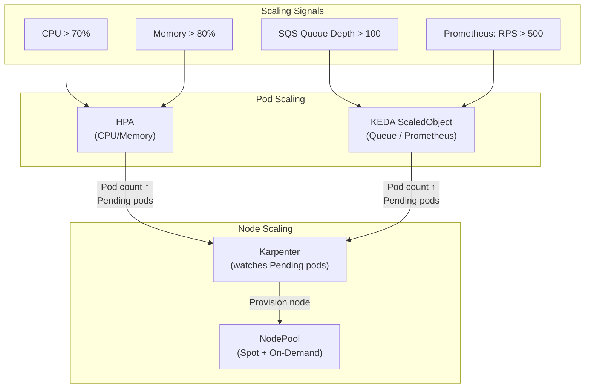

# Kubernetes Autoscaling

## Category
Scalability, Cost, Kubernetes

## Context

Kubernetes has three distinct scaling dimensions:

| Dimension | Mechanism | What scales |
|-----------|-----------|-------------|
| **Horizontal Pod** | HPA | Pod replica count |
| **Vertical Pod** | VPA | Pod CPU/memory requests |
| **Node (cluster)** | Karpenter / Cluster Autoscaler | Node count / type |

**HPA metrics sources:**
| Source | Metric examples |
|--------|----------------|
| `Resource` | CPU utilisation, memory utilisation |
| `Pods` | Requests per second (custom) |
| `External` | SQS queue depth, Kafka consumer lag (via KEDA) |
| `Object` | Ingress request rate |

**KEDA (Kubernetes Event-Driven Autoscaling)** extends HPA with 60+ scalers including: Kafka, RabbitMQ, SQS, Redis, Prometheus, Datadog, HTTP, cron.

**Karpenter** (recommended over Cluster Autoscaler on AWS):
- Provisions nodes in <60 s from pending pod to ready node
- No pre-defined node groups — selects optimal instance type dynamically
- Consolidation: replaces overprovisioned nodes with smaller ones to reduce cost
- Spot interruption handling: cordons, drains, and replaces spot nodes gracefully

---

## Pros

- **HPA**: Zero cost — scales down aggressively during off-peak.
- **VPA (recommend mode)**: Provides right-sizing recommendations without mutating pods.
- **KEDA**: Scales to zero — no idle pods during quiet periods.
- **Karpenter**: 3–5× faster scaling than Cluster Autoscaler; bin-packs optimally; native spot support.
- **Combining HPA + Karpenter**: Pods scale first, nodes follow — no pre-warmed node buffer needed.

---

## Cons

- **HPA**: Cannot scale on custom metrics without Prometheus adapter or KEDA.
- **VPA + HPA conflict**: Do not use VPA in `Auto` mode with HPA on CPU/memory — they fight. Use HPA on custom metrics + VPA for right-sizing.
- **VPA disruption**: `Auto` mode may evict pods to resize — requires PDB to manage disruption.
- **Scale-to-zero cold start**: First request after zero replicas incurs significant latency.
- **Karpenter**: AWS-native; limited to EKS (Azure NAP and GKE Autopilot have equivalents).
- **Consolidation**: Node consolidation can disrupt workloads — tune `WhenUnderutilized` carefully.

---

## Design Diagram



---

## Code Sample

### HPA — scale on CPU

```yaml
# hpa/order-service-hpa.yaml
apiVersion: autoscaling/v2
kind: HorizontalPodAutoscaler
metadata:
  name: order-service-hpa
  namespace: production
spec:
  scaleTargetRef:
    apiVersion: apps/v1
    kind: Deployment
    name: order-service
  minReplicas: 3
  maxReplicas: 20
  metrics:
    - type: Resource
      resource:
        name: cpu
        target:
          type: Utilization
          averageUtilization: 70    # Scale out when avg CPU > 70%
    - type: Resource
      resource:
        name: memory
        target:
          type: Utilization
          averageUtilization: 80
  behavior:
    scaleDown:
      stabilizationWindowSeconds: 300    # Wait 5 min before scaling down
      policies:
        - type: Pods
          value: 2
          periodSeconds: 60              # Remove at most 2 pods per minute
    scaleUp:
      stabilizationWindowSeconds: 0
      policies:
        - type: Pods
          value: 4
          periodSeconds: 30              # Add up to 4 pods per 30 seconds
```

### KEDA — scale on SQS queue depth

```yaml
# keda/order-worker-scaled-object.yaml
apiVersion: keda.sh/v1alpha1
kind: ScaledObject
metadata:
  name: order-worker
  namespace: production
spec:
  scaleTargetRef:
    name: order-worker
  minReplicaCount: 0        # Scale to zero during quiet periods
  maxReplicaCount: 50
  cooldownPeriod: 60
  triggers:
    - type: aws-sqs-queue
      authenticationRef:
        name: keda-aws-credentials
      metadata:
        queueURL: https://sqs.us-east-1.amazonaws.com/123/order-queue
        queueLength: "10"   # 1 pod per 10 messages
        awsRegion: us-east-1
---
# keda/trigger-authentication.yaml
apiVersion: keda.sh/v1alpha1
kind: TriggerAuthentication
metadata:
  name: keda-aws-credentials
  namespace: production
spec:
  podIdentity:
    provider: aws-eks       # Use IRSA
```

### Karpenter NodePool — mixed on-demand + spot

```yaml
# karpenter/nodepool.yaml
apiVersion: karpenter.sh/v1beta1
kind: NodePool
metadata:
  name: general
spec:
  template:
    spec:
      requirements:
        - key: karpenter.sh/capacity-type
          operator: In
          values: ["spot", "on-demand"]
        - key: kubernetes.io/arch
          operator: In
          values: ["amd64"]
        - key: karpenter.k8s.aws/instance-category
          operator: In
          values: ["c", "m", "r"]       # Compute, memory, general
        - key: karpenter.k8s.aws/instance-generation
          operator: Gt
          values: ["5"]                 # At least 6th gen instance
      nodeClassRef:
        apiVersion: karpenter.k8s.aws/v1beta1
        kind: EC2NodeClass
        name: default
      expireAfter: 720h                 # Replace nodes older than 30 days
  disruption:
    consolidationPolicy: WhenUnderutilized
    consolidateAfter: 30m              # Consolidate under-used nodes after 30 min
  limits:
    cpu: "1000"
    memory: 4000Gi
---
apiVersion: karpenter.k8s.aws/v1beta1
kind: EC2NodeClass
metadata:
  name: default
spec:
  amiFamily: AL2023
  role: KarpenterNodeRole
  subnetSelectorTerms:
    - tags:
        karpenter.sh/discovery: my-cluster
  securityGroupSelectorTerms:
    - tags:
        karpenter.sh/discovery: my-cluster
```

### VPA — recommendation mode only

```yaml
# vpa/order-service-vpa.yaml
apiVersion: autoscaling.k8s.io/v1
kind: VerticalPodAutoscaler
metadata:
  name: order-service-vpa
  namespace: production
spec:
  targetRef:
    apiVersion: apps/v1
    kind: Deployment
    name: order-service
  updatePolicy:
    updateMode: "Off"          # Recommendation only — do not apply automatically
  resourcePolicy:
    containerPolicies:
      - containerName: order-service
        minAllowed:
          cpu: "100m"
          memory: "128Mi"
        maxAllowed:
          cpu: "2"
          memory: "2Gi"

# Check recommendations:
# kubectl get vpa order-service-vpa -n production -o json | jq .status.recommendation
```

---

## Related

- [01 — Workloads](./01-workloads.md) — HPA acts on Deployments; KEDA on any scalable workload
- [13 — Pod Reliability](./13-pod-reliability.md) — PDB prevents over-aggressive scale-down
- [15 — Cost Optimisation](./15-cost-optimisation.md) — Karpenter + KEDA together maximise cost savings
