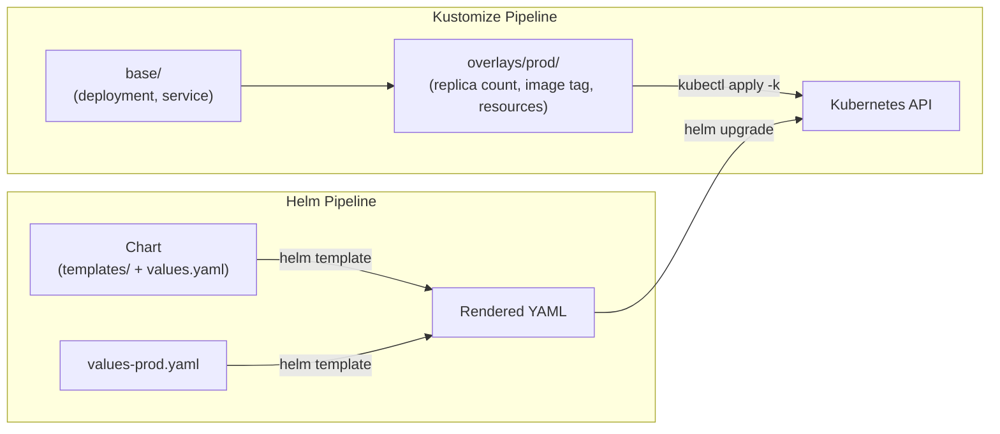

# Helm & Kustomize

## Category
Packaging, GitOps, Kubernetes

## Context

**Helm** is the de-facto Kubernetes package manager. A *chart* bundles all resources for an application with templated values. **Kustomize** is a template-free overlay system built into `kubectl` — it patches and merges YAML without Go templates.

| Concern | Helm | Kustomize |
|---------|------|-----------|
| Templating | Go templates + Sprig | None — YAML patches |
| Package registry | OCI / Artifact Hub | Git / local directory |
| Release management | `helm upgrade`, `helm rollback` | External (ArgoCD/Flux) |
| Secrets | External (ESO / Vault) | SealedSecrets / ESO |
| Learning curve | Higher (Helm DSL) | Lower |
| Multi-environment | `values-prod.yaml` override | `overlays/prod/` |
| Best for | Third-party apps (Prometheus, Kafka) | First-party app config |

**Common pattern**: Use Helm charts for infrastructure components (Prometheus, Ingress Nginx, cert-manager). Use Kustomize for your own application manifests with per-environment overlays.

---

## Pros

- **Helm**: Atomic installs/upgrades with rollback; dependency management (`dependencies` field); rich ecosystem (Artifact Hub has 10 000+ charts).
- **Helm OCI**: Store charts in same OCI registry as images — single artefact store.
- **Kustomize**: No opaque templating — output is plain YAML; easy to diff; built into `kubectl apply -k .`.
- **Kustomize patches**: `patchesStrategicMerge` and `patches` (`json6902`) give surgical control.
- **Combining both**: Kustomize `helmCharts` field allows Helm rendering inside a Kustomize pipeline.

---

## Cons

- **Helm**: Go templates are hard to debug; `helm template` output can be noisy; values files can become complex.
- **Helm hooks**: Pre/post hooks are powerful but can leave orphan pods on failure.
- **Kustomize**: No looping or conditional logic; repeated config across many overlays can diverge.
- **`helm upgrade --force`**: Recreates resources rather than patching — causes downtime.
- **Chart maintainability**: Templating deeply nested values (Istio, Kafka) leads to unmaintainable charts.

---

## Design Diagram



---

## Code Sample

### Helm chart structure (custom app)

```
order-service/
├── Chart.yaml
├── values.yaml
├── values-production.yaml
└── templates/
    ├── deployment.yaml
    ├── service.yaml
    ├── hpa.yaml
    ├── configmap.yaml
    └── _helpers.tpl
```

```yaml
# Chart.yaml
apiVersion: v2
name: order-service
description: Order Service Helm chart
type: application
version: 0.5.1           # Chart version
appVersion: "1.4.2"      # Application version
```

```yaml
# values.yaml
replicaCount: 2
image:
  repository: myregistry.io/order-service
  tag: ""                  # Defaults to appVersion when empty
  pullPolicy: IfNotPresent

resources:
  requests:
    cpu: 250m
    memory: 256Mi
  limits:
    cpu: 500m
    memory: 512Mi

autoscaling:
  enabled: true
  minReplicas: 2
  maxReplicas: 10
  targetCPUUtilizationPercentage: 70

ingress:
  enabled: true
  host: api.myapp.com
```

```yaml
# templates/deployment.yaml
apiVersion: apps/v1
kind: Deployment
metadata:
  name: {{ include "order-service.fullname" . }}
  labels:
    {{- include "order-service.labels" . | nindent 4 }}
spec:
  {{- if not .Values.autoscaling.enabled }}
  replicas: {{ .Values.replicaCount }}
  {{- end }}
  selector:
    matchLabels:
      {{- include "order-service.selectorLabels" . | nindent 6 }}
  template:
    metadata:
      labels:
        {{- include "order-service.selectorLabels" . | nindent 8 }}
    spec:
      containers:
        - name: {{ .Chart.Name }}
          image: "{{ .Values.image.repository }}:{{ .Values.image.tag | default .Chart.AppVersion }}"
          imagePullPolicy: {{ .Values.image.pullPolicy }}
          resources:
            {{- toYaml .Values.resources | nindent 12 }}
```

### Deploy / upgrade a Helm chart

```bash
# Add a chart repository
helm repo add ingress-nginx https://kubernetes.github.io/ingress-nginx
helm repo update

# Install
helm install ingress-nginx ingress-nginx/ingress-nginx \
  --namespace ingress-nginx --create-namespace \
  --values ingress-values.yaml

# Upgrade with new values
helm upgrade ingress-nginx ingress-nginx/ingress-nginx \
  --namespace ingress-nginx \
  --values ingress-values.yaml \
  --set controller.replicaCount=3

# Rollback to previous release
helm rollback ingress-nginx 1 --namespace ingress-nginx

# Render without installing (useful for debugging)
helm template order-service ./order-service --values values-production.yaml
```

### Kustomize — base + overlays structure

```
k8s/
├── base/
│   ├── kustomization.yaml
│   ├── deployment.yaml
│   └── service.yaml
└── overlays/
    ├── staging/
    │   ├── kustomization.yaml
    │   └── patch-replicas.yaml
    └── production/
        ├── kustomization.yaml
        └── patch-production.yaml
```

```yaml
# base/kustomization.yaml
apiVersion: kustomize.config.k8s.io/v1beta1
kind: Kustomization
resources:
  - deployment.yaml
  - service.yaml
commonLabels:
  app: order-service
```

```yaml
# overlays/production/kustomization.yaml
apiVersion: kustomize.config.k8s.io/v1beta1
kind: Kustomization
namespace: production
resources:
  - ../../base
images:
  - name: myregistry.io/order-service
    newTag: "1.4.2"           # Pin explicit image tag per environment
patches:
  - patch: |-
      - op: replace
        path: /spec/replicas
        value: 5
    target:
      kind: Deployment
      name: order-service
  - path: patch-production.yaml
```

```yaml
# overlays/production/patch-production.yaml
apiVersion: apps/v1
kind: Deployment
metadata:
  name: order-service
spec:
  template:
    spec:
      containers:
        - name: order-service
          resources:
            requests:
              cpu: "500m"
              memory: "512Mi"
            limits:
              cpu: "1"
              memory: "1Gi"
```

```bash
# Apply a Kustomize overlay
kubectl apply -k k8s/overlays/production/

# Preview what would be applied
kubectl diff -k k8s/overlays/production/
```

---

## Related

- [08 — GitOps](./08-gitops.md) — ArgoCD and FluxCD use Helm and Kustomize as rendering engines
- [04 — Configuration & Secrets](./04-configuration-secrets.md) — Kustomize secretGenerator vs ESO for secrets
- [05 — RBAC & Security](./05-rbac-security.md) — helm test / OPA policy tests on rendered manifests
