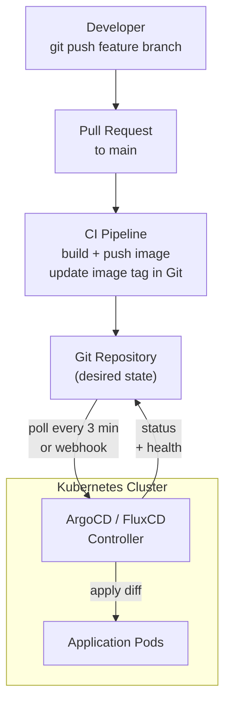

# GitOps — ArgoCD & FluxCD

## Category
GitOps, Delivery, Kubernetes

## Context

GitOps is an operational model where Git is the single source of truth for declarative infrastructure. A controller continuously reconciles the live cluster state to match the desired state stored in a Git repository.

| Concern | ArgoCD | FluxCD |
|---------|--------|--------|
| Architecture | Server + agent (same cluster) | Controllers per concern (Kustomize, Helm, Image) |
| UI | Rich web dashboard | Grafana dashboard via metrics |
| Multi-cluster | ApplicationSet + cluster generators | Multi-tenancy via separate Kustomization per cluster |
| Helm support | Native Helm rendering | `HelmRelease` CR |
| Image automation | Argo Image Updater (add-on) | Built-in `ImageRepository` + `ImagePolicy` |
| Sync policy | Manual / auto with prune | Auto with health checks |
| Rollouts | Argo Rollouts (canary, blue-green) | Flagger (add-on) |
| GitOps spirit | Pull-based reconciliation | Pull-based reconciliation |

**App of Apps pattern** (ArgoCD): A root Application points to a directory of child Application manifests in Git — bootstrapping an entire cluster from a single ArgoCD install.

---

## Pros

- Cluster state is always auditable through Git history — `git log` is your change log.
- Self-healing: drift from desired state is automatically corrected.
- Rollback = `git revert` — no `kubectl` access needed for production.
- ArgoCD **sync waves and hooks** enable ordered deploys (DB migrations before app start).
- FluxCD **image automation** opens a PR when a new image tag matches a semver policy.
- Multiple environment promotion without secrets in CI — CI only pushes to Git, GitOps controller applies.

---

## Cons

- Bootstrapping the GitOps controller itself requires an initial `kubectl` apply.
- Secrets in Git must be encrypted (Sealed Secrets, SOPS) or managed externally (ESO).
- ArgoCD UI can create false sense of security if `auto-sync` with `prune: false` is used.
- Approval gates for production require additional tooling (policy controllers, manual sync toggle).
- Large mono-repos with many Applications can make ArgoCD API server resource-intensive.

---

## Design Diagram



---

## Code Sample

### ArgoCD — Application manifest

```yaml
# gitops/apps/order-service.yaml
apiVersion: argoproj.io/v1alpha1
kind: Application
metadata:
  name: order-service
  namespace: argocd
  finalizers:
    - resources-finalizer.argocd.argoproj.io  # Cascade delete resources on app deletion
spec:
  project: default
  source:
    repoURL: https://github.com/myorg/gitops-config
    targetRevision: main
    path: k8s/overlays/production
  destination:
    server: https://kubernetes.default.svc
    namespace: production
  syncPolicy:
    automated:
      prune: true          # Remove resources no longer in Git
      selfHeal: true       # Revert manual changes to cluster
    syncOptions:
      - CreateNamespace=true
      - PrunePropagationPolicy=foreground
    retry:
      limit: 5
      backoff:
        duration: 5s
        factor: 2
        maxDuration: 3m
```

### ArgoCD — App of Apps (cluster bootstrap)

```yaml
# gitops/bootstrap/root-app.yaml
apiVersion: argoproj.io/v1alpha1
kind: Application
metadata:
  name: root
  namespace: argocd
spec:
  project: default
  source:
    repoURL: https://github.com/myorg/gitops-config
    targetRevision: main
    path: gitops/apps        # Directory of child Application manifests
  destination:
    server: https://kubernetes.default.svc
    namespace: argocd
  syncPolicy:
    automated:
      prune: true
      selfHeal: true
```

### ArgoCD — ApplicationSet (one app per cluster)

```yaml
apiVersion: argoproj.io/v1alpha1
kind: ApplicationSet
metadata:
  name: order-service-multi-cluster
  namespace: argocd
spec:
  generators:
    - clusters:
        selector:
          matchLabels:
            env: production
  template:
    metadata:
      name: "order-service-{{name}}"
    spec:
      project: default
      source:
        repoURL: https://github.com/myorg/gitops-config
        targetRevision: main
        path: "k8s/overlays/{{metadata.labels.region}}"
      destination:
        server: "{{server}}"
        namespace: production
      syncPolicy:
        automated:
          prune: true
          selfHeal: true
```

### Argo Rollouts — canary deployment

```yaml
# Replaces Deployment with a Rollout resource
apiVersion: argoproj.io/v1alpha1
kind: Rollout
metadata:
  name: order-service
spec:
  replicas: 10
  selector:
    matchLabels:
      app: order-service
  template:
    metadata:
      labels:
        app: order-service
    spec:
      containers:
        - name: order-service
          image: myregistry.io/order-service:1.4.2
          resources:
            requests:
              cpu: 250m
              memory: 256Mi
  strategy:
    canary:
      steps:
        - setWeight: 10        # Send 10% traffic to new version
        - pause: {duration: 5m}
        - setWeight: 40
        - pause: {duration: 5m}
        - analysis:
            templates:
              - templateName: success-rate
        - setWeight: 100
      canaryService: order-service-canary
      stableService: order-service-stable
---
apiVersion: argoproj.io/v1alpha1
kind: AnalysisTemplate
metadata:
  name: success-rate
spec:
  metrics:
    - name: success-rate
      successCondition: result[0] >= 0.95
      interval: 1m
      count: 5
      provider:
        prometheus:
          address: http://prometheus:9090
          query: |
            sum(rate(http_requests_total{app="order-service",status!~"5.."}[5m]))
            / sum(rate(http_requests_total{app="order-service"}[5m]))
```

### FluxCD — Kustomization + HelmRelease

```yaml
# flux/clusters/production/kustomization.yaml
apiVersion: kustomize.toolkit.fluxcd.io/v1
kind: Kustomization
metadata:
  name: order-service
  namespace: flux-system
spec:
  interval: 10m
  path: ./k8s/overlays/production
  prune: true
  sourceRef:
    kind: GitRepository
    name: gitops-config
  healthChecks:
    - apiVersion: apps/v1
      kind: Deployment
      name: order-service
      namespace: production
  timeout: 3m
---
apiVersion: helm.toolkit.fluxcd.io/v2beta1
kind: HelmRelease
metadata:
  name: ingress-nginx
  namespace: flux-system
spec:
  interval: 1h
  chart:
    spec:
      chart: ingress-nginx
      version: "4.x"
      sourceRef:
        kind: HelmRepository
        name: ingress-nginx
      interval: 12h
  values:
    controller:
      replicaCount: 3
```

### FluxCD — Image automation (auto-update image tag in Git)

```yaml
apiVersion: image.toolkit.fluxcd.io/v1beta2
kind: ImageRepository
metadata:
  name: order-service
  namespace: flux-system
spec:
  image: myregistry.io/order-service
  interval: 5m
---
apiVersion: image.toolkit.fluxcd.io/v1beta2
kind: ImagePolicy
metadata:
  name: order-service
  namespace: flux-system
spec:
  imageRepositoryRef:
    name: order-service
  policy:
    semver:
      range: ">=1.0.0 <2.0.0"  # Only pick up 1.x releases
---
apiVersion: image.toolkit.fluxcd.io/v1beta1
kind: ImageUpdateAutomation
metadata:
  name: order-service
  namespace: flux-system
spec:
  interval: 5m
  sourceRef:
    kind: GitRepository
    name: gitops-config
  git:
    checkout:
      ref:
        branch: main
    commit:
      author:
        name: FluxCD Bot
        email: fluxcd@myorg.com
      messageTemplate: "chore: update order-service to {{range .Updated.Images}}{{println .}}{{end}}"
    push:
      branch: main
  update:
    path: ./k8s/overlays/production
    strategy: Setters
```

---

## Related

- [07 — Helm & Kustomize](./07-helm-kustomize.md) — ArgoCD/FluxCD use these as rendering engines
- [13 — Pod Reliability](./13-pod-reliability.md) — Use sync waves to wait for DB migrations before app rollout
- [04 — Configuration & Secrets](./04-configuration-secrets.md) — SOPS or ESO for secrets in GitOps repos
