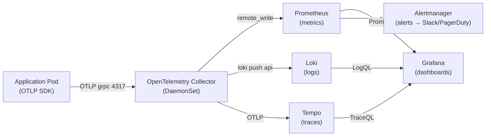

# Observability — Metrics, Logs, Traces

## Category
Observability, Monitoring, Kubernetes

## Context

Kubernetes observability rests on three pillars: **metrics** (time-series numbers), **logs** (structured events), and **traces** (distributed request flows). The **Prometheus Operator** is the defacto metrics stack; **Loki** aggregates logs without indexing; **Tempo** stores traces.

| Concern | Tool | Protocol |
|---------|------|----------|
| Metrics storage | Prometheus / Thanos / Mimir | PromQL |
| Log aggregation | Loki | LogQL |
| Distributed tracing | Tempo / Jaeger / Zipkin | OTLP |
| Collection agent | OpenTelemetry Collector | OTLP, Prometheus remote-write |
| Dashboards | Grafana | All of the above |
| Alerting | Prometheus Alertmanager | Webhook / PagerDuty / Slack |

**Prometheus Operator** introduces CRDs (`ServiceMonitor`, `PodMonitor`, `PrometheusRule`) so you declare which pods to scrape and which alerts to fire via Kubernetes objects, not Prometheus config files.

**OpenTelemetry Collector** (DaemonSet or Deployment) is the vendor-neutral agent/gateway that receives spans/metrics/logs in OTLP and forwards them to any backends — decoupling apps from specific vendors.

---

## Pros

- `ServiceMonitor` / `PodMonitor` auto-configures Prometheus scrape targets — no manual `prometheus.yml` editing.
- Loki is **log aggregation without full-text index** — far cheaper storage than Elasticsearch; LogQL correlates with Prometheus at the same timeline.
- Tempo + Grafana **trace-to-logs** and **trace-to-metrics** links allow one-click pivoting from a slow trace to the relevant log lines and metric jump.
- OpenTelemetry Collector's **filelog receiver** tails container stdout and adds k8s metadata (namespace, pod, labels) via the `k8sattributes` processor.
- Grafana **unified data source** allows mixing Prometheus metrics, Loki logs, and Tempo traces in a single dashboard.

---

## Cons

- Prometheus Operator has a learning curve — `ServiceMonitor` must match a `Prometheus` CR `serviceMonitorSelector`.
- Long-term Prometheus storage requires Thanos or Mimir (additional operational complexity).
- Loki query performance degrades on high-cardinality label combinations — keep Loki labels to fewer than 10.
- OpenTelemetry Collector resource footprint adds ~50 MB memory per node in DaemonSet mode.
- Trace sampling strategy is critical — 100% sampling breaks backends at scale; head-based vs tail-based sampling trade-offs are non-trivial.

---

## Design Diagram



---

## Code Sample

### Prometheus Operator — ServiceMonitor

```yaml
# Scrape a service exposing /metrics on port 8080
apiVersion: monitoring.coreos.com/v1
kind: ServiceMonitor
metadata:
  name: order-service
  namespace: production
  labels:
    release: prometheus     # Must match Prometheus CR serviceMonitorSelector
spec:
  selector:
    matchLabels:
      app: order-service    # Selects Services with this label
  namespaceSelector:
    matchNames:
      - production
  endpoints:
    - port: http             # Named port in the Service
      path: /metrics
      interval: 15s
      scrapeTimeout: 10s
```

### Prometheus Operator — PrometheusRule (alerting)

```yaml
apiVersion: monitoring.coreos.com/v1
kind: PrometheusRule
metadata:
  name: order-service-alerts
  namespace: production
  labels:
    release: prometheus
spec:
  groups:
    - name: order-service.rules
      interval: 30s
      rules:
        - alert: HighErrorRate
          expr: |
            sum(rate(http_requests_total{app="order-service", status=~"5.."}[5m]))
            / sum(rate(http_requests_total{app="order-service"}[5m])) > 0.05
          for: 2m
          labels:
            severity: critical
            team: backend
          annotations:
            summary: "Order service error rate > 5%"
            description: "Error rate is {{ $value | humanizePercentage }} over the last 5 minutes."
            runbook: "https://wiki.myorg.com/runbooks/order-service-high-error-rate"

        - alert: PodNotReady
          expr: kube_pod_status_ready{condition="true", namespace="production"} == 0
          for: 5m
          labels:
            severity: warning
          annotations:
            summary: "Pod {{ $labels.pod }} is not ready"
```

### OpenTelemetry Collector — DaemonSet config

```yaml
# otelcol-config.yaml (mounted as ConfigMap)
receivers:
  otlp:
    protocols:
      grpc:
        endpoint: 0.0.0.0:4317
      http:
        endpoint: 0.0.0.0:4318
  filelog:
    include:
      - /var/log/pods/production_*/*/*.log    # Tail all production pod logs
    include_file_path: true
    operators:
      - type: json_parser
        timestamp:
          parse_from: attributes.time
          layout: "%Y-%m-%dT%H:%M:%S.%LZ"

processors:
  k8sattributes:                               # Enrich with pod/namespace/node labels
    auth_type: serviceAccount
    extract:
      metadata:
        - k8s.namespace.name
        - k8s.pod.name
        - k8s.node.name
        - k8s.deployment.name
  batch:
    timeout: 5s
    send_batch_size: 1000
  memory_limiter:
    limit_mib: 400
    spike_limit_mib: 100

exporters:
  prometheusremotewrite:
    endpoint: http://prometheus:9090/api/v1/write
  loki:
    endpoint: http://loki:3100/loki/api/v1/push
  otlp/tempo:
    endpoint: http://tempo:4317
    tls:
      insecure: true

service:
  pipelines:
    traces:
      receivers: [otlp]
      processors: [k8sattributes, batch]
      exporters: [otlp/tempo]
    metrics:
      receivers: [otlp]
      processors: [k8sattributes, batch]
      exporters: [prometheusremotewrite]
    logs:
      receivers: [filelog, otlp]
      processors: [k8sattributes, batch]
      exporters: [loki]
```

### OpenTelemetry Collector DaemonSet manifest

```yaml
apiVersion: apps/v1
kind: DaemonSet
metadata:
  name: otel-collector
  namespace: monitoring
spec:
  selector:
    matchLabels:
      app: otel-collector
  template:
    metadata:
      labels:
        app: otel-collector
    spec:
      serviceAccountName: otel-collector
      containers:
        - name: otel-collector
          image: otel/opentelemetry-collector-contrib:0.95.0
          args: ["--config=/etc/otelcol/config.yaml"]
          ports:
            - containerPort: 4317  # OTLP gRPC
            - containerPort: 4318  # OTLP HTTP
          resources:
            requests:
              cpu: 100m
              memory: 128Mi
            limits:
              cpu: 500m
              memory: 512Mi
          volumeMounts:
            - name: config
              mountPath: /etc/otelcol
            - name: varlogpods
              mountPath: /var/log/pods
              readOnly: true
      volumes:
        - name: config
          configMap:
            name: otelcol-config
        - name: varlogpods
          hostPath:
            path: /var/log/pods
```

---

## Related

- [06 — Autoscaling](./06-autoscaling.md) — KEDA uses Prometheus metrics as scaling triggers
- [10 — Service Mesh](./10-service-mesh.md) — Istio and Linkerd emit metrics consumed by Prometheus
- [08 — GitOps](./08-gitops.md) — Argo Rollouts / Flagger use Prometheus metrics for canary analysis
