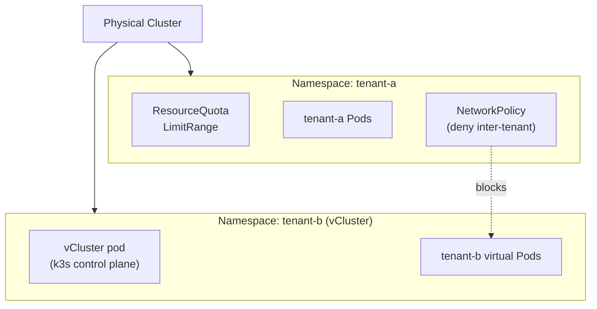

# Multi-Tenancy

## Category
Security, Multi-Tenancy, Kubernetes

## Context

Multi-tenancy on Kubernetes means sharing a cluster between multiple teams or customers (tenants) while guaranteeing isolation of resources, network traffic, and blast radius.

| Isolation model | Tool | Isolation strength | Overhead |
|-----------------|------|--------------------|----------|
| Namespace-per-tenant | Native k8s | Logical (soft) | Low |
| vCluster | vCluster.io | Virtual control-plane | Medium |
| Separate cluster | Cloud provider | Hard (physical) | High |
| HNC (hierarchical) | HNC controller | Logical + policy propagation | Low |

| Concern | Namespace isolation | vCluster |
|---------|---------------------|----------|
| Separate API server | ✗ | ✅ |
| Custom CRDs per tenant | ✗ | ✅ |
| Node sharing | ✅ | ✅ (or dedicated nodes) |
| RBAC isolation | ✅ (ClusterRole per ns) | ✅ (full k8s RBAC) |
| Network isolation | NetworkPolicy | NetworkPolicy + vCluster overlay |
| Cost | Low | Medium (extra pod per cluster) |

**ResourceQuota** caps total resource consumption per namespace. **LimitRange** sets default and max CPU/memory per container, preventing unbounded pods.

---

## Pros

- Namespace isolation is built-in, requires no extra operators, and is well understood.
- **vCluster** gives tenants a full Kubernetes API (including CRDs and separate RBAC) while running as pods — enables self-service platform teams.
- **HNC** propagates NetworkPolicies and RoleBindings from parent to child namespaces, reducing duplication across many tenant namespaces.
- **ResourceQuota + LimitRange** prevent noisy-neighbour resource exhaustion — a single tenant cannot starve others.
- Multi-tenancy through namespaces integrates cleanly with GitOps: one Git branch or folder per tenant.

---

## Cons

- Namespace isolation is **soft**: a misconfigured pod can still exhaust node-level resources (ephemeral storage, PIDs, inodes).
- Cluster-scoped resources (CRDs, ClusterRoles, StorageClasses) are shared — two tenants cannot install conflicting CRD versions.
- **vCluster** adds ~1 pod per virtual cluster and extra networking; at 100+ tenants, managing vClusters becomes complex.
- NetworkPolicy is not enforced without a CNI that supports it (Calico, Cilium, Weave, etc.); AWS VPC CNI alone does not enforce NetworkPolicy.
- LimitRange defaults only apply to new pods; existing pods are unaffected until rescheduled.

---

## Design Diagram



---

## Code Sample

### ResourceQuota — limit a tenant namespace

```yaml
apiVersion: v1
kind: ResourceQuota
metadata:
  name: tenant-a-quota
  namespace: tenant-a
spec:
  hard:
    requests.cpu: "8"
    requests.memory: "16Gi"
    limits.cpu: "16"
    limits.memory: "32Gi"
    pods: "50"
    services: "20"
    persistentvolumeclaims: "10"
    services.loadbalancers: "2"
    services.nodeports: "0"       # Disable NodePort services for this tenant
```

### LimitRange — default + cap per container

```yaml
apiVersion: v1
kind: LimitRange
metadata:
  name: tenant-a-limits
  namespace: tenant-a
spec:
  limits:
    - type: Container
      default:
        cpu: "500m"
        memory: "256Mi"
      defaultRequest:
        cpu: "100m"
        memory: "128Mi"
      max:
        cpu: "4"
        memory: "4Gi"
      min:
        cpu: "50m"
        memory: "64Mi"
    - type: PersistentVolumeClaim
      max:
        storage: "50Gi"
```

### NetworkPolicy — deny all inter-tenant traffic

```yaml
# Applied to every tenant namespace to isolate tenants from each other
apiVersion: networking.k8s.io/v1
kind: NetworkPolicy
metadata:
  name: deny-other-tenants
  namespace: tenant-a
spec:
  podSelector: {}             # Applies to all pods in tenant-a
  policyTypes:
    - Ingress
    - Egress
  ingress:
    - from:
        - podSelector: {}     # Allow only from same namespace
  egress:
    - to:
        - podSelector: {}     # Allow within namespace
    - to:                     # Allow DNS
        - namespaceSelector:
            matchLabels:
              kubernetes.io/metadata.name: kube-system
      ports:
        - port: 53
          protocol: UDP
    - to:                     # Allow shared platform services
        - namespaceSelector:
            matchLabels:
              role: platform
```

### vCluster — install via Helm (one per tenant)

```bash
# Add vCluster Helm repo
helm repo add loft-sh https://charts.loft.sh
helm repo update

# Create a virtual cluster for tenant-b
helm install tenant-b vcluster \
  --chart loft-sh/vcluster \
  --namespace tenant-b \
  --create-namespace \
  --set vcluster.image=rancher/k3s:v1.27.4-k3s1 \
  --set sync.nodes.syncAllNodes=false \
  --set sync.nodes.nodeSelector="tenant=tenant-b"

# Connect to the vCluster
vcluster connect tenant-b -n tenant-b -- kubectl get pods
```

```yaml
# vcluster-values.yaml — dedicated node pool for tenant
sync:
  nodes:
    enabled: true
    syncAllNodes: false
    nodeSelector: "tenant=tenant-b"
  storageClasses:
    enabled: false    # Inherit from host cluster
resources:
  limits:
    memory: "2Gi"
    cpu: "1"
```

### HNC — propagate policies from parent to child namespaces

```bash
# Install HNC
kubectl apply -f https://github.com/kubernetes-sigs/hierarchical-namespaces/releases/latest/download/default.yaml

# Make team-a the parent of team-a-staging and team-a-prod
kubectl hns set team-a-staging --parent team-a
kubectl hns set team-a-prod --parent team-a

# Propagated: NetworkPolicy and RoleBinding in team-a automatically appear in children
kubectl annotate rolebinding developer-access \
  hnc.x-k8s.io/propagated-to=all \
  -n team-a
```

---

## Related

- [05 — RBAC & Security](./05-rbac-security.md) — Per-namespace Roles/RoleBindings enforce tenant access control
- [02 — Networking & Services](./02-networking-services.md) — NetworkPolicy fundamentals for inter-namespace isolation
- [15 — Cost Optimisation](./15-cost-optimisation.md) — ResourceQuota as a cost guardrail per team
