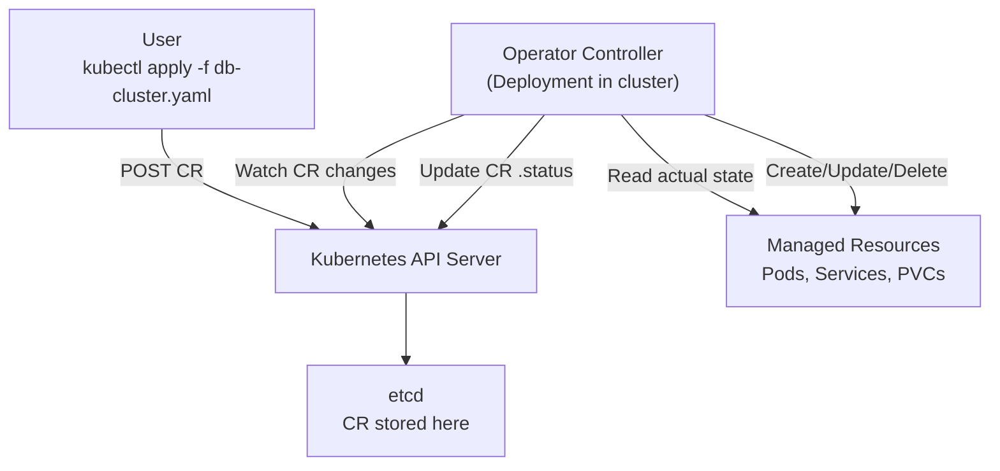

# Operators & Custom Resource Definitions

## Category
Extensibility, Platform, Kubernetes

## Context

The **Operator pattern** encodes operational knowledge (install, upgrade, backup, failover) into a Kubernetes controller. A **Custom Resource Definition (CRD)** extends the API server with new object types; a **controller** (the operator) watches those objects and reconciles the cluster towards the desired state.

| Concern | Description |
|---------|-------------|
| CRD | Schema for a new API type (e.g., `DatabaseCluster`) |
| CR (Custom Resource) | An instance of that type — a YAML object users create |
| Controller | A reconcile-loop program watching CRs and managing real resources |
| Operator | CRD + Controller bundled as a single deployment |

**Reconcile loop** (Level Triggered, not Edge Triggered):
1. Read desired state (CR spec)
2. Read actual state (pods, services, etc.)
3. Compute diff
4. Take action to converge state
5. Update CR status
6. Re-queue if not reconciled

| Framework | Language | Maturity |
|-----------|----------|----------|
| controller-runtime | Go | Highest — used by most operators |
| operator-sdk | Go/Ansible/Helm | High |
| kopf | Python | Good for prototypes |
| java-operator-sdk | Java | Growing |

---

## Pros

- Operators can manage **day-2 operations** (upgrades, backups, failovers) that Helm charts cannot.
- `kubectl get databasecluster` — users interact with domain concepts, not raw pods/services.
- The reconcile loop is idempotent and self-healing by design.
- **Status subresource** exposes human-readable and machine-readable state of the managed object.
- Operators integrate with `kubectl`, RBAC, ArgoCD, and all standard Kubernetes tooling.

---

## Cons

- Writing a production-quality operator in Go has a steep learning curve (controller-runtime, reconciler logic, caching).
- CRD versioning (`v1alpha1` → `v1beta1` → `v1`) requires conversion webhooks for in-place upgrades.
- Operators installed via OLM (Operator Lifecycle Manager) can conflict if multiple operators manage the same CRD.
- The informer cache in controller-runtime can be stale; always re-read from the API server before updating.
- kopf (Python) is easier to write but has higher memory overhead and slower reconcile loops.

---

## Design Diagram



---

## Code Sample

### CRD definition with OpenAPI schema validation

```yaml
apiVersion: apiextensions.k8s.io/v1
kind: CustomResourceDefinition
metadata:
  name: databaseclusters.db.myorg.com
spec:
  group: db.myorg.com
  scope: Namespaced
  names:
    plural: databaseclusters
    singular: databasecluster
    kind: DatabaseCluster
    shortNames: [dbc]
  versions:
    - name: v1alpha1
      served: true
      storage: true
      subresources:
        status: {}           # Enable .status subresource for status updates
      additionalPrinterColumns:
        - name: Engine
          type: string
          jsonPath: .spec.engine
        - name: Replicas
          type: integer
          jsonPath: .spec.replicas
        - name: Ready
          type: string
          jsonPath: .status.phase
      schema:
        openAPIV3Schema:
          type: object
          required: [spec]
          properties:
            spec:
              type: object
              required: [engine, replicas, storage]
              properties:
                engine:
                  type: string
                  enum: [postgres, mysql, redis]
                version:
                  type: string
                  default: "16"
                replicas:
                  type: integer
                  minimum: 1
                  maximum: 9
                storage:
                  type: object
                  required: [size]
                  properties:
                    size:
                      type: string
                      pattern: '^[0-9]+(Gi|Ti)$'
                    storageClass:
                      type: string
            status:
              type: object
              properties:
                phase:
                  type: string
                  enum: [Pending, Initializing, Running, Failed]
                readyReplicas:
                  type: integer
                message:
                  type: string
```

### Custom Resource instance

```yaml
apiVersion: db.myorg.com/v1alpha1
kind: DatabaseCluster
metadata:
  name: orders-db
  namespace: production
spec:
  engine: postgres
  version: "16"
  replicas: 3
  storage:
    size: "100Gi"
    storageClass: fast-ssd
```

### controller-runtime — minimal reconciler (Go)

```go
// internal/controller/databasecluster_controller.go
package controller

import (
    "context"
    "fmt"

    appsv1 "k8s.io/api/apps/v1"
    corev1 "k8s.io/api/core/v1"
    "k8s.io/apimachinery/pkg/api/errors"
    metav1 "k8s.io/apimachinery/pkg/apis/meta/v1"
    ctrl "sigs.k8s.io/controller-runtime"
    "sigs.k8s.io/controller-runtime/pkg/client"

    dbv1alpha1 "github.com/myorg/db-operator/api/v1alpha1"
)

type DatabaseClusterReconciler struct {
    client.Client
}

func (r *DatabaseClusterReconciler) Reconcile(ctx context.Context, req ctrl.Request) (ctrl.Result, error) {
    log := ctrl.LoggerFrom(ctx)

    // 1. Fetch the CR
    var db dbv1alpha1.DatabaseCluster
    if err := r.Get(ctx, req.NamespacedName, &db); err != nil {
        if errors.IsNotFound(err) {
            return ctrl.Result{}, nil  // CR deleted, nothing to do
        }
        return ctrl.Result{}, err
    }

    // 2. Check if StatefulSet already exists
    var sts appsv1.StatefulSet
    err := r.Get(ctx, req.NamespacedName, &sts)
    if errors.IsNotFound(err) {
        // 3. Create StatefulSet
        desired := r.buildStatefulSet(&db)
        if err := r.Create(ctx, desired); err != nil {
            log.Error(err, "Failed to create StatefulSet")
            return ctrl.Result{}, err
        }
        log.Info("Created StatefulSet", "name", desired.Name)
    } else if err != nil {
        return ctrl.Result{}, err
    } else {
        // 4. Update if replicas changed
        if *sts.Spec.Replicas != int32(db.Spec.Replicas) {
            sts.Spec.Replicas = ptr(int32(db.Spec.Replicas))
            if err := r.Update(ctx, &sts); err != nil {
                return ctrl.Result{}, err
            }
        }
    }

    // 5. Update status
    db.Status.Phase = "Running"
    db.Status.ReadyReplicas = int(sts.Status.ReadyReplicas)
    if err := r.Status().Update(ctx, &db); err != nil {
        return ctrl.Result{}, fmt.Errorf("updating status: %w", err)
    }

    return ctrl.Result{}, nil
}

func (r *DatabaseClusterReconciler) SetupWithManager(mgr ctrl.Manager) error {
    return ctrl.NewControllerManagedBy(mgr).
        For(&dbv1alpha1.DatabaseCluster{}).
        Owns(&appsv1.StatefulSet{}).  // Re-trigger reconcile if StatefulSet changes
        Complete(r)
}

func ptr[T any](v T) *T { return &v }
```

### kopf — minimal operator (Python)

```python
# operator.py
import kopf
import kubernetes


@kopf.on.create('db.myorg.com', 'v1alpha1', 'databaseclusters')
def create_fn(spec, name, namespace, logger, **kwargs):
    engine = spec.get('engine', 'postgres')
    replicas = spec.get('replicas', 1)
    logger.info(f"Creating {engine} cluster '{name}' with {replicas} replicas")

    # Create a headless Service for the StatefulSet
    api = kubernetes.client.CoreV1Api()
    service = {
        "apiVersion": "v1",
        "kind": "Service",
        "metadata": {"name": name, "namespace": namespace},
        "spec": {
            "clusterIP": "None",
            "selector": {"app": name},
            "ports": [{"port": 5432, "name": "postgres"}],
        },
    }
    api.create_namespaced_service(namespace, service)
    return {"message": f"Cluster {name} created"}


@kopf.on.delete('db.myorg.com', 'v1alpha1', 'databaseclusters')
def delete_fn(name, namespace, logger, **kwargs):
    logger.info(f"Cleaning up cluster {name}")
    api = kubernetes.client.CoreV1Api()
    api.delete_namespaced_service(name, namespace)
```

---

## Related

- [01 — Workloads](./01-workloads.md) — Operators manage StatefulSets/Deployments on behalf of users
- [05 — RBAC & Security](./05-rbac-security.md) — Operators need ClusterRole to manage across namespaces
- [07 — Helm & Kustomize](./07-helm-kustomize.md) — OLM or Helm can install operators; Helm-based operators use Helm as rendering engine
