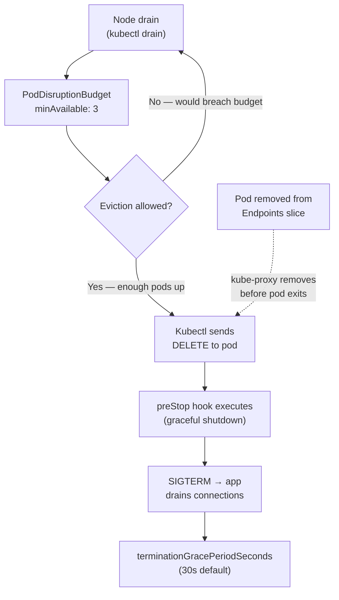

# Pod Reliability — Disruption Budgets, Topology & Priority

## Category
Resilience, Availability, Kubernetes

## Context

High-availability on Kubernetes requires protecting pods from both planned disruptions (drains, upgrades) and unplanned failures (node crash, eviction). Four complementary mechanisms address this:

| Mechanism | Problem solved |
|-----------|---------------|
| `PodDisruptionBudget` (PDB) | Caps voluntary evictions during drains / rolling upgrades |
| `TopologySpreadConstraints` | Spreads replicas across zones / nodes to avoid correlated failures |
| `PriorityClass` | Preserves critical workloads when nodes are under memory pressure |
| `preStop` hook + grace period | Allows in-flight requests to drain before pod termination |

**PDB math**: `minAvailable` defines the floor. If you have 5 replicas and `minAvailable: 4`, at most 1 pod can be voluntarily disrupted at a time. Using `maxUnavailable: 0` blocks all voluntary evictions — useful for quorum-sensitive services.

**TopologySpreadConstraints** replaced the deprecated `podAntiAffinity` spread patterns — they are more expressive and support `minDomains` (require pods in N zones before scheduling).

---

## Pros

- PDB + `terminationGracePeriodSeconds` together ensure graceful shutdown and prevent eviction storms during cluster upgrades.
- `TopologySpreadConstraints` distributes pods across availability zones automatically — no manual node affinity rules needed.
- `PriorityClass` ensures critical system pods (CoreDNS, node-local-dns) are not evicted when a node runs low on memory.
- `preStop: exec: sleep 5` compensates for endpoint propagation lag — the pod stays in Running state long enough for iptables/kube-proxy to remove it from service endpoints.
- `readinessGates` enable external controllers (load balancers, service meshes) to signal readiness before traffic is sent.

---

## Cons

- `maxUnavailable: 0` PDBs block cluster upgrades if all pods are distributed across drained nodes — can deadlock a rolling upgrade.
- `TopologySpreadConstraints` with `whenUnsatisfiable: DoNotSchedule` can make pending pods unschedulable if a zone is empty.
- Overlapping `PriorityClasses` without well-defined tiers leads to unexpected eviction ordering.
- `terminationGracePeriodSeconds` too long (>120s) slows cluster drains during Spot interruptions with only 2-minute warning.
- `readinessGates` require the signalling controller to be present — if it crashes, pods never become Ready.

---

## Design Diagram



---

## Code Sample

### PodDisruptionBudget

```yaml
apiVersion: policy/v1
kind: PodDisruptionBudget
metadata:
  name: order-service-pdb
  namespace: production
spec:
  # Prefer maxUnavailable for rolling-upgrade compatibility
  maxUnavailable: 1          # At most 1 pod down during voluntary disruption
  selector:
    matchLabels:
      app: order-service
```

### TopologySpreadConstraints — zone + node spread

```yaml
apiVersion: apps/v1
kind: Deployment
metadata:
  name: order-service
spec:
  replicas: 6
  template:
    spec:
      topologySpreadConstraints:
        # Spread evenly across availability zones
        - maxSkew: 1
          topologyKey: topology.kubernetes.io/zone
          whenUnsatisfiable: DoNotSchedule
          labelSelector:
            matchLabels:
              app: order-service
          minDomains: 3          # Require at least 3 zones to be eligible
        # Spread across nodes within each zone
        - maxSkew: 1
          topologyKey: kubernetes.io/hostname
          whenUnsatisfiable: ScheduleAnyway    # Best-effort for node spread
          labelSelector:
            matchLabels:
              app: order-service
      containers:
        - name: order-service
          image: myregistry.io/order-service:1.4.2
```

### PriorityClass — tiered workload priority

```yaml
# High priority — business-critical services
apiVersion: scheduling.k8s.io/v1
kind: PriorityClass
metadata:
  name: high-priority
value: 1000000
globalDefault: false
description: "Business-critical services; evicts best-effort workloads first"
---
# Low priority — batch jobs and background workers
apiVersion: scheduling.k8s.io/v1
kind: PriorityClass
metadata:
  name: low-priority
value: 100
globalDefault: false
description: "Batch and background workloads; first to be evicted under pressure"
```

```yaml
# Reference in a Deployment
spec:
  template:
    spec:
      priorityClassName: high-priority
```

### Graceful shutdown — preStop + grace period

```yaml
spec:
  template:
    spec:
      terminationGracePeriodSeconds: 60
      containers:
        - name: order-service
          lifecycle:
            preStop:
              exec:
                # Sleep to allow endpoint removal before SIGTERM is sent
                command: ["sh", "-c", "sleep 5"]
          # Application must handle SIGTERM to stop accepting new connections
          # and drain in-flight requests within terminationGracePeriodSeconds
```

### Readiness gates — wait for external controller signal

```yaml
# Pod spec with readiness gate
spec:
  readinessGates:
    - conditionType: "target-health.elbv2.k8s.aws/xxx"   # AWS ALB controller signals readiness
  containers:
    - name: order-service
      readinessProbe:
        httpGet:
          path: /health/ready
          port: 8080
        initialDelaySeconds: 5
        periodSeconds: 5
        failureThreshold: 3
      livenessProbe:
        httpGet:
          path: /health/live
          port: 8080
        initialDelaySeconds: 30
        periodSeconds: 15
        failureThreshold: 3
```

---

## Related

- [01 — Workloads](./01-workloads.md) — PDB and spread constraints are set on pod templates inside Deployments
- [06 — Autoscaling](./06-autoscaling.md) — Karpenter respects PDBs when consolidating/draining nodes
- [08 — GitOps](./08-gitops.md) — Argo Rollouts pause on PDB violations during canary progression
