# Supply-Chain Security — Image Signing, SBOM & Admission Control

## Category
Security, Compliance, Kubernetes

## Context

Software supply-chain attacks inject malicious code between source and deployment. Kubernetes supply-chain security covers four layers: **image signing** (who built it?), **SBOM** (what's inside?), **policy enforcement** (only trusted images reach the cluster?), and **in-cluster scanning** (are new CVEs discovered post-deploy?).

| Concern | Tool | Purpose |
|---------|------|---------|
| Image signing | Cosign (Sigstore) | Cryptographic proof of build provenance |
| Keyless signing | Sigstore / OIDC | Sign using CI identity instead of long-lived keys |
| SBOM generation | Syft | List all packages inside an image |
| Vulnerability scan | Grype / Trivy | Match SBOM packages against CVE databases |
| Admission control | OPA Gatekeeper / Kyverno | Block unsigned or unscanned images at deploy time |
| In-cluster scanning | Trivy Operator | Continuous re-scan of running workloads for new CVEs |
| Patch automation | Dependabot / Renovate | Auto-PR dependency updates in source |

**SLSA (Supply-chain Levels for Software Artifacts)** provides a framework for measuring build provenance trustworthiness:

| Level | Requirement |
|-------|-------------|
| SLSA 1 | Scripted build, provenance available (unsigned) |
| SLSA 2 | Version-controlled source, signed provenance |
| SLSA 3 | Hermetic, reproducible build; signed by builder |
| SLSA 4 | Two-party review, hermetic, isolated build |

---

## Pros

- Cosign + OPA Gatekeeper creates a hard barrier: only images signed by your CI pipeline can be deployed.
- **Keyless signing** (Sigstore Fulcio + Rekor) eliminates long-lived signing keys — CI identity (GitHub Actions OIDC) proves provenance.
- SBOM stored in OCI registry alongside image enables fast `grype sbom:oci://` scans without pulling full image layers.
- Trivy Operator continuously re-scans running containers — surfaces CVEs discovered after initial deploy.
- Signed provenance in a **transparency log** (Rekor) is immutable and publicly verifiable.

---

## Cons

- Cosign verification adds latency to admission webhooks — cache results or use async scanning instead of synchronous block.
- Keyless signing ties signing to CI OIDC token; offline or local builds need a fallback key.
- SBOMs are only as accurate as the package manager they inspect — compiled binaries or vendored sources may be missed.
- OPA Gatekeeper's admission webhook must be HA (`replicas: 3`) — a crash blocks all pod creation.
- Image digest pinning (required for signed image verification) prevents `latest` tag usage and requires supply-chain tooling to maintain digests.

---

## Design Diagram

```mermaid
flowchart LR
    CODE["Source Code<br/>(Git)"]
    CI["CI Pipeline<br/>(GitHub Actions)"]
    BUILD["OCI Image<br/>build + push"]
    SIGN["cosign sign<br/>(keyless OIDC)"]
    SBOM["syft → SBOM<br/>attached to image"]
    SCAN["grype SBOM<br/>(CVE gate)"]
    REG["OCI Registry<br/>image + signature + SBOM"]
    ADM["OPA Gatekeeper<br/>Admission Webhook"]
    CLUSTER["Kubernetes Cluster"]

    CODE --> CI --> BUILD --> SIGN --> SBOM --> SCAN --> REG
    REG -->|kubectl apply| ADM
    ADM -->|cosign verify<br/>signature OK?| REG
    ADM -->|allowed| CLUSTER
```



---

## Code Sample

### Cosign — sign and verify an image (keyless)

```bash
# Sign image using GitHub Actions OIDC (keyless) — run inside CI
cosign sign \
  --yes \
  myregistry.io/order-service@sha256:abc123...

# Sign with an explicit key pair (alternative)
cosign generate-key-pair               # saves cosign.key + cosign.pub
cosign sign --key cosign.key \
  myregistry.io/order-service@sha256:abc123...

# Verify an image before deploying (or in admission webhook)
cosign verify \
  --certificate-identity "https://github.com/myorg/order-service/.github/workflows/build.yml@refs/heads/main" \
  --certificate-oidc-issuer "https://token.actions.githubusercontent.com" \
  myregistry.io/order-service@sha256:abc123...
```

### SBOM generation and vulnerability scan

```bash
# Generate SBOM in SPDX format and attach it to the image in the registry
syft myregistry.io/order-service:1.4.2 \
  -o spdx-json=sbom.spdx.json

cosign attach sbom \
  --sbom sbom.spdx.json \
  myregistry.io/order-service:1.4.2

# Scan SBOM for CVEs (gate CI pipeline on critical findings)
grype sbom:sbom.spdx.json --fail-on critical

# In-registry scan without pulling image layers
trivy image \
  --severity HIGH,CRITICAL \
  --exit-code 1 \
  myregistry.io/order-service:1.4.2
```

### OPA Gatekeeper — require signatures on images

```yaml
# ConstraintTemplate: define the policy logic
apiVersion: templates.gatekeeper.sh/v1beta1
kind: ConstraintTemplate
metadata:
  name: requiresignedimages
spec:
  crd:
    spec:
      names:
        kind: RequireSignedImages
  targets:
    - target: admission.k8s.gatekeeper.sh
      rego: |
        package requiresignedimages

        violation[{"msg": msg}] {
          container := input.review.object.spec.containers[_]
          not is_signed(container.image)
          msg := sprintf("Container image %v must be referenced by digest and signed", [container.image])
        }

        # Images must use digest reference (not mutable tags)
        is_signed(image) {
          contains(image, "@sha256:")
        }
---
# Constraint: apply the policy to all namespaces except system ones
apiVersion: constraints.gatekeeper.sh/v1beta1
kind: RequireSignedImages
metadata:
  name: require-signed-images
spec:
  enforcementAction: deny
  match:
    kinds:
      - apiGroups: ["apps"]
        kinds: ["Deployment", "StatefulSet", "DaemonSet"]
    excludedNamespaces:
      - kube-system
      - cert-manager
      - argocd
```

### Kyverno — alternative: require image digest (simpler syntax)

```yaml
apiVersion: kyverno.io/v1
kind: ClusterPolicy
metadata:
  name: require-image-digest
spec:
  validationFailureAction: Enforce
  rules:
    - name: check-image-digest
      match:
        any:
          - resources:
              kinds: [Deployment, StatefulSet]
              namespaces: [production, staging]
      validate:
        message: "Image must use a digest reference (sha256:...)"
        pattern:
          spec:
            template:
              spec:
                containers:
                  - image: "*@sha256:*"
```

### Trivy Operator — in-cluster continuous scanning

```bash
# Install Trivy Operator
helm repo add aquasecurity https://aquasecurity.github.io/helm-charts
helm install trivy-operator aquasecurity/trivy-operator \
  --namespace trivy-system --create-namespace \
  --set trivy.ignoreUnfixed=true \
  --set operator.vulnerabilityReportsTTL=24h

# Check vulnerability reports for a namespace
kubectl get vulnerabilityreports -n production

# View critical CVEs in a specific pod
kubectl describe vulnerabilityreport \
  replicaset-order-service-abc123-order-service \
  -n production
```

---

## Related

- [05 — RBAC & Security](./05-rbac-security.md) — OPA Gatekeeper also enforces pod-level security policies
- [07 — Helm & Kustomize](./07-helm-kustomize.md) — Helm chart signing with `helm gpg` / OCI signed chart provenance
- [08 — GitOps](./08-gitops.md) — FluxCD image automation integrates with Cosign verification before updating image tags
