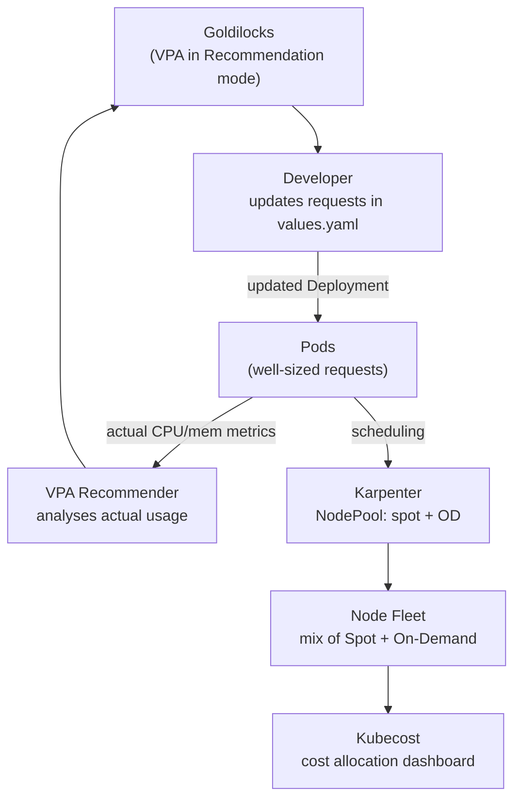

# Cost Optimisation

## Category
FinOps, Cost, Kubernetes

## Context

Kubernetes cost optimisation focuses on three levers: **right-sizing** (use only what you need), **bin packing** (fill nodes efficiently), and **compute discounts** (Spot/Preemptible instances). Real-world clusters often waste 40–70% of provisioned capacity from oversized requests.

| Lever | Tool | Saving potential |
|-------|------|-----------------|
| Right-size requests | VPA + Goldilocks | 20–50% compute |
| Spot / Preemptible | Karpenter NodePool | 60–90% node cost |
| Bin packing | Karpenter consolidation | 20–40% node count |
| Idle namespace cleanup | kubectl-cost + quota | Varies |
| Cost visibility | Kubecost | Visibility only |
| Unused PVC cleanup | manual / policies | 5–15% storage |

**Request ≠ Limit separation**: CPU is compressible (throttled), memory is not (OOM). Over-provisioning CPU requests wastes reservations; over-provisioning memory limits causes OOM kills. Target requests at p95 actual usage.

---

## Pros

- **Karpenter consolidation** removes underutilised nodes automatically, rescheduling pods to denser configurations.
- **Spot instances** (AWS) or **Spot VMs** (GCP/Azure) offer 60–90% savings over on-demand for fault-tolerant workloads.
- **Goldilocks** dashboard generates VPA recommendations for every deployment in a namespace — one-click right-sizing inputs.
- **ResourceQuota per namespace** acts as a financial guardrail: teams cannot provision more than their allocated budget.
- **Kubecost** allocates cloud spend to namespace / label / team, enabling chargeback and optimisation conversations.

---

## Cons

- Spot interruption handling requires thoughtful architecture: stateless pods with PDB, fast startup, graceful shutdown.
- VPA and HPA cannot be used simultaneously on the same resource type (CPU/memory) without KEDA managing external metrics.
- Karpenter consolidation may thrash with workloads that have high anti-affinity rules or strict topology constraints.
- Goldilocks recommendations are P95-based — traffic spikes can OOM pods if limits are set too tightly.
- Kubecost requires Prometheus and adds ~500 MB memory overhead to the cluster.

---

## Design Diagram



---

## Code Sample

### Karpenter NodePool — prioritise Spot with on-demand fallback

```yaml
apiVersion: karpenter.sh/v1
kind: NodePool
metadata:
  name: default
spec:
  template:
    metadata:
      labels:
        billing-team: platform
    spec:
      nodeClassRef:
        apiVersion: karpenter.k8s.aws/v1
        kind: EC2NodeClass
        name: default
      requirements:
        - key: karpenter.sh/capacity-type
          operator: In
          values: [spot, on-demand]       # Spot preferred; OD fallback
        - key: kubernetes.io/arch
          operator: In
          values: [amd64]
        - key: karpenter.k8s.aws/instance-family
          operator: In
          values: [c, m, r]              # Multiple families improve Spot availability
        - key: karpenter.k8s.aws/instance-generation
          operator: Gt
          values: ["5"]
        - key: karpenter.k8s.aws/instance-size   # Avoid smallest instance sizes
          operator: NotIn
          values: [nano, micro, small]
  disruption:
    consolidationPolicy: WhenEmptyOrUnderutilized
    consolidateAfter: 1m                 # Aggressive consolidation
    budgets:
      - nodes: "10%"                     # Never disrupt more than 10% at once
  limits:
    cpu: "200"                           # Cap total cluster CPU
    memory: "400Gi"
```

### Goldilocks — enable recommendations for a namespace

```bash
# Install Goldilocks
helm repo add fairwinds-stable https://charts.fairwinds.com/stable
helm install goldilocks fairwinds-stable/goldilocks \
  --namespace goldilocks --create-namespace

# Enable VPA recommendations for production namespace
kubectl label namespace production \
  goldilocks.fairwinds.com/enabled=true

# Expose the Goldilocks dashboard
kubectl port-forward -n goldilocks svc/goldilocks-dashboard 8080:80
# Then open http://localhost:8080 to see recommended requests/limits per container
```

### Namespace ResourceQuota — financial guardrail per team

```yaml
# Limit team-a's total cluster spend
apiVersion: v1
kind: ResourceQuota
metadata:
  name: team-a-budget
  namespace: team-a-production
spec:
  hard:
    requests.cpu: "20"               # ~$300/month at m5.xlarge on-demand rates
    requests.memory: "40Gi"
    limits.cpu: "40"
    limits.memory: "80Gi"
    persistentvolumeclaims: "20"
    requests.storage: "2Ti"
    services.loadbalancers: "3"      # Each LB costs ~$20/month
```

### Spot interruption handling — graceful shutdown

```yaml
# Node Termination Handler — catches Spot interruptions 2 minutes early
# Install via Helm
# helm install aws-node-termination-handler \
#   eks/aws-node-termination-handler \
#   --namespace kube-system

# Deployment best practices for Spot:
apiVersion: apps/v1
kind: Deployment
metadata:
  name: worker-service
spec:
  template:
    spec:
      # Allow scheduling on Spot AND on-demand
      affinity:
        nodeAffinity:
          preferredDuringSchedulingIgnoredDuringExecution:
            - weight: 100
              preference:
                matchExpressions:
                  - key: karpenter.sh/capacity-type
                    operator: In
                    values: [spot]
      terminationGracePeriodSeconds: 90  # Less than 120s Spot warning window
      containers:
        - name: worker
          lifecycle:
            preStop:
              exec:
                command: ["/bin/sh", "-c", "sleep 5 && /app/drain"]
```

### Kubecost — query cost allocation via API

```bash
# Install Kubecost
helm repo add kubecost https://kubecost.github.io/cost-analyzer
helm install kubecost kubecost/cost-analyzer \
  --namespace kubecost --create-namespace \
  --set kubecostToken="your-token"        # Free tier available

# Query namespace cost for the last 7 days (Kubecost API)
curl "http://localhost:9090/model/allocation?window=7d&aggregate=namespace&accumulate=true" \
  | jq '.data[0] | to_entries | sort_by(-.value.totalCost) | .[0:10] | from_entries'
```

### VPA — recommendation-only mode (safe for production)

```yaml
apiVersion: autoscaling.k8s.io/v1
kind: VerticalPodAutoscaler
metadata:
  name: order-service-vpa
  namespace: production
spec:
  targetRef:
    apiVersion: apps/v1
    kind: Deployment
    name: order-service
  updatePolicy:
    updateMode: "Off"   # Only recommend — never change requests automatically
  resourcePolicy:
    containerPolicies:
      - containerName: order-service
        minAllowed:
          cpu: 50m
          memory: 64Mi
        maxAllowed:
          cpu: "4"
          memory: 4Gi
```

```bash
# Read VPA recommendations
kubectl get vpa order-service-vpa -n production -o jsonpath='{.status.recommendation}'
# Output: {"containerRecommendations":[{"containerName":"order-service",
#   "lowerBound":{"cpu":"112m","memory":"245760k"},
#   "target":{"cpu":"220m","memory":"360Mi"},  # <-- update requests to this
#   "upperBound":{"cpu":"510m","memory":"820Mi"}}]}
```

---

## Related

- [06 — Autoscaling](./06-autoscaling.md) — Karpenter node provisioning and VPA/HPA integration
- [11 — Multi-Tenancy](./11-multi-tenancy.md) — ResourceQuota per namespace as team cost guardrail
- [13 — Pod Reliability](./13-pod-reliability.md) — PDB and topology constraints affect Karpenter consolidation
