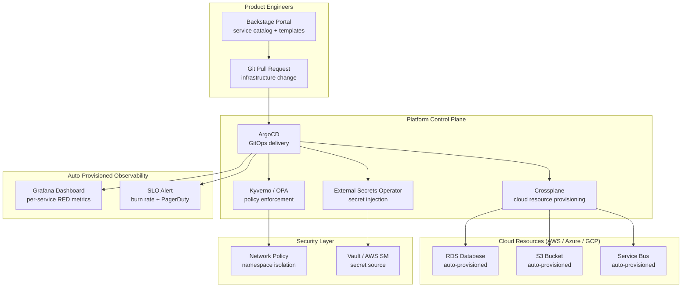

# Platform Engineering & Internal Developer Platform

## Category

Kubernetes, Platform Engineering, IDP, Backstage, Crossplane, Self-Service

## Context

**Platform engineering** is the discipline of building an Internal Developer Platform (IDP) — a self-service layer that abstracts infrastructure complexity, enabling product teams to provision resources, deploy applications, and operate services without deep platform knowledge.

The goal is to reduce cognitive load on product engineers while maintaining governance, security, and cost controls enforced by the platform team.

### Platform Engineering vs DevOps

| Aspect | DevOps | Platform Engineering |
|--------|--------|---------------------|
| **Focus** | CI/CD pipelines for each team | Shared platform capabilities for all teams |
| **Consumers** | The same team that built it | Other engineering teams |
| **Product mindset** | Tools owned by team | Platform treated as an internal product |
| **Self-service** | Engineers access infra directly | Engineers use golden paths via portal |
| **Cognitive load** | Each team manages own infra | Platform team absorbs infra complexity |

### Core IDP Components

| Component | Tool(s) | Purpose |
|-----------|---------|---------|
| **Developer Portal** | Backstage, Port | Service catalog, golden paths, docs, scorecards |
| **Infrastructure as Code** | Crossplane, Terraform, Pulumi | Self-service cloud resource provisioning |
| **GitOps** | ArgoCD, Flux | Automated deployment from Git |
| **Secret Management** | External Secrets Operator, Vault | Secure secret delivery to apps |
| **Service Catalog** | Backstage software catalog | Discoverability of services, APIs, owners |
| **Scaffolding** | Backstage Software Templates | Generate new services from golden templates |
| **Observability** | Grafana Dashboards-as-Code | Auto-provisioned per-service dashboards |
| **Policy** | OPA/Gatekeeper, Kyverno | Governance guardrails on provisioning |

---

## Pros

- **Golden paths reduce decision fatigue**: Pre-approved patterns (Backstage templates, Crossplane compositions) guide developers to compliant, production-ready setups without research overhead.
- **Shift-left governance**: Policy, security, and cost controls baked into the platform — not bolted on after the fact.
- **Faster onboarding**: A new service can be provisioned, CI/CD-wired, and deployed within minutes — not days of ticket-based requests.
- **Standardisation at scale**: Hundreds of services follow the same observability, security, and deployment patterns automatically.

## Cons

- **Platform team is a critical path**: If the IDP is down or lagging, all teams are blocked. Platform team must operate with SRE-level rigor.
- **Initial investment is high**: Building Backstage, Crossplane compositions, and golden templates is months of work before teams see value.
- **Paved road tension**: Teams with non-standard requirements resist the golden path — requires strong product management discipline.
- **Version drift**: Templates drift from best practices over time — need active maintenance cadence (just like application code).

---

## Design Diagram



---

## Code Sample

### 1. Backstage — Software Template (Golden Path for New Service)

```yaml
# backstage/templates/nodejs-microservice/template.yaml
# Product engineers use this template in Backstage to scaffold a new Node.js service
# with CI/CD, Helm chart, observability, and Crossplane database wired up automatically

apiVersion: scaffolder.backstage.io/v1beta3
kind: Template
metadata:
  name:        nodejs-microservice
  title:       Node.js Microservice
  description: Production-ready Node.js service with CI/CD, observability, and optional database
  tags:        [nodejs, recommended]
spec:
  owner:   platform-team
  type:    service
  parameters:
    - title: Service Details
      required: [serviceName, owner, description]
      properties:
        serviceName:
          title:       Service Name
          type:        string
          pattern:     '^[a-z][a-z0-9-]{2,30}$'
          description: Lowercase letters, numbers, hyphens (e.g. payment-processor)
        owner:
          title:  Team Owner
          type:   string
          ui:field: OwnerPicker
          ui:options:
            allowedKinds: [Group]
        description:
          title:  Service Description
          type:   string
        database:
          title:   Provision PostgreSQL database?
          type:    boolean
          default: false

    - title: Deployment
      properties:
        environment:
          title:   Target Environment
          type:    string
          enum:    [dev, staging, production]
          default: dev
        initialReplicas:
          title:   Initial Pod Count
          type:    integer
          minimum: 1
          maximum: 10
          default: 2

  steps:
    - id:     fetch-template
      name:   Fetch Base Template
      action: fetch:template
      input:
        url:    ./skeleton
        values:
          serviceName:  ${{ parameters.serviceName }}
          owner:        ${{ parameters.owner }}
          description:  ${{ parameters.description }}
          database:     ${{ parameters.database }}
          environment:  ${{ parameters.environment }}
          replicas:     ${{ parameters.initialReplicas }}

    - id:     publish-github
      name:   Publish to GitHub
      action: publish:github
      input:
        repoUrl:       github.com?repo=${{ parameters.serviceName }}&owner=my-org
        defaultBranch: main
        description:   ${{ parameters.description }}
        gitCommitMessage: "feat: scaffold ${{ parameters.serviceName }} from platform template"
        topics:        [microservice, nodejs, ${{ parameters.owner }}]
        repoVisibility: private
        access:        my-org/${{ parameters.owner | replace('group:', '') }}

    - id:     register-catalog
      name:   Register in Backstage Catalog
      action: catalog:register
      input:
        repoContentsUrl: ${{ steps['publish-github'].output.repoContentsUrl }}
        catalogInfoPath: /catalog-info.yaml

    - id:     create-argocd-app
      name:   Create ArgoCD Application
      action: argocd:create-resources
      input:
        appName:       ${{ parameters.serviceName }}
        argoInstance:  production-argocd
        projectName:   ${{ parameters.owner | replace('group:', '') }}
        repoUrl:       ${{ steps['publish-github'].output.remoteUrl }}
        path:          helm/

  output:
    links:
      - title:  Repository
        url:    ${{ steps['publish-github'].output.remoteUrl }}
      - title:  Backstage Catalog Entry
        icon:   catalog
        entityRef: ${{ steps['register-catalog'].output.entityRef }}
```

### 2. Crossplane — Composite Resource (Self-Service PostgreSQL)

```yaml
# crossplane/compositions/postgresql-database.yaml
# Platform-defined composition — product team requests a database via XRD
# Crossplane translates the request to actual cloud resources (RDS / Azure SQL)

---
# CompositeResourceDefinition — the API product teams use
apiVersion: apiextensions.crossplane.io/v1
kind: CompositeResourceDefinition
metadata:
  name: xpostgresqldatabases.platform.example.com
spec:
  group:  platform.example.com
  names:
    kind:   XPostgreSQLDatabase
    plural: xpostgresqldatabases
  versions:
    - name:   v1alpha1
      served: true
      referenceable: true
      schema:
        openAPIV3Schema:
          properties:
            spec:
              properties:
                parameters:
                  properties:
                    tier:
                      type: string
                      enum: [dev, standard, premium]
                      description: "dev=t3.micro, standard=t3.medium, premium=r6g.large"
                    storageSizeGB:
                      type:    integer
                      minimum: 20
                      maximum: 1000
                    databaseName:
                      type: string
                  required: [tier, storageSizeGB, databaseName]
          required: [spec]
  claimNames:
    kind:   PostgreSQLDatabase     # this is what product teams create
    plural: postgresqldatabases

---
# Composition — maps the abstract resource to AWS RDS
apiVersion: apiextensions.crossplane.io/v1
kind: Composition
metadata:
  name: postgresql-aws-rds
  labels:
    provider: aws
spec:
  compositeTypeRef:
    apiVersion: platform.example.com/v1alpha1
    kind:       XPostgreSQLDatabase
  resources:
    - name: rds-instance
      base:
        apiVersion: rds.aws.upbound.io/v1beta1
        kind:       Instance
        spec:
          forProvider:
            region:               eu-west-1
            engine:               postgres
            engineVersion:        "16.3"
            instanceClass:        db.t3.micro    # patched based on tier
            allocatedStorage:     20             # patched from spec
            dbName:               placeholder    # patched from spec
            username:             dbadmin
            passwordSecretRef:
              namespace: crossplane-system
              name:       rds-password
              key:        password
            skipFinalSnapshot:    false
            storageEncrypted:     true
            multiAz:              false          # patched for premium tier
            backupRetentionPeriod: 7
            enabledCloudwatchLogsExports: [postgresql]
      patches:
        # Map tier → instance class
        - type: CombineFromComposite
          combine:
            variables:
              - fromFieldPath: spec.parameters.tier
            strategy: string
            string:
              fmt: |
                {{ if eq . "dev" }}db.t3.micro{{ else if eq . "standard" }}db.t3.medium{{ else }}db.r6g.large{{ end }}
          toFieldPath: spec.forProvider.instanceClass

        - type:          FromCompositeFieldPath
          fromFieldPath: spec.parameters.storageSizeGB
          toFieldPath:   spec.forProvider.allocatedStorage

        - type:          FromCompositeFieldPath
          fromFieldPath: spec.parameters.databaseName
          toFieldPath:   spec.forProvider.dbName
```

### 3. Product Team — Claim a Database (Self-Service)

```yaml
# Product team creates this in their namespace — no infra tickets required
# Platform team's Crossplane composition handles the rest

apiVersion: platform.example.com/v1alpha1
kind: PostgreSQLDatabase
metadata:
  name:      payments-db
  namespace: payments-team
spec:
  parameters:
    tier:           standard
    storageSizeGB:  100
    databaseName:   payments
  writeConnectionSecretToRef:
    name:           payments-db-credentials   # Crossplane writes connection string here
```

### 4. Backstage — catalog-info.yaml (Service Self-Description)

```yaml
# catalog-info.yaml — lives in every service repository
# Backstage reads this to populate the software catalog

apiVersion: backstage.io/v1alpha1
kind: Component
metadata:
  name:        payments-service
  title:       Payments Service
  description: Core payment processing microservice — handles transaction creation, status, and settlement
  annotations:
    github.com/project-slug:           my-org/payments-service
    backstage.io/techdocs-ref:         dir:.
    argocd/app-name:                   payments-service
    grafana/dashboard-selector:        service=payments-service
    pagerduty.com/integration-key:     ${{ secrets.PAGERDUTY_KEY }}
    sonarqube.org/project-key:         my-org_payments-service
  tags:        [nodejs, postgresql, payments, pci-dss]
  links:
    - url:   https://grafana.example.com/d/payments
      title: Grafana Dashboard
      icon:  dashboard
    - url:   https://runbooks.example.com/payments
      title: Runbooks
      icon:  docs
spec:
  type:      service
  lifecycle: production
  owner:     group:payments-team
  system:    payment-platform
  dependsOn:
    - component:fraud-service
    - component:core-banking-gateway
    - resource:payments-db
  providesApis:
    - payments-api
```

### 5. Kyverno — Platform Policy (Enforce Labels + Resource Limits)

```yaml
# Enforce that all Deployments in non-system namespaces have required labels
# and resource limits defined — platform governance without manual review

apiVersion: kyverno.io/v1
kind: ClusterPolicy
metadata:
  name:        require-platform-labels
  annotations:
    policies.kyverno.io/title:       Require Platform Labels
    policies.kyverno.io/category:    Platform Engineering
    policies.kyverno.io/description: >
      All Deployments must have 'app.kubernetes.io/name', 'team', and 'environment' labels.
      Resource limits must be defined for all containers.
spec:
  validationFailureAction: Enforce
  background:              true
  rules:
    - name:  require-labels
      match:
        any:
          - resources:
              kinds:      [Deployment]
              namespaces: ["!kube-system", "!flux-system", "!azure-arc", "!monitoring"]
      validate:
        message: "Deployments must have 'app.kubernetes.io/name', 'team', and 'environment' labels"
        pattern:
          metadata:
            labels:
              app.kubernetes.io/name: "?*"
              team:                   "?*"
              environment:            "?*"

    - name:  require-resource-limits
      match:
        any:
          - resources:
              kinds:      [Deployment]
              namespaces: ["!kube-system", "!flux-system", "!azure-arc"]
      validate:
        message: "All containers must define CPU and memory limits"
        foreach:
          - list: "request.object.spec.template.spec.containers[]"
            pattern:
              resources:
                limits:
                  memory: "?*"
                  cpu:    "?*"
```

### 6. Platform Scorecard — Backstage TechDocs Plugin

```typescript
// backstage-plugins/platform-scorecard/src/plugin.ts
// Display a compliance scorecard for every service in the catalog

import { createPlugin, createRoutableExtension } from '@backstage/core-plugin-api';
import { rootRouteRef } from './routes';

export const platformScorecardPlugin = createPlugin({
  id:         'platform-scorecard',
  routes:     { root: rootRouteRef },
});

// Scorecard checks run against catalog metadata + external APIs
interface ScorecardCheck {
  id:       string;
  label:    string;
  category: 'reliability' | 'security' | 'ownership' | 'observability';
  pass:     (entity: Entity) => boolean | Promise<boolean>;
  weight:   number;
}

export const PLATFORM_CHECKS: ScorecardCheck[] = [
  {
    id:       'has-owner',
    label:    'Service has a defined owner group',
    category: 'ownership',
    weight:   20,
    pass:     entity => !!entity.spec?.owner,
  },
  {
    id:       'has-runbook',
    label:    'Runbook link present in links',
    category: 'reliability',
    weight:   15,
    pass:     entity => entity.metadata.links?.some(l => l.title === 'Runbooks') ?? false,
  },
  {
    id:       'has-grafana-dashboard',
    label:    'Grafana dashboard linked',
    category: 'observability',
    weight:   15,
    pass:     entity => !!entity.metadata.annotations?.['grafana/dashboard-selector'],
  },
  {
    id:       'has-pagerduty',
    label:    'PagerDuty integration configured',
    category: 'reliability',
    weight:   15,
    pass:     entity => !!entity.metadata.annotations?.['pagerduty.com/integration-key'],
  },
  {
    id:       'has-techdocs',
    label:    'TechDocs (README / API docs) present',
    category: 'ownership',
    weight:   10,
    pass:     entity => !!entity.metadata.annotations?.['backstage.io/techdocs-ref'],
  },
  {
    id:       'has-api-definition',
    label:    'API definition registered',
    category: 'observability',
    weight:   10,
    pass:     entity => (entity.spec?.providesApis as string[] | undefined)?.length > 0,
  },
  {
    id:       'lifecycle-production',
    label:    'Lifecycle set to production',
    category: 'ownership',
    weight:   15,
    pass:     entity => entity.spec?.lifecycle === 'production',
  },
];
```

---

## Platform Engineering Checklist

### Golden Paths
- [ ] At least one Backstage Software Template for each common service archetype (API, worker, data pipeline)
- [ ] Templates include: Helm chart skeleton, CI/CD pipeline, catalog-info.yaml, Grafana dashboard, SLO alert
- [ ] Templates reviewed and updated on a regular cadence (quarterly minimum)

### Self-Service Infrastructure
- [ ] Crossplane compositions defined for: PostgreSQL, Redis, object storage, service bus
- [ ] Product teams can provision resources without platform team tickets
- [ ] All Crossplane compositions enforce encryption, private networking, and tagging policies

### Governance
- [ ] Kyverno / OPA Gatekeeper policies enforce: required labels, resource limits, non-root containers, no latest image tag
- [ ] Platform scorecard published in Backstage for every service — visible to all engineers and management
- [ ] Policy violations block deployment (Enforce mode) after initial audit period

### Observability
- [ ] Every service auto-provisioned with: Grafana dashboard (RED metrics), SLO alert, PagerDuty routing
- [ ] Backstage catalog shows on-call owner, runbook link, and dashboard for every service

---

## References

- [Backstage — Official Documentation](https://backstage.io/docs/)
- [Crossplane — Composing Cloud Infrastructure](https://docs.crossplane.io/)
- [CNCF Platforms White Paper](https://tag-app-delivery.cncf.io/whitepapers/platforms/)
- [Team Topologies — Platform Teams](https://teamtopologies.com/key-concepts)
- [Kyverno — Policy Engine for Kubernetes](https://kyverno.io/docs/)
- [Internal Developer Platform (IDP) — internaldeveloperplatform.org](https://internaldeveloperplatform.org/)
- [Port — Developer Portal](https://www.getport.io/)
