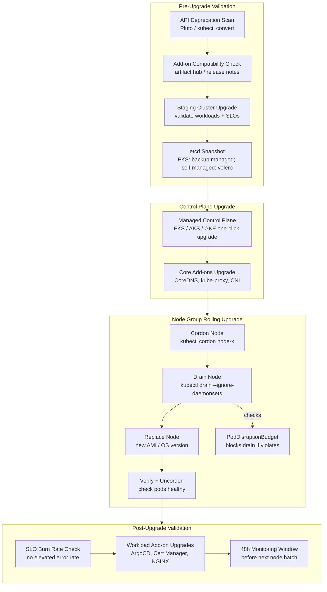

# Cluster Upgrades & Node Maintenance

## Category

Kubernetes, Upgrades, Node Maintenance, SLO, Zero-Downtime, Drain

## Context

**Kubernetes cluster upgrades** are a recurring operational necessity — Kubernetes releases a minor version every ~4 months, and each minor version receives patch releases for approximately 14 months (N-2 supported). Falling more than two versions behind means running on an unsupported, unpatched control plane.

Node maintenance (OS patching, instance retirement, hardware failures) is equally routine — nodes must be safely drained and replaced without disrupting running workloads.

### Kubernetes Release Lifecycle

| Phase | Duration | Action Required |
|-------|---------|----------------|
| Active development | — | — |
| **Supported** | ~14 months | Keep within N, N-1, or N-2 |
| **End of Life** | After 14 months | Must upgrade before EOL |
| **Extended Support** (EKS/AKS/GKE) | +12 months (paid) | Emergency use only |

**Upgrade cadence recommendation**: Upgrade once per minor version per quarter — stay no more than one version behind the latest.

### Upgrade Order (Always Upward, Never Skip)

```
1. Control Plane (managed: EKS / AKS / GKE upgrades the API server)
2. Core add-ons (kube-proxy, CoreDNS, kube-dns, CNI)
3. Node groups (rolling — one node at a time, or via Karpenter NodePool)
4. Workload add-ons (Ingress controller, Cert Manager, External Secrets, ArgoCD)
5. Application pods (re-scheduled automatically after node replacement)
```

Never upgrade nodes before the control plane — kubelets can be behind by one minor version (N-1) but not ahead.

### Upgrade Risk Factors

| Risk | Mitigation |
|------|-----------|
| API deprecations (e.g. `extensions/v1beta1` → `apps/v1`) | Run `kubectl convert` / Pluto before upgrade |
| Add-on version incompatibility | Pin add-on versions; test in staging first |
| PodDisruptionBudgets blocking drain | PDB must allow ≥1 pod to be disrupted |
| Stateful workloads (databases) | Drain stateful nodes last; take snapshot before |
| Long-running jobs interrupted | Use `terminationGracePeriodSeconds` generously |

---

## Pros

- **Rolling node replacement is zero-downtime**: Cordon → drain → replace → uncordon means workloads stay running throughout.
- **Managed K8s (EKS/AKS/GKE) reduces control plane risk**: Cloud provider handles control plane upgrade — engineer only manages node groups.
- **Karpenter simplifies node rotation**: Replace nodes by updating `NodePool.spec.template.spec.nodeClassRef` — Karpenter drains and replaces without manual scripting.
- **PodDisruptionBudgets guarantee availability**: Platform-enforced PDBs prevent upgrades from causing downtime even if an engineer drains incorrectly.

## Cons

- **Upgrade complexity scales with add-on count**: Each Helm release (Cert Manager, Istio, NGINX, External Secrets, ArgoCD...) must be tested for compatibility with the new K8s version.
- **StatefulSets require careful ordering**: Databases (PostgreSQL, Kafka) running on Kubernetes need node drain to be done one-at-a-time with health checks between each.
- **API removals are breaking changes**: Removed APIs (not just deprecated) break workloads — requires audit of all manifests before upgrading.
- **Cluster autoscaler / Karpenter need version-specific AMIs**: Node AMIs must match the new K8s version — not automatic on self-managed nodes.

---

## Design Diagram



---

## Code Sample

### 1. API Deprecation Scan — Pluto

```bash
# Install Pluto (detects deprecated/removed Kubernetes APIs in manifests and Helm releases)
brew install FairwindsOps/tap/pluto

# Scan all Helm releases in the cluster for deprecated APIs (target: K8s 1.32)
pluto detect-helm --target-versions k8s=v1.32.0 --output wide

# Scan your local manifests directory
pluto detect-files -d ./k8s/manifests --target-versions k8s=v1.32.0

# Scan a specific Helm chart before deploying
helm template my-chart ./helm/payments-service | pluto detect - --target-versions k8s=v1.32.0

# Example output:
# NAME                         NAMESPACE  KIND        VERSION                    REPLACEMENT    REMOVED   DEPRECATED
# payments/payments-service    payments   Ingress     extensions/v1beta1         networking.k8s.io/v1   true      true
```

### 2. EKS Control Plane Upgrade

```bash
# Check current EKS cluster version
aws eks describe-cluster --name my-cluster --query 'cluster.version' --output text

# List available upgrade versions
aws eks describe-addon-versions --kubernetes-version 1.31 --query 'addons[].addonName'

# Upgrade control plane (managed — AWS upgrades the API server, etcd, scheduler, controller-manager)
aws eks update-cluster-version \
  --name   my-cluster \
  --kubernetes-version 1.32

# Wait for upgrade to complete (~15 minutes)
aws eks wait cluster-active --name my-cluster

# Upgrade core EKS add-ons (must match new cluster version)
for ADDON in kube-proxy coredns vpc-cni aws-ebs-csi-driver; do
  LATEST=$(aws eks describe-addon-versions \
    --addon-name "$ADDON" \
    --kubernetes-version 1.32 \
    --query 'addons[0].addonVersions[0].addonVersion' \
    --output text)
  echo "Upgrading $ADDON to $LATEST"
  aws eks update-addon \
    --cluster-name my-cluster \
    --addon-name   "$ADDON" \
    --addon-version "$LATEST" \
    --resolve-conflicts OVERWRITE
done
```

### 3. AKS Control Plane + Node Pool Upgrade

```bash
# List available AKS upgrade versions
az aks get-upgrades --resource-group my-rg --name my-aks --output table

# Upgrade control plane only (decouple from node pool)
az aks upgrade \
  --resource-group      my-rg \
  --name                my-aks \
  --kubernetes-version  1.32.0 \
  --control-plane-only

# Upgrade a specific node pool (rolling — surge upgrade)
az aks nodepool upgrade \
  --resource-group  my-rg \
  --cluster-name    my-aks \
  --name            system \
  --kubernetes-version 1.32.0 \
  --max-surge       1          # allow 1 extra node during upgrade (faster upgrade, more cost)
  # --node-soak-duration PT30M   # wait 30 min after each node before proceeding (optional)
```

### 4. Node Drain — Safe Manual Drain

```bash
# Cordon: mark node unschedulable (no new pods will be scheduled here)
kubectl cordon node-name

# Drain: evict all pods (respects PodDisruptionBudgets and terminationGracePeriod)
kubectl drain node-name \
  --ignore-daemonsets \          # leave DaemonSet pods (they'll move automatically)
  --delete-emptydir-data \       # allow deletion of pods using emptyDir volumes
  --grace-period=60 \            # give pods 60s to terminate gracefully
  --timeout=10m                  # give up if drain takes > 10 minutes

# If drain is stuck: check which PDB is blocking
kubectl get pdb -A
kubectl describe pdb my-pdb -n my-namespace

# Common issue: PDB with maxUnavailable=0 and only 1 pod running
# Fix: scale up deployment to 2+ replicas before draining

# After node is replaced with new AMI/OS, verify the new node is Ready
kubectl get nodes
kubectl get pods --all-namespaces -o wide | grep node-name

# Uncordon: allow scheduling on the replacement node
kubectl uncordon new-node-name
```

### 5. Karpenter — Node Class Update for Version Upgrade

```yaml
# Update the Karpenter EC2NodeClass to use the new AMI
# Karpenter will automatically roll nodes when the NodeClass changes

apiVersion: karpenter.k8s.aws/v1
kind: EC2NodeClass
metadata:
  name: default
spec:
  amiFamily: AL2023   # Amazon Linux 2023
  amiSelectorTerms:
    # Pin to a specific AMI version (recommended for production)
    - id: ami-0123456789abcdef0   # new AMI for K8s 1.32
    # OR use dynamic selection (less predictable):
    # - name: "amazon-eks-node-al2023-x86_64-standard-1.32-*"
  role:         "KarpenterNodeRole-my-cluster"
  subnetSelectorTerms:
    - tags:
        karpenter.sh/discovery: my-cluster
  securityGroupSelectorTerms:
    - tags:
        karpenter.sh/discovery: my-cluster
  blockDeviceMappings:
    - deviceName: /dev/xvda
      ebs:
        volumeSize:          50Gi
        volumeType:          gp3
        iops:                3000
        encrypted:           true
        kmsKeyID:            alias/aws/ebs
```

```bash
# After updating EC2NodeClass, trigger rolling node replacement
# Karpenter will drain old nodes and provision new ones with the updated AMI

# Option 1: Manual drift trigger (Karpenter 0.33+ drift feature)
kubectl annotate nodes -l karpenter.sh/nodepool=default \
  karpenter.sh/do-not-disrupt-  # remove any do-not-disrupt annotations

# Option 2: Use karpenter-node-terminator to rolling replace
# (or simply delete nodes one at a time; Karpenter will reprovision)
kubectl delete node node-name-old-1  # Karpenter replaces automatically
```

### 6. PodDisruptionBudget — Protect During Upgrades

```yaml
# Every production Deployment should have a PDB
# Prevents cluster upgrades from taking down all replicas simultaneously

apiVersion: policy/v1
kind: PodDisruptionBudget
metadata:
  name:      payments-service-pdb
  namespace: payments
spec:
  # Guarantee at least 80% of replicas remain available during disruption
  # With 5 replicas: at least 4 must be Running/Ready at all times
  minAvailable: 80%   # use % for flexibility as replica count changes
  selector:
    matchLabels:
      app: payments-service

---
# For critical stateful services, use maxUnavailable instead
apiVersion: policy/v1
kind: PodDisruptionBudget
metadata:
  name:      kafka-pdb
  namespace: kafka
spec:
  maxUnavailable: 1   # only 1 Kafka broker at a time (for a 3-broker cluster)
  selector:
    matchLabels:
      app.kubernetes.io/name: kafka
```

### 7. Upgrade Validation — SLO Health Check Script

```bash
#!/bin/bash
# post-upgrade-validation.sh — run after each node group batch upgrade
# Fails if SLO burn rate exceeds threshold within the last 10 minutes

PROMETHEUS_URL="${PROMETHEUS_URL:-http://prometheus.monitoring.svc:9090}"
BURN_RATE_THRESHOLD="2.0"    # 2x burn rate = action required

echo "=== Post-Upgrade Validation ==="

# 1. Check all nodes are Ready
NOT_READY=$(kubectl get nodes --no-headers | grep -v " Ready" | wc -l)
if [ "$NOT_READY" -gt 0 ]; then
  echo "❌ $NOT_READY nodes are NOT Ready:"
  kubectl get nodes --no-headers | grep -v " Ready"
  exit 1
fi
echo "✅ All nodes are Ready"

# 2. Check for pods in CrashLoopBackOff or Error state
CRASH_PODS=$(kubectl get pods -A --no-headers | grep -E "CrashLoopBackOff|Error|OOMKilled" | wc -l)
if [ "$CRASH_PODS" -gt 0 ]; then
  echo "❌ $CRASH_PODS pods in unhealthy state:"
  kubectl get pods -A --no-headers | grep -E "CrashLoopBackOff|Error|OOMKilled"
  exit 1
fi
echo "✅ No pods in CrashLoopBackOff or Error state"

# 3. Check SLO burn rate via Prometheus
BURN_RATE=$(curl -s "${PROMETHEUS_URL}/api/v1/query" \
  --data-urlencode 'query=max(slo:sli_error:ratio_rate1h{sloth_service=~".+"}) * 24' \
  | python3 -c "import sys,json; data=json.load(sys.stdin); print(data['data']['result'][0]['value'][1] if data['data']['result'] else '0')" 2>/dev/null || echo "0")

if python3 -c "exit(0 if float('${BURN_RATE}') < float('${BURN_RATE_THRESHOLD}') else 1)"; then
  echo "✅ SLO burn rate is healthy: ${BURN_RATE}x"
else
  echo "❌ SLO burn rate elevated: ${BURN_RATE}x (threshold: ${BURN_RATE_THRESHOLD}x)"
  echo "   Pausing upgrade — investigate before continuing"
  exit 1
fi

echo "=== Validation PASSED — safe to continue upgrade ==="
```

---

## Upgrade Runbook Checklist

### T-2 weeks (Preparation)
- [ ] Run Pluto API deprecation scan — fix any removed API usages before upgrade
- [ ] Check add-on compatibility matrix (Cert Manager, Ingress NGINX, External Secrets, ArgoCD, Istio)
- [ ] Review K8s changelog for behavioural changes in the target version
- [ ] Upgrade staging cluster — validate all workloads and SLOs hold

### T-0 (Upgrade Day)
- [ ] Notify on-call team and stakeholders — maintenance window set
- [ ] Take etcd snapshot / velero backup (self-managed) or verify cloud backup (EKS/AKS/GKE)
- [ ] Upgrade control plane (`aws eks update-cluster-version` / `az aks upgrade --control-plane-only`)
- [ ] Wait for control plane to be Ready — verify with `kubectl version`
- [ ] Upgrade core add-ons (kube-proxy, CoreDNS, CNI, EBS/AzureDisk CSI)
- [ ] Roll node groups — one batch at a time; run validation script after each batch
- [ ] Upgrade workload add-ons (ArgoCD, Cert Manager, NGINX Ingress, External Secrets)
- [ ] Run post-upgrade validation script — confirm SLO burn rate healthy

### T+48h (Follow-up)
- [ ] Monitor SLO dashboards for 48 hours
- [ ] Update runbook with any unexpected issues found
- [ ] Update internal wiki with completed version upgrade
- [ ] Schedule next upgrade (aim for quarterly cadence)

---

## References

- [Kubernetes Release Cadence & Support](https://kubernetes.io/releases/)
- [EKS — Updating a Cluster](https://docs.aws.amazon.com/eks/latest/userguide/update-cluster.html)
- [AKS — Upgrade a Cluster](https://learn.microsoft.com/en-us/azure/aks/upgrade-cluster)
- [Pluto — API Deprecation Detector](https://github.com/FairwindsOps/pluto)
- [Karpenter — Node Drift](https://karpenter.sh/docs/concepts/disruption/#drift)
- [PodDisruptionBudget — Kubernetes Docs](https://kubernetes.io/docs/tasks/run-application/configure-pdb/)
- [EKS Best Practices Guide — Upgrades](https://aws.github.io/aws-eks-best-practices/upgrades/)
