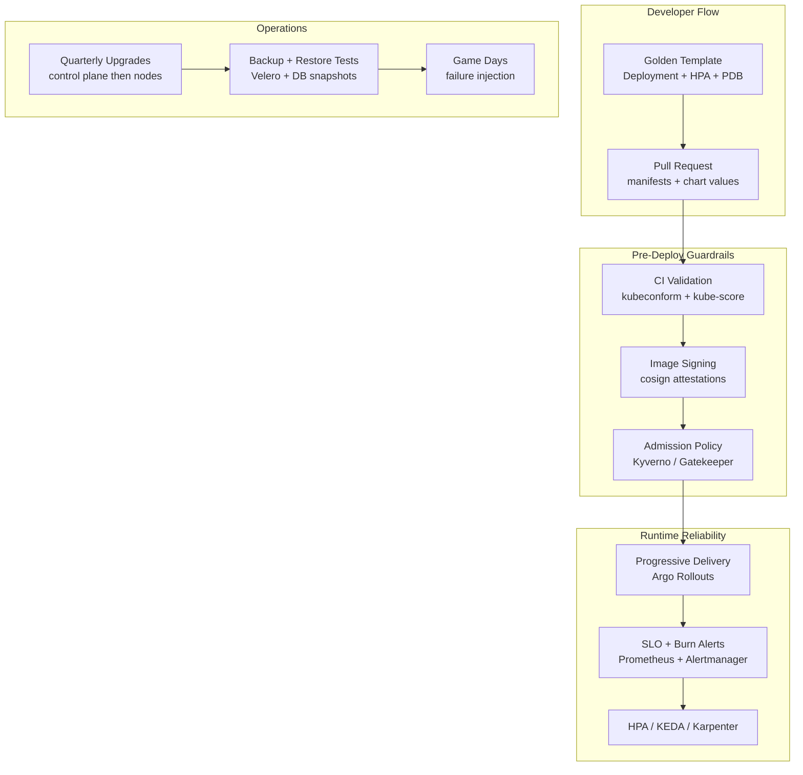

# Kubernetes Best Practices

## Category

Kubernetes, Best Practices, Reliability, Security, Operability

## Context

Kubernetes gives teams massive flexibility, but that flexibility can quickly turn into inconsistency, outages, and cost waste without clear platform standards.

This guide captures pragmatic best practices that consistently improve delivery speed, reliability, and security in production Kubernetes environments.

### Best Practices Maturity Model

| Level | Focus | Typical outcomes |
|------|-------|------------------|
| Level 1 | Basics (health probes, resource requests, namespaces) | Fewer incidents, better scheduling |
| Level 2 | Platform controls (GitOps, policy, SLO alerts) | Safer releases, predictable operations |
| Level 3 | Advanced operations (progressive delivery, error budgets, chaos drills) | Higher resilience and faster recovery |

### Golden Rule

Adopt defaults that are safe for production, and force exceptions to be explicit and reviewed.

---

## Pros

- **Fewer avoidable incidents**: Stable probes, sane resources, and disruption policies prevent common failures.
- **Faster onboarding**: Standard templates and policy guardrails reduce decision fatigue.
- **Improved security posture**: Principle-of-least-privilege and signed-image controls block risky deployments.
- **Lower cloud costs**: Right-sizing and autoscaling avoid chronic overprovisioning.

## Cons

- **Requires platform investment**: Good defaults and policy automation take time to build.
- **Perceived developer friction**: Teams may resist constraints without clear enablement and documentation.
- **Ongoing maintenance**: Best practices evolve with Kubernetes versions and ecosystem tools.

---

## Design Diagram



---

## Best Practices Checklist

### Workload Design

- Set `requests` and `limits` on all containers.
- Use readiness and liveness probes with realistic thresholds.
- Define `PodDisruptionBudget` for all critical services.
- Use `topologySpreadConstraints` for zonal resilience.
- Use `terminationGracePeriodSeconds` based on real shutdown behavior.

### Security

- Run containers as non-root and drop Linux capabilities.
- Use least-privilege RBAC; never bind cluster-admin broadly.
- Prefer workload identity (IRSA, Workload Identity) over static cloud keys.
- Enforce signed images and trusted registries.
- Isolate namespaces with default-deny NetworkPolicy.

### Delivery and Operations

- Use GitOps for all cluster changes.
- Roll out with canary or blue/green for high-impact services.
- Keep Kubernetes versions within supported windows.
- Practice restore drills, not only backups.
- Track SLOs and error budgets per critical service.

---

## Code Sample

### 1. Production Deployment Baseline

```yaml
apiVersion: apps/v1
kind: Deployment
metadata:
  name: checkout-service
  namespace: commerce
  labels:
    app: checkout-service
spec:
  replicas: 3
  revisionHistoryLimit: 5
  strategy:
    type: RollingUpdate
    rollingUpdate:
      maxUnavailable: 0
      maxSurge: 1
  selector:
    matchLabels:
      app: checkout-service
  template:
    metadata:
      labels:
        app: checkout-service
    spec:
      serviceAccountName: checkout-service
      terminationGracePeriodSeconds: 60
      securityContext:
        seccompProfile:
          type: RuntimeDefault
      containers:
        - name: api
          image: ghcr.io/acme/checkout-service:1.14.2
          ports:
            - containerPort: 8080
          resources:
            requests:
              cpu: "250m"
              memory: "256Mi"
            limits:
              cpu: "1000m"
              memory: "512Mi"
          securityContext:
            runAsNonRoot: true
            allowPrivilegeEscalation: false
            readOnlyRootFilesystem: true
            capabilities:
              drop: ["ALL"]
          readinessProbe:
            httpGet:
              path: /ready
              port: 8080
            initialDelaySeconds: 5
            periodSeconds: 10
            failureThreshold: 3
          livenessProbe:
            httpGet:
              path: /live
              port: 8080
            initialDelaySeconds: 20
            periodSeconds: 10
            failureThreshold: 3
```

### 2. PodDisruptionBudget and Spread Constraints

```yaml
apiVersion: policy/v1
kind: PodDisruptionBudget
metadata:
  name: checkout-service-pdb
  namespace: commerce
spec:
  minAvailable: 2
  selector:
    matchLabels:
      app: checkout-service
---
apiVersion: apps/v1
kind: Deployment
metadata:
  name: checkout-service
  namespace: commerce
spec:
  template:
    spec:
      topologySpreadConstraints:
        - maxSkew: 1
          topologyKey: topology.kubernetes.io/zone
          whenUnsatisfiable: DoNotSchedule
          labelSelector:
            matchLabels:
              app: checkout-service
```

### 3. Default Deny Network Policy

```yaml
apiVersion: networking.k8s.io/v1
kind: NetworkPolicy
metadata:
  name: default-deny
  namespace: commerce
spec:
  podSelector: {}
  policyTypes:
    - Ingress
    - Egress
---
apiVersion: networking.k8s.io/v1
kind: NetworkPolicy
metadata:
  name: allow-checkout-to-payments
  namespace: commerce
spec:
  podSelector:
    matchLabels:
      app: checkout-service
  policyTypes:
    - Egress
  egress:
    - to:
        - namespaceSelector:
            matchLabels:
              name: payments
          podSelector:
            matchLabels:
              app: payments-api
      ports:
        - protocol: TCP
          port: 8080
```

### 4. Kyverno Policy to Enforce Requests and Limits

```yaml
apiVersion: kyverno.io/v1
kind: ClusterPolicy
metadata:
  name: require-requests-limits
spec:
  validationFailureAction: Enforce
  background: true
  rules:
    - name: check-container-resources
      match:
        any:
          - resources:
              kinds: ["Pod"]
      validate:
        message: "All containers must define requests and limits for CPU and memory"
        foreach:
          - list: "request.object.spec.containers[]"
            pattern:
              resources:
                requests:
                  cpu: "?*"
                  memory: "?*"
                limits:
                  cpu: "?*"
                  memory: "?*"
```

### 5. Progressive Delivery with Argo Rollouts

```yaml
apiVersion: argoproj.io/v1alpha1
kind: Rollout
metadata:
  name: checkout-service
  namespace: commerce
spec:
  replicas: 5
  selector:
    matchLabels:
      app: checkout-service
  template:
    metadata:
      labels:
        app: checkout-service
    spec:
      containers:
        - name: api
          image: ghcr.io/acme/checkout-service:1.15.0
          ports:
            - containerPort: 8080
  strategy:
    canary:
      canaryService: checkout-service-canary
      stableService: checkout-service
      steps:
        - setWeight: 10
        - pause: { duration: 3m }
        - setWeight: 30
        - pause: { duration: 5m }
        - setWeight: 60
        - pause: { duration: 5m }
```

### 6. SLO Burn Rate Alert

```yaml
groups:
  - name: slo-alerts
    rules:
      - alert: CheckoutHighErrorBudgetBurn
        expr: |
          (
            rate(http_requests_total{service="checkout",status=~"5.."}[5m])
            /
            rate(http_requests_total{service="checkout"}[5m])
          ) > (0.001 * 14.4)
        for: 5m
        labels:
          severity: page
          service: checkout
        annotations:
          summary: "Checkout burning error budget too fast"
          description: "5m error rate exceeds 14.4x allowed burn for 99.9% SLO"
```

---

## Platform Team Review Questions

- Are all production workloads covered by PDBs and spread constraints?
- Do we block unsigned images and untrusted registries at admission time?
- Are deprecated APIs scanned before every minor version upgrade?
- Do release rollouts have automated rollback gates based on SLO or error rates?
- Can every critical service be restored end-to-end within the stated RTO?

---

## References

- [Kubernetes Production Best Practices](https://kubernetes.io/docs/setup/best-practices/)
- [Pod Security Standards](https://kubernetes.io/docs/concepts/security/pod-security-standards/)
- [Argo Rollouts](https://argo-rollouts.readthedocs.io/)
- [Kyverno Policies](https://kyverno.io/policies/)
- [Google SRE Workbook — Alerting on SLOs](https://sre.google/workbook/alerting-on-slos/)