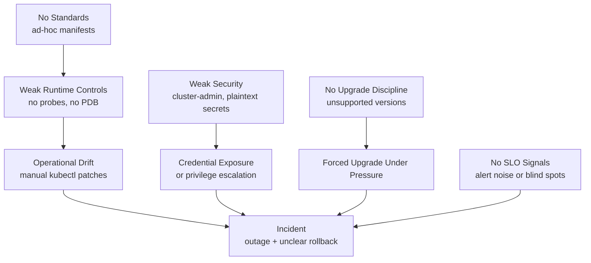

# Kubernetes Anti-Patterns

## Category

Kubernetes, Anti-Patterns, Reliability, Security, Operations

## Context

Most Kubernetes outages are not caused by Kubernetes itself; they are caused by repeatable design and operational anti-patterns.

This guide catalogs common anti-patterns, why they fail, and what to do instead.

### Anti-Pattern Severity Scale

| Severity | Meaning |
|---------|---------|
| Critical | High chance of outage or security incident |
| High | Frequent incidents, degraded reliability |
| Medium | Operational drag, cost waste, slower delivery |

---

## Top Anti-Patterns (And Better Alternatives)

| Anti-pattern | Severity | Why it fails | Better pattern |
|-------------|----------|--------------|----------------|
| No resource requests/limits | High | Noisy-neighbor contention, OOM chaos | Enforce requests/limits policy |
| No readiness/liveness probes | High | Broken pods receive traffic; dead pods linger | Probe design aligned to app behavior |
| Using latest image tag in production | Critical | Non-reproducible deployments, surprise regressions | Immutable tags and digest pinning |
| Cluster-admin for app teams | Critical | Privilege escalation blast radius | Namespace-scoped RBAC least privilege |
| Secrets in plain text Git | Critical | Credential leakage and compliance failures | External Secrets + secret manager |
| Manual kubectl hotfixes in prod | High | Drift from Git, non-auditable changes | GitOps-only reconciliation |
| Single replica critical services | Critical | Any restart causes downtime | 2+ replicas + PDB + anti-affinity |
| Ignoring upgrade windows | High | Unsupported clusters, forced risky upgrades | Quarterly upgrade cadence |
| No NetworkPolicy | High | Flat network, easy lateral movement | Default deny + explicit allow |
| Overusing sidecars everywhere | Medium | CPU/memory tax and latency overhead | Sidecars only where justified |

---

## Failure Diagram



---

## Code Sample

### 1. Anti-Pattern: latest Tag

Bad:

```yaml
apiVersion: apps/v1
kind: Deployment
metadata:
  name: orders-api
spec:
  template:
    spec:
      containers:
        - name: api
          image: ghcr.io/acme/orders-api:latest
```

Better:

```yaml
apiVersion: apps/v1
kind: Deployment
metadata:
  name: orders-api
spec:
  template:
    spec:
      containers:
        - name: api
          image: ghcr.io/acme/orders-api:2.7.4@sha256:3b9a8b4a9fe6d4e4a8f8c6be7f2ef0f7c0c25f2d7d4f02b9c774a6a1f9a4c123
```

### 2. Anti-Pattern: No Requests/Limits

Bad:

```yaml
containers:
  - name: worker
    image: ghcr.io/acme/worker:1.4.0
```

Better:

```yaml
containers:
  - name: worker
    image: ghcr.io/acme/worker:1.4.0
    resources:
      requests:
        cpu: "200m"
        memory: "256Mi"
      limits:
        cpu: "1000m"
        memory: "1Gi"
```

### 3. Anti-Pattern: Manual Production Patch

Bad:

```bash
kubectl -n payments set image deployment/payments-api api=ghcr.io/acme/payments-api:hotfix-now
kubectl -n payments edit deployment payments-api
```

Better:

```bash
# Update image tag in Git, open PR, let GitOps apply
git checkout -b hotfix/payments-timeout
sed -i '' 's|payments-api:2.5.3|payments-api:2.5.4|g' clusters/prod/payments/deployment.yaml
git commit -am "fix(payments): patch timeout bug"
git push origin hotfix/payments-timeout
# ArgoCD/Flux reconciles after PR merge
```

### 4. Anti-Pattern: Broad RBAC

Bad:

```yaml
apiVersion: rbac.authorization.k8s.io/v1
kind: ClusterRoleBinding
metadata:
  name: app-team-admin
subjects:
  - kind: Group
    name: app-team
roleRef:
  apiGroup: rbac.authorization.k8s.io
  kind: ClusterRole
  name: cluster-admin
```

Better:

```yaml
apiVersion: rbac.authorization.k8s.io/v1
kind: Role
metadata:
  name: app-team-deployer
  namespace: payments
rules:
  - apiGroups: ["apps"]
    resources: ["deployments"]
    verbs: ["get", "list", "watch", "create", "update", "patch"]
  - apiGroups: [""]
    resources: ["services", "configmaps", "secrets"]
    verbs: ["get", "list", "watch", "create", "update", "patch"]
---
apiVersion: rbac.authorization.k8s.io/v1
kind: RoleBinding
metadata:
  name: app-team-deployer
  namespace: payments
subjects:
  - kind: Group
    name: app-team
roleRef:
  apiGroup: rbac.authorization.k8s.io
  kind: Role
  name: app-team-deployer
```

### 5. Anti-Pattern: Plaintext Secrets in Git

Bad:

```yaml
apiVersion: v1
kind: Secret
metadata:
  name: payments-db
  namespace: payments
type: Opaque
stringData:
  password: "SuperSecret123"
```

Better:

```yaml
apiVersion: external-secrets.io/v1beta1
kind: ExternalSecret
metadata:
  name: payments-db
  namespace: payments
spec:
  refreshInterval: 1h
  secretStoreRef:
    name: aws-secrets-manager
    kind: ClusterSecretStore
  target:
    name: payments-db
    creationPolicy: Owner
  data:
    - secretKey: password
      remoteRef:
        key: prod/payments/db
        property: password
```

### 6. Anti-Pattern: Missing PDB for Critical Service

Bad:

```yaml
apiVersion: apps/v1
kind: Deployment
metadata:
  name: checkout
spec:
  replicas: 2
```

Better:

```yaml
apiVersion: policy/v1
kind: PodDisruptionBudget
metadata:
  name: checkout-pdb
spec:
  minAvailable: 1
  selector:
    matchLabels:
      app: checkout
```

### 7. Anti-Pattern: No Upgrade Pipeline

Bad:

```bash
# No staging test, no deprecation scan, direct production upgrade
aws eks update-cluster-version --name prod-cluster --kubernetes-version 1.32
```

Better:

```bash
pluto detect-helm --target-versions k8s=v1.32.0
./run-staging-upgrade.sh
./run-smoke-tests.sh
aws eks update-cluster-version --name prod-cluster --kubernetes-version 1.32
./validate-slo-burn.sh
```

---

## Anti-Pattern Detection Signals

- Frequent OOMKilled events or CPU throttling spikes.
- kubectl edits in production not represented in Git history.
- Critical services with one replica in production namespaces.
- Widespread use of cluster-admin bindings.
- Secrets discovered in repository history or CI logs.
- Version drift where cluster is outside supported Kubernetes window.

---

## Team Retro Questions

- Which anti-pattern caused the most incidents in the last quarter?
- Which anti-pattern is easiest to remove with one platform policy?
- Which team needs migration support to exit risky legacy practices?
- Which anti-pattern currently has no automated detection?

---

## References

- [Kubernetes Security Checklist](https://kubernetes.io/docs/concepts/security/overview/)
- [NSA/CISA Kubernetes Hardening Guidance](https://media.defense.gov/2022/Aug/03/2003049074/-1/-1/0/CTR_KUBERNETES_HARDENING_GUIDANCE_1.2_20220801.PDF)
- [ArgoCD Best Practices](https://argo-cd.readthedocs.io/)
- [External Secrets Operator](https://external-secrets.io/)
- [Pluto API Deprecation Tool](https://github.com/FairwindsOps/pluto)