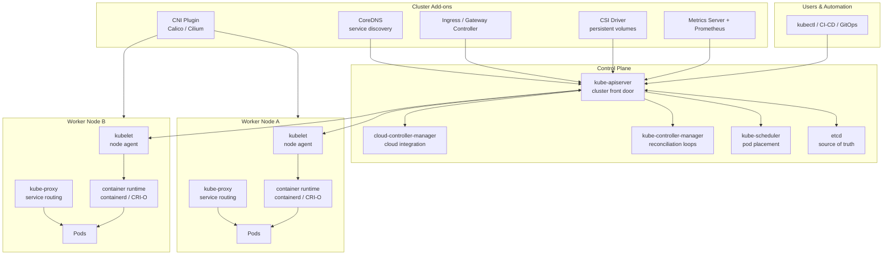

# Kubernetes Architecture & Key Components

## Category

Kubernetes, Architecture, Control Plane, Data Plane, Operations

## Context

Kubernetes is a distributed system that separates **desired state management** from **workload execution**.

- The **control plane** decides what should run and where.
- The **data plane** (worker nodes) actually runs pods.
- **Cluster add-ons** provide networking, DNS, metrics, ingress, and storage integrations.

Understanding each component and its responsibilities is the foundation for secure, reliable Kubernetes operations.

### At-a-Glance Architecture

| Layer | Core purpose | Main components |
|------|--------------|-----------------|
| Control Plane | Reconcile desired state | API Server, etcd, Scheduler, Controller Manager, Cloud Controller Manager |
| Node Plane | Execute workloads | kubelet, kube-proxy, container runtime, CNI plugin |
| Add-on Plane | Platform capabilities | CoreDNS, Ingress Controller, CSI driver, Metrics Server, observability stack |

---

## Pros

- **Clear separation of concerns**: control plane handles orchestration while nodes focus on execution.
- **Strong reconciliation model**: controllers continuously converge real state toward desired state.
- **Pluggable ecosystem**: CNI/CSI/runtime interfaces allow platform-specific integrations.
- **Horizontal scalability**: additional worker nodes and autoscaling support growth.

## Cons

- **Operational complexity**: many moving parts require strong observability and platform discipline.
- **Network and storage abstractions are non-trivial**: CNI/CSI misconfiguration can cause subtle failures.
- **Control plane dependency**: API server or etcd instability impacts all cluster operations.
- **Version compatibility constraints**: component skew and add-on versions must be managed carefully.

---

## Design Diagram



---

## Key Components Explained

## 1. kube-apiserver

The API server is the central entry point for all cluster operations.

### Responsibilities

- Authenticates and authorizes requests.
- Validates and persists Kubernetes objects.
- Exposes REST APIs for clients, controllers, and operators.
- Acts as the only component that directly reads/writes etcd.

### Best practices

- Run at least two API server instances in HA control plane setups.
- Enable audit logs for security and compliance tracing.
- Use RBAC and admission policies to prevent unsafe manifests.

### Anti-patterns

- Direct etcd writes bypassing the API server.
- Overly broad cluster-admin usage by app teams.

---

## 2. etcd

etcd is a distributed key-value store containing all cluster state.

### Responsibilities

- Stores desired and current state of resources.
- Maintains watch history for controller reconciliation.
- Provides strong consistency guarantees.

### Best practices

- Keep odd-numbered etcd members (3 or 5) for quorum.
- Regularly snapshot and test restore procedures.
- Place etcd on fast, low-latency storage.

### Anti-patterns

- Running etcd without backup or restore testing.
- Co-locating etcd with noisy workloads.

---

## 3. kube-scheduler

The scheduler selects the best node for unscheduled pods.

### Responsibilities

- Filters nodes by constraints (resources, taints/tolerations, affinity).
- Scores feasible nodes and picks optimal placement.
- Binds pod to selected node.

### Best practices

- Define resource requests to improve scheduling quality.
- Use topology spread constraints for zonal resilience.
- Use priority classes for critical workloads.

### Anti-patterns

- Missing requests/limits leading to unstable placement.
- Over-constrained affinity rules causing unschedulable pods.

---

## 4. kube-controller-manager

Runs core reconciliation controllers that continuously drive actual state toward desired state.

### Key built-in controllers

- Deployment/ReplicaSet controller
- StatefulSet controller
- Node controller
- Job/CronJob controller
- EndpointSlice controller

### Best practices

- Monitor controller queue depth and reconciliation errors.
- Keep controller manager version in sync with supported skew rules.

### Anti-patterns

- Ignoring persistent reconciliation failures.
- Disabling default controllers without clear replacement.

---

## 5. cloud-controller-manager

Integrates Kubernetes with cloud provider APIs.

### Responsibilities

- Node lifecycle integration.
- LoadBalancer service provisioning.
- Route and volume attachment integration.

### Best practices

- Use workload identities (IRSA/Workload Identity) instead of static credentials.
- Scope cloud IAM permissions minimally.

### Anti-patterns

- Granting broad cloud admin permissions to CCM identities.
- Assuming all providers implement features identically.

---

## 6. kubelet

The kubelet is the per-node agent that ensures pods run as declared.

### Responsibilities

- Watches PodSpecs from API server.
- Starts/stops containers via CRI runtime.
- Reports node and pod status.
- Executes health probes.

### Best practices

- Harden node OS and kubelet config.
- Reserve node resources for system daemons.
- Enforce seccomp/AppArmor and non-root policies.

### Anti-patterns

- Running unmanaged processes on worker nodes.
- Treating nodes as mutable pets instead of replaceable cattle.

---

## 7. kube-proxy

Implements Kubernetes Service networking on each node.

### Responsibilities

- Programs iptables/ipvs rules for service VIPs.
- Routes traffic to healthy backend pods.

### Best practices

- Prefer IPVS mode for large clusters where supported.
- Pair with readiness probes to avoid routing to broken pods.

### Anti-patterns

- Ignoring service-level latency and connection tracking limits.
- Missing NetworkPolicies while exposing east-west traffic.

---

## 8. Container Runtime (containerd or CRI-O)

Runtime pulls images and runs containers under kubelet control.

### Responsibilities

- Image pull and unpack.
- Container lifecycle and isolation.
- Log stream management.

### Best practices

- Use supported runtime versions only.
- Restrict image registries and enforce signature verification.

### Anti-patterns

- Using unpinned images (`:latest`) in production.
- Allowing unrestricted pulls from unknown registries.

---

## 9. CNI Plugin (Calico, Cilium, etc.)

Provides pod-to-pod networking and often network policy enforcement.

### Responsibilities

- Assign pod IPs.
- Configure routes/overlay dataplane.
- Enforce network segmentation policies.

### Best practices

- Start with default-deny policies and explicit allow rules.
- Validate DNS and egress policies in staging before production rollout.

### Anti-patterns

- Flat network without segmentation.
- Policy rollout without canary validation.

---

## 10. CoreDNS

Cluster DNS service that resolves Kubernetes service and pod names.

### Responsibilities

- Resolves service names (e.g., `orders.default.svc.cluster.local`).
- Provides DNS forwarding for external domains.

### Best practices

- Run multiple replicas across zones.
- Monitor DNS latency and failure rate as platform SLI.

### Anti-patterns

- Single CoreDNS replica in production.
- Unbounded custom DNS rules without observability.

---

## 11. Ingress/Gateway Controller

Handles north-south traffic ingress into cluster services.

### Responsibilities

- TLS termination and routing.
- Host/path/header-based traffic rules.
- Optional WAF/auth integrations.

### Best practices

- Standardize on one ingress pattern per environment.
- Enforce TLS, rate limits, and request size limits.

### Anti-patterns

- Multiple ingress controllers without ownership boundaries.
- Exposing internal services publicly by default.

---

## 12. CSI Driver

Allows Kubernetes to provision and attach persistent storage volumes.

### Responsibilities

- Dynamic PVC provisioning from StorageClasses.
- Attach/mount/detach lifecycle.
- Snapshot and restore integrations (driver dependent).

### Best practices

- Use separate StorageClasses by workload tier (latency/cost).
- Test volume snapshot restore in DR exercises.

### Anti-patterns

- Using default storage class for all workloads.
- Assuming backups work without restore drills.

---

## 13. Metrics and Observability Stack

Metrics Server powers autoscaling; Prometheus/Grafana/Loki/Tempo provide deep observability.

### Responsibilities

- Resource metrics for HPA/VPA recommendations.
- Time-series metrics, logs, traces, dashboards, alerts.

### Best practices

- Define SLO-based alerts instead of threshold-only alerting.
- Control cardinality to avoid telemetry cost explosions.

### Anti-patterns

- Alerting on raw infrastructure noise only.
- High-cardinality labels such as user IDs in metrics.

---

## Control Plane Request Flow

1. Developer or GitOps tool submits manifest to API server.
2. API server validates, authorizes, and stores object in etcd.
3. Scheduler selects node for pending pods.
4. Kubelet on that node starts containers through runtime.
5. kube-proxy + CNI provide connectivity.
6. Controllers continuously reconcile drift.

---

## Code Sample

### 1. Quick Component Health Checks

```bash
# API server readiness (verbose)
kubectl get --raw='/readyz?verbose'

# Node health overview
kubectl get nodes -o wide

# Core control-plane and add-on pods
kubectl get pods -n kube-system

# Check DNS service availability
kubectl -n kube-system get deployment coredns

# Identify scheduling failures
kubectl get events -A --field-selector reason=FailedScheduling
```

### 2. Example PodSpec with Scheduling Signals

```yaml
apiVersion: apps/v1
kind: Deployment
metadata:
  name: payments-api
  namespace: payments
spec:
  replicas: 3
  selector:
    matchLabels:
      app: payments-api
  template:
    metadata:
      labels:
        app: payments-api
    spec:
      priorityClassName: high-priority
      topologySpreadConstraints:
        - maxSkew: 1
          topologyKey: topology.kubernetes.io/zone
          whenUnsatisfiable: DoNotSchedule
          labelSelector:
            matchLabels:
              app: payments-api
      containers:
        - name: api
          image: ghcr.io/acme/payments-api:3.8.1
          resources:
            requests:
              cpu: "250m"
              memory: "256Mi"
            limits:
              cpu: "1"
              memory: "512Mi"
```

---

## References

- [Kubernetes Components](https://kubernetes.io/docs/concepts/overview/components/)
- [API Server](https://kubernetes.io/docs/reference/command-line-tools-reference/kube-apiserver/)
- [Scheduler](https://kubernetes.io/docs/concepts/scheduling-eviction/kube-scheduler/)
- [Controller Manager](https://kubernetes.io/docs/reference/command-line-tools-reference/kube-controller-manager/)
- [Node Architecture](https://kubernetes.io/docs/concepts/architecture/nodes/)
- [Container Runtime Interface (CRI)](https://kubernetes.io/docs/setup/production-environment/container-runtimes/)
- [CNI Specification](https://github.com/containernetworking/cni)
- [CSI Specification](https://github.com/container-storage-interface/spec)
