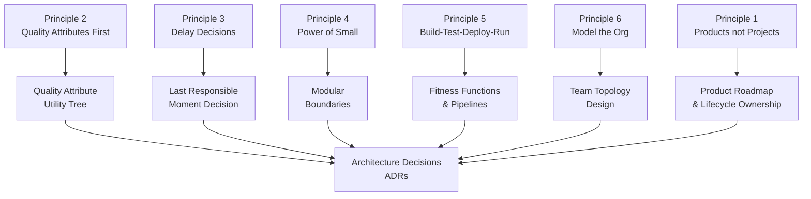

# Six Principles of Continuous Architecture

## Category

Continuous Architecture — Foundations

## Context

The six principles are the invariant rules that guide continuous architecture practice regardless of technology stack, team size, or delivery method. They were derived by observing what distinguishes software systems that successfully evolve over years from those that accumulate irreversible complexity.

They are not a process to follow sequentially — they are constraints to apply simultaneously on every architecture decision.

### The Six Principles at a Glance

| # | Principle | Core Idea | Failure Mode Avoided |
|---|-----------|-----------|----------------------|
| 1 | **Architect products, not just projects** | Design for the full lifecycle, not just the delivery date | Systems abandoned at handover; no-one owns the long-term |
| 2 | **Focus on quality attributes, not on functional requirements** | Functions change constantly; quality attributes define the envelope of change | Architecture designed only around features; collapses under load or change |
| 3 | **Delay design decisions until the last responsible moment** | Defer irreversible decisions until you have real information | Big-upfront design locked in wrong assumptions; expensive to undo |
| 4 | **Architect for change — leverage the power of small** | Small, replaceable components are more changeable than monolithic ones | Change requires touching everything; blast radius is the whole system |
| 5 | **Architect for build, test, deploy, and run** | Architecture must include deployability, testability, and operability | Architecturally correct system that cannot be safely deployed or operated |
| 6 | **Model the organisation and its context** | Conway's Law: structure follows conversation paths | Architecture misaligned with team structure; seams in wrong places |

---

## Principle 1: Architect Products, Not Projects

Projects have end dates. Products live indefinitely. Architectures designed for project delivery tend to:
- Accumulate debt after go-live (no budget, no ownership)
- Lack operational instrumentation (didn't need it to hit the deadline)
- Resist change (change wasn't the goal; delivery was)

**Product-thinking shift**:

| Project thinking | Product thinking |
|---|---|
| "Done when delivered" | "Done when decommissioned" |
| Success = on-time delivery | Success = sustained outcomes |
| Handover to ops | Cross-functional team owns end-to-end |
| Minimise scope at launch | Minimise cost of change over time |
| Architecture for today's load | Architecture for today's load × 10 |

---

## Principle 2: Focus on Quality Attributes

Functional requirements (what the system does) change with every sprint. Quality attributes (how well it does it) are far more stable — and far harder to retrofit.

**Why QAs must be first-class architecture drivers**:
- Performance, scalability, and availability requirements shape every significant structural decision
- A system that functionally delivers every feature but cannot meet its SLA has failed
- Retrofitting QAs (adding observability to an unobservable system, security to an insecure design) is an order of magnitude more expensive than building for them

**QA taxonomy** (the primary "ilities"):

| Quality Attribute | Key Questions | Architectural Lever |
|---|---|---|
| **Performance** | Latency p99, throughput, capacity | Caching, async processing, connection pooling |
| **Scalability** | Horizontal scale-out, vertical limits | Stateless services, partition-tolerant storage |
| **Availability** | Uptime target, failover time | Redundancy, health checks, circuit breakers |
| **Modifiability** | Cost of a feature change | Loose coupling, module boundaries, ADRs |
| **Testability** | Coverage achievable, speed of feedback | Dependency injection, contract tests, ports & adapters |
| **Deployability** | Deploy frequency, rollback time | Feature flags, blue-green, independent deployability |
| **Security** | Attack surface, data classification | Zero trust, least-privilege, secrets management |
| **Observability** | MTTR, traceability, alertability | Structured logging, distributed tracing, SLOs |

---

## Principle 3: Delay Decisions Until the Last Responsible Moment

The last responsible moment (LRM) is the latest point at which deferring a decision would close off a valuable option. Before LRM, defer. At LRM, decide.

**Deferral strategies**:

| Decision type | Deferral mechanism |
|---|---|
| Database technology | Define the data access interface; implement in-memory first |
| Message broker choice | Define the event schema; use in-process events initially |
| Cloud provider | Abstract behind a provider-neutral port |
| API design | Define the contract; stub the implementation |
| Microservice boundaries | Start as a modular monolith; split when the seam is clear |

**Danger zone**: Deferral is not avoidance. If a decision deferred past LRM closes off future options, the cost is compounded by the delay. The discipline is knowing when LRM has arrived.

---

## Principle 4: Architect for Change — Leverage the Power of Small

Large, entangled components resist change. Small, focused components with clean interfaces enable it.

**"Small" means**:
- A component does one thing and does it well (high cohesion)
- A component depends on as few others as possible (low coupling)
- A component can be replaced without rewriting its callers
- Blast radius of a failure or change is bounded

**Indicators that "small" is not being applied**:
- A change to one feature requires touching 5+ modules
- Tests for module A require mocking 8+ dependencies
- Service deployments require coordinating across 3+ teams
- Onboarding a new engineer to understand "this part" takes weeks

---

## Principle 5: Architect for Build, Test, Deploy, and Run

Architecture is not complete at design — it is complete when the system is observable in production. The full lifecycle is:

```
Build → Test → Deploy → Run → Observe → Change → Build...
```

**Architectural implications of each stage**:

| Stage | Architectural concern |
|---|---|
| **Build** | Modular structure enables parallel team work; clean dependency graph enables incremental builds |
| **Test** | Testability built in (DI, ports & adapters); contract tests for service boundaries |
| **Deploy** | Independent deployability; feature flags; versioned APIs; zero-downtime deployments |
| **Run** | Health endpoints; graceful shutdown; circuit breakers; bulkheads; backpressure |
| **Observe** | Structured logs; distributed traces; business metrics; SLO dashboards |

---

## Principle 6: Model the Organisation and Its Context

Conway's Law: *"Any organisation that designs a system will produce a design whose structure is a copy of the organisation's communication structure."*

This is a constraint, not a recommendation. You cannot design your way around it — you must design with it.

**Inverse Conway Manoeuvre**: Design the team topology you need, then the architecture will follow. If you want a microservices architecture, structure teams as product teams that own services end-to-end.

| Org structure | Architecture produced |
|---|---|
| Functional silos (frontend, backend, DBA, ops) | Layered monolith with handover friction |
| Matrix teams (feature teams without ownership) | Shared, entangled codebases |
| Stream-aligned product teams | Independent, deployable services |
| Platform team + stream-aligned teams | Shared infrastructure; domain-specific services |

## Design Diagram



## Code Sample

### Architecture Decision Log — Applying Principle 3 (Delay + Defer)

```typescript
// Ports & adapters: defer the database technology decision
// Define the port (interface) now; pick the adapter (implementation) later

export interface UserRepository {
  findById(id: string): Promise<User | null>;
  save(user: User): Promise<void>;
  delete(id: string): Promise<void>;
}

// Day 1: in-memory adapter (no DB commitment)
export class InMemoryUserRepository implements UserRepository {
  private store = new Map<string, User>();

  async findById(id: string) { return this.store.get(id) ?? null; }
  async save(user: User) { this.store.set(user.id, user); }
  async delete(id: string) { this.store.delete(id); }
}

// Day 60: PostgreSQL adapter (once data model is proven)
export class PostgresUserRepository implements UserRepository {
  constructor(private db: Pool) {}

  async findById(id: string) {
    const row = await this.db.query('SELECT * FROM users WHERE id = $1', [id]);
    return row.rows[0] ? mapRowToUser(row.rows[0]) : null;
  }
  async save(user: User) {
    await this.db.query(
      'INSERT INTO users (id, name, email) VALUES ($1, $2, $3) ON CONFLICT (id) DO UPDATE SET ...',
      [user.id, user.name, user.email]
    );
  }
  async delete(id: string) {
    await this.db.query('DELETE FROM users WHERE id = $1', [id]);
  }
}

// Composition root — swap adapter without touching domain code
const userRepo: UserRepository = process.env.USE_POSTGRES
  ? new PostgresUserRepository(pool)
  : new InMemoryUserRepository();
```

## Key Patterns

### Applying All Six Together

The principles reinforce each other:
- **Product thinking (P1)** without **QA focus (P2)** produces a product that degrades.
- **QA focus (P2)** without **delayed decisions (P3)** produces over-engineered solutions.
- **Small components (P4)** without **build-test-deploy-run (P5)** produces unmaintainable nano-services.
- All five without **org alignment (P6)** produces architecture that fights the team structure.

### Common Principle Violations

| Violation | Which principle | Detection signal |
|---|---|---|
| Architecture designed for the launch demo | P1 | No observability, no graceful degradation |
| "We'll add security later" | P2 | QA not in acceptance criteria |
| DB technology chosen in sprint 1 based on habit | P3 | Switching DB would rewrite entire application |
| God service with 50 responsibilities | P4 | PRs always touch 10+ files |
| No health endpoints, no structured logging | P5 | MTTR > 1 hour for production incidents |
| Architecture team separate from engineering teams | P6 | Architecture diagrams don't match deployed system |

## Related Patterns

- [02 — Quality Attributes](./02-quality-attributes.md) — Applying Principle 2 in depth
- [03 — Technical Debt](./03-technical-debt.md) — Managing debt accumulated by violations
- [06 — Fitness Functions](./06-fitness-functions.md) — Automating enforcement of the principles
- [07 — ADRs](./07-adrs.md) — Capturing the decisions made at LRM (Principle 3)
- [09 — Team Topologies](./09-team-topologies.md) — Applying Principle 6 in depth
