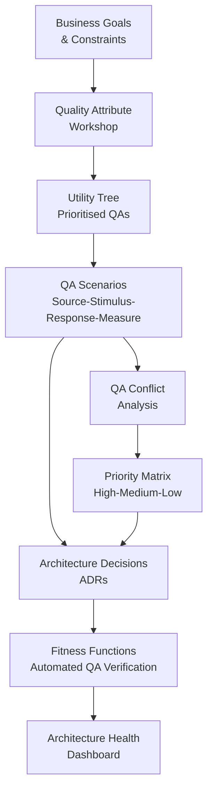

# Quality Attributes

## Category

Continuous Architecture — Design

## Context

Quality attributes (QAs) — also called non-functional requirements (NFRs) or the "ilities" — define *how well* a system performs its functions. They are the primary architectural drivers because they shape structure, whereas functional requirements shape behaviour.

The distinction matters: functional requirements change frequently (new features, changed rules). Quality attribute requirements are far more stable and far harder to retrofit. An architecture that ignores QAs at the start cannot add them cheaply later.

### QA vs Functional Requirements

| Dimension | Functional Requirements | Quality Attributes |
|---|---|---|
| What they define | What the system does | How well it does it |
| Stability over time | Low (change every sprint) | High (stable over years) |
| Cost to retrofit | Low–medium | High–extreme |
| Architectural impact | Local (feature module) | Global (structural decisions) |
| Test style | Acceptance tests, BDD | Load tests, chaos engineering, fitness functions |
| Example | "User can reset password" | "99.9% availability; p99 latency < 200 ms" |

### QA Taxonomy

| Quality Attribute | ISO 25010 Group | Key Measures |
|---|---|---|
| **Performance** | Performance efficiency | p50/p95/p99 latency; throughput (RPS); CPU/memory utilisation |
| **Scalability** | Performance efficiency | Requests handled at N× current load; scale-out time |
| **Availability** | Reliability | Uptime %; MTBF; MTTR; failover time |
| **Resilience** | Reliability | Recovery from failure; graceful degradation; data loss (RPO) |
| **Modifiability** | Maintainability | Cost of a feature change; lines changed per story point |
| **Testability** | Maintainability | Unit test coverage achievable; test execution time |
| **Deployability** | Operability | Deploy frequency; rollback time; zero-downtime capability |
| **Security** | Security | Attack surface; OWASP compliance; secret exposure risk |
| **Observability** | Operability | Log coverage; trace completeness; alert accuracy |
| **Portability** | Portability | Effort to move to new runtime, cloud, or platform |
| **Interoperability** | Compatibility | Number of integration points; standards compliance |

## Pros

- Forces architectural decisions to be driven by measurable requirements, not assumptions
- QA conflicts surface early, before implementation, when they are cheap to resolve
- Provides an objective basis for architecture trade-off decisions (A vs B for QA X)
- Enables architecture fitness functions (automated QA verification)
- Creates shared language between business, product, and engineering

## Cons

- Requires active elicitation — QAs are rarely volunteered by stakeholders
- Quantifying some QAs is difficult (modifiability, portability)
- QA conflicts must be resolved by prioritisation, not elimination — some tension always remains
- Poorly specified QAs ("the system must be fast") are worse than none — they create false confidence

## Design Diagram



## Code Sample

### QA Scenario — Structured specification

```markdown
## QA Scenario: Payment Service Availability

**Quality Attribute**: Availability
**Scenario ID**: QA-001
**Priority**: High / High (business importance / implementation difficulty)

| Field | Value |
|---|---|
| **Source** | End user submitting a payment |
| **Stimulus** | Payment API pod crashes during a transaction |
| **Artifact** | Payment service |
| **Environment** | Normal operation, peak load (Black Friday) |
| **Response** | Request is retried automatically; no duplicate charge; adjacent services unaffected |
| **Response Measure** | 99.95% success rate; p99 latency < 500 ms; zero duplicate charges |

**Architectural decisions driven by this scenario**:
- Idempotency key on all payment mutations (ADR-023)
- Circuit breaker between payment service and downstream PSP (ADR-031)
- Separate pod disruption budget: minimum 2 replicas always available (ADR-044)
```

### TypeScript — QA Scenario registry (machine-readable)

```typescript
export interface QAScenario {
  id: string;
  attribute: QualityAttribute;
  priority: { business: 'H' | 'M' | 'L'; difficulty: 'H' | 'M' | 'L' };
  source: string;
  stimulus: string;
  artifact: string;
  environment: string;
  response: string;
  measure: string;
  drivesAdrs: string[];   // ADR IDs this scenario drives
  fitnessFunctions: string[]; // FF IDs that verify this scenario
}

type QualityAttribute =
  | 'performance' | 'scalability' | 'availability' | 'resilience'
  | 'modifiability' | 'testability' | 'deployability' | 'security'
  | 'observability' | 'portability' | 'interoperability';

export const scenarios: QAScenario[] = [
  {
    id: 'QA-001',
    attribute: 'availability',
    priority: { business: 'H', difficulty: 'H' },
    source: 'End user submitting a payment',
    stimulus: 'Payment API pod crashes during a transaction',
    artifact: 'Payment service',
    environment: 'Normal operation, peak load',
    response: 'Request retried; no duplicate charge; adjacent services unaffected',
    measure: '99.95% success rate; p99 < 500 ms; zero duplicates',
    drivesAdrs: ['ADR-023', 'ADR-031', 'ADR-044'],
    fitnessFunctions: ['FF-010', 'FF-011'],
  },
];
```

### Quality Attribute Utility Tree

```
Root: Utility
│
├── Performance (H/H)
│   ├── API response time < 200 ms p99 at 1000 RPS (H/M)
│   └── Background jobs complete within 30-minute SLA (M/L)
│
├── Availability (H/H)
│   ├── 99.95% uptime on payment APIs (H/H)
│   └── 99.9% uptime on read-only APIs (M/L)
│
├── Modifiability (H/M)
│   ├── New payment method added without changing existing processors (H/M)
│   └── Feature flag controls any new feature rollout (M/L)
│
├── Security (H/H)
│   ├── PCI-DSS compliance for card data (H/H)
│   └── Zero credential secrets in environment variables (H/L)
│
└── Deployability (M/M)
    ├── Deploy without downtime (M/M)
    └── Rollback completable in < 5 minutes (M/M)

Legend: (Business importance / Implementation difficulty): H = High, M = Medium, L = Low
```

## Key Patterns

### QA Conflict Resolution

QA conflicts are inevitable — resolving them explicitly is an architectural responsibility.

| Conflict | Typical resolution |
|---|---|
| Performance vs Security | Add TLS offload at the edge (gateway); defer auth on cached responses |
| Availability vs Consistency | Adopt eventual consistency by default; strong consistency only where business requires |
| Modifiability vs Performance | Optimise for modifiability first; introduce performance optimisations only where measured |
| Portability vs Performance | Use portability as the default; allow native optimisations only in isolated adapters |

### Quality Attribute Workshop (QAW)

A facilitated session for eliciting and prioritising QAs from stakeholders:

1. **Introductory briefing** — explain what QAs are and why they drive architecture
2. **Scenario brainstorm** — stakeholders generate QA scenarios without judgement
3. **Consolidation** — group similar scenarios; identify duplicate and conflicting scenarios
4. **Prioritisation** — stakeholders vote on business importance; architects assess implementation difficulty
5. **Utility tree construction** — produce the weighted tree from prioritised scenarios
6. **Handoff** — map high-priority scenarios to architecture decisions and fitness functions

### Common Mistakes

| Mistake | What to do instead |
|---|---|
| Accepting "the system must be fast" as a QA | Define: fast for *what workload*, *what percentile*, *what concurrency* |
| Treating all QAs equally | Prioritise explicitly; over-engineering a low-priority QA wastes effort |
| QA discovery in sprint 1 only | Revisit the utility tree at each major milestone; QAs evolve |
| No automated QA testing | Wire high-priority QAs to fitness functions in CI/CD |

## Related Patterns

- [01 — Six Principles](./01-six-principles.md) — Principle 2: QAs are the primary architectural driver
- [06 — Fitness Functions](./06-fitness-functions.md) — Turning QA scenarios into automated gates
- [03 — Technical Debt](./03-technical-debt.md) — Unmet QAs are the most expensive form of architectural debt
- [15 — Architecture Health Metrics](./15-architecture-metrics.md) — Measuring QA achievement over time
