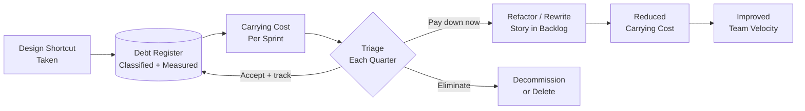

# Technical Debt

## Category

Continuous Architecture — Sustainability

## Context

Technical debt is any design or implementation shortcut taken today that increases the cost of future work. The term, coined by Ward Cunningham, is often used loosely; a precise definition is required for effective management.

**Critical distinction**: Technical debt is not defects. Defects are broken behaviour. Technical debt is structurally sound but suboptimal design — code or architecture that works today but makes future change harder and more expensive.

### The Quadrant Model (Fowler / Cunningham)

| | **Reckless** | **Prudent** |
|---|---|---|
| **Deliberate** | "We don't have time for design" | "We must ship now; we'll pay it back in Q2" |
| **Inadvertent** | "What's layered architecture?" | "Now we understand better, we'd have done it differently" |

- **Reckless deliberate** → the most damaging; avoidable with discipline
- **Prudent deliberate** → acceptable as a conscious, tracked trade-off
- **Reckless inadvertent** → addressable through education and code review
- **Prudent inadvertent** → unavoidable; the cost of learning; minimise via iterative design

## Pros of Deliberate Debt (When Managed)

- Enables time-to-market when the window is narrow and the cost is bounded
- Creates optionality — commit to minimum viable structure, defer the correct structure
- Acceptable in prototypes and experiments that will be discarded or rebuilt
- Manageable when tracked and paid back systematically

## Cons

- Compound interest: unaddressed debt makes future debt cheaper to take on and harder to pay off
- Invisible until critical: debt accumulates silently; the symptom (slow delivery, instability) appears long after the cause
- Socially sticky: once something is "legacy", teams work around it rather than fixing it
- Underestimated: teams routinely underestimate the carrying cost of debt per sprint

## Design Diagram



## Code Sample

### Debt Register — YAML format

```yaml
# technical-debt-register.yaml
version: "1.0"
updated: "2026-04-12"
owner: "Architecture Guild"

entries:
  - id: TD-001
    title: "Synchronous HTTP calls between Order and Inventory service"
    category: architecture
    type: deliberate-prudent
    introduced: "2024-08-01"
    context: "Async messaging would have delayed Q3 launch by 3 weeks"
    cost_per_sprint: high      # one incident per sprint on avg; 4h recovery
    risk: high                 # cascading failures under load
    paydown:
      approach: "Replace with event-driven via Kafka; decouple Order → Inventory"
      adr: ADR-041
      target_quarter: "2026-Q2"
      assigned_team: platform
    fitness_violated: ["FF-018-service-coupling-threshold"]

  - id: TD-002
    title: "No integration tests for payment webhook processor"
    category: test
    type: reckless-inadvertent
    introduced: "2024-01-15"
    context: "Not identified during initial delivery; discovered in post-mortem"
    cost_per_sprint: medium    # 2 production incidents per quarter from regressions
    risk: high                 # revenue-impacting payment processing
    paydown:
      approach: "Add contract tests + Testcontainers integration suite"
      target_quarter: "2026-Q1"
      assigned_team: payments
```

### TypeScript — Debt carrying cost model

```typescript
export enum DebtCategory {
  Code = 'code',           // naming, duplication, complexity
  Design = 'design',       // poor module structure, god classes
  Architecture = 'architecture', // wrong boundaries, wrong coupling
  Test = 'test',           // missing or brittle tests
  Documentation = 'documentation',
  Infrastructure = 'infrastructure',
  Knowledge = 'knowledge', // single point of knowledge failure
}

export enum DebtType {
  DeliberatePrudent = 'deliberate-prudent',
  DeliberateReckless = 'deliberate-reckless',
  InadvertentPrudent = 'inadvertent-prudent',
  InadvertentReckless = 'inadvertent-reckless',
}

export interface DebtItem {
  id: string;
  title: string;
  category: DebtCategory;
  type: DebtType;
  introduced: Date;
  costPerSprint: 'low' | 'medium' | 'high' | 'critical';
  risk: 'low' | 'medium' | 'high' | 'critical';
  fitnessViolated: string[];
  paydown: {
    approach: string;
    targetQuarter: string;
    assignedTeam: string;
  };
}

// Priority formula: riskWeight × costWeight (higher = pay first)
const RISK_WEIGHT = { low: 1, medium: 2, high: 4, critical: 8 };
const COST_WEIGHT = { low: 1, medium: 2, high: 3, critical: 5 };

export function prioritise(items: DebtItem[]): DebtItem[] {
  return [...items].sort((a, b) => {
    const scoreB = RISK_WEIGHT[b.risk] * COST_WEIGHT[b.costPerSprint];
    const scoreA = RISK_WEIGHT[a.risk] * COST_WEIGHT[a.costPerSprint];
    return scoreB - scoreA;
  });
}
```

## Key Patterns

### Debt Classification

| Category | Examples | Primary Impact |
|---|---|---|
| **Code debt** | Long functions, duplicated logic, poor naming | Developer velocity |
| **Design debt** | God classes, anemic domain models, violated SOLID | Testability, modifiability |
| **Architecture debt** | Wrong service boundaries, synchronous coupling, shared mutable state | Scalability, deployability, resilience |
| **Test debt** | Missing tests, brittle tests, no contract tests | Stability, regression rate |
| **Documentation debt** | Missing ADRs, outdated diagrams, no runbooks | Onboarding, incident response |
| **Infrastructure debt** | Unpatched dependencies, manual operations, drift | Security, reliability |
| **Knowledge debt** | Bus factor = 1 for critical components | Resilience of the team |

### The Debt Lifecycle

1. **Identification**: Automated (static analysis, fitness functions) or manual (code review, ADR review, post-mortems)
2. **Classification**: Category, type (quadrant), and carrying cost assessment
3. **Triage**: Is cost/risk high enough to prioritise paydown over feature work?
4. **Paydown planning**: Refactor story, architecture spike, or full rewrite — placed in the backlog with capacity reserved
5. **Verification**: Fitness function confirms the debt is resolved; register entry closed

### Capacity Reservation for Debt Paydown

Teams that never reserve capacity for debt paydown accumulate debt monotonically. Common models:

| Model | Description | Risk |
|---|---|---|
| **Percentage of sprint** | 10–20% of every sprint reserved for debt | Easy to see, easy to trade away under pressure |
| **IP iterations** | Dedicated innovation/paydown sprint every 5–6 sprints | Clear boundary; feature work not competing |
| **Debt budget** | Fixed number of story points per quarter | Explicit business expectation |
| **Debt gating** | New feature work blocked if debt index exceeds threshold | Most effective but requires strong governance |

### Measuring Debt

| Metric | Tool | Target |
|---|---|---|
| Cyclomatic complexity | SonarQube, ESLint | < 10 per function |
| Cognitive complexity | SonarQube | < 15 per function |
| Afferent / efferent coupling | Dependency-cruiser | Instability index < 0.7 for stable modules |
| Code duplication | SonarQube | < 3% duplicate lines |
| Test coverage | Istanbul / Vitest | ≥ 80% for critical paths |
| SQALE debt ratio | SonarQube | < 5% (A rating) |

## Related Patterns

- [06 — Fitness Functions](./06-fitness-functions.md) — Automated debt detection gates
- [02 — Quality Attributes](./02-quality-attributes.md) — Unmet QAs are architectural debt
- [08 — Modularity and Coupling](./08-modularity-coupling.md) — Coupling metrics as debt indicators
- [15 — Architecture Health Metrics](./15-architecture-metrics.md) — Debt ratio and trend tracking
