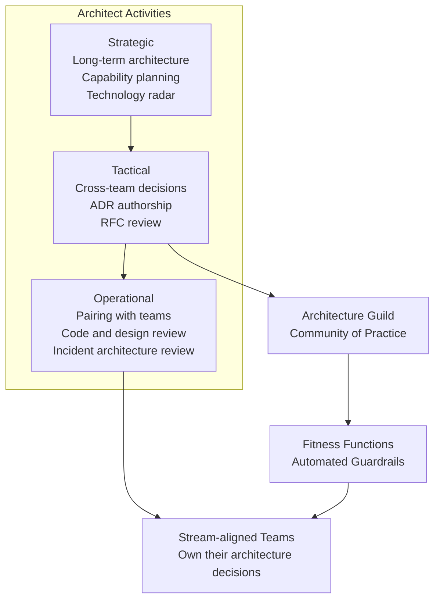

# The Architect's Role

## Category

Continuous Architecture — People

## Context

The architect's role has shifted fundamentally in agile and DevOps organisations. The traditional model — gather requirements, produce a definitive design, hand it to teams — fails in a world where both requirements and technology change continuously.

The new model is the **architect as enabler**: someone who creates the conditions for good architecture to emerge continuously, rather than designing it once and enforcing it forever.

### Traditional vs Continuous Architecture Role

| Dimension | Traditional Architect | Continuous Architect |
|---|---|---|
| **Primary output** | Architecture documents and blueprints | Principles, constraints, patterns, ADRs |
| **Primary activity** | Upfront design; formal reviews | Coaching, pairing, enabling, continuous review |
| **Relationship to teams** | Separated; hands down design | Embedded or closely coupled; works alongside teams |
| **Decision authority** | Centralised; architect decides | Distributed; architect guides; teams decide within guardrails |
| **Governance model** | Approval-gated | Continuous fitness functions + lightweight review |
| **Value delivered** | Correct initial design | Systems that remain evolvable over time |
| **Success metric** | Design accepted | Teams making good architectural decisions autonomously |

## Pros of the Enabler Model

- Architectural knowledge is distributed — it does not become a bottleneck
- Decisions are made closer to the context, with better information
- Architecture stays connected to reality — architects see what's actually being built
- Architect develops T-shaped depth across the organisation
- Teams own their architecture — higher quality and higher follow-through

## Cons

- Harder to coordinate cross-team architectural consistency without formal authority
- Requires high trust and strong communication between architect and teams
- Difficult to measure — architect's impact is indirect and lagging
- Some organisations have cultural resistance to distributed decision-making

## Design Diagram



## Code Sample

### Architecture RFC template (architect as enabler — teams propose, architect guides)

```markdown
# RFC-042: Replace synchronous payment PSP calls with async event pattern

**Status**: Under Review
**Author**: @jane-smith (Payments Team)
**Architect reviewer**: @bob-jones
**Date**: 2026-04-01
**Related ADR**: ADR-041 (pending approval)

## Problem Statement
The payment service makes synchronous HTTP calls to the PSP. Under load, PSP latency
spikes cause our p99 API latency to exceed the 500 ms SLA (QA-001). Under PSP outage,
we return 502 to users with no retry.

## Proposed Solution
Replace synchronous PSP calls with an outbox pattern + async event processor:
1. Payment intent stored in DB with outbox record (atomic)
2. Outbox worker publishes to Kafka topic `payments.psp.requests`
3. PSP processor consumes; retries with exponential backoff
4. Status updates via `payments.psp.results` topic (webhook or polling for UI)

## Quality Attributes Addressed
- **Availability** (QA-001): PSP outage no longer causes user-facing errors
- **Performance** (QA-002): API p99 under PSP latency pressure decoupled
- **Resilience** (QA-003): Guaranteed delivery with at-least-once semantics

## Tradeoffs
- Payment confirmation is now eventual (not synchronous). UX must reflect pending state.
- Operational complexity increases: Kafka consumer + outbox worker to operate.

## Alternatives Considered
- Circuit breaker only (rejected: doesn't help under sustained outage)
- SDK-level retry (rejected: blocks thread; doesn't solve user-facing error)

## Architect Guidance Requested
- Confirmation that outbox pattern aligns with platform event standards
- Review of proposed Kafka topic naming against platform conventions
- Fitness function coverage plan
```

### Architect effectiveness self-assessment

```typescript
// Architecture health indicators the architect should track
export interface ArchitectHealthIndicators {
  // Are teams making good decisions without me in the room?
  teamsWithAutonomousADRAuthorship: number; // target: all stream-aligned teams
  // Are architecture fitness functions catching violations automatically?
  fitnessViolationsInCI: boolean;           // target: true
  // Is debt being tracked and paid down?
  debtRegisterEntries: number;
  debtItemsClosedLastQuarter: number;       // target: growing
  // Is governance lightweight enough to not be a bottleneck?
  avgADRReviewCycleDays: number;            // target: < 5
  // Are principles understood and applied?
  principlesViolationsInLastQuarter: number; // target: trends down
}
```

## Key Patterns

### The T-Shaped Architect

```
Breadth (knows enough to connect dots across domains)
─────────────────────────────────────────────────────────────────
         │
         │  Depth (expert in 1–2 domains, e.g., distributed systems + security)
         │
         ▼
```

A T-shaped architect:
- Has deep expertise in one or two areas (e.g., distributed systems, security, data platforms)
- Has working knowledge of all areas that affect architecture (networking, front-end constraints, DB internals, observability, CI/CD)
- Knows where to find expert knowledge they don't have
- Can communicate effectively across the full stack — from CTO to DevOps engineer

### Architect Engagement Models

| Model | Description | Best for |
|---|---|---|
| **Embedded** | Architect sits in a delivery team as a senior member | New teams; greenfield systems; high-risk domains |
| **Consulting** | Architect engaged by teams for specific decisions | Mature teams; well-understood domains |
| **Reviewing** | Architect reviews proposals and ADRs asynchronously | Low-risk teams; established quality gates |
| **Guilding** | Architect facilitates an architecture guild across teams | Cross-team consistency at scale |

The right model changes over a team's maturity lifecycle. An embedded architect should aim to make themselves unnecessary in the domain they're working in.

### Activities by Time Horizon

| Horizon | Timescale | Architect activities |
|---|---|---|
| **Visionary** | 3–5 years | Technology radar; capability gap analysis; architecture strategy doc |
| **Strategic** | 1–2 years | Cross-team architecture decisions; platform investment; fitness function programme |
| **Tactical** | 1–3 months | RFC review; ADR authorship; fitness function implementation; tech debt triage |
| **Operational** | Daily–weekly | Pairing; code/design review; incident architecture analysis; coaching |

A common failure is architectures that only work at one horizon. Visionary-only architects lose touch with reality. Operational-only architects lose strategic direction.

### Growing Architectural Capability in Teams

The enabler model succeeds only if teams develop architectural judgment. A programme for this:

1. **ADR practice**: Require ADRs for significant decisions; architect reviews and coaches, doesn't veto
2. **Architecture pairing**: Architect pairs with team leads on cross-cutting concerns
3. **Pattern catalogue**: Maintain a reusable pattern library that teams pull from
4. **Architecture guild**: Weekly or bi-weekly cross-team forum; case studies from incidents and ADRs
5. **Rotate architecture responsibilities**: Different engineers author ADRs; architect provides feedback

## Related Patterns

- [05 — Architecture in Agile & DevOps](./05-architecture-agile.md) — How architects work within delivery cadences
- [07 — ADRs](./07-adrs.md) — The primary tool for distributed decision-making
- [09 — Team Topologies](./09-team-topologies.md) — Org structure that the enabler model requires
- [10 — Architecture Governance](./10-architecture-governance.md) — The guild and review mechanisms
