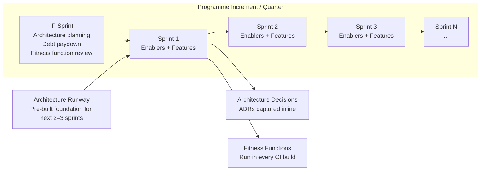

# Architecture in Agile & DevOps

## Category

Continuous Architecture — Process

## Context

Agile and DevOps change the conditions under which architecture is practised — not the need for architecture. The failure to reconcile architecture with agile delivery produces two opposite pathologies:

1. **Architecture bypassed**: No upfront design; architecture emerges reactively. Result: high coupling, missed QAs, mounting debt.
2. **Architecture as a blocker**: Big design reviews gate delivery. Result: delayed teams, stale designs, architect as bottleneck.

Continuous architecture integrates architecture work into the delivery cadence — making it incremental, testable, and continuously validated.

### Architecture in Agile: Common Failure Modes

| Pattern | What it looks like | Consequence |
|---|---|---|
| **BDUF (Big Design Up Front)** | Full architecture before any sprint begins | Stale by sprint 3; teams don't follow it |
| **No architecture** | "We'll figure it out in the sprint" | Every sprint touches everything; velocity collapses |
| **Architecture team separate** | Reviews happen after implementation | Too late to change; creates resentment |
| **Architecture in the backlog, never prioritised** | "We'll refactor when things slow down" | Things never slow down |

## Pros

- Architecture work is visible to product and business stakeholders
- Trade-off decisions are made with maximum available information
- Architectural risk is managed iteratively — not discovered at integration time
- Architecture spikes generate real data, not speculation
- Fitness functions in CI/CD make architectural regression detectable immediately

## Cons

- Requires disciplined capacity reservation for architecture work (competing with features)
- Architecture across sprints requires continuity — dropped in mid-flight leaves partial designs
- "Just enough" design is skill-dependent; junior teams under-design, anxious teams over-design
- Product owners unfamiliar with the model resist non-feature capacity

## Design Diagram



## Code Sample

### Architecture Spike — Structured output template

```markdown
# Spike: Evaluate event streaming platforms for notification pipeline

**Spike ID**: SPIKE-019
**Sprint**: Sprint 14
**Capacity**: 3 days (one engineer)
**Question**: Is Kafka or AWS EventBridge the better fit for our notification fan-out pattern?

## Acceptance Criteria (what must be answered, not what must be built)
- [ ] Delivery guarantee semantics of both platforms compared against QA-007 (at-least-once required)
- [ ] Fan-out throughput benchmarked at 10k events/min with our event schema
- [ ] Operational complexity assessed: alert failure detection, replay capability, monitoring
- [ ] Cost modelled at current + 5× volume
- [ ] Recommendation with rationale documented as ADR-draft

## Experiment Plan
1. Deploy Kafka (Confluent Cloud) and EventBridge side-by-side in sandbox
2. Publish 10k synthetic notification events through each
3. Measure: throughput, p99 latency, consumer lag, DLQ behaviour
4. Document findings in the ADR draft

## Outcome (filled after spike)
**Recommendation**: Kafka (Confluent Cloud)
**Rationale**: EventBridge fan-out at 10k events/min showed 340 ms p99 latency (vs Kafka 45 ms).
At 5× volume, EventBridge cost is 4× Kafka. Replay capability gap is significant for our support use-case.
**ADR**: ADR-038 (approved)
**Follow-on stories**: STORY-441 (Kafka cluster setup enabler), STORY-442 (notification consumer implementation)
```

### Architecture enabler story — example format

```markdown
## [ENABLER] Implement database connection pooling across all services

**Type**: Architecture Enabler (not a feature)
**Sprint**: Sprint 15
**Capacity**: 2 story points
**Drives QA**: QA-002 (Performance — connection exhaustion under load)
**Drives ADR**: ADR-039

**Description**:
Currently each service creates new DB connections per request (verified in SPIKE-018).
Under 1000 RPS sustained load, connection exhaustion causes p99 latency to exceed 1200 ms.
This enabler adds connection pooling (PgBouncer) in front of the primary DB.

**Acceptance Criteria**:
- [ ] PgBouncer deployed and configured with pool_size = 20 per service instance
- [ ] Integration tests confirm no connection leaks under sustained load
- [ ] Fitness function FF-009 (max DB connections) passes in CI for all services
- [ ] Runbook for PgBouncer maintenance added to ops wiki

**Definition of Done**: FF-009 green; p99 under load test < 200 ms; ADR-039 closed.
```

## Key Patterns

### Just-Enough, Just-In-Time Architecture

| Phase | Architectural work done | Rationale |
|---|---|---|
| **Programme kick-off** | Architectural vision; QA utility tree; key constraints; initial team topology | Sufficient to start; nothing that can't be changed |
| **First sprint** | Walking skeleton; core integration points; initial ADRs for irreversible decisions | Validate the most important assumptions |
| **Each sprint** | ADRs for decisions made; debt register updated; enabler stories pulled | Decisions made at LRM with real information |
| **IP iteration** | Fitness function review; debt triage; runway review for next PI | Intentional pause to recalibrate |
| **Quarterly** | Architecture health review; QA scenario reassessment; technology radar update | Ensure strategy remains aligned |

### Walking Skeleton

A walking skeleton is the thinnest possible implementation of the end-to-end architecture: all major components present, connected, and observable — but with minimal functionality.

**Why first**: It validates the most critical architectural decisions (service boundaries, communication patterns, deployment pipeline) before business logic accumulates and makes them expensive to change.

**Walking skeleton checklist**:
```
[ ] One request flows from client through all service layers to persistence and back
[ ] All services deployed to the target environment (not just local)
[ ] Distributed tracing spans visible across service boundaries
[ ] One metric per service emitted to the monitoring stack
[ ] One integration test runs in CI against the deployed skeleton
[ ] One ADR capturing the boundary decisions made
```

### Architecture Runway

Runway is the pre-existing architectural foundation that allows feature teams to deliver features without being blocked on infrastructure or cross-cutting concerns. See [12 — Architecture Runway](./12-architecture-runway.md) for full detail.

**Rule of thumb**: Maintain 2–3 sprints of runway ahead of the feature teams; replenish continuously in IP iterations and via enabler stories.

### DevOps Alignment

Architecture must support the DevOps pipeline — not be designed independently of it.

| DevOps practice | Architectural requirement |
|---|---|
| Continuous delivery | Independent deployability (no coordinated releases between services) |
| Feature flags | Flag evaluation must be a first-class architectural concern, not an afterthought |
| Canary releases | Services must be versionable and traffic-splittable independently |
| Automated testing | Testability built into design (DI, ports & adapters, contract tests) |
| Incident response | Health endpoints, graceful shutdown, structured logging — all architectural requirements |
| Feedback loops | Observability (traces, metrics, logs) built in — not bolted on |

## Related Patterns

- [12 — Architecture Runway](./12-architecture-runway.md) — Runway in detail
- [06 — Fitness Functions](./06-fitness-functions.md) — Automated architectural governance in CI
- [07 — ADRs](./07-adrs.md) — Decision capture throughout delivery
- [04 — The Architect's Role](./04-architect-role.md) — How architects work within sprints
