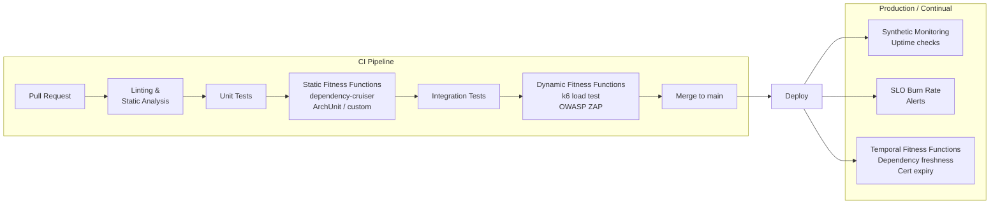

# Architecture Fitness Functions

## Category

Continuous Architecture — Governance

## Context

An architecture fitness function is any mechanism that measures the degree to which a system conforms to an architectural characteristic. The term comes from evolutionary computing — a fitness function scores an individual against a target; the architecture equivalent scores a system against an architectural property.

Fitness functions replace manual architecture reviews for properties that can be expressed programmatically. They make architectural governance continuous, objective, and cheap.

### Fitness Function Taxonomy

| Dimension | Values | Description |
|---|---|---|
| **Trigger** | Triggered / Continual | Triggered = runs on pipeline; Continual = runs in production (synthetic monitoring, SLO checks) |
| **Scope** | Atomic / Holistic | Atomic = single property; Holistic = cross-cutting (performance under security scan) |
| **Nature** | Automated / Manual | Automated = CI gate; Manual = structured review with rubric |
| **Temporality** | Static / Dynamic / Temporal | Static = structure (code analysis); Dynamic = runtime (load test); Temporal = scheduled (dependency freshness) |

### Fitness Function vs Test

| | Unit / Integration Test | Fitness Function |
|---|---|---|
| **Tests** | Functional behaviour | Structural / quality attribute conformance |
| **Fails when** | The system does the wrong thing | The system is structured the wrong way |
| **Examples** | "Payment is correctly charged" | "No service imports directly from another service's DB" |
| **Framework** | Jest, Vitest, JUnit | ArchUnit, dependency-cruiser, custom scripts, k6, Gatekeeper |

## Pros

- Architectural governance runs automatically in every CI build — no human bottleneck
- Violations are caught when they are cheapest to fix (at PR time, not post-release)
- Communicates architecture decisions as executable code, not documents
- Creates an objective definition of "architecturally correct"
- Drives continuous improvement: fitness scores trending over time reveal architecture decay

## Cons

- Not all architectural properties can be expressed programmatically
- Poorly written fitness functions create noise (false violations) and lose trust
- Requires investment upfront; pays off over time — often resisted in pressure environments
- Some runtime properties (security, resilience) require dedicated test environments

## Design Diagram



## Code Sample

### Static fitness function — dependency-cruiser (no cross-domain imports)

```json
// .dependency-cruiser.json
{
  "forbidden": [
    {
      "name": "no-cross-domain-import",
      "comment": "Services must not import directly from another service's internal modules",
      "severity": "error",
      "from": { "path": "^src/domains/([^/]+)/" },
      "to": {
        "path": "^src/domains/([^/]+)/",
        "pathNot": "^src/domains/$1/"
      }
    },
    {
      "name": "no-infrastructure-in-domain",
      "comment": "Domain layer must not import infrastructure (ports & adapters)",
      "severity": "error",
      "from": { "path": "^src/domains/" },
      "to": { "path": "^src/infrastructure/" }
    },
    {
      "name": "no-circular-deps",
      "comment": "No cyclic dependencies allowed",
      "severity": "error",
      "from": {},
      "to": { "circular": true }
    }
  ]
}
```

```bash
# In CI
npx depcruise --config .dependency-cruiser.json src
```

### Dynamic fitness function — k6 load test as CI gate

```typescript
// k6/fitness-performance.ts
import http from 'k6/http';
import { check, sleep } from 'k6';
import { Rate, Trend } from 'k6/metrics';

// Fitness function thresholds (from QA-002)
export const options = {
  stages: [
    { duration: '30s', target: 100 },  // ramp to 100 users
    { duration: '60s', target: 100 },  // sustain
    { duration: '10s', target: 0 },    // ramp down
  ],
  thresholds: {
    http_req_duration: ['p(99)<200'],  // p99 < 200 ms (QA-002)
    http_req_failed: ['rate<0.001'],   // < 0.1% error rate
    checks: ['rate>0.999'],            // > 99.9% checks pass
  },
};

export default function () {
  const res = http.get(`${__ENV.BASE_URL}/api/v1/products`);
  check(res, {
    'status is 200': (r) => r.status === 200,
    'latency OK': (r) => r.timings.duration < 200,
  });
  sleep(0.1);
}
```

### Temporal fitness function — dependency freshness check

```bash
#!/usr/bin/env bash
# bin/check-dep-freshness.sh
# Fitness function: No high-severity CVEs; no deps > 180 days out of date

set -euo pipefail

echo "=== Dependency CVE Scan ==="
npx audit-ci --high --exit-zero-on-empty-advisories

echo "=== Outdated dependency check ==="
OUTDATED=$(npm outdated --json 2>/dev/null || true)
STALE=$(echo "$OUTDATED" | jq '[to_entries[] | select(.value.current != .value.latest)] | length')

if [ "$STALE" -gt 10 ]; then
  echo "FAIL: $STALE outdated packages (threshold: 10). Update dependencies."
  exit 1
fi

echo "PASS: $STALE outdated packages (within threshold)"
```

### Fitness Function Registry

```yaml
# fitness-functions.yaml
functions:
  - id: FF-001
    name: "No cross-domain imports"
    type: static
    trigger: triggered
    tool: dependency-cruiser
    qa: modifiability
    threshold: "zero violations"
    ci_step: "static-ff"

  - id: FF-002
    name: "API p99 latency under load"
    type: dynamic
    trigger: triggered
    tool: k6
    qa: performance (QA-002)
    threshold: "p99 < 200 ms at 100 RPS"
    ci_step: "dynamic-ff"
    environment: staging

  - id: FF-003
    name: "No high CVEs in dependencies"
    type: temporal
    trigger: daily-scheduled
    tool: audit-ci
    qa: security
    threshold: "zero high/critical advisories"

  - id: FF-004
    name: "All services have /health endpoint"
    type: static
    trigger: triggered
    tool: custom-script
    qa: deployability / operability
    threshold: "100% services implement HealthController"
```

## Key Patterns

### Fitness Function Maturity Ladder

| Level | What exists | Gap |
|---|---|---|
| 0 | No fitness functions | Start with FF-001 (structural) and FF-003 (security CVEs) |
| 1 | Linting + basic static analysis | Add dependency structure rules |
| 2 | Structural FF in CI | Add dynamic FF (load test) in staging |
| 3 | Structural + dynamic | Add temporal (scheduled) for cert expiry, dep freshness |
| 4 | All three types | Add holistic FF (cross-cutting concerns: security under load) |
| 5 | Full FF suite + continual in production | Fitness function results feed architecture health dashboard |

### Writing Good Fitness Functions

1. **Tie to a QA scenario**: Every FF should reference a QA scenario or ADR. If you can't justify it, don't add it.
2. **Fail fast**: FF violations should block the pipeline immediately — not produce warnings.
3. **Self-documenting**: FF failure messages must explain what violated, which principle or QA, and how to fix.
4. **Keep them fast**: Static FFs should run in < 30 seconds. Slow FFs get disabled under pressure.
5. **Review periodically**: A FF that never fires is either always passing (great) or always skipped (check).

## Related Patterns

- [02 — Quality Attributes](./02-quality-attributes.md) — QA scenarios that fitness functions verify
- [03 — Technical Debt](./03-technical-debt.md) — FF violations are debt detection signals
- [05 — Architecture in Agile & DevOps](./05-architecture-agile.md) — FF placement in CI/CD pipeline
- [10 — Architecture Governance](./10-architecture-governance.md) — FF as lightweight governance mechanism
