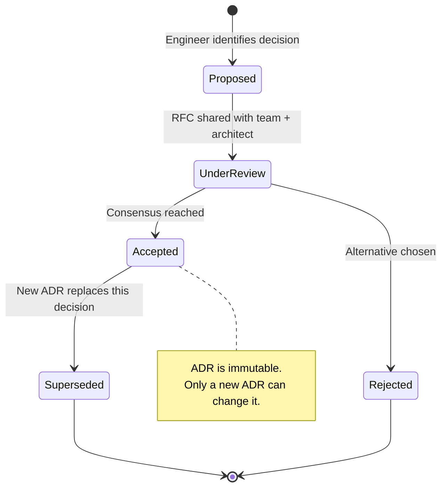

# Architecture Decision Records

## Category

Continuous Architecture — Documentation

## Context

An Architecture Decision Record (ADR) is a short document that captures a single, significant architectural decision — what was decided, why, and what alternatives were considered. ADRs are the minimum viable documentation for a continuously evolving architecture.

Without ADRs, architectural decisions exist only in the minds of people who were in the room. When those people leave, change teams, or simply forget, the decisions are re-litigated, reversed without understanding the original rationale, or duplicated. ADRs prevent this at negligible documentation cost.

### ADR vs Other Documentation

| Document type | Scope | Lifespan | Cost |
|---|---|---|---|
| **ADR** | Single decision | Permanent (immutable; superseded by new ADR) | Low — 1 page, 30 min |
| **Architecture document / SAD** | Full system design | Short (goes stale quickly) | High |
| **RFC / Design doc** | Proposal for review | Short (becomes ADR or rejected) | Medium |
| **Runbook** | Operational procedure | Medium (updated as system evolves) | Medium |
| **C4 diagram** | System structure | Medium (updated at milestones) | Medium |

### When to Write an ADR

Write an ADR for any decision that:
- Is hard to reverse without significant effort (architecture-level commitment)
- Affects more than one team or service
- Involves a trade-off between competing quality attributes
- Selects a technology, pattern, or principle that will be reused
- Satisfies a significant QA scenario

Do **not** write an ADR for:
- Implementation details within a single module
- Decisions that can be changed with minimal effort
- Decisions with no alternatives (there is only one option)

## Pros

- Lightweight: one page, no ceremony, no committee required
- Immutable: once accepted, an ADR is never edited — only superseded; history is preserved
- Searchable: the ADR log is a queryable record of why the system is the way it is
- Onboarding accelerator: new engineers understand the "why" without interrogating veterans
- Distributed decision-making: teams author ADRs; architects review — not the other way

## Cons

- Requires discipline to maintain: ADRs not tied to a workflow quickly fall out of practice
- Quality varies: a poor ADR (missing context, no alternatives) is worse than a good code comment
- Lag risk: decisions made in Slack and never recorded are the most important ones to capture
- Discovery: ADRs are only valuable if people know they exist and can find them

## Design Diagram



## Code Sample

### MADR format (Markdown Architectural Decision Records)

```markdown
# ADR-038: Use Kafka for notification fan-out pipeline

**Status**: Accepted
**Date**: 2026-03-15
**Deciders**: @jane-smith (Payments), @bob-jones (Architecture), @alice-chen (Platform)
**Supersedes**: —
**Superseded by**: —

## Context and Problem Statement

The notification service must fan out a single business event (e.g., "order confirmed") to
multiple downstream consumers (email, SMS, push, analytics). Currently each consumer is called
synchronously. Under 10k events/min sustained load (our Q3 projection), this causes:
- p99 latency to exceed QA-007 (< 500 ms)
- Any slow consumer blocks all others
- No replay capability for failed consumers

## Decision Drivers

- **QA-007**: Notification delivery p99 < 500 ms at 10k events/min
- **QA-003**: At-least-once delivery semantics required
- **QA-005**: Replay capability for support and ops use cases
- **Principle 4**: Decouple producers from consumers; small, replaceable components

## Considered Options

| Option | Delivery guarantee | Throughput at target | Replay | Monthly cost at 5× |
|---|---|---|---|---|
| **Kafka (Confluent Cloud)** | At-least-once (configurable exactly-once) | ✅ 45ms p99 | ✅ Log retention | ~$320 |
| AWS EventBridge | At-least-once | ❌ 340ms p99 at target | ❌ No native replay | ~$1,200 |
| SQS fan-out (SNS→SQS) | At-least-once | ✅ 80ms p99 | ❌ No replay | ~$160 |
| In-process event bus | None | ✅ ~1ms | ❌ No | $0 |

## Decision Outcome

**Chosen option: Kafka (Confluent Cloud)**

Rationale: Only option that meets QA-007 latency at target throughput AND provides replay
capability (QA-005). SQS fan-out meets latency but fails replay. EventBridge fails both.

**Consequences**:
- Positive: Fan-out decoupled; new consumers added by creating a new consumer group (no producer change)
- Positive: Replay available for support tooling from day one
- Negative: Operational complexity increases — Confluent cluster, consumer lag monitoring required
- Negative: Eventual consistency: consumers may lag by up to 30 seconds (accepted by business)
- Negative: Cost higher than SQS at current volume; crossover at ~3× when replay value justifies

## Fitness Functions Impacted

- FF-015: Consumer lag < 30s (new — to be implemented in Sprint 17)
- FF-016: Kafka partition count scales with throughput target (new)

## Links

- SPIKE-019: Evaluation of Kafka vs EventBridge
- QA-007, QA-003, QA-005 (quality attribute scenarios)
- STORY-441 (Kafka cluster setup enabler)
```

### Y-Statement format (ultra-lightweight ADR)

```markdown
# ADR-039: Database connection pooling via PgBouncer

**Status**: Accepted | **Date**: 2026-03-20

In the context of **connection exhaustion under 1000 RPS sustained load (QA-002)**,
facing **new DB connections created per request across all services**,
we decided **to deploy PgBouncer as a connection pooler (pool_size=20 per service)**,
to achieve **p99 latency < 200 ms under load (QA-002)**,
accepting **an additional infrastructure component to operate and monitor**.
```

### ADR file naming and storage convention

```
docs/
  architecture/
    decisions/
      README.md             ← ADR index table
      adr-001-initial-db.md
      adr-002-api-style.md
      ...
      adr-038-kafka-fanout.md
      adr-039-pgbouncer.md
```

## Key Patterns

### ADR Workflow in Team Practice

| Step | Who | When |
|---|---|---|
| **Identify** | Any engineer | When a significant decision is being made |
| **Draft** | Decision author | Before the decision is finalised (or immediately after) |
| **Review** | Team + architect | Within 48 hours; async review preferred |
| **Accept** | Deciders named in ADR | Consensus or designated decision-maker |
| **File** | Author | In `docs/architecture/decisions/`; linked from relevant code and tickets |
| **Reference** | All engineers | Via commit message, PR description, or code comment — "see ADR-038" |

### Linking ADRs to Code

```typescript
/**
 * Kafka producer for notification fan-out events.
 *
 * Architecture decision: ADR-038 — Kafka selected over EventBridge for
 * throughput and replay capability at target load. See docs/architecture/decisions/adr-038-kafka-fanout.md
 */
export class NotificationProducer {
  // ...
}
```

### ADR Anti-Patterns

| Anti-pattern | Problem | Fix |
|---|---|---|
| ADR with no alternatives | Looks like a justification, not a decision | Always list ≥ 2 alternatives; even rejected ones teach future readers |
| Editing an accepted ADR | Destroys the historical record | Create a new ADR that supersedes the old one |
| ADR written after the fact with no context | Loses the real rationale | Write before or during the decision; if late, capture what you remember |
| ADR for tactical implementation details | ADR fatigue — too many, no one reads them | Reserve ADRs for reversibility-impacting, cross-team, or QA-level decisions |
| ADRs only in Confluence | Disconnected from code version history | Store ADRs in the same repository as the code they govern |

## Related Patterns

- [07 — ADRs](./07-adrs.md) — This file
- [04 — Architect's Role](./04-architect-role.md) — Distributed ADR authorship in the enabler model
- [10 — Architecture Governance](./10-architecture-governance.md) — ADR review as lightweight governance
- [14 — Architecture Documentation](./14-architecture-documentation.md) — ADRs in the broader documentation strategy
