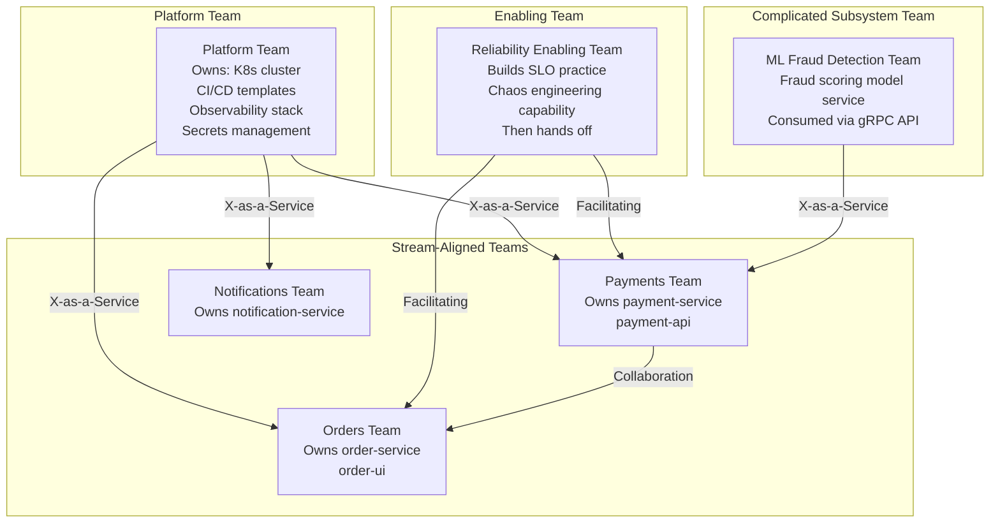

# Team Topologies and Conway's Law

## Category

Continuous Architecture — Organisation

## Context

Conway's Law (Mel Conway, 1967): *"Any organisation that designs a system will produce a design whose structure is a copy of the organisation's communication structure."*

This is not a recommendation — it is an empirical observation. If you want a microservices architecture with clean service boundaries, you need teams that match those boundaries. If you have a frontend team, a backend team, and a DBA team, you will produce a layered monolith with handover friction, regardless of your intended architecture.

**Inverse Conway Manoeuvre**: Deliberately design team topology to produce the desired architecture. The architecture follows the communication paths.

### Team Topology Types (Skelton & Pais)

| Team type | Primary mode | Purpose | Architecture relationship |
|---|---|---|---|
| **Stream-aligned** | Flow of work | End-to-end feature delivery for a business domain | Owns one or more services/products in that domain |
| **Platform** | Enabling | Provides internal services that reduce cognitive load on stream-aligned teams | Owns the platform; stream-aligned teams consume it via self-serve |
| **Enabling** | Facilitating | Helps other teams acquire capabilities they lack | Temporary; builds capability then moves on |
| **Complicated-subsystem** | Specialist | Owns a component requiring deep specialist knowledge | Provides a component (not a product) consumed by stream-aligned teams |

### Interaction Modes

| Mode | Description | When to use |
|---|---|---|
| **Collaboration** | Two teams work closely together on a shared goal | Establishing a new boundary; solving a novel problem |
| **X-as-a-Service** | One team provides something the other consumes with minimal interaction | Stable capability; clear API; low cognitive load |
| **Facilitating** | One team helps another acquire a capability | Enabling team helps stream-aligned team with security, testing, reliability |

## Pros

- Aligning team topology with architecture eliminates the friction of teams working across the wrong boundaries
- Platform teams reduce cognitive load: stream-aligned teams don't need to understand CI/CD tooling, infra provisioning, observability setup
- Stream-aligned teams can deploy independently — no cross-team release coordination
- Enabling teams spread capability instead of creating dependency on central expertise

## Cons

- Reorganising teams to match desired architecture is expensive and disruptive
- Platform team becomes a bottleneck if not invested properly (self-serve is harder to build than a service desk)
- Complicated-subsystem teams can become isolated silos if interaction model is not managed
- Team topology changes are political — require organisational authority to implement

## Design Diagram



## Code Sample

### Team API — Platform team self-service contract

```yaml
# platform/team-api.yaml
# The Platform team publishes this "Team API" — what they offer and how to consume it

name: Platform Team
version: "2.1"
contact: platform-team@company.com

services:
  ci_cd:
    description: Reusable GitHub Actions workflows for build/test/deploy
    interface: x-as-a-service
    consume_via: "Reuse .github/workflows/platform-build.yml (template)"
    sla: "Build pipeline success rate > 99.5%; p99 build time < 8 min"
    docs: "https://internal-docs/platform/ci-cd"

  kubernetes:
    description: Managed K8s cluster with namespaces per team
    interface: x-as-a-service
    consume_via: "Helm chart deployment via ArgoCD; namespace provisioned via self-serve form"
    sla: "Cluster availability 99.95%; namespace provisioned in < 10 min"
    docs: "https://internal-docs/platform/kubernetes"

  observability:
    description: Grafana + Prometheus + Tempo + Loki stack
    interface: x-as-a-service
    consume_via: "Include platform/observability/v2 Helm dependency; dashboards auto-provisioned"
    sla: "Metrics retention 90 days; trace retention 30 days"
    docs: "https://internal-docs/platform/observability"

  secrets:
    description: Vault-based secrets management + K8s injection
    interface: x-as-a-service
    consume_via: "Annotate pod with vault.hashicorp.com/agent-inject-secret"
    sla: "Secret sync < 30s; zero plaintext credentials in environment variables"
    docs: "https://internal-docs/platform/secrets"

cognitive_load_target: "< 2 hours for a new team to deploy their first service end-to-end"
```

### Inverse Conway — architecture decision driven by team topology

```markdown
# ADR-051: Align service ownership with stream-aligned team boundaries

**Status**: Accepted
**Date**: 2026-02-01

## Context
We have a shared `notification-service` owned by no one — contributions from 5 teams with
conflicting priorities and no single accountable team. The service has become a coordination
bottleneck and has the highest defect rate in production.

## Decision
Create a dedicated Notifications Team (stream-aligned) as the single owner of notification-service.
Teams requiring notifications consume the Notifications Team's API (email/SMS/push endpoints).
No other team contributes code directly to notification-service.

## Consequences
- Positive: Clear ownership; accountable team for SLA and on-call
- Positive: Notification domain expertise concentrates and grows
- Negative: 3-month transition; other teams must raise requests rather than PRs
- Negative: Notifications Team must be staffed (2 engineers initially)

## Conway's Law alignment
This decision applies the Inverse Conway Manoeuvre: we are structuring the team to produce
the desired service boundary, not trying to maintain the boundary despite the team structure.
```

## Key Patterns

### Cognitive Load Budget

Every team has a finite cognitive load capacity. Platform teams exist to absorb infrastructure complexity so stream-aligned teams focus on their domain.

**Cognitive load types**:

| Type | Description | Target |
|---|---|---|
| **Intrinsic** | Complexity of the domain being built | Maximise — this is what stream-aligned teams should spend on |
| **Extraneous** | Irrelevant complexity (infra, tooling, compliance) | Minimise — platform team absorbs this |
| **Germane** | Learning that improves domain understanding | Encourage — enables teams, builds enabling team capability |

**Rule**: If a stream-aligned team spends more than 20% of its time on extraneous concerns, the platform is not doing its job.

### Common Team Topology Mistakes

| Mistake | What it produces | Fix |
|---|---|---|
| No platform team — each team manages its own infra | Duplicated effort; inconsistent practices; high cognitive load | Establish a platform team; build golden paths |
| Platform team as a service desk | Bottleneck; stream-aligned teams waiting on tickets | Build self-serve; platform team enables, doesn't gate |
| Enabling team stays permanently | Creates dependency instead of building capability | Enabling teams have a defined engagement period (3–6 months) |
| Too many interaction modes simultaneously | Cognitive load spike; unclear ownership | Choose one mode per team pair at a time |
| Feature teams that span domain boundaries | High coordination; coupling across boundaries | Align team ownership to domain; split if necessary |

### Conway's Law in Practice

| Architecture target | Required team topology |
|---|---|
| Microservices with independent deployability | Stream-aligned teams owning ≤3 services each |
| API-first platform | Platform team owns internal developer platform; stream-aligned teams are consumers |
| Data mesh | Domain teams own their data products end-to-end; no central data engineering team |
| Modular monolith | One team (or feature teams with clear module ownership); strict module boundaries enforced by FF |

## Related Patterns

- [01 — Six Principles](./01-six-principles.md) — Principle 6: Model the organisation and its context
- [04 — Architect's Role](./04-architect-role.md) — Architect works with team topology, not against it
- [08 — Modularity and Coupling](./08-modularity-coupling.md) — Team coupling drives code coupling
- [10 — Architecture Governance](./10-architecture-governance.md) — Guild spans all teams
