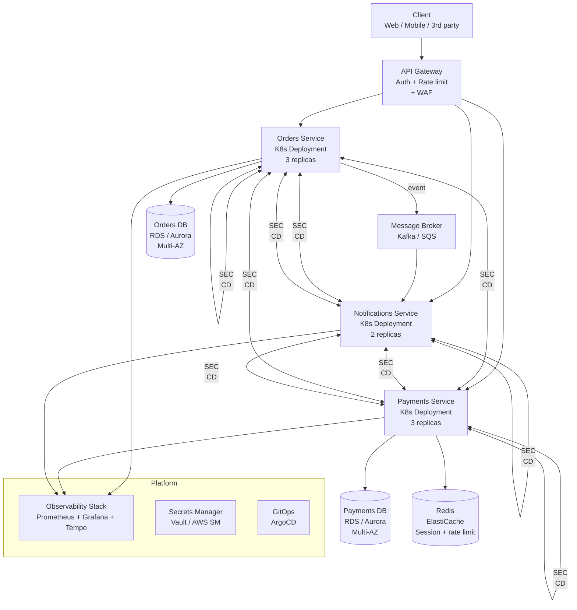

# Cloud-Native Architecture

## Category

Continuous Architecture — Platform

## Context

Cloud-native architecture is the practice of designing systems that fully exploit cloud platform capabilities: elastic scaling, managed services, pay-per-use economics, and global distribution. It is not a synonym for "deployed in the cloud" — a traditional monolith deployed to EC2 is not cloud-native.

Cloud-native design is a direct expression of Principles 4 (small, replaceable components), 5 (built for deploy and run), and 6 (model the organisation). Systems that cannot be elastically scaled, independently deployed, and self-healing cannot benefit from cloud investment.

### Cloud-Native vs Traditional

| Dimension | Traditional | Cloud-Native |
|---|---|---|
| **Unit of deployment** | Application server (WAR/EAR, VM) | Container / function / managed service |
| **Scaling model** | Manual vertical (bigger machine) | Automatic horizontal (more instances) |
| **State management** | In-process (session, cache) | External (Redis, DB, object store) |
| **Failure model** | Avoid failures; big redundant servers | Design for failure; fast recovery |
| **Dependencies** | Self-managed middleware (MQ, cache, DB) | Managed services (SQS, ElastiCache, RDS) |
| **Configuration** | File-based, environment-specific | Environment variables, secrets manager, feature flags |
| **Observability** | Log files on disk; manual tracing | Structured logs, distributed traces, metrics — all to a central platform |
| **Release frequency** | Monthly / quarterly | Multiple times per day |

### Microservices vs Modular Monolith Decision

| Factor | Lean toward microservices | Lean toward modular monolith |
|---|---|---|
| Team size | > 15 engineers | < 15 engineers |
| Domain clarity | Boundaries well-understood and stable | Boundaries still being discovered |
| Deploy frequency | Teams need independent deployment | Single coordinated release acceptable |
| Scale requirements | Services have very different scale needs | Uniform scale acceptable |
| Operational maturity | Platform team + observability stack mature | Platform team not yet established |
| Cost sensitivity | Revenue justifies distributed systems overhead | Cost of microservices overhead not justified |

**Default recommendation**: Start with a modular monolith. Extract services when a seam is stable, team size justifies it, and independent deployability would unblock delivery.

## Pros

- Elastic horizontal scaling eliminates capacity planning bottlenecks
- Managed services (RDS, SQS, ElastiCache) reduce operational burden
- Pay-per-use economics align cost with actual load
- Independent deployable services remove cross-team release coordination
- Built-in redundancy and availability primitives (multi-AZ, auto-healing) are cheaper than self-managed

## Cons

- Distributed systems complexity: network failures, partial failures, eventual consistency
- Observability required — without traces and metrics, debugging is nearly impossible
- Cold start latency in serverless patterns (Lambda, Container Apps)
- Data locality challenges: distributed services mean distributed data; joins and transactions are harder
- Cost management is non-trivial: elastic scaling can produce elastic bills

## Design Diagram



## Code Sample

### 12-Factor App — applied checklist

```typescript
// Factor I: Codebase — one repo, many deploys
// Each service has its own repository; shared code via npm package

// Factor II: Dependencies — explicitly declared
// package.json — no implicit global dependencies

// Factor III: Config — stored in the environment
export const config = {
  databaseUrl: process.env.DATABASE_URL!,           // not in code
  kafkaBrokers: process.env.KAFKA_BROKERS!.split(','),
  featureFlags: process.env.FEATURE_FLAGS_URL!,
  logLevel: (process.env.LOG_LEVEL ?? 'info') as 'debug' | 'info' | 'warn' | 'error',
};

// Factor IV: Backing services — treated as attached resources
// DB, cache, queue all referenced by URL — swap without code change

// Factor VI: Processes — stateless and share-nothing
// No in-process session; session stored in Redis
import { createClient } from 'redis';
const redis = createClient({ url: config.redisUrl });

// Factor VII: Port binding — export services via port
// Express/Fastify listening on process.env.PORT

// Factor VIII: Concurrency — scale via the process model
// K8s HPA scales replicas; each replica is a stateless process

// Factor IX: Disposability — fast startup, graceful shutdown
process.on('SIGTERM', async () => {
  console.log('SIGTERM received; draining connections...');
  await server.close();
  await db.end();
  await redis.quit();
  process.exit(0);
});

// Factor X: Dev/Prod parity — keep environments as similar as possible
// Use Testcontainers for local; same Postgres/Redis in all environments

// Factor XI: Logs — treat as event streams
import pino from 'pino';
export const logger = pino({ level: config.logLevel }); // structured JSON; platform collects

// Factor XII: Admin processes — run as one-off processes
// DB migrations run as init containers or pre-deploy jobs, not in the app startup
```

### Kubernetes Deployment — production-ready baseline

```yaml
apiVersion: apps/v1
kind: Deployment
metadata:
  name: orders-service
  labels:
    app: orders-service
    version: "2.4.1"
spec:
  replicas: 3
  strategy:
    type: RollingUpdate
    rollingUpdate:
      maxSurge: 1
      maxUnavailable: 0          # zero-downtime deploy
  selector:
    matchLabels:
      app: orders-service
  template:
    metadata:
      labels:
        app: orders-service
      annotations:
        prometheus.io/scrape: "true"
        prometheus.io/port: "3000"
        prometheus.io/path: "/metrics"
    spec:
      terminationGracePeriodSeconds: 30
      containers:
        - name: orders-service
          image: registry.company.com/orders-service:2.4.1
          ports:
            - containerPort: 3000
          env:
            - name: DATABASE_URL
              valueFrom:
                secretKeyRef:
                  name: orders-db-credentials
                  key: url
            - name: LOG_LEVEL
              value: "info"
          resources:
            requests:
              cpu: "100m"
              memory: "256Mi"
            limits:
              cpu: "500m"
              memory: "512Mi"
          readinessProbe:
            httpGet:
              path: /health/ready
              port: 3000
            initialDelaySeconds: 5
            periodSeconds: 5
          livenessProbe:
            httpGet:
              path: /health/live
              port: 3000
            initialDelaySeconds: 10
            periodSeconds: 15
          lifecycle:
            preStop:
              exec:
                command: ["sleep", "5"]   # allow load balancer to drain
```

## Key Patterns

### Cloud-Native Resilience Patterns

| Pattern | Problem solved | Implementation |
|---|---|---|
| **Circuit breaker** | Cascading failure from downstream degradation | Resilience4j, Polly, custom middleware |
| **Bulkhead** | One slow integration starves all thread pool capacity | Separate thread pools / connection pools per integration |
| **Retry with backoff** | Transient failures miscounted as permanent failures | Exponential backoff + jitter; idempotency required |
| **Timeout** | Slow dependency holds request indefinitely | All outbound calls must have an explicit timeout |
| **Health endpoints** | Load balancer routes to unhealthy instances | `/health/live` (is process alive?) + `/health/ready` (can it serve?) |
| **Graceful shutdown** | Abrupt kill drops in-flight requests | SIGTERM handler; drain; exit |
| **Saga** | Distributed transaction across services | Choreography (events) or orchestration (Saga orchestrator) |

### Serverless Architecture — when to use

| Good fit | Poor fit |
|---|---|
| Low and variable throughput (async jobs, webhooks) | > 100 RPS sustained (cost crossover) |
| Short-lived background tasks (< 15 min) | Long-running processes |
| Event-driven pipelines (S3 → Lambda → DynamoDB) | Low cold-start latency required (< 50 ms) |
| Extreme scale spikes (batch, seasonal) | Complex stateful interactions |

## Related Patterns

- [01 — Six Principles](./01-six-principles.md) — Principles 4 and 5 drive cloud-native design
- [13 — Evolutionary Patterns](./13-evolutionary-patterns.md) — Migrating to cloud-native from legacy
- [12 — Architecture Runway](./12-architecture-runway.md) — Platform team provides cloud-native runway
- [15 — Architecture Health Metrics](./15-architecture-metrics.md) — DORA metrics as cloud-native health indicators
