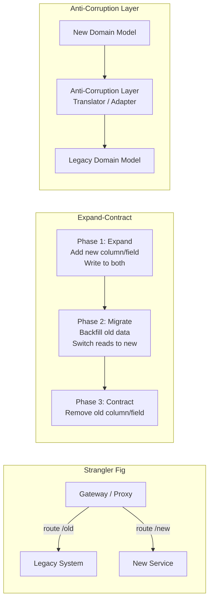

# Evolutionary Architecture Patterns

## Category

Continuous Architecture — Design

## Context

Evolutionary architecture is the practice of changing a running production system incrementally — replacing parts without disrupting the whole. It is the structural embodiment of Principle 4 (the power of small): systems that cannot be changed incrementally cannot be evolved safely.

The patterns in this section are the primary mechanisms for safely evolving systems that are already in production, with real users and real data.

### Why Evolutionary Change Is Hard

| Challenge | Why it exists | Pattern that addresses it |
|---|---|---|
| Data migration risk | Can't stop the world to migrate production data | Expand-Contract (parallel write + migrate) |
| API version compatibility | Old clients must keep working during rollout | Expand-Contract; versioned APIs |
| Legacy strangling | Large legacy system can't be rewritten wholesale | Strangler Fig |
| Model corruption | New system must integrate with legacy domain model | Anti-Corruption Layer |
| Breaking dependencies | Component B must be decoupled from A gradually | Branch by Abstraction |
| Parallel testing safety | Can't test against production without risk | Dark launching / parallel runs |

## Pros

- Systems evolve continuously without big-bang rewrites (which fail at very high rates)
- Each incremental change is small, testable, and reversible
- Users and dependent systems experience continuity — no forced synchronous migration
- Teams can work in parallel on new and old parts during transition

## Cons

- Incremental change takes longer than a rewrite (but succeeds more often)
- Running both old and new simultaneously increases operational complexity temporarily
- Data migration in the Expand-Contract pattern requires careful sequencing
- Patterns require discipline — teams are always tempted to accelerate past safe increments

## Design Diagram



## Code Sample

### Strangler Fig — request routing at the gateway

```typescript
// Gateway middleware: route traffic to legacy or new service
// Increment the percentage over time until legacy is fully replaced

import type { Request, Response, NextFunction } from 'express';

interface RoutingConfig {
  newServiceUrl: string;
  legacyServiceUrl: string;
  newServiceTrafficPercent: number; // 0–100; increment as confidence grows
  routes: string[];                 // paths being migrated
}

export function stranglerFigRouter(config: RoutingConfig) {
  return async (req: Request, res: Response, next: NextFunction) => {
    const isMigratedRoute = config.routes.some(r => req.path.startsWith(r));
    if (!isMigratedRoute) return next();

    const useNewService = Math.random() * 100 < config.newServiceTrafficPercent;
    const targetUrl = useNewService ? config.newServiceUrl : config.legacyServiceUrl;

    // Proxy request; preserve headers, body, method
    const upstream = await fetch(`${targetUrl}${req.path}`, {
      method: req.method,
      headers: { ...req.headers, 'x-forwarded-via': 'strangler-gateway' } as HeadersInit,
      body: ['GET', 'HEAD'].includes(req.method) ? undefined : JSON.stringify(req.body),
    });

    const data = await upstream.json();
    res.status(upstream.status).json(data);
  };
}

// Increment newServiceTrafficPercent:
// Day 1: 5% → monitor for errors
// Day 3: 25% → if clean
// Day 7: 50% → if clean
// Day 14: 100% → decommission old routes
```

### Expand-Contract — database column migration

```sql
-- PHASE 1: EXPAND (add new column; write to both old and new)
ALTER TABLE users ADD COLUMN phone_e164 TEXT;  -- new format: +15551234567
-- Application writes to BOTH phone (old) AND phone_e164 (new)

-- PHASE 2: MIGRATE (backfill old data into new format)
UPDATE users
SET phone_e164 = '+1' || regexp_replace(phone, '[^0-9]', '', 'g')
WHERE phone_e164 IS NULL
  AND phone IS NOT NULL;
-- Run in batches; verify row count before proceeding

-- Switch reads to phone_e164 once all rows are backfilled
-- Application now reads from phone_e164; still writes to both

-- PHASE 3: CONTRACT (remove old column once no readers remain)
ALTER TABLE users ALTER COLUMN phone_e164 SET NOT NULL;  -- confirm all migrated
ALTER TABLE users DROP COLUMN phone;                     -- remove old column
-- Application stops writing to old column (it no longer exists)
```

### Anti-Corruption Layer — TypeScript adapter

```typescript
// Legacy system has its own Order model with different field names and conventions
interface LegacyOrder {
  ord_id: string;
  cust_no: string;
  ord_dt: string;        // "YYYYMMDD" format
  tot_amt: number;       // cents
  stat_cd: 'O' | 'S' | 'C' | 'X'; // Open, Shipped, Closed, Cancelled
}

// New domain model — clean, intention-revealing
interface Order {
  id: string;
  customerId: string;
  orderedAt: Date;
  totalAmountCents: number;
  status: 'open' | 'shipped' | 'closed' | 'cancelled';
}

// Anti-Corruption Layer: translates without polluting the domain
export class LegacyOrderAdapter {
  private static STATUS_MAP: Record<LegacyOrder['stat_cd'], Order['status']> = {
    O: 'open', S: 'shipped', C: 'closed', X: 'cancelled',
  };

  static toDomain(legacy: LegacyOrder): Order {
    const dt = legacy.ord_dt; // "20260101"
    return {
      id: legacy.ord_id,
      customerId: legacy.cust_no,
      orderedAt: new Date(`${dt.slice(0,4)}-${dt.slice(4,6)}-${dt.slice(6,8)}`),
      totalAmountCents: legacy.tot_amt,
      status: this.STATUS_MAP[legacy.stat_cd],
    };
  }

  static toLegacy(order: Order): LegacyOrder {
    const dt = order.orderedAt;
    const STATUS_REVERSE = Object.fromEntries(
      Object.entries(this.STATUS_MAP).map(([k, v]) => [v, k])
    ) as Record<Order['status'], LegacyOrder['stat_cd']>;
    return {
      ord_id: order.id,
      cust_no: order.customerId,
      ord_dt: `${dt.getFullYear()}${String(dt.getMonth()+1).padStart(2,'0')}${String(dt.getDate()).padStart(2,'0')}`,
      tot_amt: order.totalAmountCents,
      stat_cd: STATUS_REVERSE[order.status],
    };
  }
}
```

### Branch by Abstraction — decoupling a dependency

```typescript
// STEP 1: Create an abstraction (interface) over the current concrete dependency
export interface NotificationSender {
  send(to: string, message: string): Promise<void>;
}

// STEP 2: Wrap the existing implementation behind the interface
export class LegacyEmailSender implements NotificationSender {
  async send(to: string, message: string) {
    // existing legacy SendGrid direct call — unchanged
    await legacySendgridClient.send({ to, text: message });
  }
}

// STEP 3: Build the new implementation behind the same interface
export class NewNotificationService implements NotificationSender {
  async send(to: string, message: string) {
    await fetch(`${process.env.NOTIFICATION_SERVICE_URL}/send`, {
      method: 'POST',
      body: JSON.stringify({ to, message }),
      headers: { 'Content-Type': 'application/json' },
    });
  }
}

// STEP 4: Feature flag switches between implementations
const sender: NotificationSender = featureFlags.isEnabled('new-notification-service')
  ? new NewNotificationService()
  : new LegacyEmailSender();
```

## Key Patterns

### Pattern Selection Guide

| Scenario | Pattern | Duration |
|---|---|---|
| Replacing an entire legacy system | Strangler Fig | Months to years |
| Changing a database schema without downtime | Expand-Contract | Days to weeks |
| Integrating with a legacy/external model | Anti-Corruption Layer | Permanent (until legacy decommissioned) |
| Decoupling a concrete dependency before replacement | Branch by Abstraction | Weeks |
| Testing a new implementation alongside the old | Dark launching / parallel run | Sprints |
| Gradually migrating API consumers | Tolerant Reader + versioned API | Months |

### Dark Launching

Run the new implementation in parallel with the old, but don't use its results for production responses. Compare outputs to verify correctness before switching over.

```typescript
export async function darkLaunch<T>(
  current: () => Promise<T>,
  candidate: () => Promise<T>,
  compare: (a: T, b: T) => boolean,
  sampleRate = 0.1
): Promise<T> {
  const result = await current();
  if (Math.random() < sampleRate) {
    candidate().then(candidateResult => {
      if (!compare(result, candidateResult)) {
        logger.warn({ current: result, candidate: candidateResult }, 'Dark launch divergence detected');
        metrics.increment('dark_launch.divergence', { service: 'orders' });
      }
    }).catch(err => logger.error(err, 'Dark launch candidate failed'));
  }
  return result; // always return current result — candidate is silent
}
```

## Related Patterns

- [01 — Six Principles](./01-six-principles.md) — Principle 4: Architect for change
- [08 — Modularity and Coupling](./08-modularity-coupling.md) — Modularity enables evolutionary change
- [11 — Cloud-Native Architecture](./11-cloud-native.md) — Cloud-native migration frequently uses strangler fig
- [05 — Architecture in Agile & DevOps](./05-architecture-agile.md) — Incremental change in sprint cadence
