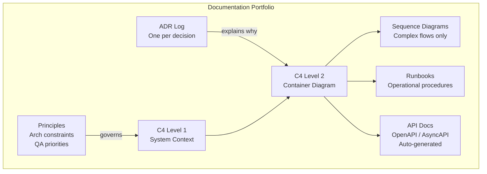
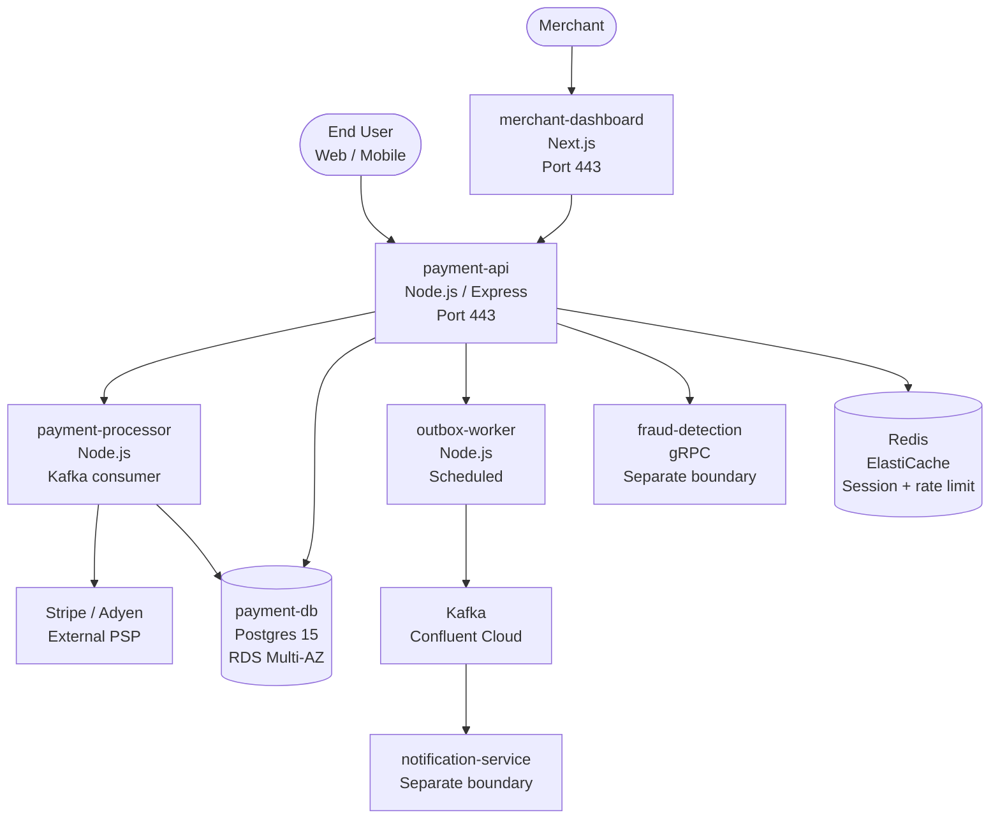

# Architecture Documentation

## Category

Continuous Architecture — Documentation

## Context

Architecture documentation has a paradox: too little means decisions are forgotten and systems are incomprehensible to new engineers; too much means documentation goes stale, no one reads it, and the effort of maintaining it exceeds the value it provides.

Continuous architecture documentation follows a rule: document the minimum that remains useful over time. This means:
- **Decisions** (ADRs) — permanent; never stale because they record what was true at decision time
- **Structure** (C4 diagrams) — updated at milestones; sufficient to orient any engineer
- **Constraints and principles** — slow to change; high value per page
- **Operational context** (runbooks) — updated as the system changes

What is *not* documented: implementation detail available in the code; decisions that are being revisited; anything with a lifespan measured in weeks.

### Documentation Hierarchy

| Level | Content | Lifespan | Update trigger | Owner |
|---|---|---|---|---|
| **Principles** | Architecture principles and constraints | Years | Significant context change | Architect |
| **Decisions** | ADRs — one per significant decision | Permanent | New decision supersedes old | Decision author |
| **Structure** | C4 context + container diagrams | Months | New component or significant change | Architect + team |
| **Behaviour** | Sequence diagrams for complex flows | Months | Flow changes significantly | Team |
| **Operational** | Runbooks, alert playbooks | Weeks–months | System changes | Ops / team |
| **Implementation** | API docs, inline code docs | Days–weeks | Code changes | Developer (auto-generated where possible) |

## Pros

- Right-sized documentation has a high signal-to-noise ratio — engineers actually read it
- ADRs provide irreversible decision history at negligible cost
- C4 diagrams communicate architecture to non-technical stakeholders without implementation detail
- Principles stored in version control are versioned alongside the code they govern
- Auto-generated API docs (OpenAPI, TypeDoc) are always current

## Cons

- Requires discipline to update diagrams when systems change (they will lag if not maintained)
- C4 at Level 3 (component) and Level 4 (code) goes stale quickly — generally not recommended
- Principles and constraints require stakeholder buy-in to be effective
- Over-specifying at lower levels creates false confidence — the detail is wrong before anyone reads it

## Design Diagram



## Code Sample

### C4 Model — System Context (Level 1)

```markdown
# System Context — Payment Platform

## Diagram

[Rendered from structurizr DSL or drawn in Miro/Excalidraw]

## Actors

| Actor | Type | Interacts via | Notes |
|---|---|---|---|
| **End User** | Person | Web/Mobile App | Authenticated via SSO |
| **Merchant** | Person | Merchant Dashboard | B2B SaaS interface |
| **Payment Service Provider (PSP)** | External system | REST API (HTTPS) | Stripe / Adyen |
| **Core Banking** | Internal system | Internal REST + Event | Backbase Core |
| **Fraud Detection** | Internal system | gRPC (synchronous) | ML scoring service |
| **Notification Service** | Internal system | Kafka (async events) | Email, SMS, Push |

## System Boundary

Includes: payment-api, payment-processor, payment-db, outbox-worker
Excludes: authentication (owned by Identity team), fraud scoring (owned by ML team)

## Key Constraints

- PCI-DSS scope applies to all components within this boundary
- Card data must never leave this boundary unmasked
- All API calls to PSP must be proxied through payment-processor (no direct client-to-PSP)
```

### C4 Model — Container Diagram (Level 2) in Mermaid



### Architecture principles document template

```markdown
# Payment Platform — Architecture Principles

**Version**: 2.1 | **Owner**: @lead-architect | **Last reviewed**: 2026-Q1

## Context
These principles govern all architectural decisions for the Payment Platform.
Any decision that conflicts with a principle must be explicitly documented in an ADR
explaining the exception and the conditions under which it is acceptable.

---

## P1: No direct DB cross-access between services
**Statement**: A service may only read from and write to databases it owns.
Cross-service data access must go through a defined service API or event.
**Rationale**: Direct DB access creates hidden coupling and prevents independent evolution.
**Fitness function**: FF-001 (dependency-cruiser: no cross-domain imports)
**Example violation**: Order service reading from Payment service's DB directly.

## P2: All external calls are resilient by default
**Statement**: All HTTP calls to external services (PSPs, identity, fraud) must have:
an explicit timeout (< 5s), retry with exponential backoff (max 3 attempts), and a circuit breaker.
**Rationale**: PSP latency spikes must not cascade into user-facing failures (QA-001).
**Fitness function**: FF-008 (integration test: circuit breaker trip at 50% failure rate)

## P3: At-least-once delivery for payment events
**Statement**: All payment state changes must be published as durable events via Kafka outbox.
HTTP-only notification is not acceptable.
**Rationale**: Notification consumers must never miss a payment event, even under partial outage (QA-003).
**ADR**: ADR-023 (outbox pattern), ADR-038 (Kafka for fan-out)

## P4: No secrets in code or environment variables
**Statement**: All credentials, API keys, and certificates must be stored in AWS Secrets Manager
and injected at runtime via the platform secrets CSI driver. Zero exceptions.
**Fitness function**: FF-003 (audit-ci) + custom secret scanner in CI
```

### Architecture documentation as code — Structurizr DSL

```dsl
workspace "Payment Platform" "Architecture as Code" {
  model {
    user = person "End User" "Authenticated customer"
    merchant = person "Merchant" "B2B merchant dashboard user"

    psp = softwareSystem "PSP" "Stripe / Adyen" { tags "External" }
    fraud = softwareSystem "Fraud Detection" "ML scoring service" { tags "Internal" }

    paymentPlatform = softwareSystem "Payment Platform" "Processes payments" {
      api = container "payment-api" "REST API; auth, validation, rate limiting" "Node.js"
      processor = container "payment-processor" "PSP integration; retry; idempotency" "Node.js"
      outbox = container "outbox-worker" "Reliable event publishing via outbox" "Node.js"
      db = container "payment-db" "Payment state, outbox table" "Postgres 15" { tags "DB" }
      kafka = container "Kafka" "Event bus for payment events" "Confluent Cloud" { tags "MQ" }

      api -> processor "Publish PaymentIntent" "Kafka"
      processor -> psp "Charge card" "HTTPS"
      processor -> db "Persist payment result" "SQL"
      outbox -> db "Poll outbox table" "SQL"
      outbox -> kafka "Publish payment events" "Kafka"
    }

    user -> api "Submit payment" "HTTPS"
    merchant -> api "Manage payments" "HTTPS"
    api -> fraud "Score transaction" "gRPC"
  }

  views {
    systemContext paymentPlatform "Context" { include * }
    container paymentPlatform "Containers" { include * }
    theme default
  }
}
```

## Key Patterns

### arc42 Template — Lightweight Alternative to SAD

arc42 is a practical template for architecture documentation that maps well to continuous architecture. Use only the sections relevant to your context:

| arc42 Section | Include? | Notes |
|---|---|---|
| 1. Introduction & goals | ✅ | Business context and QA priorities (utility tree) |
| 2. Constraints | ✅ | Technical, regulatory, organisational constraints |
| 3. Context & scope | ✅ | C4 Level 1 — system context diagram |
| 4. Solution strategy | ✅ | Key decisions and principles (link to ADRs) |
| 5. Building block view | ✅ | C4 Level 2 — container diagram |
| 6. Runtime view | Only if complex | Sequence diagrams for non-obvious flows |
| 7. Deployment view | ✅ | K8s namespace / infrastructure overview |
| 8. Cross-cutting concepts | ✅ | Logging, security, error handling, testing strategies |
| 9. Architecture decisions | ✅ | Link to ADR log (don't duplicate) |
| 10. Quality requirements | ✅ | QA utility tree (link to QA scenarios) |
| 11. Risks | ✅ | Currently known risks and mitigations |
| 12. Glossary | If needed | Domain terms used non-standardly |

### Documentation Location Rules

| Content | Where | Why |
|---|---|---|
| ADRs | `docs/architecture/decisions/` in repo | Versioned with code; searchable; PR-reviewable |
| C4 diagrams | `docs/architecture/` + Structurizr workspace | Version-controlled DSL; rendered on demand |
| Runbooks | `docs/runbooks/` or Confluence | Close to ops tooling; frequently updated |
| API docs | Auto-generated from OpenAPI spec in repo | Never manually maintained; always current |
| Architecture principles | `docs/architecture/principles.md` | Versioned; linked from ADRs |

## Related Patterns

- [07 — ADRs](./07-adrs.md) — The primary documentation artefact
- [10 — Architecture Governance](./10-architecture-governance.md) — Who owns which documentation
- [04 — Architect's Role](./04-architect-role.md) — Architect as documentation curator
- [02 — Quality Attributes](./02-quality-attributes.md) — QA utility tree as a key documentation artefact
