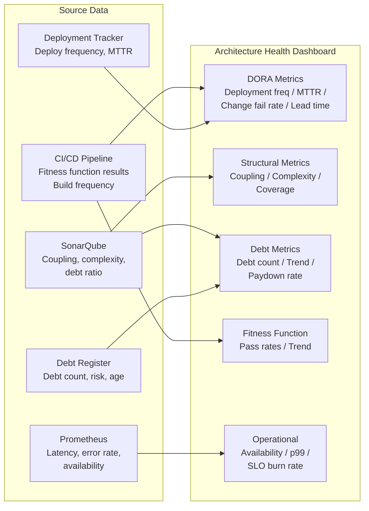

# Architecture Health Metrics

## Category

Continuous Architecture — Measurement

## Context

"Architecture is healthy" is not a useful statement. "Architecture instability has decreased from 0.72 to 0.48 in the orders domain, and deployment frequency has increased from 2×/week to 8×/week over the quarter" — is.

Architecture health metrics make the quality of the architecture visible to engineers, architects, and business stakeholders. They enable data-driven decisions about technical investment, debt paydown priority, and platform evolution.

Without metrics, architecture quality is judged subjectively (usually at the moment of crisis — a major incident or a delivery collapse) when it is too late and too expensive to change.

### Metric Categories

| Category | What it measures | Primary audience |
|---|---|---|
| **Delivery metrics (DORA)** | How effectively the architecture enables delivery | Engineering leadership, product |
| **Structural metrics** | Internal quality of the code and module structure | Architects, senior engineers |
| **Technical debt metrics** | Accumulation and trend of architectural shortcuts | Architects, team leads |
| **Fitness function results** | Conformance to explicit architectural properties | Architects, platform team |
| **Operational metrics** | How well the architecture performs in production | SRE, platform team, architects |

## Pros

- Objective, trend-based evidence for investment decisions ("we need 20% capacity for tech debt")
- Early warning signals: structural degradation visible before it produces delivery slowdown
- Creates shared language between architecture and business ("deployment frequency" vs "we can ship faster")
- Fitness function pass rates show governance health without manual audit
- DORA metrics correlate directly with business outcomes (research-backed)

## Cons

- Metrics can be gamed if tied to performance evaluations
- Some architectural quality properties resist quantification (conceptual integrity, principle adherence)
- Metrics require tooling investment to collect; dashboards require maintenance
- Leading indicators (structural metrics) have a lag before they produce lagging indicator impact (DORA)

## Design Diagram



## Code Sample

### DORA Metrics — data collection model

```typescript
// Architecture health: DORA metrics tracking
export interface DoraSnapshot {
  period: string;          // "2026-Q1"
  team: string;

  // Deployment Frequency: how often code is deployed to production
  // Elite: multiple times/day | High: 1/day–1/week | Medium: 1/week–1/month | Low: < 1/month
  deploymentFrequency: {
    deploysPerDay: number;
    level: 'elite' | 'high' | 'medium' | 'low';
  };

  // Lead Time for Changes: commit → production
  // Elite: < 1h | High: 1h–1d | Medium: 1d–1wk | Low: > 1 week
  leadTimeHours: {
    median: number;
    p95: number;
    level: 'elite' | 'high' | 'medium' | 'low';
  };

  // Change Failure Rate: % of deployments causing incidents / rollbacks
  // Elite: 0–5% | High: 5–10% | Medium: 10–15% | Low: > 15%
  changeFailureRatePercent: number;

  // Mean Time to Restore: how long to recover from a failure
  // Elite: < 1h | High: < 1d | Medium: 1d–1wk | Low: > 1 week
  meanTimeToRestoreHours: number;
}

// Structural architecture metrics
export interface StructuralSnapshot {
  period: string;
  module: string;

  afferentCoupling: number;    // Ca: modules that depend on this
  efferentCoupling: number;    // Ce: modules this depends on
  instability: number;         // Ce / (Ca + Ce) — target: stable modules I < 0.3
  cyclomaticComplexity: {
    avg: number;               // target: < 10
    max: number;               // target: < 20
    violatingFunctions: number; // target: 0
  };
  testCoverage: number;        // % — target: > 80% for critical paths
  duplicationPercent: number;  // target: < 3%
  sqaleDebtRatio: number;      // % — target: < 5% (A rating)
}

// Fitness function health
export interface FitnessSnapshot {
  period: string;
  totalFunctions: number;
  passingFunctions: number;
  failingFunctions: string[];   // FF IDs currently failing
  passRate: number;             // target: 100%
  newViolationsLastPeriod: number;
  violationsResolvedLastPeriod: number;
}
```

### Architecture health dashboard — Prometheus recording rules

```yaml
# prometheus/recording-rules/architecture-health.yaml
groups:
  - name: architecture_health
    interval: 1m
    rules:
      # Deployment frequency (CI/CD events)
      - record: arch:deployment_frequency:rate24h
        expr: sum(rate(deployments_total{env="production"}[24h])) by (service)

      # Change failure rate
      - record: arch:change_failure_rate:ratio
        expr: |
          sum(rate(deployments_total{status="failed",env="production"}[30d])) by (service)
          /
          sum(rate(deployments_total{env="production"}[30d])) by (service)

      # SLO burn rate (Google SRE model)
      - record: arch:slo_burn_rate:1h
        expr: |
          (1 - (sum(rate(http_requests_total{status!~"5.."}[1h])) by (service)
               / sum(rate(http_requests_total[1h])) by (service)))
          / (1 - 0.999)  # 99.9% SLO target

      # p99 latency
      - record: arch:latency_p99:5m
        expr: |
          histogram_quantile(0.99,
            sum(rate(http_request_duration_seconds_bucket[5m])) by (service, le)
          )
```

### Coupling trend report (CI artifact)

```typescript
// bin/coupling-report.ts — run weekly; output to architecture health dashboard
import { execSync } from 'child_process';

interface CouplingReport {
  date: string;
  modules: {
    name: string;
    instability: number;
    trend: 'improving' | 'stable' | 'degrading';
    alertLevel: 'ok' | 'warn' | 'critical';
  }[];
  overallHealth: 'green' | 'amber' | 'red';
}

const INSTABILITY_THRESHOLDS = {
  stable: 0.3,   // modules that should be stable (domain layer)
  warn: 0.7,     // any module approaching max instability
  critical: 0.9, // very high instability — likely a god module or circular dependency
};

export function generateCouplingReport(srcDir: string): CouplingReport {
  const raw = execSync(`npx depcruise ${srcDir} --output-type metrics --output-format json`);
  const metrics = JSON.parse(raw.toString());

  const modules = metrics.modules.map((m: any) => {
    const Ca = m.dependents?.length ?? 0;
    const Ce = m.dependencies?.length ?? 0;
    const instability = Ca + Ce === 0 ? 0 : Ce / (Ca + Ce);
    return {
      name: m.source,
      instability,
      trend: 'stable' as const, // compare against previous run for real trend
      alertLevel: (
        instability > INSTABILITY_THRESHOLDS.critical ? 'critical' :
        instability > INSTABILITY_THRESHOLDS.warn     ? 'warn' : 'ok'
      ) as 'ok' | 'warn' | 'critical',
    };
  });

  const critical = modules.filter((m: any) => m.alertLevel === 'critical').length;
  return {
    date: new Date().toISOString(),
    modules,
    overallHealth: critical > 3 ? 'red' : critical > 0 ? 'amber' : 'green',
  };
}
```

## Key Patterns

### Architecture Health Scorecard

| Metric | Current | Target | Trend | Alert |
|---|---|---|---|---|
| Deployment frequency | 2.3/day | ≥ 3/day | ↑ improving | — |
| Lead time (median) | 4.2h | < 1h | → stable | ⚠️ |
| Change failure rate | 3.1% | < 5% | ↓ improving | — |
| MTTR | 45 min | < 1h | → stable | — |
| Max module instability | 0.88 | < 0.7 | ↑ degrading | 🔴 |
| SonarQube debt ratio | 4.2% | < 5% | → stable | — |
| Fitness function pass rate | 94% | 100% | ↓ degrading | ⚠️ |
| Open critical debt items | 3 | 0 | ↑ degrading | 🔴 |
| Test coverage (critical paths) | 78% | ≥ 80% | → stable | ⚠️ |

### DORA Performance Levels (2023 State of DevOps Report)

| Metric | Elite | High | Medium | Low |
|---|---|---|---|---|
| Deployment frequency | Multiple/day | 1/day – 1/week | 1/week – 1/month | < 1/month |
| Lead time | < 1 hour | 1h – 1 day | 1 day – 1 week | > 1 week |
| Change failure rate | 0–5% | 5–10% | 10–15% | > 15% |
| MTTR | < 1 hour | < 1 day | 1 day – 1 week | > 1 week |

Elite performers deploy 973× more frequently than low performers and recover from failures 6,570× faster. Architecture decisions that improve deployability and modularity are the primary architectural levers for moving up these levels.

### Metric Review Cadence

| Frequency | What to review | Forum |
|---|---|---|
| **Every CI build** | Fitness function pass/fail | CI dashboard; block on failure |
| **Weekly** | DORA trend; coupling trend; debt register delta | Architecture guild agenda |
| **Monthly** | Full health scorecard; SLO burn rates; FF coverage | Architect + engineering leadership |
| **Quarterly** | Technology radar update; QA utility tree re-calibration; debt paydown capacity setting | PI planning / architecture review |

## Related Patterns

- [06 — Fitness Functions](./06-fitness-functions.md) — Automated metrics generated by FFs
- [03 — Technical Debt](./03-technical-debt.md) — Debt metrics and paydown tracking
- [08 — Modularity and Coupling](./08-modularity-coupling.md) — Structural coupling metrics
- [05 — Architecture in Agile & DevOps](./05-architecture-agile.md) — DORA metrics and delivery cadence
