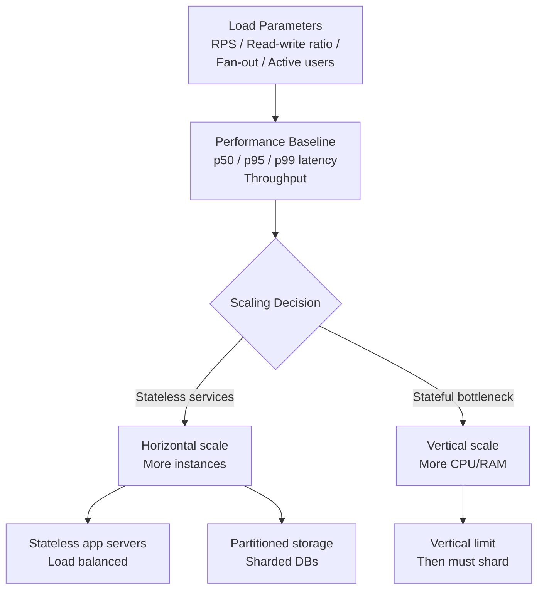

# Reliability, Scalability, and Maintainability

## Category

DDIA — Foundations (Chapter 1)

## Context

Every data-intensive application is built on three non-negotiable properties. These are not features to add later — they are the frame within which every data system decision is made.

| Property | Core question | Failure mode |
|---|---|---|
| **Reliability** | Does the system work correctly even when things go wrong? | Silent data corruption; cascading failures; wrong answers |
| **Scalability** | Can the system handle growth in load, data, or complexity? | Latency degrades under load; system collapses under growth |
| **Maintainability** | Can engineers work on the system productively over time? | Only original authors can make changes; every change is risky |

### Reliability

Reliability means working correctly even in the face of **faults**. A fault is a deviation from spec in one component. A **failure** is when the whole system stops providing service. Fault-tolerant systems prevent faults from causing failures.

**Fault categories**:
| Fault type | Example | Mitigation |
|---|---|---|
| Hardware fault | Disk failure, power cut, network card failure | RAID, redundant power, multi-datacenter |
| Software bug | Off-by-one, race condition, runaway process | Testing, process isolation, gradual rollout |
| Human error | Wrong config, deleted data, misconfigured firewall | Change management, reversible operations, monitoring |

**Reliability ≠ no faults**: The goal is fault *tolerance*, not fault prevention. Netflix's Chaos Monkey (deliberately killing production servers) builds reliability by forcing fault tolerance to be real, not theoretical.

### Scalability

Scalability is the ability to handle growth. Growth can be in volume (more data), throughput (more requests), or complexity (more varied workloads).

**Load parameters** — the numbers that describe your load:
- RPS (requests per second) to a web service
- Ratio of reads to writes in a database
- Number of simultaneously active users
- Cache hit rate
- Fan-out in a social graph (average follows per user)

**Twitter's fan-out problem** is the canonical scalability example:
- *Approach 1*: On read — compute timeline from follows on every read request → collapses under load for users with many followers
- *Approach 2*: On write — push new tweets to all followers' timeline caches → write amplification; celebrity accounts with 30M followers make this expensive
- *Twitter's solution*: Hybrid — most users get approach 2; accounts above a follower threshold stay on approach 1; merged at read time

**Performance questions**:
- If load increases, how does performance change with the same resources?
- If load increases, how much resource must be added to keep performance constant?

**Latency vs response time**: These are not synonyms. Response time is what the client observes (processing + network + queueing). Latency is the time a request is waiting to be handled. Report **percentiles** (p50, p95, p99, p999) not averages — averages hide the tail.

### Maintainability

Most software cost is maintenance, not initial development. Three design principles:

| Principle | What it means | Design levers |
|---|---|---|
| **Operability** | Easy for ops to keep the system running | Good monitoring, self-healing, predictable behaviour, good defaults |
| **Simplicity** | Easy for new engineers to understand | Abstraction that removes accidental complexity; not essential complexity |
| **Evolvability** | Easy to make changes | Modularity, loose coupling, extensible data formats, ADRs |

## Pros

- Explicit focus on these three properties prevents the common failure mode of building something that works at demo scale but collapses in production
- Load parameters give teams a shared, measurable definition of "performance"
- Separating essential complexity (the hard problem) from accidental complexity (our implementation choices) focuses simplification effort correctly

## Cons

- The three properties tension each other: maximising reliability often costs scalability; maximising simplicity may cost some reliability mechanisms
- Operability is the hardest to quantify — teams know it when they have it, and know it when they don't

## Design Diagram



## Code Sample

### Latency percentile tracking — production instrumentation

```typescript
import { Histogram, register } from 'prom-client';

const httpDuration = new Histogram({
  name: 'http_request_duration_seconds',
  help: 'HTTP request duration in seconds',
  labelNames: ['method', 'route', 'status'],
  // Report p50, p95, p99, p999 — never just the average
  buckets: [0.005, 0.01, 0.025, 0.05, 0.1, 0.25, 0.5, 1, 2.5, 5, 10],
});

export function httpInstrumentation() {
  return (req: Request, res: Response, next: NextFunction) => {
    const end = httpDuration.startTimer({
      method: req.method,
      route: req.route?.path ?? 'unknown',
    });
    res.on('finish', () => end({ status: res.statusCode }));
    next();
  };
}

// Chaos / fault injection middleware — builds reliability by testing it
export function faultInjection(config: {
  errorRate: number;    // 0.0–1.0: fraction of requests to fail
  latencyMs?: number;  // artificial latency to inject
}) {
  return async (req: Request, res: Response, next: NextFunction) => {
    if (config.latencyMs) {
      await new Promise(resolve => setTimeout(resolve, config.latencyMs));
    }
    if (Math.random() < config.errorRate) {
      return res.status(503).json({ error: 'Injected fault' });
    }
    next();
  };
}
```

### Fan-out write model (Twitter timeline pattern)

```typescript
import { createClient } from 'redis';
import { Pool } from 'pg';

const redis = createClient({ url: process.env.REDIS_URL });
const db = new Pool({ connectionString: process.env.DATABASE_URL });

const CELEBRITY_THRESHOLD = 100_000; // followers — switch to read-time approach

export async function publishTweet(authorId: string, text: string): Promise<string> {
  // 1. Write the canonical tweet to DB
  const { rows } = await db.query(
    'INSERT INTO tweets (author_id, text, created_at) VALUES ($1, $2, NOW()) RETURNING id',
    [authorId, text]
  );
  const tweetId: string = rows[0].id;

  // 2. Decide fan-out strategy based on follower count
  const { rows: [user] } = await db.query(
    'SELECT follower_count FROM users WHERE id = $1', [authorId]
  );

  if (user.follower_count <= CELEBRITY_THRESHOLD) {
    // Write-time fan-out: push to each follower's timeline cache
    const { rows: followers } = await db.query(
      'SELECT follower_id FROM follows WHERE followee_id = $1', [authorId]
    );
    await Promise.all(
      followers.map(f =>
        redis.lPush(`timeline:${f.follower_id}`, tweetId).then(() =>
          redis.lTrim(`timeline:${f.follower_id}`, 0, 799) // keep last 800
        )
      )
    );
  }
  // else: celebrity tweets are fetched at read time and merged with cache

  return tweetId;
}

export async function getTimeline(userId: string): Promise<string[]> {
  // 1. Get pre-computed timeline from cache
  const cachedIds = await redis.lRange(`timeline:${userId}`, 0, 99);

  // 2. Merge in any celebrity tweets (read-time fan-in)
  const { rows: celebrities } = await db.query(`
    SELECT t.id FROM tweets t
    JOIN follows f ON f.followee_id = t.author_id
    JOIN users u ON u.id = t.author_id
    WHERE f.follower_id = $1
      AND u.follower_count > $2
      AND t.created_at > NOW() - INTERVAL '7 days'
    ORDER BY t.created_at DESC LIMIT 50
  `, [userId, CELEBRITY_THRESHOLD]);

  // 3. Merge and deduplicate
  const allIds = [...new Set([...cachedIds, ...celebrities.map(r => r.id)])];
  return allIds.sort().slice(0, 100);
}
```

## Key Patterns

### SLA vs SLO vs SLI

| Term | Definition | Example |
|---|---|---|
| **SLI** (Service Level Indicator) | A metric that measures service quality | p99 response time |
| **SLO** (Service Level Objective) | A target value for an SLI | p99 < 200 ms, 99.9% of the time |
| **SLA** (Service Level Agreement) | A contract with consequences for missing the SLO | "If we miss our SLO for 3 months, you get a credit" |

### Percentile Tail Latency — Why P99 Matters

If a service makes 5 backend calls in parallel, and each has 1% chance of being slow:
- P(at least one slow) = 1 − (0.99)^5 ≈ 5%
- In a microservices fan-out, slow tails multiply quickly — p99 of a single service becomes p50 of the composite service

**Consequence**: Optimise p99 and p999, not just average latency.

### Accidental vs Essential Complexity

| Type | Definition | Example | Remedy |
|---|---|---|---|
| **Essential** | Inherent in the problem | Distributed agreement is hard | Learn to manage it; can't remove |
| **Accidental** | Caused by our implementation choices | Global mutable state everywhere | Refactor; better abstractions |

Good abstraction moves accidental complexity behind an interface, leaving engineers to focus on essential complexity.

## Related Patterns

- [05 — Replication](./05-replication.md) — Reliability through redundancy
- [06 — Partitioning](./06-partitioning-sharding.md) — Scalability through distribution
- [08 — Distributed Systems Trouble](./08-distributed-systems-trouble.md) — Why reliability is hard in distributed systems
- [15 — Data Architecture Patterns](./15-data-architecture-patterns.md) — Composing reliable, scalable systems
