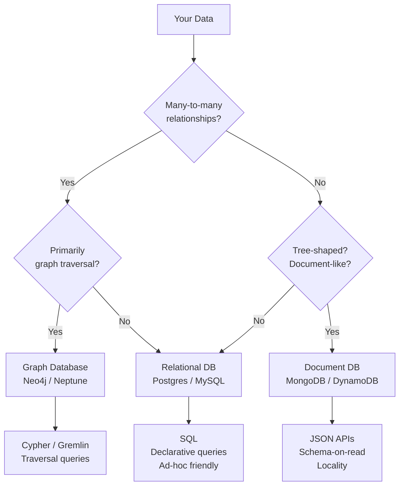

# Data Models and Query Languages

## Category

DDIA — Foundations (Chapter 2)

## Context

The data model is the most fundamental choice in any data system. It determines what queries are natural, what updates are efficient, and what the code that uses the database looks like. Most applications are built on a layered stack of data models, each abstracting the one below.

There is no universally best data model. The question is always: what is the best model for *this* access pattern?

### The Three Primary Models

| Model | Core abstraction | Best for | Examples |
|---|---|---|---|
| **Relational** | Tables, rows, relations, joins | Many-to-many relationships; ad-hoc queries; strong consistency | PostgreSQL, MySQL, Oracle |
| **Document** | Self-contained documents (JSON/BSON) | Document-like data; one-to-many; tree-shaped; locality | MongoDB, DynamoDB, CouchDB |
| **Graph** | Vertices and edges | Highly connected data; many-to-many with traversal | Neo4j, Amazon Neptune, JanusGraph |

### Impedance Mismatch

Object-oriented code operates on objects. Relational databases operate on rows and tables. The translation between the two is the **impedance mismatch** problem — handled by ORMs, but never fully eliminated.

```
Object model:           Relational model:
User {                  users (id, name, email)
  id,                   positions (user_id, title, org_id, start_year, end_year)
  name,                 educations (user_id, institution, degree, start_year, end_year)
  positions: [...],     contact_infos (user_id, type, value)
  education: [...],
  contact: [...]
}
```

Document databases reduce impedance mismatch for self-contained tree-shaped data. They increase it for many-to-many relationships that relational models handle naturally.

### Relational vs Document Trade-offs

| Consideration | Relational | Document |
|---|---|---|
| Schema | Enforced at write (schema-on-write) | At read (schema-on-read — more flexible) |
| Joins | Natural (JOIN) | Emulated in application code (expensive) |
| Many-to-many | Native | Anti-pattern; denormalise or use references |
| Tree-shaped data | Awkward (multiple tables + joins) | Natural (nested structure in one document) |
| Ad-hoc queries | Excellent (SQL optimiser) | Limited (index-only; full table scan otherwise) |
| Data locality | Poor (rows split across pages) | Excellent (whole document stored together) |
| Schema evolution | ALTER TABLE (disruptive at scale) | Add/remove fields in documents — backward compatible |

## Pros — Relational Model

- Decades of battle-tested query optimisers
- SQL is declarative — what, not how; optimiser chooses the plan
- Natural many-to-many relationships via foreign keys and joins
- ACID transactions well-understood and widely implemented
- Ad-hoc queries without pre-planning access patterns

## Pros — Document Model

- Schema flexibility: fields can be added to documents without a migration
- Data locality: the entire document is fetched in one read if the full document is needed
- Closer to the in-memory representation for tree-shaped data (reduces impedance mismatch)
- Horizontal scaling is easier (documents are self-contained; sharding by document key is natural)

## Pros — Graph Model

- Most natural representation for highly connected data (social graphs, knowledge graphs, route networks, fraud rings)
- Graph traversal queries (finding paths, neighbours, clusters) that would require many recursive self-joins in SQL are natural
- Schema-free: different vertex types can have different properties

## Cons of Each

| Model | Primary weaknesses |
|---|---|
| Relational | Object-relational impedance; ALTER TABLE pain at scale; joins have cost; horizontal scale harder |
| Document | No joins — many-to-many requires application-side joins or denormalisation; limited ad-hoc query support |
| Graph | Not suitable for simple CRUD; specialised query languages (Cypher, SPARQL, Gremlin) have learning curve |

## Design Diagram



## Code Sample

### Relational — normalised schema with joins

```typescript
import { Pool } from 'pg';
const db = new Pool({ connectionString: process.env.DATABASE_URL });

// Normalised relational schema
// users(id, name, email)
// positions(id, user_id, title, company_id, start_year, end_year)
// companies(id, name, industry)

interface UserProfile {
  id: string;
  name: string;
  positions: { title: string; company: string; startYear: number }[];
}

export async function getUserProfile(userId: string): Promise<UserProfile | null> {
  // One query with a join — DB does the heavy lifting
  const { rows } = await db.query(`
    SELECT u.id, u.name,
           p.title, c.name AS company, p.start_year
    FROM users u
    LEFT JOIN positions p ON p.user_id = u.id
    LEFT JOIN companies c ON c.id = p.company_id
    WHERE u.id = $1
    ORDER BY p.start_year DESC
  `, [userId]);

  if (rows.length === 0) return null;
  return {
    id: rows[0].id,
    name: rows[0].name,
    positions: rows.map(r => ({ title: r.title, company: r.company, startYear: r.start_year })),
  };
}
```

### Document — self-contained document (MongoDB / DynamoDB)

```typescript
import { MongoClient } from 'mongodb';
const client = new MongoClient(process.env.MONGO_URL!);
const db = client.db('profiles');

// Denormalised document — all user data in one document
interface UserDocument {
  _id: string;
  name: string;
  email: string;
  positions: { title: string; company: { name: string; industry: string }; startYear: number }[];
  education: { institution: string; degree: string; year: number }[];
}

export async function getUserDoc(userId: string): Promise<UserDocument | null> {
  // Single read — no join needed; locality advantage
  return db.collection<UserDocument>('users').findOne({ _id: userId });
}

// Schema-on-read: adding a new field doesn't require migration
export async function addSkillsField(userId: string, skills: string[]) {
  await db.collection('users').updateOne(
    { _id: userId },
    { $set: { skills } }  // documents without 'skills' simply don't have the field
  );
}
```

### Graph — Cypher query (Neo4j)

```cypher
-- Find all friends-of-friends of Alice who work at the same company as Bob
-- This would require recursive CTEs or application-side joins in SQL

MATCH (alice:Person {name: 'Alice'})-[:KNOWS]->(friend:Person)-[:KNOWS]->(fof:Person),
      (bob:Person {name: 'Bob'})-[:WORKS_AT]->(company:Company)<-[:WORKS_AT]-(fof)
WHERE NOT (alice)-[:KNOWS]->(fof)
  AND alice <> fof
RETURN fof.name, company.name
ORDER BY fof.name
```

```typescript
// Via neo4j-driver
import neo4j from 'neo4j-driver';
const driver = neo4j.driver(process.env.NEO4J_URL!, neo4j.auth.basic('neo4j', process.env.NEO4J_PASS!));

export async function friendsOfFriendsAtCompany(aliceName: string, bobName: string) {
  const session = driver.session();
  try {
    const result = await session.run(`
      MATCH (alice:Person {name: $alice})-[:KNOWS]->(friend)-[:KNOWS]->(fof:Person),
            (bob:Person {name: $bob})-[:WORKS_AT]->(co:Company)<-[:WORKS_AT]-(fof)
      WHERE NOT (alice)-[:KNOWS]->(fof) AND alice <> fof
      RETURN fof.name AS name, co.name AS company
    `, { alice: aliceName, bob: bobName });
    return result.records.map(r => ({ name: r.get('name'), company: r.get('company') }));
  } finally {
    await session.close();
  }
}
```

## Key Patterns

### Normalisation vs Denormalisation

| Strategy | Advantage | Disadvantage | When to use |
|---|---|---|---|
| **Normalised** (store IDs, join at query time) | No duplication; consistent updates; smaller storage | Join cost; multiple round trips in document DBs | Relational; frequently updated reference data |
| **Denormalised** (embed full copies) | Fast reads; no joins; good locality | Update anomalies; duplication; larger documents | Document DB; read-heavy; rarely updated references |
| **Hybrid** | Optimise for most common access pattern | Complexity of two representations | CQRS; read replicas; pre-computed views |

### Schema-on-Write vs Schema-on-Read

| | Schema-on-write | Schema-on-read |
|---|---|---|
| **When schema is checked** | At write time (INSERT/UPDATE) | At read time (application code interprets) |
| **Analogy** | Static type checking (TypeScript compile) | Dynamic type checking (JavaScript runtime) |
| **Migration cost** | ALTER TABLE — often expensive at scale | Add field in app; old documents just lack the field |
| **Safety** | Rejects invalid data at write | Accepts invalid data; fails at read |
| **Best for** | Known stable schema; data quality critical | Heterogeneous data; schema evolving rapidly |

### Declarative vs Imperative Queries

SQL is declarative (describe *what* you want; DB decides *how*):
```sql
SELECT * FROM animals WHERE family = 'Sharks' ORDER BY name;
```

An equivalent imperative (MapReduce-style) approach:
```javascript
db.animals.filter(a => a.family === 'Sharks').sort((a,b) => a.name.localeCompare(b.name));
```

Declarative queries allow the DB to optimise (use an index, parallelise), restructure the query, etc. Imperative queries commit to a specific execution strategy.

## Related Patterns

- [03 — Storage and Retrieval](./03-storage-retrieval.md) — How these models are physically implemented
- [06 — Partitioning](./06-partitioning-sharding.md) — How data models affect sharding strategies
- [13 — OLAP and Column Stores](./13-olap-column-stores.md) — Analytical data models
- [15 — Data Architecture Patterns](./15-data-architecture-patterns.md) — Combining models in a system
