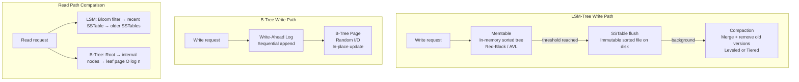

# Storage and Retrieval

## Category

DDIA — Foundations (Chapter 3)

## Context

The storage engine is the component responsible for storing data and retrieving it on request. Understanding how engines work is essential for:
- Choosing the right storage engine for a workload
- Tuning indexes effectively
- Understanding why write-heavy and read-heavy workloads need different architectures

Two fundamentally different families of storage engines exist: **B-tree based** (used in most relational databases) and **log-structured** (LSM-trees, used in write-optimised NoSQL engines).

### The Simplest Possible Database

```bash
# World's simplest key-value store
db_set() { echo "$1,$2" >> database.log; }
db_get() { grep "^$1," database.log | tail -n 1 | cut -d',' -f2; }
```

- **Write**: O(1) — append to log (fast)
- **Read**: O(n) — scan the whole log (disastrously slow without an index)
- **Space**: grows forever (no compaction)

This toy example reveals the fundamental trade-off: **writes are cheap when you append; reads are expensive without an index; space management requires compaction**.

Every real storage engine is a sophisticated solution to exactly these three problems.

### LSM-Trees (Log-Structured Merge-Trees)

Used by: LevelDB, RocksDB, Cassandra, HBase, Lucene

```
Write path:
  1. Write to in-memory memtable (sorted, AVL tree or red-black tree)
  2. When memtable reaches threshold → flush to SSTable on disk (immutable, sorted file)
  3. Background: compact and merge SSTables (removes old versions, tombstones)

Read path:
  1. Check memtable
  2. Check most recent SSTable
  3. Check older SSTables (bloom filter first to skip most)
```

**SSTables (Sorted String Tables)**: Segments of key-value pairs sorted by key. Because sorted, efficient merge (like merge sort). Bloom filters allow "definitely not in this file" short-circuit.

### B-Trees

Used by: PostgreSQL, MySQL (InnoDB), SQLite, Oracle, SQL Server

```
Structure:
  - Fixed-size pages (4KB–16KB), each containing keys + child page pointers
  - Branching factor: number of child pointers (typically several hundred)
  - Tree height: log_B(n) pages — 4 levels for 256 TB of data at B=500
  - Writes: read page → modify in place → write page back
  - WAL (Write-Ahead Log): crash recovery — redo log written before page modification
```

### B-Tree vs LSM-Tree

| Dimension | B-Tree | LSM-Tree |
|---|---|---|
| Write performance | Slower — random I/O; write amplification from WAL + page write | Faster — sequential writes; memtable flush; batch compaction |
| Read performance | Faster — O(log n); direct page lookup | Slower — may check multiple SSTables; bloom filters help |
| Write amplification | ~2× (WAL + page) | 10× or more (multiple compaction rounds) |
| Space amplification | Low (in-place updates) | Higher (multiple versions until compaction) |
| Compaction overhead | None | Background I/O competes with foreground reads |
| Crash recovery | WAL | WAL + memtable journal |
| Best for | Read-heavy; point queries | Write-heavy; time series; append-heavy |

## Pros

- Understanding the storage engine prevents surprise: a B-tree database will perform very differently from an LSM-tree database under write-heavy workloads
- Index design decisions (type, coverage, composite key order) that would be guesses become principled choices
- Distinguishing OLTP (row-oriented) from OLAP (column-oriented) shapes the entire system architecture

## Cons

- Storage engine internals are deep; full understanding requires significant investment
- Storage engine choice is often constrained by the database product, not directly controllable
- Knowing the internals doesn't remove the need to benchmark actual workloads

## Design Diagram



## Code Sample

### Indexes — explicit type selection

```typescript
// PostgreSQL index type selection — not all indexes are equal

// B-Tree (default): equality + range + sorting — the general-purpose index
// Use for: most queries, ORDER BY, BETWEEN, <, >, =
await db.query(`CREATE INDEX idx_orders_created_at ON orders (created_at);`);

// Hash: equality only, faster than B-Tree for =
// Use for: exact match lookups where range queries never happen
await db.query(`CREATE INDEX idx_sessions_token ON sessions USING HASH (token);`);

// GIN (Generalised Inverted Index): multi-valued columns, full text, JSONB
// Use for: array containment, full-text search, JSONB field queries
await db.query(`CREATE INDEX idx_products_tags ON products USING GIN (tags);`);
await db.query(`CREATE INDEX idx_posts_body ON posts USING GIN (to_tsvector('english', body));`);

// GiST: geometric data, full-text, exclusion constraints
await db.query(`CREATE INDEX idx_events_range ON events USING GIST (tsrange(starts_at, ends_at));`);

// BRIN (Block Range Index): very large sorted tables with natural ordering
// Tiny index (stores min/max per block); good for time-series with natural time ordering
await db.query(`CREATE INDEX idx_metrics_ts ON metrics USING BRIN (recorded_at);`);

// Partial index: only index rows that match a condition — smaller, faster
await db.query(`
  CREATE INDEX idx_orders_pending ON orders (created_at)
  WHERE status = 'pending';
`);

// Covering index: include extra columns to avoid heap fetch
await db.query(`
  CREATE INDEX idx_users_email_covering ON users (email)
  INCLUDE (id, name);  -- query can be answered from index alone
`);
```

### LSM-Tree simulation — the compaction intuition

```typescript
// Simplified LSM-tree read path — shows why reads check multiple levels
interface SSTableEntry { key: string; value: string | null } // null = tombstone

class SimpleLSMTree {
  private memtable = new Map<string, string | null>();
  private sstables: SSTableEntry[][] = []; // index 0 = most recent

  write(key: string, value: string) { this.memtable.set(key, value); }
  delete(key: string) { this.memtable.set(key, null); } // tombstone

  flush() {
    const sorted = [...this.memtable.entries()]
      .sort(([a], [b]) => a.localeCompare(b))
      .map(([key, value]) => ({ key, value }));
    this.sstables.unshift(sorted); // newest first
    this.memtable.clear();
  }

  read(key: string): string | undefined {
    // 1. Check memtable first
    if (this.memtable.has(key)) {
      const val = this.memtable.get(key);
      return val === null ? undefined : val; // tombstone = deleted
    }
    // 2. Check SSTables newest to oldest — first occurrence wins
    for (const sst of this.sstables) {
      // In real LSM-trees: bloom filter first; binary search (sorted); skip if not found
      const entry = sst.find(e => e.key === key);
      if (entry) return entry.value === null ? undefined : entry.value;
    }
    return undefined;
  }
}
```

### Explaining query plans — understanding index usage

```typescript
export async function analyzeQuery(db: Pool, query: string, params: unknown[]) {
  const { rows } = await db.query(`EXPLAIN (ANALYZE, BUFFERS, FORMAT JSON) ${query}`, params);
  const plan = rows[0]['QUERY PLAN'][0];

  console.log('Total cost:', plan['Plan']['Total Cost']);
  console.log('Actual rows:', plan['Plan']['Actual Rows']);
  console.log('Execution time:', plan['Execution Time'], 'ms');

  // Seq Scan on a large table = missing index
  const planText = JSON.stringify(plan);
  if (planText.includes('Seq Scan')) {
    console.warn('WARNING: Sequential scan detected. Consider adding an index.');
  }
  if (planText.includes('Hash Join') || planText.includes('Nested Loop')) {
    console.log('INFO: Join detected — check join column indexes.');
  }
}
```

## Key Patterns

### Index Design Rules

1. **Every foreign key should have an index** — without it, ON DELETE/UPDATE checks do a full table scan
2. **Composite index key order matters** — `(a, b)` index supports queries on `a` or `(a, b)` but NOT `b` alone
3. **Cardinality matters** — an index on a boolean column with 50/50 data is likely not used (seq scan is faster)
4. **Covering indexes eliminate heap fetches** — if all needed columns are in the index, the heap is never touched
5. **Partial indexes are smaller and faster** — only index the rows your queries actually need

### OLTP vs OLAP Storage

| Property | OLTP | OLAP |
|---|---|---|
| Access pattern | Small number of rows per query; point lookups | Aggregate over millions of rows |
| Write pattern | Random, small, high-frequency writes | Bulk load (ETL); less frequent |
| Schema | Normalised (3NF) | Denormalised star/snowflake schema |
| Storage orientation | Row-oriented | Column-oriented |
| Index type | B-Tree for point lookup | Bitmap indexes; sparse indexes |
| Bottleneck | Disk seek time | Disk bandwidth (read many columns) |
| Examples | PostgreSQL, MySQL | Redshift, BigQuery, ClickHouse |

### Column-Oriented Storage Intuition

Row-oriented: `[id, name, price, qty, ...]` — good for fetching all columns of one row.
Column-oriented: `[id1, id2, id3...][name1, name2...][price1, price2...]` — good for aggregating one column across all rows.

Column orientation enables:
- Column compression (similar values compress well — run-length encoding, delta encoding)
- Only read columns needed for the query (bandwidth savings of 10×–100×)
- SIMD CPU vectorisation on compressed column data

## Related Patterns

- [02 — Data Models](./02-data-models.md) — The models stored by these engines
- [06 — Partitioning](./06-partitioning-sharding.md) — Distributing storage across nodes
- [13 — OLAP and Column Stores](./13-olap-column-stores.md) — Column-oriented storage in depth
- [03 — Technical Debt (CA)](../continuous-architecture/03-technical-debt.md) — Wrong storage engine is architectural debt
