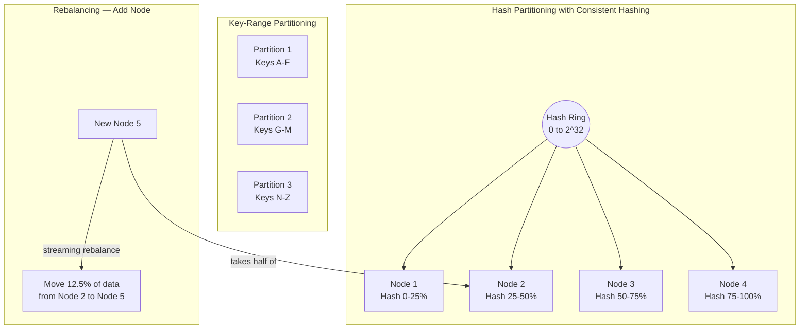

# Partitioning and Sharding

## Category

DDIA — Distributed Data (Chapter 6)

## Context

When a dataset is too large for a single node, or throughput exceeds what a single machine can handle, data must be **partitioned** (also called **sharding**) across multiple nodes. Each node is responsible for a subset of the data.

The goal is to spread load evenly — both data volume and query throughput. A partition scheme that leaves all hot data on one node has gained nothing from the distribution.

### Partitioning Strategies

| Strategy | How | Pros | Cons |
|---|---|---|---|
| **Key range** | Sort all keys; assign contiguous ranges to partitions | Easy range scans; sequential writes to adjacent partitions | Hot spots if writes cluster (e.g., timestamp keys) |
| **Hash of key** | Hash the key; assign hash ranges to partitions | Distributes load evenly; eliminates hot spots | Range queries impossible (must scatter-gather all partitions) |
| **Consistent hashing** | Keys and nodes on a hash ring; each node owns the keys between it and the previous node | Minimal rebalancing when nodes added/removed | Non-uniform distribution without virtual nodes |
| **Compound key** | Hash first component; sort second component | Even distribution of users; range scan within user | More complex routing |

**The hot spot problem**: If many writes go to the same key (a celebrity user in a social app, a popular product in e-commerce), that partition is hot regardless of the number of partitions. Solution: add a random prefix to the key (scatter writes); at read time, query all prefixed variants and merge.

### Partitioning and Secondary Indexes

Secondary indexes don't map naturally to partitioning. Two approaches:

| Approach | How | Pros | Cons |
|---|---|---|---|
| **Document-partitioned (local index)** | Each partition maintains its own secondary index covering only its documents | Writes cheap (update local index only) | Reads must scatter-gather all partitions (expensive) |
| **Term-partitioned (global index)** | Secondary index itself is partitioned by the index term | Reads can target specific partitions | Writes must update multiple partitions (complex, often eventually consistent) |

## Pros

- Horizontal scalability: add nodes to increase capacity and throughput
- Fault isolation: a failed node loses only its partitions (if replicated, no data loss)
- Geographic distribution: place partitions close to users
- Parallel processing: batch jobs can process each partition independently

## Cons

- Cross-partition queries are expensive (scatter-gather; latency = slowest partition)
- Transactions across partitions are complex (require distributed protocol — see Chapter 7)
- Rebalancing (when nodes added/removed) is expensive and must be done carefully to avoid overloading nodes
- Hot spots are subtle and devastating; hard to detect before production

## Design Diagram



## Code Sample

### Consistent hashing with virtual nodes

```typescript
import { createHash } from 'crypto';

function md5(s: string): number {
  return parseInt(createHash('md5').update(s).digest('hex').slice(0, 8), 16);
}

export class ConsistentHashRing {
  private ring = new Map<number, string>(); // hash position → node
  private sorted: number[] = [];

  constructor(private virtualNodes = 150) {}

  addNode(nodeId: string) {
    for (let i = 0; i < this.virtualNodes; i++) {
      const hash = md5(`${nodeId}:${i}`);
      this.ring.set(hash, nodeId);
    }
    this.sorted = [...this.ring.keys()].sort((a, b) => a - b);
  }

  removeNode(nodeId: string) {
    for (let i = 0; i < this.virtualNodes; i++) {
      this.ring.delete(md5(`${nodeId}:${i}`));
    }
    this.sorted = [...this.ring.keys()].sort((a, b) => a - b);
  }

  // Find the node responsible for a given key
  getNode(key: string): string {
    if (this.ring.size === 0) throw new Error('Ring is empty');
    const hash = md5(key);
    // Find the first node clockwise from this hash position
    const idx = this.sorted.findIndex(h => h >= hash);
    const position = idx === -1 ? this.sorted[0] : this.sorted[idx]; // wrap around
    return this.ring.get(position)!;
  }

  // For replication: get the next N distinct nodes from the key position
  getReplicaNodes(key: string, replicas: number): string[] {
    const hash = md5(key);
    const idx = this.sorted.findIndex(h => h >= hash);
    const startIdx = idx === -1 ? 0 : idx;
    const nodes = new Set<string>();
    let i = 0;
    while (nodes.size < replicas && i < this.sorted.length) {
      const pos = this.sorted[(startIdx + i) % this.sorted.length];
      nodes.add(this.ring.get(pos)!);
      i++;
    }
    return [...nodes];
  }
}
```

### Hot spot mitigation — key salting

```typescript
const HOT_SPOT_SALT_RANGE = 100; // number of write shards for hot keys

// Write: distribute writes for a celebrity user across N partitions
export async function writeHotKey(userId: string, data: object, db: ShardedDB) {
  const shard = Math.floor(Math.random() * HOT_SPOT_SALT_RANGE);
  const key = `${userId}:${shard}`; // e.g. "celebrity_123:42"
  await db.set(key, data);
}

// Read: must query all shards and merge
export async function readHotKey(userId: string, db: ShardedDB): Promise<object[]> {
  const keys = Array.from(
    { length: HOT_SPOT_SALT_RANGE },
    (_, i) => `${userId}:${i}`
  );
  const results = await Promise.all(keys.map(k => db.get(k)));
  return results.filter(Boolean) as object[];
}
```

### Scatter-gather query with partial failure handling

```typescript
export async function scatterGather<T>(
  partitions: Partition[],
  query: (partition: Partition) => Promise<T[]>,
  maxFailures = 0
): Promise<T[]> {
  const results = await Promise.allSettled(partitions.map(query));

  const succeeded: T[] = [];
  let failures = 0;

  for (const result of results) {
    if (result.status === 'fulfilled') {
      succeeded.push(...result.value);
    } else {
      failures++;
      if (failures > maxFailures) {
        throw new Error(`Too many partition failures: ${failures}`);
      }
    }
  }

  return succeeded;
}

// Usage — search across all partitions
const allResults = await scatterGather(
  partitionClients,
  async (p) => p.search({ query: 'running shoes', category: 'sports' }),
  maxFailures = 1 // allow 1 partition to be down without failing the query
);
```

## Key Patterns

### Rebalancing Strategies

| Strategy | How | Risk |
|---|---|---|
| **Fixed number of partitions** | Create 1000 partitions for 10 nodes (100/node); when a node is added, reassign partitions — no splitting required | Over-partition count is wasteful; under-set limits future growth |
| **Dynamic partitioning** | Split partition when it exceeds size threshold; merge when it shrinks | Automatic; no manual sizing; startup has only 1 partition (initial bottleneck) |
| **Partitioning + replication separately** | Cassandra model: partition independently of replication | Most flexible; standard approach for distributed databases |

### Routing

Who decides which partition serves a query?

| Model | How | Example |
|---|---|---|
| **Client-side routing** | Client knows the partition map and routes directly | Redis Cluster |
| **Routing tier** | Separate router/proxy; clients go through it | Kafka (broker handles routing); MongoDB mongos |
| **Server-side forwarding** | Any server can receive any request; forwards internally | Cassandra gossip |

### Compound Key Pattern (Cassandra)

```
Partition key: user_id (determines which node)
Clustering key: created_at (determines order within partition)

Table: user_events (user_id, created_at, event_type, payload)
→ All events for a user are on the same partition (locality)
→ Events are sorted by time within the partition (efficient range scans)
→ "Get last 100 events for user X" = single-partition query (fast)
```

## Related Patterns

- [05 — Replication](./05-replication.md) — Each partition is replicated across nodes
- [07 — Transactions](./07-transactions.md) — Cross-partition transactions are hard
- [03 — Storage and Retrieval](./03-storage-retrieval.md) — Partitioning interacts with index design
- [10 — Batch Processing](./10-batch-processing.md) — Partitioning enables parallel batch jobs
