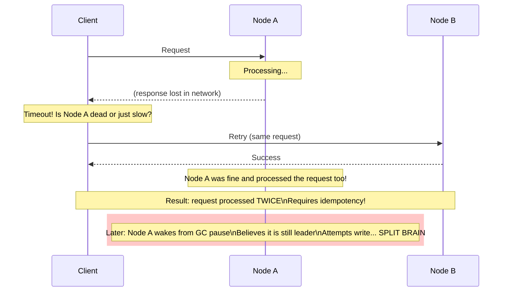

# The Trouble with Distributed Systems

## Category

DDIA — Distributed Data (Chapter 8)

## Context

In a single-node system, a failure is relatively simple: the machine either works or it doesn't. A distributed system introduces partial failures — some parts work while others don't — and there is no clean way to detect which.

This chapter is about being honest with yourself about what can go wrong. Distributed systems are not just "two computers talking" — they are systems where:
- The network can lose packets, delay them indefinitely, or duplicate them
- Clocks can drift, jump, and lie
- Processes can pause for seconds and then resume, unaware time has passed
- A node that is alive may believe incorrect things about the world

### Networks: Everything Can Go Wrong

When you send a packet over a network, the possible outcomes include all of the following:
1. Packet lost (your request never arrives)
2. Packet delayed (waiting in a queue; will arrive later)
3. Remote node failed (crashed before processing)
4. Remote node paused temporarily (GC pause, then processes the old request)
5. Response lost (request processed; reply dropped)
6. Response delayed (reply stuck in network; will arrive later)

**The fundamental problem: from the sender's perspective, these are indistinguishable.** You send a request and wait. After a timeout, you don't know if:
- The request was never received
- The request was received but the server crashed before responding
- The request was processed successfully but the response was lost

**Network timeouts are the only mechanism** — but choosing a timeout is a trade-off: too short → false positives (declare alive nodes dead); too long → slow failure detection.

### Clocks: Unreliable and Non-Monotonic

| Clock Type | Monotonic | Subject to NTP jumps | Use for |
|---|---|---|---|
| **Wall-clock (`Date.now()`)** | ❌ No | ✅ Yes — can jump backward | Timestamps, TTL, human-readable time |
| **Monotonic clock (`process.hrtime.bigint()`)** | ✅ Yes | ❌ No | Elapsed time, timeouts, measuring durations |

**Never use wall-clock time to measure elapsed duration** (e.g., timeouts, rate limiting windows). NTP can slew the clock backward. Use monotonic time.

**Never rely on timestamps for ordering events across nodes.** Two nodes with NTP-synchronized clocks can still have clock skew of hundreds of milliseconds. A "later" timestamp does not mean it happened after.

### Process Pauses

A running process can be paused for extended periods and not know it:
- **GC stop-the-world**: JVM, Go GC — can pause for seconds
- **VM live migration**: cloud hypervisor suspends a VM and moves it to another host
- **OS context switching + disk swap**: process swapped to disk during heavy memory pressure
- **Laptop lid close / hibernate**: process resumes after minutes or hours

A node that resumes from a pause has no idea time passed. If it was a leader before the pause, it may still believe it is the leader — even though a new leader has been elected in its absence.

**Solution: fencing tokens.** Every time a lock is granted, issue a monotonically increasing token. Storage must reject writes with a token lower than the highest seen.

## Pros

- Understanding these constraints allows design of systems that remain correct under failure
- Timeout-based failure detection is simple and universal
- Monotonic clocks are safe for all elapsed-time measurements in a single process
- Fencing tokens prevent split-brain write conflicts

## Cons

- You can never fully know the state of a remote node (no reliable failure detection)
- You cannot rely on clocks for distributed ordering — requires logical clocks or consensus
- Handling all partial failure modes makes code significantly more complex
- The "worst case" network/clock behaviour is rare in practice — over-engineering for it wastes resources

## Design Diagram



## Code Sample

### Timeout with explicit unknown-state handling

```typescript
type RequestState = 'success' | 'failure' | 'unknown';

interface RequestResult<T> {
  state: RequestState;
  data?: T;
  error?: Error;
}

async function requestWithTimeout<T>(
  fn: () => Promise<T>,
  timeoutMs: number
): Promise<RequestResult<T>> {
  const controller = new AbortController();
  const timer = setTimeout(() => controller.abort(), timeoutMs);

  try {
    const data = await fn(); // pass signal to fetch or your HTTP client
    return { state: 'success', data };
  } catch (err: any) {
    if (err.name === 'AbortError') {
      // UNKNOWN — request may or may not have been processed
      // Do NOT assume failure. May need to query the server for status.
      return { state: 'unknown', error: new Error(`Request timed out after ${timeoutMs}ms`) };
    }
    // Definite failure (connection refused, etc.)
    return { state: 'failure', error: err };
  } finally {
    clearTimeout(timer);
  }
}

// Caller must handle the unknown state explicitly
async function transferFunds(from: string, to: string, amount: number): Promise<void> {
  const idempotencyKey = crypto.randomUUID(); // makes retries safe
  const result = await requestWithTimeout(
    () => fetch(`/api/transfer`, {
      method: 'POST',
      body: JSON.stringify({ from, to, amount, idempotencyKey }),
      headers: { 'Content-Type': 'application/json' }
    }).then(r => r.json()),
    5000
  );

  if (result.state === 'success') return;
  if (result.state === 'failure') throw result.error;
  if (result.state === 'unknown') {
    // Poll for status using the idempotency key — do not re-submit blindly
    await pollForTransferStatus(idempotencyKey);
  }
}
```

### Monotonic clock for elapsed time

```typescript
// WRONG: wall-clock can jump backward (NTP adjustment)
function badTimeout(start: number, limitMs: number): boolean {
  return Date.now() - start > limitMs; // NTP can make this negative or skip ahead
}

// CORRECT: monotonic clock only measures real elapsed time
function elapsed(startNs: bigint): number {
  return Number(process.hrtime.bigint() - startNs) / 1_000_000; // convert to ms
}

class LeaderLease {
  private readonly durationMs: number;
  private grantedAt: bigint | null = null;
  private fencingToken: number = 0;

  constructor(durationMs: number) {
    this.durationMs = durationMs;
  }

  grant(): number {
    this.grantedAt = process.hrtime.bigint();
    this.fencingToken++; // monotonically increasing
    return this.fencingToken;
  }

  isValid(): boolean {
    if (!this.grantedAt) return false;
    return elapsed(this.grantedAt) < this.durationMs;
  }

  getToken(): number {
    return this.fencingToken;
  }
}

// Storage rejects writes with stale fencing tokens
class FencedStorage {
  private maxSeenToken = 0;
  private data = new Map<string, string>();

  write(key: string, value: string, fencingToken: number): boolean {
    if (fencingToken < this.maxSeenToken) {
      // Stale token — this node was previously the leader but has been superseded
      console.warn(`Rejecting write: token ${fencingToken} < max seen ${this.maxSeenToken}`);
      return false;
    }
    this.maxSeenToken = fencingToken;
    this.data.set(key, value);
    return true;
  }
}
```

## Key Patterns

### Response to Each Network Failure Mode

| Failure mode | Detection | Response |
|---|---|---|
| Request lost | Timeout | Retry with idempotency key; handle `unknown` state |
| Response lost | Timeout | Same — server processed it; check status before retry |
| Server crash | Timeout + health check | Route to replica; idempotency key avoids double-processing |
| Server paused | Timeout expires faster than GC | Treat as crashed; fencing token prevents stale-leader writes |
| Network partition | Timeout + gossip failure | Reduce traffic to that node; circuit breaker |

### Clock Usage Rules

```
✅ Monotonic clock — measure timeouts, durations, SLO latencies (all within one process)
✅ Wall clock — human-readable timestamps, TTL/expiry (accept some drift)
❌ Wall clock — ordering events across nodes (use Lamport timestamps or vector clocks)
❌ Wall clock — distributed lock expiry (use NTP-synced timestamps with uncertainty bounds + Spanner-style TrueTime)
```

### Fencing Token Protocol

```
1. Client acquires lock → receives token N
2. Client makes write to storage, includes token N
3. If N >= storage's max seen token → accept write, update max
4. If N < storage's max seen token → reject write (client is stale ex-leader)
```

## Related Patterns

- [09 — Consistency and Consensus](./09-consistency-consensus.md) — How consensus handles these failure modes
- [07 — Transactions](./07-transactions.md) — ACID guarantees and where they break down in distributed settings
- [05 — Replication](./05-replication.md) — Replication lag and split-brain
- [14 — Distributed Transactions](./14-distributed-transactions.md) — 2PC and Saga patterns
