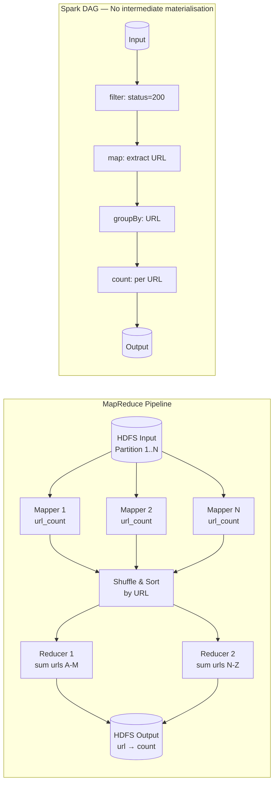

# Batch Processing

## Category

DDIA — Derived Data (Chapter 10)

## Context

Batch processing reads a bounded set of data, processes it, and produces an output (a derived dataset). Unlike online request handling (OLTP), batch jobs:
- Are not triggered by a user waiting for a response
- Can take minutes to hours to complete
- Prioritise throughput over latency
- Are naturally retryable (same input → same output)

### Unix Philosophy as a Mental Model

Unix pipes are the simplest batch processing system. Each tool does one thing; tools are connected by pipes with a uniform interface (stdin/stdout of byte streams). This is exactly the mental model behind MapReduce and modern dataflow engines.

```bash
cat /var/log/nginx.log \
  | awk '{print $7}' \          # extract URL
  | sort \                      # sort for grouping
  | uniq -c \                   # count occurrences
  | sort -rn \                  # sort by frequency
  | head -5                     # top 5
```

### MapReduce

MapReduce generalises the Unix pipe model to distributed clusters. It was Google's answer to processing petabytes of web crawl data.

**Two phases:**
1. **Map**: apply a function to each input record → emit (key, value) pairs
2. **Reduce**: group by key; apply an aggregation function to values with the same key

The **shuffle/sort** between map and reduce is the expensive part: all records with the same key must be sorted together before the reducer runs.

| Phase | Input | Function | Output |
|---|---|---|---|
| **Map** | One input record | Emit 0..N (key, value) pairs | Intermediate (key, value) pairs |
| **Shuffle/Sort** | All (key, value) pairs | Sort by key; send to reducer | Sorted (key, list-of-values) |
| **Reduce** | All values for one key | Aggregate | Output records per key |

### Joins in Batch Processing

Joins are the most expensive batch operation (requires data co-location). Three strategies:

| Join type | Mechanism | When to use |
|---|---|---|
| **Sort-merge join** | Both sides sorted by join key; merge in a sorted scan | Large-scale inputs; both sides too big for memory |
| **Broadcast hash join** | Small side broadcast to all workers; large side streamed | One table fits in memory (e.g., dimension table join) |
| **Partitioned hash join** | Both sides partitioned by join key; hash join within each partition | Both sides large; partition eliminates need for full sort |

### Modern Dataflow Engines (Spark, Flink in batch mode)

Hadoop MapReduce materialises intermediate results to HDFS after every step. Spark/Flink keep data in memory and chain operators into a DAG, avoiding unnecessary disk I/O.

| Feature | Hadoop MapReduce | Spark / Flink |
|---|---|---|
| Intermediate data | Written to HDFS (disk) | In-memory / RDD / pipelined |
| Recovery | Re-run failed map/reduce steps | Re-run from last checkpoint/lineage |
| Latency | Minutes (disk I/O overhead) | Seconds (memory pipelined) |
| Complex pipelines | Multiple separate jobs | Single DAG with lazy evaluation |
| Language API | Java (verbose) | Scala/Python/Java/SQL |

## Pros

- Batch jobs produce reliable, auditable derived datasets (search indexes, ML features, reports)
- Fault tolerance is simple: re-run the job from scratch (or from a checkpoint)
- Batch systems can be scaled by adding workers; no coordination required
- Input data is immutable → pure functions → deterministic output

## Cons

- High latency: results may be hours old (not suitable for real-time use cases)
- Large jobs require substantial cluster resources
- Debugging and profiling distributed batch jobs is complex
- Skewed data (one reducer gets 90% of work) causes slow job completion

## Design Diagram



## Code Sample

### MapReduce pattern in TypeScript (conceptual)

```typescript
// Conceptual MapReduce — models the key abstractions

type KV<K, V> = { key: K; value: V };

function mapPhase<TInput, K, V>(
  inputs: TInput[],
  mapper: (input: TInput) => KV<K, V>[]
): KV<K, V>[] {
  return inputs.flatMap(mapper);
}

function shuffleAndSort<K, V>(kvPairs: KV<K, V>[]): Map<K, V[]> {
  const grouped = new Map<K, V[]>();
  // Sort by key first (MapReduce guarantees sorted delivery to reducer)
  const sorted = [...kvPairs].sort((a, b) =>
    String(a.key).localeCompare(String(b.key))
  );
  for (const { key, value } of sorted) {
    const list = grouped.get(key) ?? [];
    list.push(value);
    grouped.set(key, list);
  }
  return grouped;
}

function reducePhase<K, V, R>(
  shuffled: Map<K, V[]>,
  reducer: (key: K, values: V[]) => R
): Map<K, R> {
  const results = new Map<K, R>();
  for (const [key, values] of shuffled) {
    results.set(key, reducer(key, values));
  }
  return results;
}

// Example: word count
const documents = [
  'the cat sat on the mat',
  'the cat sat on the hat',
  'the cat in the hat'
];

const mapped = mapPhase(documents, doc =>
  doc.split(' ').map(word => ({ key: word, value: 1 }))
);

const shuffled = shuffleAndSort(mapped);

const wordCounts = reducePhase(shuffled, (word, ones) => ones.reduce((a, b) => a + b, 0));
// Map { 'the' => 6, 'cat' => 3, 'sat' => 2, 'on' => 2, ... }

console.log([...wordCounts.entries()].sort((a, b) => b[1] - a[1]).slice(0, 3));
```

### Broadcast hash join simulation

```typescript
// In Spark: df.join(broadcast(smallDf), 'key')
// In plain TypeScript:

interface Order { id: string; customerId: string; amount: number; }
interface Customer { id: string; name: string; country: string; }

function broadcastHashJoin(
  largeTable: Order[],          // too big to sort — streamed
  smallTable: Customer[]        // small enough to broadcast to all workers
): Array<Order & { customerName: string; country: string }> {
  // Build a hash map from the small table (broadcast phase)
  const customerMap = new Map<string, Customer>(
    smallTable.map(c => [c.id, c])
  );

  // Probe with each record from the large table (streaming phase)
  return largeTable.map(order => {
    const customer = customerMap.get(order.customerId);
    return {
      ...order,
      customerName: customer?.name ?? 'unknown',
      country: customer?.country ?? 'unknown'
    };
  }).filter(r => r.customerName !== 'unknown');
}
```

### Idempotent output pattern

```typescript
// Batch jobs must be safe to re-run. Output to a temporary location, then atomic rename.
import * as fs from 'fs';
import * as path from 'path';

async function writeBatchOutput(
  data: Record<string, number>[],
  outputPath: string
): Promise<void> {
  const tmpPath = `${outputPath}.tmp.${Date.now()}`;

  try {
    // Write to temp file
    fs.writeFileSync(tmpPath, JSON.stringify(data, null, 2));

    // Atomic rename — either old or new file exists, never partial
    fs.renameSync(tmpPath, outputPath);
  } catch (e) {
    // Clean up temp file on failure
    if (fs.existsSync(tmpPath)) fs.unlinkSync(tmpPath);
    throw e;
  }
}
```

## Key Patterns

### Handling Data Skew

| Problem | Symptom | Solution |
|---|---|---|
| Hot key (one reducer overwhelmed) | Single reducer runs 10x longer than others | Two-pass aggregation: partial aggregate per mapper first; combine results |
| Highly skewed join (one join key has 90% of rows) | One join task is enormous | Salt the hot key; replicate the small side for each salt value |
| Imbalanced partitions | Some workers idle, some overloaded | Re-partition after shuffle; use range partitioning on uniformly distributed column |

### Batch Processing Checklist

```
[ ] Input data is immutable — never modify source data
[ ] Output written atomically (temp file + rename or output to new dated partition)
[ ] Job is idempotent — can be re-run without side effects
[ ] Partial results not visible externally until job completes
[ ] Metrics captured: input records, output records, processing time, error count
[ ] Skew detection: log reducer input size; alert if P90/P50 > 3x
[ ] Distinguish between single-pass (complete data) and incremental (append-only new data) jobs
```

## Related Patterns

- [11 — Stream Processing](./11-stream-processing.md) — Streaming replaces batch for lower latency; same joins apply
- [12 — Derived Data Systems](./12-derived-data-systems.md) — Batch as part of Lambda architecture
- [13 — OLAP and Column Stores](./13-olap-column-stores.md) — Analytical queries on batch output data
- [03 — Storage and Retrieval](./03-storage-retrieval.md) — How batch output is stored and queried
