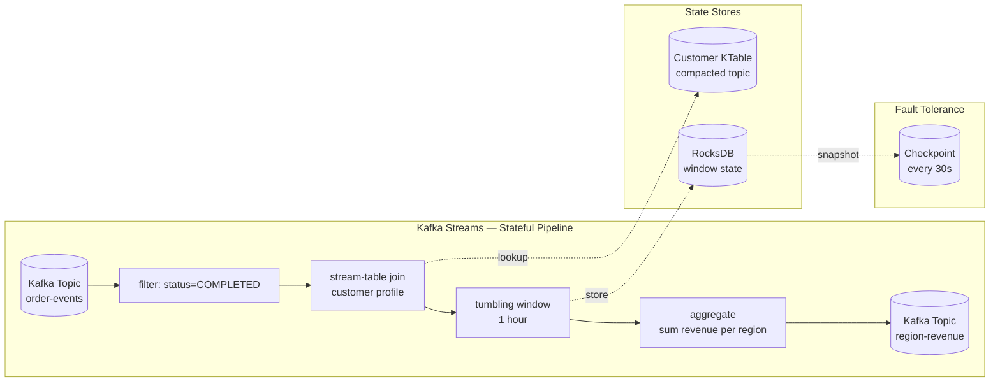

# Stream Processing

## Category

DDIA — Derived Data (Chapter 11)

## Context

Stream processing is batch processing done with unbounded (continuous) data. Instead of waiting for all data to be collected, stream processors respond to events as they arrive — enabling near-real-time derived views, alerts, and responses.

### Message Brokers vs Event Logs

There are two fundamentally different approaches to stream transport:

| Feature | Message Broker (RabbitMQ, ActiveMQ) | Event Log (Kafka, Kinesis, Pulsar) |
|---|---|---|
| **Retention** | Delete after consumer ACKs | Retain for configurable period (log) |
| **Replay** | ❌ Cannot replay consumed messages | ✅ Consumers can seek to any offset |
| **Consumer position** | Broker tracks delivery state | Consumer tracks its own offset |
| **Ordering** | Per-queue (not partitioned); no global order | Total order within a partition |
| **Consumer model** | Push (broker pushes to consumer) | Pull (consumer polls for new records) |
| **Scale** | Fewer consumers; broker is bottleneck | Many consumer groups; each independent |
| **Use case** | Task queues, work distribution | Event sourcing, audit logs, stream joins |

**Key insight**: an event log is like a database table that can only be appended to. Any consumer group can independently read from any position. This enables replaying and reprocessing history.

### Event Time vs Processing Time

| Time | What it measures | Problem |
|---|---|---|
| **Event time** | When the event occurred in the real world | Events arrive late (network delay, mobile offline sync); can be out of order |
| **Processing time** | When the event arrived at the processor | Always monotonically increasing; but doesn't reflect reality |

**Watermarks**: a watermark is a declaration: "I believe all events with timestamp < W have now arrived." Events that arrive after the watermark for their window are called **late data**.

**Window types:**

| Window | Definition | Example |
|---|---|---|
| **Tumbling** | Fixed size, non-overlapping | Revenue per hour |
| **Hopping** | Fixed size, overlapping (slides by step) | 5-min window every 1 min |
| **Session** | Gaps in activity close a window | User session (30-min inactivity = new session) |
| **Global** | One window over entire stream | Running total since system start |

### Stream Joins

| Join type | Description | Example |
|---|---|---|
| **Stream-stream** | Windowed join: two streams within a time window | Click + impression joined within 1 hour window |
| **Stream-table** | Stream side joins against a table (database or CDC changelog) | Enrich order events with current customer info |
| **Table-table** | Both sides materialised as tables; output is a materialised view | Order + customer → denormalised order view |

### Exactly-Once Semantics

| Delivery guarantee | Meaning | Failure behaviour |
|---|---|---|
| **At-most-once** | Deliver and forget; no retry | Events may be lost |
| **At-least-once** | Retry until ACK; may process twice | Duplicates possible; requires idempotent consumer |
| **Exactly-once** | Processed exactly once (no loss, no duplicate) | Requires idempotency OR atomic commit of offset + side effect |

**Kafka exactly-once**: transactions allow atomic write of output + commit of input offset. The consumer-processor-producer forms a transactional loop.

## Pros

- Real-time derived views: search indexes, dashboards, ML feature stores updated in seconds
- Event log (Kafka) enables replay — re-process all history to build a new derived view
- Stateful processing enables complex calculations (joins, aggregations) over continuous data
- Consumer groups are independent — adding a new consumer doesn't affect existing ones

## Cons

- Late data requires special handling (watermarks, allowed lateness, retractions)
- Stateful processors require state backends (RocksDB, in-memory) that need to be checkpointed
- Stream processing code is harder to test and debug than batch
- Exactly-once semantics have overhead; at-least-once + idempotency is simpler

## Design Diagram



## Code Sample

### Kafka consumer with at-least-once processing + idempotency

```typescript
// Using kafkajs — at-least-once delivery; idempotency on the consumer side
import { Kafka, Consumer, EachMessagePayload } from 'kafkajs';

const kafka = new Kafka({ brokers: ['localhost:9092'] });

interface OrderEvent {
  orderId: string;
  customerId: string;
  amount: number;
  status: string;
  eventTime: number; // Unix ms
}

// Idempotency store: track processed message IDs
const processedIds = new Set<string>(); // in production: persistent store (Redis, DB)

async function processOrderStream(): Promise<void> {
  const consumer = kafka.consumer({ groupId: 'revenue-aggregator' });
  await consumer.connect();
  await consumer.subscribe({ topic: 'order-events', fromBeginning: false });

  await consumer.run({
    // eachBatch gives more control over offset commits
    eachMessage: async ({ topic, partition, message }: EachMessagePayload) => {
      const key = `${topic}-${partition}-${message.offset}`; // unique message ID

      // Idempotent: skip if already processed
      if (processedIds.has(key)) {
        console.log(`Skipping duplicate: ${key}`);
        return;
      }

      const event: OrderEvent = JSON.parse(message.value!.toString());

      if (event.status === 'COMPLETED') {
        await updateRevenueAggregate(event);
      }

      // Mark as processed AFTER successful handling
      processedIds.add(key);
    }
  });
}

async function updateRevenueAggregate(event: OrderEvent): Promise<void> {
  // This should be idempotent — if called twice with same orderId, result is the same
  // Use INSERT ... ON CONFLICT DO NOTHING pattern
  console.log(`Processing order ${event.orderId}: £${event.amount}`);
}
```

### Tumbling window aggregation

```typescript
// In-process tumbling window (demonstration — use Kafka Streams or Flink in production)

interface WindowedAggregate {
  windowStart: number;
  windowEnd: number;
  key: string;
  sum: number;
  count: number;
}

class TumblingWindowAggregator {
  private readonly windowMs: number;
  private windows = new Map<string, WindowedAggregate>();

  constructor(windowMs: number) {
    this.windowMs = windowMs;
  }

  // Returns the window start for a given event time
  private windowStart(eventTime: number): number {
    return Math.floor(eventTime / this.windowMs) * this.windowMs;
  }

  add(key: string, value: number, eventTime: number): void {
    const start = this.windowStart(eventTime);
    const windowKey = `${key}:${start}`;
    const existing = this.windows.get(windowKey) ?? {
      windowStart: start,
      windowEnd: start + this.windowMs,
      key,
      sum: 0,
      count: 0
    };
    existing.sum += value;
    existing.count++;
    this.windows.set(windowKey, existing);
  }

  // Emit and evict windows that are beyond the watermark
  emitBefore(watermark: number): WindowedAggregate[] {
    const emitted: WindowedAggregate[] = [];
    for (const [wKey, window] of this.windows) {
      if (window.windowEnd <= watermark) {
        emitted.push(window);
        this.windows.delete(wKey);
      }
    }
    return emitted;
  }
}

// Example usage
const agg = new TumblingWindowAggregator(60 * 60 * 1000); // 1-hour windows

const events = [
  { key: 'region:EU', value: 150, eventTime: Date.now() - 3600000 },
  { key: 'region:EU', value: 200, eventTime: Date.now() - 3600000 + 1000 },
  { key: 'region:US', value: 500, eventTime: Date.now() - 3600000 + 2000 }
];

for (const e of events) agg.add(e.key, e.value, e.eventTime);

// Watermark: current time - 10 minutes (allow up to 10 minutes late)
const watermark = Date.now() - 10 * 60 * 1000;
const results = agg.emitBefore(watermark);
console.log(results);
// [{ key: 'region:EU', sum: 350, count: 2, ... }, { key: 'region:US', sum: 500, count: 1, ... }]
```

### Stream-table join (enrich events with current state)

```typescript
// KTable semantics: subscribe to a compacted topic; maintain a local lookup map
// In production: use RocksDB-backed KTable in Kafka Streams

class KTable<V> {
  private store = new Map<string, V>();

  update(key: string, value: V | null): void {
    if (value === null) {
      this.store.delete(key); // tombstone = delete
    } else {
      this.store.set(key, value); // upsert
    }
  }

  lookup(key: string): V | undefined {
    return this.store.get(key);
  }
}

interface CustomerProfile { name: string; tier: 'standard' | 'premium'; }
interface EnrichedOrder extends OrderEvent { customerName: string; tier: string; }

const customerTable = new KTable<CustomerProfile>();

// In production: consume CDC changelog for customer table
customerTable.update('cust-1', { name: 'Alice', tier: 'premium' });
customerTable.update('cust-2', { name: 'Bob', tier: 'standard' });

function enrichOrder(event: OrderEvent): EnrichedOrder {
  const profile = customerTable.lookup(event.customerId);
  return {
    ...event,
    customerName: profile?.name ?? 'unknown',
    tier: profile?.tier ?? 'standard'
  };
}
```

## Key Patterns

### Exactly-once Options

| Approach | How | Trade-off |
|---|---|---|
| **Idempotent consumer** | Track processed message IDs; skip duplicates | Extra storage; works for at-least-once |
| **Kafka transactions** | Atomic: write output + commit offset in one transaction | Kafka producer + consumer in same transaction; slightly lower throughput |
| **Idempotent writes** | Upsert by natural key (`ON CONFLICT DO UPDATE`) | Simplest; requires natural key in the event |

### Stream Processing Best Practices

```
[ ] Use event time (not processing time) for windowing
[ ] Set watermarks conservatively (10-30 min for mobile events)
[ ] Handle late data explicitly: allow_lateness OR retract + re-emit
[ ] Checkpoint state regularly (RocksDB snapshot every 30-60 seconds)
[ ] Idempotent writes: all sinks must tolerate duplicate processing
[ ] Group by partition key to keep related events on same processor (state locality)
[ ] Monitor consumer group lag: trigger alerts at N minutes behind
```

## Related Patterns

- [10 — Batch Processing](./10-batch-processing.md) — Joins and aggregations; same concepts in bounded vs unbounded data
- [12 — Derived Data Systems](./12-derived-data-systems.md) — Stream as the Kappa architecture backbone
- [04 — Encoding and Evolution](./04-encoding-evolution.md) — Avro schema evolution for stream events
- [09 — Consistency and Consensus](./09-consistency-consensus.md) — Exactly-once and distributed transactions in Kafka
