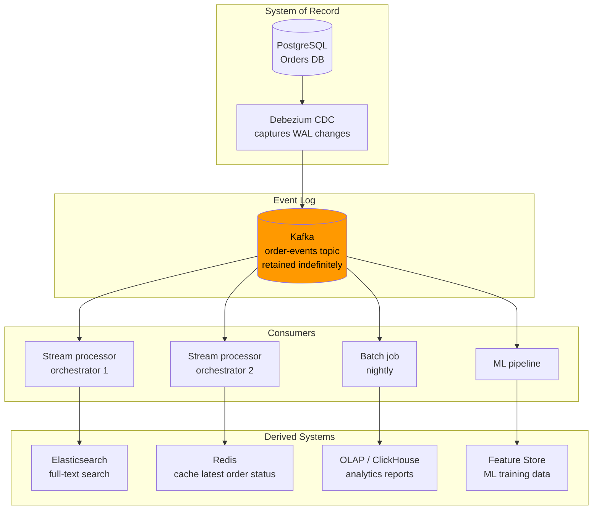

# Derived Data Systems

## Category

DDIA — Derived Data (Chapter 12)

## Context

DDIA Chapter 12 argues that the future of data systems is not one database that does everything well. Instead, it is composing specialised systems — each best at one thing — and keeping them in sync through a reliable integration layer.

### System of Record vs Derived Data

| Concept | Definition | Example |
|---|---|---|
| **System of record** | The authoritative source of truth; changes originate here | PostgreSQL transactional DB (orders, users) |
| **Derived data** | Computed from the system of record; can be deleted and recreated | Elasticsearch index, Redis cache, reporting DB |
| **Log** | Ordered, append-only record of changes; the integration mechanism | Kafka event log, database WAL (Write-Ahead Log) |

**Key insight**: if the event log is durable and replayable, any derived dataset can be rebuilt from scratch by replaying the log. The log is the source of truth for derived data; the derived data is a view.

### Lambda Architecture

Lambda architecture was a response to the tension between batch (accurate but slow) and stream (fast but approximate).

```
                 ┌──────────────────────────────┐
Source events ──►│ Batch layer (recalculate all) │──► Batch views
     │           └──────────────────────────────┘         │
     │                                                     ▼
     │           ┌──────────────────────────────┐   ┌──────────────┐
     └──────────►│ Speed layer (real-time delta) │──►│ Serving layer│◄── Query
                 └──────────────────────────────┘   └──────────────┘
```

| Layer | Responsibility | Technology |
|---|---|---|
| **Batch layer** | Recompute all historical data periodically | Spark, Hadoop MapReduce |
| **Speed layer** | Compute incremental real-time updates | Kafka Streams, Flink, Storm |
| **Serving layer** | Merge batch + speed views; answer queries | Cassandra, HBase, Druid |

**Problems with Lambda:**
- Logic must be written twice (batch + stream versions must produce the same result)
- Merging batch and speed views in the serving layer is complex
- Operational complexity: two separate systems to maintain

### Kappa Architecture

Kappa architecture replaces both batch and speed layers with a single stream processor. Historical data is reprocessed by replaying from the beginning of the log.

```
Source events ──► Kafka (log, retained) ──► Stream processor ──► Serving store ──► Query
                        │
                        └──► Re-process (new version): seek to offset 0; write to new output table
```

| Feature | Lambda | Kappa |
|---|---|---|
| Processing layers | Two (batch + speed) | One (stream only) |
| Historical reprocessing | Batch layer runs periodically | Replay event log from offset 0 |
| Logic duplication | Yes — must write batch + stream code | No — single codebase |
| Operational complexity | High | Lower |
| Best for | Highly complex batch aggregations | Event-driven systems with Kafka |

### Unbundling Databases

Traditional databases bundle storage, indexing, query execution, caching, and replication together. The "unbundled" approach separates these concerns:

| Concern | Traditional DB | Unbundled equivalent |
|---|---|---|
| **Storage** | DB files | S3 / HDFS / object store |
| **Indexing** | B-tree, GiST | Elasticsearch, Algolia |
| **Queries** | SQL engine | Presto, BigQuery, Athena |
| **Caching** | Buffer pool | Redis, Memcached |
| **Replication** | WAL shipping | Kafka CDC (Debezium) |
| **Full-text search** | pg_trgm | Elasticsearch |

The event log (Kafka) is the glue: changes propagate from the system of record to all derived systems through CDC events.

## Pros

- Derived data can always be rebuilt from the log — no permanent data loss
- Specialised systems outperform general-purpose DBs for their specific use case
- Kappa architecture reduces complexity vs Lambda by eliminating the batch layer
- Event log (Kafka) decouples producers and consumers; any new consumer can replay history

## Cons

- Multiple systems to operate and keep in sync — operational overhead is real
- Eventual consistency between system of record and derived stores — applications must handle lag
- Reprocessing historical data requires sufficient log retention (can be TBs)
- Debugging cross-system data issues is harder than a single DB

## Design Diagram



## Code Sample

### Event log + projection rebuild pattern (Kappa)

```typescript
// Kappa architecture: all state is derived from replaying the event log
// Any "view" (DB table, cache, index) can be recreated by replaying from offset 0

interface DomainEvent {
  id: string;
  type: string;
  aggregateId: string;
  payload: Record<string, unknown>;
  occurredAt: number;
}

// Projection: a function that builds a read model from events
type Projection<T> = {
  init: () => T;
  apply: (state: T, event: DomainEvent) => T;
};

// Example: order summary projection
interface OrderSummary {
  id: string;
  status: string;
  total: number;
  items: string[];
  updatedAt: number;
}

const orderSummaryProjection: Projection<Map<string, OrderSummary>> = {
  init: () => new Map(),
  apply: (state, event) => {
    const updated = new Map(state);
    switch (event.type) {
      case 'ORDER_CREATED': {
        const { orderId, total, items } = event.payload as any;
        updated.set(orderId, { id: orderId, status: 'pending', total, items, updatedAt: event.occurredAt });
        break;
      }
      case 'ORDER_SHIPPED': {
        const existing = updated.get(event.aggregateId);
        if (existing) updated.set(event.aggregateId, { ...existing, status: 'shipped', updatedAt: event.occurredAt });
        break;
      }
      case 'ORDER_CANCELLED': {
        const existing = updated.get(event.aggregateId);
        if (existing) updated.set(event.aggregateId, { ...existing, status: 'cancelled', updatedAt: event.occurredAt });
        break;
      }
    }
    return updated;
  }
};

// Rebuild any projection from a stream of events (replay from offset 0)
function buildProjection<T>(
  events: DomainEvent[],
  projection: Projection<T>
): T {
  return events.reduce(projection.apply, projection.init());
}

// Example events
const events: DomainEvent[] = [
  { id: 'e1', type: 'ORDER_CREATED', aggregateId: 'ord-1', payload: { orderId: 'ord-1', total: 150, items: ['item-a', 'item-b'] }, occurredAt: 1700000000000 },
  { id: 'e2', type: 'ORDER_SHIPPED', aggregateId: 'ord-1', payload: {}, occurredAt: 1700003600000 },
];

const view = buildProjection(events, orderSummaryProjection);
console.log(view.get('ord-1')); // { id: 'ord-1', status: 'shipped', total: 150, ... }
```

### CDC pipeline: Debezium → Kafka → Elasticsearch sync

```typescript
// Consume CDC events from Kafka and sync to Elasticsearch
import { Kafka } from 'kafkajs';

interface DebeziumEnvelope<T> {
  before: T | null;
  after: T | null;
  op: 'c' | 'u' | 'd' | 'r'; // create, update, delete, read (snapshot)
  source: { ts_ms: number; table: string };
}

async function syncOrdersToElasticsearch(): Promise<void> {
  const kafka = new Kafka({ brokers: ['localhost:9092'] });
  const consumer = kafka.consumer({ groupId: 'es-sync' });

  await consumer.connect();
  await consumer.subscribe({ topic: 'db.public.orders' }); // Debezium topic format

  await consumer.run({
    eachMessage: async ({ message }) => {
      const envelope: DebeziumEnvelope<Record<string, unknown>> =
        JSON.parse(message.value!.toString());

      const { op, after, before } = envelope;

      if (op === 'c' || op === 'u' || op === 'r') {
        // Upsert into Elasticsearch
        await indexDocument('orders', String(after!['id']), after!);
      } else if (op === 'd') {
        // Delete from Elasticsearch
        await deleteDocument('orders', String(before!['id']));
      }
    }
  });
}

async function indexDocument(index: string, id: string, doc: unknown): Promise<void> {
  await fetch(`http://localhost:9200/${index}/_doc/${id}`, {
    method: 'PUT',
    body: JSON.stringify(doc),
    headers: { 'Content-Type': 'application/json' }
  });
}

async function deleteDocument(index: string, id: string): Promise<void> {
  await fetch(`http://localhost:9200/${index}/_doc/${id}`, { method: 'DELETE' });
}
```

## Key Patterns

### Derived Data Design Rules

```
1. Always design for rebuildability: derived data can always be discarded and reconstructed
2. The log is the truth: system of record → log → derived views (not the other way)
3. Never write back from derived to source: Elasticsearch should not write to PostgreSQL
4. Tolerate lag: consumers must handle the fact that derived data may be seconds behind
5. Versioned rebuilds: write new projections to new tables; switch over atomically
```

### Architecture Decision: Lambda vs Kappa vs Direct CDC

| Criterion | Lambda | Kappa | Direct CDC |
|---|---|---|---|
| Latency requirements | Mixed (reports: batch; dashboard: realtime) | Seconds | Seconds |
| Historical reprocessing | Complex batch jobs | Log replay | Full rebuild needed |
| Codebase complexity | High (two implementations) | Medium | Low |
| Technology investment | High (Spark + Flink + Cassandra) | Medium (Kafka + Flink) | Low (Debezium + target store) |
| Best for | Large data teams; complex aggregations | Event-driven microservices | Simple sync (DB → search) |

## Related Patterns

- [11 — Stream Processing](./11-stream-processing.md) — The Kappa architecture stream processor
- [10 — Batch Processing](./10-batch-processing.md) — The Lambda architecture batch layer
- [15 — Data Architecture Patterns](./15-data-architecture-patterns.md) — Event sourcing + CQRS as a data architecture
- [05 — Replication](./05-replication.md) — CDC leverages DB replication log (WAL)
