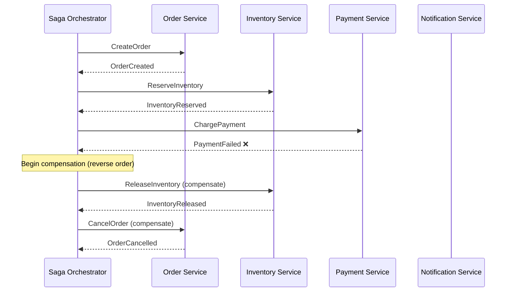

# Distributed Transactions

## Category

DDIA — Distributed Data (Chapter 7 extended + Chapter 9)

## Context

A distributed transaction spans multiple nodes, databases, or services. It attempts to preserve ACID guarantees across a distributed system — the hardest problem in distributed systems engineering.

### Two-Phase Commit (2PC)

2PC is the classical protocol for achieving atomicity across multiple participants (databases, message brokers). It introduces a **coordinator** that orchestrates the commit decision.

**Phase 1 — Prepare:**
1. Coordinator sends `PREPARE` to all participants
2. Each participant checks if it can commit; writes to its WAL; responds `YES` or `NO`
3. Once a participant sends `YES`, it can no longer unilaterally abort

**Phase 2 — Commit/Abort:**
4. If all participants voted `YES` → coordinator sends `COMMIT` to all
5. If any participant voted `NO` → coordinator sends `ABORT` to all
6. Participants execute the commit or abort and release locks

**The fundamental problem**: 2PC is a **blocking** protocol. If the coordinator fails after participants have voted `YES` but before sending the `COMMIT` message:
- Participants are **in-doubt** — they cannot proceed without the coordinator
- Resources (locks, rows) remain locked until the coordinator recovers
- System is unavailable for writes to those rows

This is why 2PC is called "Two-Phase, yet three-point-of-failure".

### XA Transactions

XA is a standard interface for 2PC across heterogeneous resource managers (RDBMS, JMS message brokers). Java EE application servers and JTA implement XA.

**Problem**: XA requires the application/coordinator to hold a live connection to all participants throughout the transaction. Long transactions, high latency, and coordinator failures lead to in-doubt transactions that can last for days.

### Saga Pattern

Saga is an alternative to 2PC that avoids distributed locking. A saga is a sequence of **local transactions**, each publishing an event/message that triggers the next. If any step fails, **compensating transactions** are executed in reverse order.

| Feature | Two-Phase Commit | Saga |
|---|---|---|
| **Atomicity** | Strong (same as ACID) | Eventual (compensations may fail too) |
| **Blocking** | Yes — locks held across network round trips | No — each step commits immediately |
| **Availability** | Low — coordinator failure = blocked | High — each service is autonomous |
| **Complexity** | Protocol complexity | Business logic complexity (write compensations) |
| **Best for** | Single DB + message broker (XA) | Cross-service workflows (microservices) |

**Saga implementations:**

| Style | Mechanism | Pros | Cons |
|---|---|---|---|
| **Choreography** | Each service reacts to events and emits events | No central coordinator; loose coupling | Hard to trace; complex to reason about |
| **Orchestration** | Central orchestrator sends commands to each service | Clear flow; easy to trace; easier compensation | Orchestrator is a central dependency |

## Pros

- 2PC provides strong atomicity guarantees — suitable for financial operations on one DB + one broker
- Sagas allow cross-service workflows without distributed locking — much higher availability
- Orchestrated sagas are auditable and traceable — the orchestrator holds the full saga state
- Idempotency keys make saga steps safe to retry

## Cons

- 2PC is blocking — coordinator failure leaves in-doubt transactions holding locks
- Sagas provide only eventual consistency — an external observer can see partial state mid-saga
- Writing compensating transactions correctly is hard — they must be idempotent and handle all failure modes
- Saga orchestrators can become complex if workflows have many conditional branches

## Design Diagram



## Code Sample

### Saga Orchestrator implementation

```typescript
type SagaStepResult = { success: true } | { success: false; error: string };

interface SagaStep<TState> {
  name: string;
  execute: (state: TState) => Promise<SagaStepResult>;
  compensate: (state: TState) => Promise<void>;
}

interface SagaExecution<TState> {
  sagaId: string;
  state: TState;
  completedSteps: string[];
  status: 'running' | 'completed' | 'compensating' | 'failed';
}

class SagaOrchestrator<TState> {
  constructor(
    private readonly steps: SagaStep<TState>[],
    private readonly persistState: (exec: SagaExecution<TState>) => Promise<void>
  ) {}

  async execute(initialState: TState): Promise<TState> {
    const execution: SagaExecution<TState> = {
      sagaId: crypto.randomUUID(),
      state: initialState,
      completedSteps: [],
      status: 'running'
    };

    await this.persistState(execution);

    for (const step of this.steps) {
      console.log(`[${execution.sagaId}] Executing step: ${step.name}`);
      const result = await step.execute(execution.state);

      if (!result.success) {
        console.error(`[${execution.sagaId}] Step ${step.name} failed: ${result.error}`);
        execution.status = 'compensating';
        await this.compensate(execution);
        throw new Error(`Saga failed at step ${step.name}: ${result.error}`);
      }

      execution.completedSteps.push(step.name);
      await this.persistState(execution);
    }

    execution.status = 'completed';
    await this.persistState(execution);
    return execution.state;
  }

  private async compensate(execution: SagaExecution<TState>): Promise<void> {
    // Execute compensations in reverse order of completed steps
    const toCompensate = [...execution.completedSteps].reverse();
    for (const stepName of toCompensate) {
      const step = this.steps.find(s => s.name === stepName)!;
      console.log(`[${execution.sagaId}] Compensating step: ${stepName}`);
      await step.compensate(execution.state);
    }
    execution.status = 'failed';
    await this.persistState(execution);
  }
}

// Example: Order checkout saga
interface CheckoutState {
  orderId: string;
  customerId: string;
  items: Array<{ productId: string; quantity: number }>;
  totalAmount: number;
  reservationId?: string;
  paymentIntentId?: string;
}

const inventoryService = {
  reserve: async (state: CheckoutState): Promise<SagaStepResult> => {
    // Call inventory service API; store reservationId in state
    state.reservationId = `res-${Date.now()}`;
    return { success: true };
  },
  release: async (state: CheckoutState): Promise<void> => {
    if (state.reservationId) {
      console.log(`Releasing reservation: ${state.reservationId}`);
      // Call inventory API to release
    }
  }
};

const paymentService = {
  charge: async (state: CheckoutState): Promise<SagaStepResult> => {
    // Call payment API; store paymentIntentId in state
    state.paymentIntentId = `pi-${Date.now()}`;
    return { success: true };
  },
  refund: async (state: CheckoutState): Promise<void> => {
    if (state.paymentIntentId) {
      console.log(`Refunding payment intent: ${state.paymentIntentId}`);
      // Call payment API to refund
    }
  }
};

const checkoutSaga = new SagaOrchestrator<CheckoutState>(
  [
    { name: 'ReserveInventory', execute: inventoryService.reserve, compensate: inventoryService.release },
    { name: 'ChargePay',        execute: paymentService.charge,    compensate: paymentService.refund }
  ],
  async (exec) => {
    // Persist saga state to DB for recovery on failure
    console.log(`Persist saga ${exec.sagaId} status=${exec.status}`);
  }
);
```

### Idempotency key pattern (exactly-once effect)

```typescript
// At-least-once delivery + idempotent operation = exactly-once effect
// Store idempotency key + result; return stored result on duplicate

class IdempotencyStore {
  // In production: PostgreSQL or Redis with TTL
  private store = new Map<string, { result: unknown; expiresAt: number }>();

  async getOrExecute<T>(
    idempotencyKey: string,
    fn: () => Promise<T>,
    ttlMs = 24 * 60 * 60 * 1000 // 24 hours
  ): Promise<T> {
    const cached = this.store.get(idempotencyKey);
    if (cached && cached.expiresAt > Date.now()) {
      console.log(`Returning cached result for key: ${idempotencyKey}`);
      return cached.result as T;
    }

    const result = await fn();
    this.store.set(idempotencyKey, { result, expiresAt: Date.now() + ttlMs });
    return result;
  }
}

const idempotency = new IdempotencyStore();

// Client includes idempotencyKey in request; retries are safe
async function processPayment(idempotencyKey: string, amount: number): Promise<string> {
  return idempotency.getOrExecute(idempotencyKey, async () => {
    // Actual payment processing — runs at most once per idempotency key
    const chargeId = `charge-${Date.now()}`;
    console.log(`Processing payment of £${amount}: ${chargeId}`);
    return chargeId;
  });
}
```

## Key Patterns

### When to Use Each Approach

| Scenario | Recommended approach |
|---|---|
| One database + one message broker (e.g., PostgreSQL + RabbitMQ) | XA (2PC via JTA) or Outbox Pattern |
| Cross-microservice workflow with compensation | Saga (orchestration style) |
| Simple at-most-two operations | Outbox Pattern (avoid distributed transactions entirely) |
| Long-running workflow with human approval steps | Saga orchestration + persistent state |
| External payment/3rd-party API | Idempotency keys + async status polling |

### Outbox Pattern: Avoid Distributed Transactions

Instead of 2PC across DB + broker, write a message to an **outbox table** in the same database transaction. A separate poller reads the outbox and publishes to the broker.

```
BEGIN TRANSACTION;
  INSERT INTO orders (...) VALUES (...);
  INSERT INTO outbox (topic, payload) VALUES ('order-created', '{"orderId": "..."}');
COMMIT;

-- Separate process/sidecar:
LOOP:
  SELECT * FROM outbox WHERE processed = false LIMIT 100;
  FOR each message: publish to Kafka;
  UPDATE outbox SET processed = true WHERE id = ...;
```

## Related Patterns

- [07 — Transactions](./07-transactions.md) — ACID properties and isolation levels (single-node)
- [09 — Consistency and Consensus](./09-consistency-consensus.md) — Why 2PC blocking is related to consensus theory
- [08 — Distributed Systems Trouble](./08-distributed-systems-trouble.md) — Coordinator failure scenarios
- [12 — Derived Data Systems](./12-derived-data-systems.md) — Outbox pattern and CDC as an alternative
