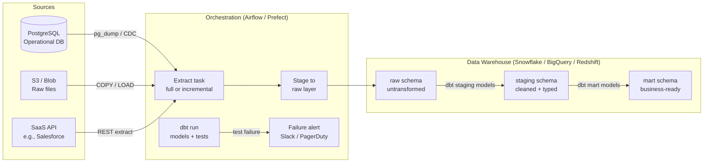

# Batch Data Ingestion & ETL Pipelines

## Category

Data Solutions, ETL, Batch Processing, Apache Spark, dbt, Airflow, Data Warehouse, ELT

## Context

**Batch data ingestion** moves large volumes of data from source systems (operational databases, SaaS APIs, files) into a data warehouse or data lake on a scheduled basis. **ETL (Extract, Transform, Load)** and its modern inverse **ELT (Extract, Load, Transform)** are the two dominant paradigms:

| Paradigm | Transform where?                  | When to use                                                                            |
| -------- | --------------------------------- | -------------------------------------------------------------------------------------- |
| **ETL**  | In the pipeline (before load)     | Sensitive data that must be masked before landing; memory-constrained targets          |
| **ELT**  | Inside the warehouse (after load) | Cloud warehouses (BigQuery, Snowflake, Redshift) with massive compute; SQL-first teams |

### Ingestion patterns

| Pattern                       | Description                                          | Best for                                              |
| ----------------------------- | ---------------------------------------------------- | ----------------------------------------------------- |
| **Full load**                 | Replace entire target table each run                 | Small dimensions, lookup tables                       |
| **Incremental (append)**      | Load only new rows since last watermark              | Append-only event tables                              |
| **CDC (Change Data Capture)** | Stream row-level INSERT/UPDATE/DELETE from DB binlog | Operational DB replicas, near-real-time sync          |
| **Snapshot diff**             | Compare full snapshot to detect changes              | APIs with no change feed                              |
| **SCD Type 2**                | Keep full history with validity dates                | Slowly changing dimensions (customer address history) |

### Pipeline orchestration tools

| Tool                              | Model                | Strengths                                |
| --------------------------------- | -------------------- | ---------------------------------------- |
| **Apache Airflow**                | Python DAG           | Mature ecosystem, flexible operators, UI |
| **Prefect**                       | Python flows + tasks | Dynamic task mapping, modern API         |
| **Dagster**                       | Asset-centric        | Data lineage and software-defined assets |
| **dbt**                           | SQL-first transforms | T in ELT — models, tests, docs, lineage  |
| **Apache Spark**                  | Distributed compute  | PB-scale transformations                 |
| **AWS Glue / Azure Data Factory** | Managed ETL          | Serverless, no infra management          |

---

## Pros

- **Decoupled from source systems**: Batch windows allow reads during off-peak hours, reducing operational DB load.
- **SQL-native transformations**: dbt brings software engineering practices (version control, tests, CI) to data transformation.
- **Idempotent reruns**: Well-designed batch jobs can be safely re-executed after failure without double-counting.
- **Cost-efficient for large volumes**: Bulk warehouse loads are far cheaper per GB than row-by-row API calls.
- **Auditability**: Each pipeline run produces a dated partition — historical data is preserved and repairable.

---

## Cons

- **Latency**: Data is stale by the batch interval (hourly/daily) — not suitable for real-time dashboards.
- **Watermark management complexity**: Incremental loads depend on reliable `updated_at` timestamps — missing or wrong timestamps cause silent data gaps.
- **Schema evolution fragility**: Source schema changes (renamed columns, type changes) break downstream pipelines if not handled.
- **Full load cost at scale**: For large tables, full-refresh ELT can be expensive if the warehouse charges by bytes scanned.
- **Debugging difficulty**: Distributed Spark jobs require familiarity with execution plans, shuffle partitions, and cluster sizing.

---

## Design Diagram



---

## Code Sample

### Python — Airflow DAG: incremental PostgreSQL → Snowflake

```python
# dags/payments_incremental_load.py
# Incremental load: extracts rows updated since last successful run watermark

from __future__ import annotations

import pendulum
from airflow.decorators import dag, task
from airflow.providers.postgres.hooks.postgres import PostgresHook
from airflow.providers.snowflake.hooks.snowflake import SnowflakeHook

TABLE      = "payments"
PG_CONN    = "postgres_oltp"
SF_CONN    = "snowflake_dw"
WATERMARK_TABLE = "pipeline_watermarks"


@dag(
    dag_id="payments_incremental_load",
    schedule="@hourly",
    start_date=pendulum.datetime(2026, 1, 1, tz="UTC"),
    catchup=False,
    tags=["payments", "incremental"],
)
def payments_incremental_load():

    @task()
    def get_last_watermark() -> str:
        """Retrieve the last successfully processed updated_at timestamp."""
        hook = SnowflakeHook(snowflake_conn_id=SF_CONN)
        result = hook.get_first(
            f"SELECT MAX(watermark_value) FROM {WATERMARK_TABLE} WHERE table_name = '{TABLE}'"
        )
        return str(result[0]) if result and result[0] else "1970-01-01 00:00:00"

    @task()
    def extract_from_postgres(watermark: str) -> list[dict]:
        """Extract rows updated since the watermark."""
        hook = PostgresHook(postgres_conn_id=PG_CONN)
        records = hook.get_records(
            """
            SELECT id, amount, currency, status, customer_id,
                   created_at, updated_at
            FROM payments
            WHERE updated_at > %s
            ORDER BY updated_at
            LIMIT 500000
            """,
            parameters=(watermark,),
        )
        columns = ["id", "amount", "currency", "status", "customer_id", "created_at", "updated_at"]
        return [dict(zip(columns, row)) for row in records]

    @task()
    def load_to_snowflake(rows: list[dict]) -> str:
        """Upsert extracted rows into Snowflake raw layer."""
        if not rows:
            return "no-op"

        hook = SnowflakeHook(snowflake_conn_id=SF_CONN)

        # Stage data via Snowflake internal stage (avoids large IN clause)
        hook.run("CREATE TEMPORARY STAGE IF NOT EXISTS tmp_payments_stage")
        hook.run(
            """
            MERGE INTO raw.payments AS target
            USING (SELECT * FROM VALUES %s AS v(id, amount, currency, status,
                          customer_id, created_at, updated_at))
                          AS source ON target.id = source.id
            WHEN MATCHED     THEN UPDATE SET amount=source.amount, status=source.status,
                                             updated_at=source.updated_at
            WHEN NOT MATCHED THEN INSERT VALUES (source.id, source.amount, source.currency,
                                                 source.status, source.customer_id,
                                                 source.created_at, source.updated_at)
            """,
            # Production: use write_pandas or Snowflake PUT for large payloads
        )

        max_watermark = max(r["updated_at"] for r in rows)
        return str(max_watermark)

    @task()
    def update_watermark(max_watermark: str) -> None:
        """Persist the new high-water mark for the next run."""
        if max_watermark == "no-op":
            return
        hook = SnowflakeHook(snowflake_conn_id=SF_CONN)
        hook.run(
            f"""
            MERGE INTO {WATERMARK_TABLE} AS t USING (SELECT '{TABLE}' AS table_name,
                '{max_watermark}'::TIMESTAMP_NTZ AS watermark_value) AS s
            ON t.table_name = s.table_name
            WHEN MATCHED     THEN UPDATE SET watermark_value = s.watermark_value
            WHEN NOT MATCHED THEN INSERT (table_name, watermark_value)
                                  VALUES (s.table_name, s.watermark_value)
            """
        )

    watermark    = get_last_watermark()
    rows         = extract_from_postgres(watermark)
    max_wm       = load_to_snowflake(rows)
    update_watermark(max_wm)


payments_incremental_load()
```

### SQL — dbt staging model with schema tests

```sql
-- models/staging/stg_payments.sql
-- Staging model: clean, rename, cast raw payments loaded by Airflow

{{ config(
    materialized = 'incremental',
    unique_key   = 'payment_id',
    on_schema_change = 'append_new_columns'
) }}

WITH source AS (
    SELECT * FROM {{ source('raw', 'payments') }}

    
    -- Only process rows newer than the most recent record in this model
    WHERE updated_at > (SELECT MAX(updated_at) FROM {{ this }})
    
),

cleaned AS (
    SELECT
        id                                          AS payment_id,
        amount / 100.0                              AS amount_decimal,      -- cents → decimal
        UPPER(currency)                             AS currency_code,
        LOWER(status)                               AS payment_status,
        customer_id,
        created_at::TIMESTAMP_NTZ                   AS created_at_utc,
        updated_at::TIMESTAMP_NTZ                   AS updated_at_utc,

        -- Data quality flags
        amount > 0                                  AS is_positive_amount,
        status IN ('pending','completed','failed','refunded') AS is_valid_status

    FROM source
    WHERE id IS NOT NULL   -- hard filter on business key
)

SELECT * FROM cleaned
```

```yaml
# models/staging/schema.yml
version: 2

models:
  - name: stg_payments
    description: "Cleaned and typed payments from the operational database"
    columns:
      - name: payment_id
        description: "Surrogate key from operational DB"
        tests: [unique, not_null]

      - name: currency_code
        tests:
          - accepted_values:
              values: ["USD", "EUR", "GBP", "SGD"]

      - name: payment_status
        tests:
          - accepted_values:
              values: ["pending", "completed", "failed", "refunded"]

      - name: amount_decimal
        tests:
          - not_null
          - dbt_utils.expression_is_true:
              expression: ">= 0"
```
