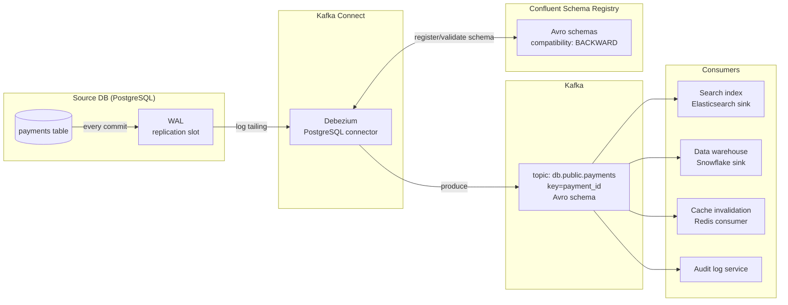

# Change Data Capture (CDC)

## Category

Data Solutions, CDC, Debezium, Kafka, Real-time Replication, Event Streaming, Database Synchronisation

## Context

**Change Data Capture (CDC)** is the process of detecting and capturing row-level changes (INSERT, UPDATE, DELETE) from a database's transaction log and propagating them downstream in near real-time — without polling the source database or impacting operational query latency.

### How CDC works

Most relational databases write every committed change to a binary transaction log before applying it:

| Database        | Log name                      | CDC tool                             |
| --------------- | ----------------------------- | ------------------------------------ |
| PostgreSQL      | WAL (Write-Ahead Log)         | Debezium PostgreSQL connector        |
| MySQL / MariaDB | binlog                        | Debezium MySQL connector             |
| SQL Server      | CDC feature + transaction log | Debezium SQL Server connector        |
| Oracle          | Redo log                      | Debezium Oracle connector (LogMiner) |
| MongoDB         | Oplog                         | Debezium MongoDB connector           |

**Debezium** reads the database log at the replication slot level — it appears to the database as a replica, consuming log entries without running queries against the table.

### CDC vs polling comparison

| Aspect               | CDC (log-based)                      | Timestamp polling                      |
| -------------------- | ------------------------------------ | -------------------------------------- |
| Latency              | Milliseconds                         | Minutes (batch interval)               |
| Source DB load       | Minimal (log read)                   | High (full table scan possible)        |
| Captures DELETEs     | Yes                                  | No (row is gone)                       |
| Captures all updates | Yes                                  | Only if `updated_at` updated correctly |
| Schema evolution     | Event-driven                         | Manual coordination                    |
| Complexity           | Higher (replication slot management) | Lower                                  |

### Delivery guarantees

| Guarantee         | Description                                                              |
| ----------------- | ------------------------------------------------------------------------ |
| **At-least-once** | Default — offsets may replay on restart; consumers must be idempotent    |
| **Exactly-once**  | Achievable end-to-end with Kafka transactions + idempotent consumers     |
| **Ordering**      | Maintained per table partition (same primary key → same Kafka partition) |

---

## Pros

- **Near real-time propagation**: Changes land in downstream systems within milliseconds — not minutes or hours.
- **Captures all DML**: DELETEs and UPDATE history are visible — impossible with `updated_at` polling.
- **Zero source DB impact**: Reads from the replication log — no SELECT queries against operational tables.
- **Audit trail**: Every change event contains before/after state — native audit log without application changes.
- **Decoupled consumers**: Multiple downstream systems (search index, cache, analytics, another DB) can independently consume the same Kafka topic.

---

## Cons

- **Replication slot management**: PostgreSQL replication slots hold WAL until consumed — an idle consumer can cause WAL to grow unbounded and fill disk.
- **DDL changes break consumers**: Adding a NOT NULL column, renaming a column, or changing types can break the Debezium schema registry.
- **Schema Registry coupling**: Avro/Protobuf schemas must be registered and evolved carefully — backward/forward compatibility must be maintained.
- **Operational complexity**: Kafka cluster + Kafka Connect cluster + Schema Registry + Debezium connectors = significant infrastructure.
- **Initial snapshot**: The first run requires a consistent snapshot of the entire table, which can lock the table (depending on connector settings) or take hours for large tables.

---

## Design Diagram



---

## Code Sample

### YAML — Debezium PostgreSQL connector configuration

```yaml
# kafka-connect/debezium-postgres-connector.json (applied via Connect REST API)
# Captures all changes from the 'payments' schema in PostgreSQL

name: postgres-payments-cdc

config:
  connector.class: io.debezium.connector.postgresql.PostgresConnector
  plugin.name: pgoutput # Built-in logical replication plugin (PG 10+)

  # Source DB connection (credentials from environment / Vault — not hardcoded)
  database.hostname: "${env:PG_HOST}"
  database.port: "5432"
  database.user: "${env:PG_CDC_USER}" # Dedicated replication-only user
  database.password: "${env:PG_CDC_PASSWORD}"
  database.dbname: payments
  database.server.name: payments_pg # Kafka topic prefix

  # Replication slot — must be created before starting connector
  slot.name: debezium_payments_slot
  publication.name: debezium_payments_pub

  # Only capture the tables we need
  table.include.list: public.payments,public.customers,public.refunds

  # Serialise change events as Avro using Schema Registry
  key.converter: io.confluent.connect.avro.AvroConverter
  value.converter: io.confluent.connect.avro.AvroConverter
  key.converter.schema.registry.url: http://schema-registry:8081
  value.converter.schema.registry.url: http://schema-registry:8081

  # Include before-state in update/delete events for full diff
  before.state.propagation.mode: always_emit
  tombstones.on.delete: true # Emit null tombstone after DELETE for log compaction

  # Emit the full row after every UPDATE (not just changed columns)
  column.include.list: "" # Empty = all columns
  decimal.handling.mode: double # Avoids Avro Decimal type complexity

  # Heartbeat prevents replication slot from stalling during idle periods
  heartbeat.interval.ms: "15000"
  heartbeat.action.query: "INSERT INTO public._debezium_heartbeat(ts) VALUES(NOW()) ON CONFLICT DO NOTHING"

  # Snapshot: use export snapshot to avoid long lock on large tables
  snapshot.mode: exported
  snapshot.isolation.mode: repeatable_read
```

### TypeScript — Idempotent CDC consumer (Kafka.js)

```typescript
// src/consumers/payments-cdc-consumer.ts
// Consumes Debezium CDC events from Kafka and upserts into the read model

import { Kafka, Consumer, EachMessagePayload } from "kafkajs";
import { SchemaRegistry } from "@kafkajs/confluent-schema-registry";

const kafka = new Kafka({
  clientId: "payments-read-model",
  brokers: (process.env.KAFKA_BROKERS ?? "").split(","),
  ssl: true,
  sasl: {
    mechanism: "scram-sha-512",
    username: process.env.KAFKA_USER!,
    password: process.env.KAFKA_PASSWORD!,
  },
});

const registry = new SchemaRegistry({ host: process.env.SCHEMA_REGISTRY_URL! });

// Represents a Debezium change event envelope
interface DebeziumEnvelope {
  op: "c" | "u" | "d" | "r"; // create, update, delete, read (snapshot)
  before: Record<string, unknown> | null;
  after: Record<string, unknown> | null;
  source: { ts_ms: number; table: string };
}

async function upsertPayment(after: Record<string, unknown>): Promise<void> {
  // Implementation: write to PostgreSQL read model, Elasticsearch, or Redis
  console.log("UPSERT payment:", after["id"], "status:", after["status"]);
}

async function deletePayment(id: unknown): Promise<void> {
  console.log("DELETE payment:", id);
}

async function startConsumer(): Promise<void> {
  const consumer: Consumer = kafka.consumer({
    groupId: "payments-read-model-v1",
  });
  await consumer.connect();
  await consumer.subscribe({
    topic: "payments_pg.public.payments",
    fromBeginning: false,
  });

  await consumer.run({
    autoCommit: false, // Manual commit for at-least-once with idempotent processing
    eachMessageAutoResolve: true,

    eachMessage: async ({
      topic,
      partition,
      message,
      heartbeat,
    }: EachMessagePayload) => {
      // Tombstone = deleted key → propagate delete
      if (message.value === null) {
        const key = message.key ? JSON.parse(message.key.toString()) : null;
        if (key) await deletePayment(key.id ?? key.payload?.id);
        await consumer.commitOffsets([
          { topic, partition, offset: (Number(message.offset) + 1).toString() },
        ]);
        return;
      }

      const event = (await registry.decode(message.value)) as DebeziumEnvelope;

      switch (event.op) {
        case "c": // INSERT
        case "u": // UPDATE
        case "r": // Snapshot read
          if (event.after) await upsertPayment(event.after);
          break;
        case "d": // DELETE
          if (event.before) await deletePayment(event.before["id"]);
          break;
      }

      // Commit offset only after successful processing — ensures at-least-once
      await consumer.commitOffsets([
        { topic, partition, offset: (Number(message.offset) + 1).toString() },
      ]);
      await heartbeat();
    },
  });
}

startConsumer().catch((err) => {
  console.error(err);
  process.exit(1);
});
```
