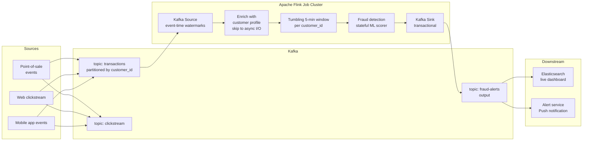

# Real-time Stream Processing

## Category

Data Solutions, Stream Processing, Apache Kafka, Apache Flink, Kafka Streams, Event-Driven, Real-time Analytics, Windowing

## Context

**Stream processing** is the continuous computation over unbounded, time-ordered sequences of events — producing results as events arrive rather than waiting for a batch to accumulate. It powers real-time fraud detection, live dashboards, user activity pipelines, and operational alerting.

### Stream processing models

| Model                | Description                                    | Tools                                         |
| -------------------- | ---------------------------------------------- | --------------------------------------------- |
| **Record-at-a-time** | Process each event independently               | Kafka Streams, Faust                          |
| **Micro-batch**      | Accumulate small batches, process periodically | Spark Structured Streaming (trigger interval) |
| **True streaming**   | Stateful, continuous operator graph            | Apache Flink, Apache Beam                     |

### Windowing strategies

| Window type  | Description                         | Example                           |
| ------------ | ----------------------------------- | --------------------------------- |
| **Tumbling** | Fixed non-overlapping periods       | Hourly revenue totals             |
| **Sliding**  | Fixed size, advances by step        | 5-min rolling average every 1 min |
| **Session**  | Gap-based — closes after inactivity | User session activity grouping    |
| **Global**   | Entire stream, triggered manually   | Running totals                    |

### Time semantics

| Time type           | Definition                      | Use when                                             |
| ------------------- | ------------------------------- | ---------------------------------------------------- |
| **Event time**      | Timestamp embedded in the event | Accurate ordering; requires watermarks for late data |
| **Processing time** | Clock when event is processed   | Simple; imprecise under lag                          |
| **Ingestion time**  | When event enters the pipeline  | Middle ground                                        |

**Watermarks** define how long the engine waits for late-arriving events before closing a window. Too short = data loss; too long = increased latency.

### Exactly-once semantics

Flink and Kafka Streams achieve exactly-once end-to-end via:

1. **Checkpointing** — periodic consistent snapshots of all operator state.
2. **Kafka transactions** — output is written transactionally; uncommitted offsets are not visible.
3. **Idempotent producers** — duplicate messages from retries are deduplicated by the broker.

---

## Pros

- **Sub-second latency**: Results available in milliseconds to seconds after the event is produced.
- **Stateful computation**: Joins, aggregations, and enrichments across event streams with distributed state stores.
- **Fault tolerance**: Checkpointing + replaying from Kafka offsets ensures at-least-once (or exactly-once) guarantees.
- **Backpressure handling**: Flink and Kafka Streams apply backpressure upstream when consumers slow down — prevents OOM.
- **Event time correctness**: Watermarks allow accurate results even when events arrive out of order due to network delays.

---

## Cons

- **Operational complexity**: Flink clusters, checkpoint storage (S3/HDFS), job management, and state backend tuning require dedicated platform expertise.
- **Late data handling**: Choosing the right watermark lag is a business trade-off — no universal answer.
- **State store growth**: Long-retention windowed aggregations accumulate large RocksDB state backends; requires careful TTL management.
- **Debugging difficulty**: Stateful streaming bugs (incorrect windowing, wrong key) are hard to reproduce locally; requires replaying Kafka topics.
- **Schema evolution**: Changing event schemas mid-stream requires coordinated consumer updates and schema compatibility enforcement.

---

## Design Diagram



---

## Code Sample

### Java/Scala-style pseudocode → TypeScript — Kafka Streams topology

```typescript
// src/streams/fraud-detection-topology.ts
// Kafka Streams topology: windowed transaction aggregation + threshold alerting

import { Kafka, logLevel } from "kafkajs";
import { SchemaRegistry } from "@kafkajs/confluent-schema-registry";

const kafka = new Kafka({
  clientId: "fraud-detection-stream",
  brokers: (process.env.KAFKA_BROKERS ?? "").split(","),
});

interface TransactionEvent {
  customerId: string;
  amount: number;
  currency: string;
  merchantId: string;
  timestamp: number; // epoch millis
}

interface WindowAggregate {
  customerId: string;
  windowStart: number;
  windowEnd: number;
  totalAmount: number;
  txCount: number;
  merchants: Set<string>;
}

// In-memory tumbling window store (production: use RocksDB or Redis)
const windowStore = new Map<string, WindowAggregate>();

const WINDOW_DURATION_MS = 5 * 60 * 1000; // 5-minute tumbling window
const AMOUNT_THRESHOLD = 10_000; // Flag if > $10,000 in 5 min
const TX_COUNT_THRESHOLD = 10; // Flag if > 10 transactions in 5 min

function getWindowKey(customerId: string, timestamp: number): string {
  const windowStart =
    Math.floor(timestamp / WINDOW_DURATION_MS) * WINDOW_DURATION_MS;
  return `${customerId}@${windowStart}`;
}

function aggregateTransaction(event: TransactionEvent): WindowAggregate {
  const key = getWindowKey(event.customerId, event.timestamp);
  const windowStart =
    Math.floor(event.timestamp / WINDOW_DURATION_MS) * WINDOW_DURATION_MS;

  const existing = windowStore.get(key) ?? {
    customerId: event.customerId,
    windowStart: windowStart,
    windowEnd: windowStart + WINDOW_DURATION_MS,
    totalAmount: 0,
    txCount: 0,
    merchants: new Set<string>(),
  };

  existing.totalAmount += event.amount;
  existing.txCount += 1;
  existing.merchants.add(event.merchantId);

  windowStore.set(key, existing);

  // Evict expired windows (TTL = 2× window to handle late events)
  const cutoff = event.timestamp - WINDOW_DURATION_MS * 2;
  for (const [k, v] of windowStore.entries()) {
    if (v.windowEnd < cutoff) windowStore.delete(k);
  }

  return existing;
}

function isFraudulent(agg: WindowAggregate): boolean {
  return agg.totalAmount > AMOUNT_THRESHOLD || agg.txCount > TX_COUNT_THRESHOLD;
}

async function runFraudDetectionStream(): Promise<void> {
  const registry = new SchemaRegistry({
    host: process.env.SCHEMA_REGISTRY_URL!,
  });
  const consumer = kafka.consumer({ groupId: "fraud-detection-v2" });
  const producer = kafka.producer({
    transactionalId: "fraud-detection-producer",
    idempotent: true,
  });

  await consumer.connect();
  await producer.connect();
  await consumer.subscribe({ topic: "transactions", fromBeginning: false });

  await consumer.run({
    eachMessage: async ({ topic, partition, message }) => {
      if (!message.value) return;

      const event = (await registry.decode(message.value)) as TransactionEvent;
      const agg = aggregateTransaction(event);

      if (isFraudulent(agg)) {
        await producer.transaction().then(async (tx) => {
          await tx.send({
            topic: "fraud-alerts",
            messages: [
              {
                key: event.customerId,
                value: JSON.stringify({
                  customerId: agg.customerId,
                  windowStart: agg.windowStart,
                  windowEnd: agg.windowEnd,
                  totalAmount: agg.totalAmount,
                  txCount: agg.txCount,
                  reason:
                    agg.totalAmount > AMOUNT_THRESHOLD
                      ? "HIGH_AMOUNT"
                      : "HIGH_FREQUENCY",
                  detectedAt: Date.now(),
                }),
              },
            ],
          });
          await tx.sendOffsets({
            consumerGroupId: "fraud-detection-v2",
            topics: [
              {
                topic,
                partitions: [
                  {
                    partition,
                    offset: (Number(message.offset) + 1).toString(),
                  },
                ],
              },
            ],
          });
          await tx.commit();
        });
      }
    },
  });
}

runFraudDetectionStream().catch((err) => {
  console.error(err);
  process.exit(1);
});
```

### YAML — Apache Flink job deployment on Kubernetes (Flink Operator)

```yaml
# kubernetes/flink/fraud-detection-job.yaml
# Deploys the fraud detection Flink job via the Apache Flink Kubernetes Operator

apiVersion: flink.apache.org/v1beta1
kind: FlinkDeployment
metadata:
  name: fraud-detection
  namespace: data-platform
spec:
  image: ghcr.io/myorg/fraud-detection-flink:1.2.0
  flinkVersion: v1_18

  flinkConfiguration:
    taskmanager.numberOfTaskSlots: "4"
    state.backend: rocksdb
    state.backend.incremental: "true" # Incremental checkpoints — much faster for large state
    execution.checkpointing.interval: "30000" # Checkpoint every 30s
    execution.checkpointing.mode: EXACTLY_ONCE
    execution.checkpointing.externalized-checkpoint-retention: RETAIN_ON_CANCELLATION

    # Kafka source exactly-once
    kafka.consumer.isolation.level: read_committed

  serviceAccount: flink-sa

  jobManager:
    resource:
      memory: "2048m"
      cpu: 1

  taskManager:
    resource:
      memory: "4096m"
      cpu: 2

  job:
    jarURI: local:///opt/flink/usrlib/fraud-detection.jar
    entryClass: com.myorg.fraud.FraudDetectionJob
    parallelism: 8
    upgradeMode: stateful # Resume from latest checkpoint on upgrade

  podTemplate:
    spec:
      containers:
        - name: flink-main-container
          env:
            - name: KAFKA_BROKERS
              valueFrom:
                { secretKeyRef: { name: kafka-credentials, key: brokers } }
            - name: KAFKA_USER
              valueFrom:
                { secretKeyRef: { name: kafka-credentials, key: username } }
            - name: KAFKA_PASSWORD
              valueFrom:
                { secretKeyRef: { name: kafka-credentials, key: password } }
```
