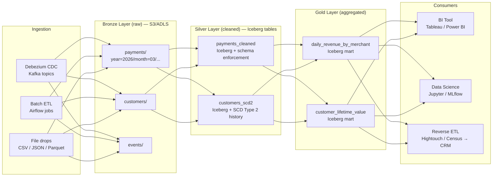

# Data Lakehouse Architecture

## Category

Data Solutions, Data Lake, Data Lakehouse, Delta Lake, Apache Iceberg, Apache Hudi, Medallion Architecture, Parquet

## Context

A **data lakehouse** combines the low-cost, schema-flexible storage of a data lake with the ACID transactions, schema enforcement, and query performance of a data warehouse. It eliminates the traditional two-tier "lake + warehouse" architecture where data was copied (and potentially diverged) between both systems.

### Lake vs Warehouse vs Lakehouse

|                  | Data Lake                | Data Warehouse  | Data Lakehouse                    |
| ---------------- | ------------------------ | --------------- | --------------------------------- |
| **Storage**      | Object store (S3/ADLS)   | Vendor-managed  | Object store (S3/ADLS)            |
| **Format**       | Raw (JSON, CSV, Parquet) | Proprietary     | Open table format (Iceberg/Delta) |
| **Schema**       | Schema-on-read           | Schema-on-write | Schema-on-write + evolution       |
| **ACID**         | No                       | Yes             | Yes                               |
| **DML**          | Append only              | Full DML        | Full DML (UPDATE, DELETE, MERGE)  |
| **Query engine** | Spark, Hive              | SQL warehouse   | Spark, Trino, DuckDB, Athena      |
| **Cost**         | $                        | $$$$            | $$                                |

### Open table formats

| Format             | Creator    | Key strength                                          |
| ------------------ | ---------- | ----------------------------------------------------- |
| **Apache Iceberg** | Netflix    | Hidden partitioning, partition evolution, time travel |
| **Delta Lake**     | Databricks | Tight Spark integration, Z-ordering, DML optimiser    |
| **Apache Hudi**    | Uber       | Incremental queries, record-level upserts (MoR/CoW)   |

### Medallion (multi-layer) architecture

```
Bronze (raw)     → exact copy of source data, append-only, never modified
Silver (cleaned) → deduplicated, typed, joined, business rules applied
Gold (aggregated)→ aggregated, business-ready facts and dimensions for BI/ML
```

---

## Pros

- **Single source of truth**: Eliminates the lake–warehouse copy — BI and ML teams query the same data.
- **ACID on object storage**: MERGE, UPDATE, DELETE on petabyte-scale data stored cheaply in S3 or ADLS.
- **Time travel**: Query historical snapshots (`AS OF TIMESTAMP` or snapshot ID) — essential for audits and debugging.
- **Open format**: Not locked to a single vendor — Iceberg tables can be queried by Spark, Trino, Athena, DuckDB, Snowflake, and BigQuery Omni.
- **Schema evolution**: Add, rename, or reorder columns without rewriting existing Parquet files.

---

## Cons

- **Small file problem**: Frequent incremental writes produce many small Parquet files — requires periodic compaction jobs.
- **Metadata overhead**: Iceberg and Delta maintain large metadata trees — for very high write frequencies, metadata management adds latency.
- **Query engine familiarity**: Teams comfortable with SQL on a warehouse must learn Spark API or Trino/Athena SQL dialects.
- **Compaction cost**: Regular OPTIMIZE / compaction operations consume compute and must be scheduled carefully to not contend with production queries.
- **Governance complexity**: Without a data catalog (Glue, Unity Catalog, Hive Metastore), discoverability across thousands of Iceberg tables is difficult.

---

## Design Diagram



---

## Code Sample

### Python — Apache Spark + Iceberg: Bronze → Silver upsert

```python
# jobs/bronze_to_silver_payments.py
# Reads raw CDC events from the Bronze layer and merges into the Silver Iceberg table

from pyspark.sql            import SparkSession
from pyspark.sql.functions  import col, from_json, schema_of_json, to_timestamp, lit
from pyspark.sql.types      import (StructType, StructField, StringType,
                                    LongType, DecimalType, TimestampType)

spark = (
    SparkSession.builder
    .appName("bronze_to_silver_payments")
    .config("spark.sql.extensions",               "org.apache.iceberg.spark.extensions.IcebergSparkSessionExtensions")
    .config("spark.sql.catalog.lakehouse",         "org.apache.iceberg.spark.SparkCatalog")
    .config("spark.sql.catalog.lakehouse.type",    "glue")          # AWS Glue as Iceberg catalog
    .config("spark.sql.catalog.lakehouse.warehouse", "s3://myorg-lakehouse/")
    .getOrCreate()
)

BRONZE_PATH   = "s3://myorg-lakehouse/bronze/payments/"
SILVER_TABLE  = "lakehouse.silver.payments"

payment_schema = StructType([
    StructField("id",          StringType(),    nullable=False),
    StructField("amount",      DecimalType(18, 2)),
    StructField("currency",    StringType()),
    StructField("status",      StringType()),
    StructField("customer_id", StringType()),
    StructField("created_at",  LongType()),     # epoch millis from Debezium
    StructField("updated_at",  LongType()),
])

def run() -> None:
    # ── Read raw Parquet from bronze layer (landed by Kafka S3 Sink) ──────────
    raw_df = (
        spark.read
        .schema(payment_schema)
        .parquet(BRONZE_PATH)
        .withColumn("created_at_utc", to_timestamp(col("created_at") / 1000))
        .withColumn("updated_at_utc", to_timestamp(col("updated_at") / 1000))
        # Deduplicate: keep the latest version per payment id (max updated_at)
        .dropDuplicates(["id"])
    )

    # ── Ensure Silver Iceberg table exists ────────────────────────────────────
    spark.sql(f"""
        CREATE TABLE IF NOT EXISTS {SILVER_TABLE} (
            id            STRING  NOT NULL,
            amount        DECIMAL(18,2),
            currency      STRING,
            status        STRING,
            customer_id   STRING,
            created_at_utc TIMESTAMP,
            updated_at_utc TIMESTAMP
        )
        USING iceberg
        PARTITIONED BY (months(created_at_utc))
        TBLPROPERTIES (
            'write.parquet.compression-codec' = 'zstd',
            'history.expire.max-snapshot-age-ms' = '604800000'   -- 7 days
        )
    """)

    # ── MERGE (upsert) into Silver ─────────────────────────────────────────────
    raw_df.createOrReplaceTempView("incoming_payments")

    spark.sql(f"""
        MERGE INTO {SILVER_TABLE} AS target
        USING incoming_payments AS source
            ON target.id = source.id

        WHEN MATCHED AND source.updated_at_utc > target.updated_at_utc
            THEN UPDATE SET *

        WHEN NOT MATCHED
            THEN INSERT *
    """)

    print(f"Merge complete. Silver table: {SILVER_TABLE}")

    # ── Compact small files periodically ──────────────────────────────────────
    spark.sql(f"CALL lakehouse.system.rewrite_data_files(table => '{SILVER_TABLE}', strategy => 'binpack')")
    spark.sql(f"CALL lakehouse.system.expire_snapshots(table => '{SILVER_TABLE}', older_than => TIMESTAMP '{{}}')")


if __name__ == "__main__":
    run()
```

### YAML — GitHub Actions: lakehouse job promotion pipeline

```yaml
# .github/workflows/lakehouse-job.yaml
# CI/CD for PySpark lakehouse jobs: test → package → deploy to EMR / Dataproc

name: Lakehouse Job CI/CD

on:
  push:
    branches: [main]
    paths: ["jobs/**", "tests/jobs/**"]

jobs:
  test:
    runs-on: ubuntu-latest
    steps:
      - uses: actions/checkout@v4

      - uses: actions/setup-python@v5
        with: { python-version: "3.11" }

      - run: pip install pyspark pytest pytest-cov delta-spark

      - name: Run unit tests with local Spark
        run: pytest tests/jobs/ --cov=jobs --cov-report=xml

  package-and-deploy:
    needs: test
    runs-on: ubuntu-latest
    permissions:
      id-token: write # OIDC for AWS
      contents: read

    steps:
      - uses: actions/checkout@v4

      - uses: aws-actions/configure-aws-credentials@v4
        with:
          role-to-assume: ${{ secrets.AWS_EMR_DEPLOY_ROLE_ARN }}
          aws-region: eu-west-1

      - name: Package job as zip (includes dependencies)
        run: |
          pip install -r requirements.txt --target ./dist/deps
          zip -r job.zip jobs/ dist/deps/

      - name: Upload job artifact to S3
        run: |
          VERSION=$(git rev-parse --short HEAD)
          aws s3 cp job.zip s3://myorg-emr-artifacts/jobs/${VERSION}/job.zip
          echo "JOB_S3_URI=s3://myorg-emr-artifacts/jobs/${VERSION}/job.zip" >> "$GITHUB_ENV"

      - name: Submit EMR Serverless job
        run: |
          aws emr-serverless start-job-run \
            --application-id "${{ secrets.EMR_APP_ID }}" \
            --execution-role-arn "${{ secrets.EMR_EXEC_ROLE_ARN }}" \
            --job-driver '{
              "sparkSubmit": {
                "entryPoint":      "'"$JOB_S3_URI"'",
                "entryPointArguments": ["--env", "production"],
                "sparkSubmitParameters": "--conf spark.executor.cores=4 --conf spark.executor.memory=8g"
              }
            }' \
            --configuration-overrides '{
              "monitoringConfiguration": {
                "s3MonitoringConfiguration": {
                  "logUri": "s3://myorg-emr-logs/"
                }
              }
            }'
```
