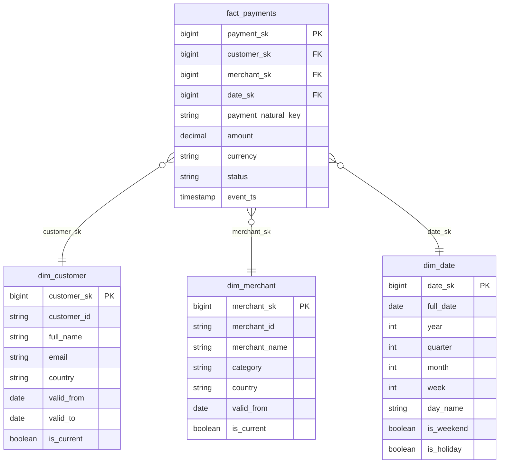

# Data Modelling & Warehouse Design

## Category

Data Solutions, Data Modelling, Dimensional Modelling, Kimball, Data Vault, Star Schema, OBT, Slowly Changing Dimensions

## Context

**Data modelling** is the practice of structuring data for analytical workloads. The right model determines query performance, flexibility for future changes, and ease of use for business analysts. Three dominant paradigms exist in modern data warehousing:

### Modelling paradigms

| Paradigm                | Structure                      | Best for                                                 | Trade-off                                       |
| ----------------------- | ------------------------------ | -------------------------------------------------------- | ----------------------------------------------- |
| **Kimball Star Schema** | Fact tables + dimension tables | Business intelligence, OLAP cubes                        | Join complexity; dimension updates require care |
| **Data Vault**          | Hubs, Links, Satellites        | Auditable, historised enterprise DW; many source systems | Complex to query; high table count              |
| **One Big Table (OBT)** | Denormalised wide table        | Simple, fast analytics; single domain                    | Storage cost; harder to maintain                |
| **Inmon 3NF**           | Normalised relational model    | Enterprise data warehouse with many reuse patterns       | Slow for analytics without marts                |

### Dimensional modelling concepts

| Concept                  | Description                                                                 |
| ------------------------ | --------------------------------------------------------------------------- |
| **Fact table**           | Quantitative business events: orders, payments, page views                  |
| **Dimension table**      | Descriptive context: customer, product, date, location                      |
| **Surrogate key**        | Integer PK generated by the pipeline — decouples DW from source system keys |
| **Natural key**          | Original business key from source (e.g., customer_id)                       |
| **SCD Type 1**           | Overwrite — no history kept                                                 |
| **SCD Type 2**           | Keep full history with `valid_from` / `valid_to` and `is_current` flag      |
| **SCD Type 6**           | SCD 2 + current value denormalised into the row for easy querying           |
| **Conformed dimension**  | Dimension shared across multiple fact tables (e.g., `dim_date`)             |
| **Degenerate dimension** | Attribute stored directly in the fact table (e.g., order number)            |
| **Bridge table**         | Resolves many-to-many relationships between facts and dimensions            |

### dbt conventions for a well-structured warehouse

```
sources/     → raw source declarations (YAML)
staging/     → stg_* models — 1:1 with source tables, cleaned and typed
intermediate/→ int_* models — joins and business logic
marts/       → fact_* and dim_* models — the dimensional model
```

---

## Pros

- **Star schema simplicity**: Analysts write `JOIN fact ON dim` — intuitive and fast with columnar engines.
- **Historical accuracy (SCD Type 2)**: Fact rows always point to the dimension state that was true at event time — critical for regulatory reporting.
- **Conformed dimensions**: `dim_date` and `dim_customer` shared across all fact tables — one definition prevents contradictory metrics.
- **Query performance**: Columnar warehouses (Snowflake, BigQuery, Redshift) optimise heavily for star schema join patterns.
- **Data Vault auditability**: Every row has a load date and source system hash — proves exactly when data arrived and from where.

---

## Cons

- **Star schema inflexibility**: Adding a new grain requires a new fact table — poorly structured stars become unmaintainable over time.
- **SCD 2 query complexity**: `WHERE is_current = TRUE` clauses must appear in every dimension join — easy to forget in ad-hoc queries.
- **Data Vault query verbosity**: A simple report may require joining 10+ tables (hub + multiple links + satellites) — typically requires view abstractions on top.
- **OBT maintenance cost**: Adding a column to a wide table with 500 columns and billions of rows requires careful migration.
- **Dimension key management**: Surrogate key generation and lookup must be handled carefully to avoid key conflicts across source systems.

---

## Design Diagram



---

## Code Sample

### SQL — dbt SCD Type 2 snapshot for `dim_customer`

```sql
-- snapshots/scd2_customers.sql
-- dbt snapshot that maintains full history of customer dimension changes



{{
    config(
        target_schema  = 'snapshots',
        unique_key     = 'customer_id',
        strategy       = 'check',
        check_cols     = ['full_name', 'email', 'country', 'tier'],
        invalidate_hard_deletes = true
    )
}}

SELECT
    customer_id,
    full_name,
    email,
    country,
    tier,
    created_at,
    updated_at
FROM {{ source('raw', 'customers') }}


```

```sql
-- models/marts/dim_customer.sql
-- Dimensional model built on top of the SCD2 snapshot

SELECT
    {{ dbt_utils.surrogate_key(['customer_id', 'dbt_valid_from']) }} AS customer_sk,
    customer_id,
    full_name,
    email,
    country,
    tier,
    dbt_valid_from                             AS valid_from,
    COALESCE(dbt_valid_to, '9999-12-31'::DATE) AS valid_to,
    dbt_valid_to IS NULL                       AS is_current
FROM {{ ref('scd2_customers') }}
```

### SQL — dbt fact table with surrogate key lookup

```sql
-- models/marts/fact_payments.sql
-- Central fact table: joins staged payments to current dimension keys

{{ config(
    materialized  = 'incremental',
    unique_key    = 'payment_natural_key',
    partition_by  = { 'field': 'event_date', 'data_type': 'date' }
) }}

WITH payments AS (
    SELECT *
    FROM {{ ref('stg_payments') }}
    
    WHERE updated_at_utc > (SELECT MAX(event_ts) FROM {{ this }})
    
),

-- Point-in-time join to dimension: get the SCD2 row that was valid at event time
customers AS (
    SELECT * FROM {{ ref('dim_customer') }}
),

merchants AS (
    SELECT * FROM {{ ref('dim_merchant') }}
),

dates AS (
    SELECT * FROM {{ ref('dim_date') }}
)

SELECT
    {{ dbt_utils.surrogate_key(['p.payment_id']) }}     AS payment_sk,

    -- Dimension surrogate key lookup (point-in-time correct for SCD2)
    c.customer_sk,
    m.merchant_sk,
    d.date_sk,

    p.payment_id                                         AS payment_natural_key,
    p.amount_decimal                                     AS amount,
    p.currency_code,
    p.payment_status,
    p.created_at_utc                                     AS event_ts,
    p.created_at_utc::DATE                               AS event_date

FROM payments AS p

-- Point-in-time dimension joins
LEFT JOIN customers AS c
    ON  p.customer_id  = c.customer_id
    AND p.created_at_utc >= c.valid_from
    AND p.created_at_utc <  c.valid_to

LEFT JOIN merchants AS m
    ON  p.merchant_id  = m.merchant_id
    AND p.created_at_utc >= m.valid_from
    AND p.created_at_utc <  m.valid_to

LEFT JOIN dates AS d
    ON p.created_at_utc::DATE = d.full_date
```

### SQL — `dim_date` generator (Snowflake)

```sql
-- models/marts/dim_date.sql
-- Pre-generate date spine from 2020 to 2030 — no joins needed for date attributes

{{ config(materialized = 'table') }}

WITH spine AS (
    {{ dbt_utils.date_spine(
        datepart = 'day',
        start_date = "CAST('2020-01-01' AS DATE)",
        end_date   = "CAST('2030-12-31' AS DATE)"
    ) }}
)

SELECT
    TO_NUMBER(TO_CHAR(date_day, 'YYYYMMDD'))     AS date_sk,
    date_day                                       AS full_date,
    YEAR(date_day)                                 AS year,
    QUARTER(date_day)                              AS quarter,
    MONTH(date_day)                                AS month,
    WEEK(date_day)                                 AS week,
    DAY(date_day)                                  AS day_of_month,
    DAYOFWEEK(date_day)                            AS day_of_week,
    DAYNAME(date_day)                              AS day_name,
    MONTHNAME(date_day)                            AS month_name,
    DAYOFWEEK(date_day) IN (1, 7)                  AS is_weekend,
    FALSE                                          AS is_holiday   -- Extend with holiday calendar
FROM spine
ORDER BY date_day
```
