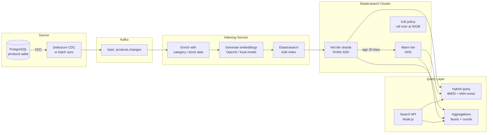

# Search & Full-Text Search Patterns

## Category

Data Solutions, Search, Elasticsearch, OpenSearch, Full-Text Search, Vector Search, Faceted Search, Relevance Tuning

## Context

**Search** is a specialised data access pattern optimised for finding documents by relevance rather than by exact key lookup. It powers e-commerce product search, knowledge base search, log analytics, and increasingly **vector/semantic search** for AI-powered retrieval.

### Search use cases and engines

| Use case                      | Engine                                               | Why                                            |
| ----------------------------- | ---------------------------------------------------- | ---------------------------------------------- |
| **Full-text search**          | Elasticsearch / OpenSearch                           | Inverted index, BM25 relevance, analysers      |
| **Log analytics**             | OpenSearch / Elastic                                 | Schema-on-read, Kibana / OpenSearch Dashboards |
| **Vector / semantic search**  | pgvector, Pinecone, Weaviate, Qdrant, OpenSearch kNN | Embedding similarity for AI search             |
| **Faceted / filtered search** | Elasticsearch + aggregations                         | E-commerce product filters                     |
| **Geospatial search**         | Elasticsearch geo_point                              | Location-based queries                         |
| **Typo-tolerant search**      | Typesense, Meilisearch, Algolia                      | Consumer-facing product search                 |

### Relevance signals

| Signal                | Description                                                                     |
| --------------------- | ------------------------------------------------------------------------------- |
| **BM25 (TF-IDF)**     | Default Elasticsearch scorer — term frequency + inverse document frequency      |
| **Field boosts**      | `title^3 description^1` — matches in title count more                           |
| **Function score**    | Combine text relevance with business signals (popularity, recency, stock level) |
| **Personalisation**   | User embedding proximity, purchase history signals                              |
| **Vector similarity** | Cosine / dot product distance between query embedding and document embeddings   |

### Index lifecycle

```
Active index     → receives all writes and queries
Roll over        → when size or age threshold is crossed, create new index
Warm index       → recent-but-not-current; reduced replica count
Cold index       → rarely queried; move to slower storage
Frozen / Delete  → snapshot to object storage; delete from cluster
```

---

## Pros

- **Relevance ranking**: Inverted index + BM25 returns documents sorted by semantic match — not possible with SQL LIKE.
- **Horizontal scalability**: Indices are sharded across nodes — linear throughput scaling.
- **Faceted aggregations**: `terms`, `range`, `date_histogram` aggregations compute facet counts in a single query pass.
- **Near-real-time**: Default 1-second refresh cycle makes indexed documents searchable within 1 second of indexing.
- **Multilingual**: Language-specific analysers (tokenisation, stemming, stopwords) built in for 30+ languages.

---

## Cons

- **Eventual consistency**: Documents are only searchable after a refresh cycle — not appropriate as a transactional record store.
- **Mapping immutability**: Field types cannot be changed after index creation — requires reindexing.
- **Operational complexity**: Cluster sizing, shard allocation, JVM heap tuning, and ILM policy configuration require expertise.
- **Duplicate data**: Search index is derived from the source of truth — CDC or event-driven sync must keep them consistent.
- **Cost**: Elasticsearch clusters are memory-intensive — hot tier nodes with NVMe SSDs are expensive at scale.

---

## Design Diagram



---

## Code Sample

### TypeScript — Elasticsearch index management + hybrid search

```typescript
// src/search/product-search.ts
// Manages product search index: mapping, indexing, and hybrid BM25 + kNN query

import { Client } from "@elastic/elasticsearch";

const es = new Client({
  node: process.env.ES_URL!,
  auth: { apiKey: process.env.ES_API_KEY! },
  tls: { rejectUnauthorized: true },
});

const INDEX = "products-v1";

// ─── Index mapping ────────────────────────────────────────────────────────────

export async function createIndex(): Promise<void> {
  const exists = await es.indices.exists({ index: INDEX });
  if (exists) return;

  await es.indices.create({
    index: INDEX,
    mappings: {
      properties: {
        product_id: { type: "keyword" },
        name: { type: "text", analyzer: "english", boost: 3 },
        description: { type: "text", analyzer: "english" },
        category: { type: "keyword" },
        brand: { type: "keyword" },
        price: { type: "scaled_float", scaling_factor: 100 },
        in_stock: { type: "boolean" },
        rating: { type: "float" },
        review_count: { type: "integer" },
        tags: { type: "keyword" },
        updated_at: { type: "date" },

        // Dense vector for semantic / kNN search (embedding dimension = 1536 for text-embedding-3-small)
        name_embedding: {
          type: "dense_vector",
          dims: 1536,
          index: true,
          similarity: "cosine",
        },
      },
    },
    settings: {
      number_of_shards: 3,
      number_of_replicas: 1,
      refresh_interval: "1s",
    },
  });
}

// ─── Bulk indexing ────────────────────────────────────────────────────────────

interface Product {
  product_id: string;
  name: string;
  description: string;
  category: string;
  brand: string;
  price: number;
  in_stock: boolean;
  rating: number;
  review_count: number;
  tags: string[];
  name_embedding: number[]; // Pre-computed before calling this function
  updated_at: string;
}

export async function bulkIndex(products: Product[]): Promise<void> {
  const operations = products.flatMap((p) => [
    { index: { _index: INDEX, _id: p.product_id } },
    p,
  ]);

  const result = await es.bulk({ operations, refresh: false });

  const failed = result.items.filter((i) => i.index?.error);
  if (failed.length > 0) {
    console.error(`Bulk index: ${failed.length} failures`, failed.slice(0, 3));
    throw new Error(
      `Bulk index partial failure: ${failed.length} documents failed`,
    );
  }
}

// ─── Hybrid search: BM25 text + kNN vector ───────────────────────────────────

interface SearchParams {
  query: string;
  queryEmbedding: number[]; // Embedding of the query string
  category?: string;
  minPrice?: number;
  maxPrice?: number;
  inStockOnly?: boolean;
  from?: number;
  size?: number;
}

interface SearchResult {
  product_id: string;
  name: string;
  price: number;
  category: string;
  score: number;
}

export async function hybridSearch(
  params: SearchParams,
): Promise<{ hits: SearchResult[]; total: number }> {
  const {
    query,
    queryEmbedding,
    category,
    minPrice,
    maxPrice,
    inStockOnly = false,
    from = 0,
    size = 20,
  } = params;

  // Build filter context
  const filters: object[] = [];
  if (category) filters.push({ term: { category } });
  if (inStockOnly) filters.push({ term: { in_stock: true } });
  if (minPrice !== undefined || maxPrice !== undefined) {
    filters.push({
      range: {
        price: {
          ...(minPrice && { gte: minPrice }),
          ...(maxPrice && { lte: maxPrice }),
        },
      },
    });
  }

  const response = await es.search({
    index: INDEX,
    from,
    size,
    query: {
      // Hybrid: combine BM25 full-text relevance with vector kNN similarity
      bool: {
        should: [
          {
            multi_match: {
              query,
              fields: ["name^3", "description", "brand^2", "tags"],
              type: "best_fields",
              fuzziness: "AUTO",
              minimum_should_match: "60%",
            },
          },
          {
            knn: {
              field: "name_embedding",
              query_vector: queryEmbedding,
              k: 50, // Retrieve top-50 from kNN, then blend
              num_candidates: 200,
              boost: 0.4, // Weight: 40% vector, 60% BM25
            },
          } as object,
        ],
        filter: filters,
      },
    },
    // Boost in-stock and high-rated products
    rescore: {
      query: {
        rescore_query: {
          function_score: {
            functions: [
              { filter: { term: { in_stock: true } }, weight: 1.2 },
              {
                field_value_factor: {
                  field: "rating",
                  factor: 0.1,
                  missing: 0,
                },
              },
            ],
          },
        },
        query_weight: 1.0,
        rescore_query_weight: 0.3,
      },
    },
    aggs: {
      categories: { terms: { field: "category", size: 20 } },
      price_ranges: {
        range: {
          field: "price",
          ranges: [
            { to: 25 },
            { from: 25, to: 100 },
            { from: 100, to: 500 },
            { from: 500 },
          ],
        },
      },
    },
  });

  const hits: SearchResult[] = response.hits.hits.map((h) => ({
    ...(h._source as Product),
    score: h._score ?? 0,
  }));

  return {
    hits,
    total:
      typeof response.hits.total === "number"
        ? response.hits.total
        : (response.hits.total?.value ?? 0),
  };
}
```
