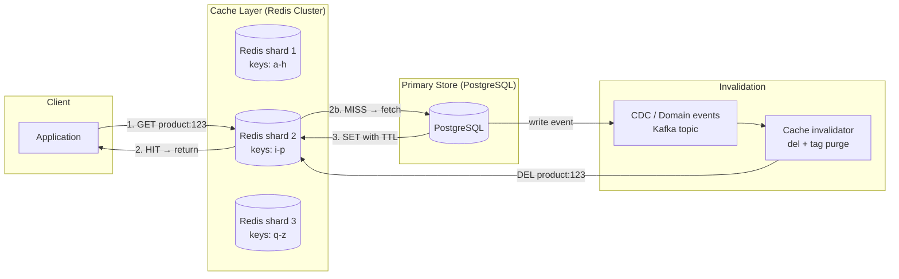

# Caching Strategies & Patterns

## Category

Data Solutions, Caching, Redis, Cache-Aside, Write-Through, Read-Through, CDN, Cache Invalidation, Distributed Cache

## Context

**Caching** stores the result of an expensive operation (database query, API call, computation) in fast memory so subsequent requests can be served without repeating the work. It is one of the most impactful performance optimisations available — often reducing response times by orders of magnitude and database load by 90%+.

### Cache types by location

| Type                     | Location                      | Latency       | Use case                              |
| ------------------------ | ----------------------------- | ------------- | ------------------------------------- |
| **In-process (L1)**      | Application heap (LRU Map)    | ~0.1 ms       | Single-instance, hot-path objects     |
| **Distributed (L2)**     | Redis / Memcached             | ~1 ms         | Multi-instance consistency            |
| **CDN**                  | Edge PoP (CloudFront, Akamai) | ~5 ms         | Static assets, public API responses   |
| **HTTP cache**           | Browser / reverse proxy       | ~0 ms (local) | `Cache-Control`, ETags                |
| **Database query cache** | Database buffer pool          | ~0.5 ms       | Repeated identical queries (built-in) |

### Cache patterns

| Pattern                       | Write path                                       | Read path                                     | Best for                                       |
| ----------------------------- | ------------------------------------------------ | --------------------------------------------- | ---------------------------------------------- |
| **Cache-Aside (Lazy)**        | App writes DB only                               | App checks cache → miss → DB → populate cache | Most general purpose                           |
| **Read-Through**              | App writes DB only                               | Cache fetches from DB on miss transparently   | Simpler app code; cache library handles misses |
| **Write-Through**             | App writes cache; cache writes DB synchronously  | Always reads from cache                       | Strong consistency; higher write latency       |
| **Write-Behind (Write-Back)** | App writes cache; cache writes DB asynchronously | Always reads from cache                       | High write throughput; risk of data loss       |
| **Refresh-Ahead**             | Background refresh before TTL expires            | Always serves from cache                      | Predictable access patterns; zero miss latency |

### Cache invalidation strategies

| Strategy                      | Description                                       | Trade-off                                         |
| ----------------------------- | ------------------------------------------------- | ------------------------------------------------- |
| **TTL expiry**                | Cache entry expires after a fixed duration        | Simple; stale data during the TTL window          |
| **Event-driven invalidation** | CDC / domain event triggers cache delete          | Near-real-time freshness; requires event pipeline |
| **Version key**               | Embed version in key: `user:{id}:v{version}`      | Instant invalidation by incrementing version      |
| **Tag-based invalidation**    | Group keys by tag; invalidate all keys with a tag | Flexible; requires tag index                      |

---

## Pros

- **Dramatic latency reduction**: Memory reads (~1 ms) vs database reads (~10–100 ms) — 10–100× faster for cached hits.
- **Database protection**: Cache absorbs thundering herd — protects DB during traffic spikes.
- **Cost reduction**: Fewer DB queries = fewer compute units consumed — direct cost saving on serverless DB models.
- **Horizontal scalability**: Redis Cluster shards the keyspace across nodes — scales to billions of keys.
- **Versatile data structures**: Redis supports strings, hashes, sorted sets, lists, bitmaps, streams — suitable for rate limiting, leaderboards, session storage, pub/sub, and more.

---

## Cons

- **Cache invalidation complexity**: Famously described as one of the two hard problems in computer science — stale data bugs are subtle and hard to reproduce.
- **Cache stampede (thundering herd)**: When a popular key expires, many concurrent requests miss simultaneously and all query the DB — requires probabilistic early expiry or locking.
- **Memory cost**: Redis stores data in RAM — expensive at scale; requires careful TTL and eviction policy design.
- **Inconsistency window**: Cache-Aside pattern has a window between DB write and cache invalidation during which stale data is served.
- **Serialisation overhead**: Storing complex objects requires serialisation (JSON/MessagePack) — adds CPU cost and constrains schema evolution.

---

## Design Diagram



---

## Code Sample

### TypeScript — Cache-Aside with stampede protection

```typescript
// src/cache/product-cache.ts
// Cache-Aside pattern with probabilistic early expiry to prevent stampede

import { createClient, RedisClientType } from "redis";
import { gzip, gunzip } from "zlib";
import { promisify } from "util";

const gzipAsync = promisify(gzip);
const gunzipAsync = promisify(gunzip);

let redis: RedisClientType;

export async function getRedisClient(): Promise<RedisClientType> {
  if (!redis) {
    redis = createClient({
      url: process.env.REDIS_URL!,
      socket: { tls: true, rejectUnauthorized: true },
      password: process.env.REDIS_PASSWORD,
    }) as RedisClientType;
    await redis.connect();
  }
  return redis;
}

interface CacheEntry<T> {
  data: T;
  createdAt: number;
  ttlSeconds: number;
}

const DEFAULT_TTL = 300; // 5 minutes
const BETA = 1.0; // Probabilistic early expiry coefficient

/**
 * Probabilistic early expiry: recompute before TTL expires to avoid stampede.
 * Formula: currentTime - (delta * BETA * ln(random())) > expiryTime
 */
function shouldRecompute(
  createdAt: number,
  ttlSeconds: number,
  recomputeDelta: number,
): boolean {
  const expiryTime = createdAt + ttlSeconds * 1000;
  const now = Date.now();
  return (
    now - recomputeDelta * BETA * Math.log(Math.random()) * 1000 > expiryTime
  );
}

export async function cacheAside<T>(
  key: string,
  fetcher: () => Promise<T>,
  ttlSeconds: number = DEFAULT_TTL,
): Promise<T> {
  const client = await getRedisClient();

  // Try cache hit
  const cached = await client.get(key);
  if (cached) {
    const entry = JSON.parse(
      (await gunzipAsync(Buffer.from(cached, "base64"))).toString(),
    ) as CacheEntry<T>;

    // Probabilistic early expiry: recompute if close to expiry AND random check triggers
    if (
      !shouldRecompute(
        entry.createdAt,
        entry.ttlSeconds,
        10 /* 10s recompute window */,
      )
    ) {
      return entry.data;
    }
    // Fall through to recompute
  }

  // Cache miss or early expiry — fetch from source
  const data = await fetcher();
  const entry: CacheEntry<T> = { data, createdAt: Date.now(), ttlSeconds };
  const compressed = (await gzipAsync(JSON.stringify(entry))).toString(
    "base64",
  );

  // SET with EX — atomic: key that expires automatically
  await client.set(key, compressed, { EX: ttlSeconds });

  return data;
}

// ─── Cache invalidation ───────────────────────────────────────────────────────

export async function invalidate(key: string): Promise<void> {
  const client = await getRedisClient();
  await client.del(key);
}

export async function invalidatePattern(pattern: string): Promise<void> {
  const client = await getRedisClient();
  // SCAN instead of KEYS to avoid blocking the Redis event loop
  let cursor = 0;
  do {
    const result = await client.scan(cursor, { MATCH: pattern, COUNT: 100 });
    cursor = result.cursor;
    if (result.keys.length > 0) await client.del(result.keys);
  } while (cursor !== 0);
}
```

### TypeScript — Rate limiter using Redis sorted sets + sliding window

```typescript
// src/cache/rate-limiter.ts
// Sliding-window rate limiter using Redis sorted sets — accurate, no count drift

import { getRedisClient } from "./product-cache";

interface RateLimitResult {
  allowed: boolean;
  remaining: number;
  resetAt: number; // Unix ms timestamp when the window resets
}

/**
 * Sliding window rate limiter.
 * Stores request timestamps in a sorted set with score = timestamp.
 * Window: entries older than (now - windowMs) are pruned on each call.
 */
export async function checkRateLimit(
  identifier: string, // e.g., 'user:123' or 'ip:1.2.3.4'
  limit: number, // max requests per window
  windowMs: number, // window duration in milliseconds
): Promise<RateLimitResult> {
  const client = await getRedisClient();
  const key = `ratelimit:${identifier}`;
  const now = Date.now();
  const windowStart = now - windowMs;

  // Atomic Lua script: prune old entries + count + conditionally add
  const script = `
    local key          = KEYS[1]
    local now          = tonumber(ARGV[1])
    local windowStart  = tonumber(ARGV[2])
    local limit        = tonumber(ARGV[3])
    local windowMs     = tonumber(ARGV[4])

    -- Remove entries outside the window
    redis.call('ZREMRANGEBYSCORE', key, '-inf', windowStart)

    local count = redis.call('ZCARD', key)

    if count < limit then
      -- Add current request timestamp
      redis.call('ZADD', key, now, now)
      redis.call('PEXPIRE', key, windowMs)
      return {1, limit - count - 1, now + windowMs}
    else
      return {0, 0, now + windowMs}
    end
  `;

  const [allowed, remaining, resetAt] = (await client.eval(script, {
    keys: [key],
    arguments: [
      now.toString(),
      windowStart.toString(),
      limit.toString(),
      windowMs.toString(),
    ],
  })) as [number, number, number];

  return { allowed: allowed === 1, remaining, resetAt };
}
```

### YAML — Redis Cluster Helm values (production configuration)

```yaml
# helm/redis/values.yaml
# Redis Cluster for production: 3 masters, 3 replicas, TLS, auth, RDB + AOF persistence

architecture: cluster
cluster:
  enabled: true
  slaveCount: 1 # 1 replica per master (6 pods total for 3 shards)

auth:
  enabled: true
  existingSecret: redis-auth # Kubernetes Secret with redis-password key

tls:
  enabled: true
  autoGenerated: false
  existingSecret: redis-tls # Cert-manager managed TLS cert

master:
  resources:
    requests: { cpu: 500m, memory: 1Gi }
    limits: { cpu: 2, memory: 4Gi }
  persistence:
    enabled: true
    size: 20Gi
    storageClass: managed-premium

replica:
  resources:
    requests: { cpu: 250m, memory: 512Mi }
    limits: { cpu: 1, memory: 2Gi }

# Combined RDB snapshot + AOF for durability
commonConfiguration: |-
  save 60 1000
  appendonly yes
  appendfsync everysec
  maxmemory-policy allkeys-lru   # Evict least-recently-used keys when memory full

metrics:
  enabled: true
  serviceMonitor:
    enabled: true # Prometheus operator ServiceMonitor
```
