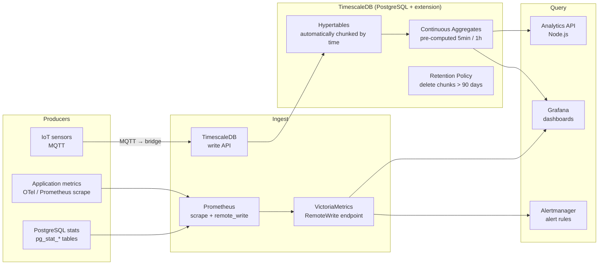

# Time-Series Data & Analytics

## Category
Data Solutions, Time-Series, InfluxDB, TimescaleDB, Prometheus, Victoria Metrics, IoT, Metrics, Continuous Aggregates, Retention Policies

## Context

**Time-series data** is a sequence of data points indexed in chronological order, where the timestamp is a first-class dimension. It is characterised by high ingest volume (millions of points per second), immutability (historical data rarely changes), and query patterns that are time-bounded and aggregate-heavy (averages, percentiles, rates, downsampling).

### Where time-series data appears

| Domain | Example data | Query pattern |
|--------|-------------|--------------|
| **Infrastructure metrics** | CPU%, memory, disk I/O per host | 1-hour avg per host over 7 days |
| **Application metrics** | Request rate, error rate, latency p99 | 5-min rollup, alert if p99 > 200 ms |
| **IoT / sensor data** | Temperature, pressure, vibration per device | Anomaly detection over last 24h |
| **Financial market data** | Price ticks per instrument | OHLCV aggregation, VWAP |
| **Business KPIs** | DAU, revenue per minute, conversion rate | Trend over 30 days, YoY comparison |

### Specialised time-series databases vs general purpose

| Database | Type | Strengths |
|---------|------|-----------|
| **Prometheus** | Pull-based metrics | Native K8s metrics, PromQL, alert rules |
| **InfluxDB v3** | Purpose-built TSDB | IOx columnar engine, line protocol, Flux/SQL |
| **TimescaleDB** | PostgreSQL extension | SQL-native, hypertables, continuous aggregates |
| **VictoriaMetrics** | Prometheus-compatible | Low resource usage, high cardinality, long retention |
| **QuestDB** | SIMD-optimised SQL | Extremely fast ingestion and time-range queries |
| **Apache Druid** | OLAP + time-series | Sub-second analytics on billions of rows |

### Retention and downsampling

Time-series data grows unbounded — retention policies and downsampling are essential:

```
Raw data (1s resolution)    → keep 7 days
5-min aggregates            → keep 90 days
1-hour aggregates           → keep 2 years
1-day aggregates            → keep forever
```

---

## Pros

- **Columnar storage efficiency**: Same-type values in a column compress extremely well (delta encoding, Gorilla compression) — 10–20× better than row-based.
- **Continuous aggregates**: TimescaleDB and InfluxDB pre-compute rollups incrementally — dashboards return instantly with no on-the-fly aggregation.
- **Native time functions**: `time_bucket()`, `date_bin()`, `window()` — purpose-built functions that are awkward to express in general-purpose SQL.
- **Automatic retention**: Lifecycle policies delete or downsample old data automatically — no manual maintenance.
- **High ingest throughput**: Specialised ingestion paths (line protocol, batch writes) support millions of points/second on commodity hardware.

---

## Cons

- **Schema rigidity**: Tags (indexed labels) vs fields (unindexed values) distinction in InfluxDB is complex — wrong choice causes high cardinality and query slowness.
- **High cardinality kills performance**: Indexing every unique `user_id` in a time-series DB creates millions of series — most TSDBs degrade significantly above ~10M series.
- **Limited JOIN support**: TSDBs optimise for single-series queries — joining metrics with relational data typically requires an external query layer.
- **Learning curve**: PromQL, Flux, and TSDB-specific SQL dialects require dedicated training time.
- **Backfill complexity**: Inserting historical data out of order can bypass continuous aggregates — requires manual refresh.

---

## Design Diagram



---

## Code Sample

### SQL — TimescaleDB hypertable + continuous aggregate

```sql
-- migrations/V001_create_metrics_hypertable.sql
-- Create a hypertable for high-frequency sensor readings

CREATE TABLE IF NOT EXISTS sensor_readings (
    time        TIMESTAMPTZ NOT NULL,
    device_id   TEXT        NOT NULL,
    metric      TEXT        NOT NULL,    -- e.g., 'temperature', 'humidity'
    value       DOUBLE PRECISION NOT NULL,
    unit        TEXT,
    tags        JSONB DEFAULT '{}'
);

-- Convert to hypertable partitioned by time (7-day chunks)
SELECT create_hypertable(
    'sensor_readings',
    'time',
    chunk_time_interval => INTERVAL '7 days',
    if_not_exists       => TRUE
);

-- Indexes: time + device_id for device-based queries + metric filter
CREATE INDEX IF NOT EXISTS idx_sensor_device_time
    ON sensor_readings (device_id, metric, time DESC);

-- Enable native compression on chunks older than 3 days
ALTER TABLE sensor_readings SET (
    timescaledb.compress,
    timescaledb.compress_segmentby = 'device_id, metric'
);

SELECT add_compression_policy('sensor_readings', INTERVAL '3 days');

-- Retention: delete raw data older than 90 days
SELECT add_retention_policy('sensor_readings', INTERVAL '90 days');

-- ── Continuous aggregate: 5-minute summaries ──────────────────────────────────

CREATE MATERIALIZED VIEW sensor_5min
WITH (timescaledb.continuous) AS
SELECT
    time_bucket('5 minutes', time)  AS bucket,
    device_id,
    metric,
    AVG(value)                       AS avg_value,
    MIN(value)                       AS min_value,
    MAX(value)                       AS max_value,
    PERCENTILE_CONT(0.95) WITHIN GROUP (ORDER BY value) AS p95_value,
    COUNT(*)                         AS sample_count
FROM sensor_readings
GROUP BY bucket, device_id, metric
WITH NO DATA;

-- Refresh policy: update the aggregate every 5 minutes for the last 6 hours
SELECT add_continuous_aggregate_policy(
    'sensor_5min',
    start_offset => INTERVAL '6 hours',
    end_offset   => INTERVAL '5 minutes',
    schedule_interval => INTERVAL '5 minutes'
);

-- Longer-term aggregate: 1-hour rollup from 5-min (aggregate-on-aggregate)
CREATE MATERIALIZED VIEW sensor_1h
WITH (timescaledb.continuous) AS
SELECT
    time_bucket('1 hour', bucket)   AS bucket,
    device_id,
    metric,
    AVG(avg_value)                   AS avg_value,
    MIN(min_value)                   AS min_value,
    MAX(max_value)                   AS max_value,
    SUM(sample_count)                AS sample_count
FROM sensor_5min
GROUP BY 1, device_id, metric
WITH NO DATA;

SELECT add_continuous_aggregate_policy(
    'sensor_1h',
    start_offset => INTERVAL '2 days',
    end_offset   => INTERVAL '1 hour',
    schedule_interval => INTERVAL '1 hour'
);
```

### TypeScript — High-throughput ingestion with batch writes

```typescript
// src/timeseries/sensor-ingest.ts
// Buffers sensor readings and flushes in batches for high-throughput ingestion

import { Pool } from 'pg';

const pool = new Pool({
  connectionString: process.env.TIMESCALEDB_URL!,
  max:              10,
  ssl:              { rejectUnauthorized: true },
});

interface SensorReading {
  time:     Date;
  deviceId: string;
  metric:   string;
  value:    number;
  unit?:    string;
  tags?:    Record<string, string>;
}

class SensorIngestionBuffer {
  private buffer: SensorReading[] = [];
  private flushTimer: ReturnType<typeof setTimeout> | null = null;

  constructor(
    private readonly batchSize:    number = 1000,
    private readonly flushIntervalMs: number = 5000,
  ) {}

  add(reading: SensorReading): void {
    this.buffer.push(reading);
    if (this.buffer.length >= this.batchSize) {
      this.flush();
    } else if (!this.flushTimer) {
      this.flushTimer = setTimeout(() => this.flush(), this.flushIntervalMs);
    }
  }

  async flush(): Promise<void> {
    if (this.buffer.length === 0) return;

    if (this.flushTimer) { clearTimeout(this.flushTimer); this.flushTimer = null; }

    const batch = this.buffer.splice(0, this.buffer.length);
    const client = await pool.connect();

    try {
      // Build parameterised bulk INSERT using unnest (efficient for large batches)
      const times     = batch.map(r => r.time);
      const deviceIds = batch.map(r => r.deviceId);
      const metrics   = batch.map(r => r.metric);
      const values    = batch.map(r => r.value);
      const units     = batch.map(r => r.unit ?? null);
      const tags      = batch.map(r => JSON.stringify(r.tags ?? {}));

      await client.query(`
        INSERT INTO sensor_readings (time, device_id, metric, value, unit, tags)
        SELECT * FROM unnest(
          $1::TIMESTAMPTZ[],
          $2::TEXT[],
          $3::TEXT[],
          $4::DOUBLE PRECISION[],
          $5::TEXT[],
          $6::JSONB[]
        )
        ON CONFLICT DO NOTHING
      `, [times, deviceIds, metrics, values, units, tags]);

      console.log(`Flushed ${batch.length} sensor readings`);
    } finally {
      client.release();
    }
  }
}

const ingestionBuffer = new SensorIngestionBuffer(1000, 5000);
export { ingestionBuffer };
```
