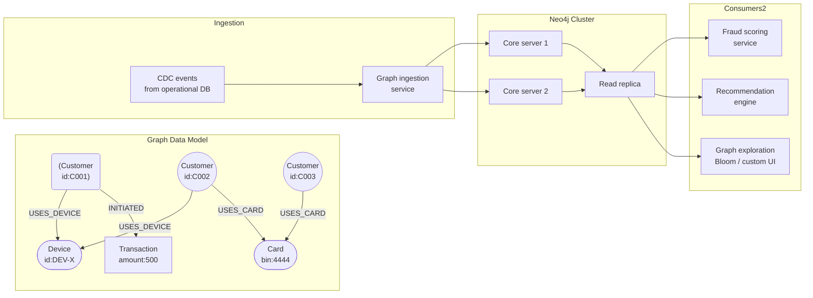

# Graph Databases & Relationship Modelling

## Category

Data Solutions, Graph Database, Neo4j, Amazon Neptune, Knowledge Graph, Fraud Detection, Recommendation Engine, Cypher

## Context

**Graph databases** model data as a network of **nodes** (entities) and **edges** (relationships), with properties on both. They excel when relationships are first-class — when you need to traverse connections rather than join rows.

### When to use a graph database

| Use case                   | Why graph wins over relational                                                                                       |
| -------------------------- | -------------------------------------------------------------------------------------------------------------------- |
| **Fraud detection**        | Find rings of shared identities: `(A)-[:SHARES_DEVICE]->( B)-[:SHARES_CARD]->(C)` — 3+ hop traversal in milliseconds |
| **Recommendation engine**  | Collaborative filtering: "users like you also bought" via common purchase edges                                      |
| **Identity graph**         | Unify customer identities across devices, emails, phone numbers                                                      |
| **Knowledge graph**        | Enterprise ontologies, semantic search enrichment                                                                    |
| **Access control (ReBAC)** | Zanzibar-style relationship-based authorisation                                                                      |
| **Network/IT topology**    | Infrastructure dependency mapping, blast radius analysis                                                             |
| **Social network**         | Followers, friends-of-friends, influence scoring                                                                     |

### Graph data model

```
Node:  (Customer {id, name, email})
Edge:  (Customer)-[:PURCHASED {amount, timestamp}]->(Product)
       (Customer)-[:SHARES_DEVICE {device_id}]->(Customer)
```

### Graph databases comparison

| Database           | Query language                | Strengths                                         |
| ------------------ | ----------------------------- | ------------------------------------------------- |
| **Neo4j**          | Cypher                        | Richest ecosystem, ACID, Bloom visualiser         |
| **Amazon Neptune** | Gremlin / SPARQL / openCypher | Fully managed, deep AWS integration               |
| **ArangoDB**       | AQL                           | Multi-model (document + graph + key-value)        |
| **TigerGraph**     | GSQL                          | Massively parallel analytics on very large graphs |
| **Dgraph**         | GraphQL+- / DQL               | Horizontally scalable, native GraphQL             |

---

## Pros

- **Variable-depth traversal**: `MATCH (a)-[:CONNECTED*1..5]->(b)` traverses up to 5 hops — trivial in Cypher, extremely complex in recursive SQL CTEs.
- **Relationship properties**: Edges carry metadata (timestamps, amounts, confidence scores) — not just a join table row.
- **Intuitive modelling**: Domain experts can read the graph model directly — nodes and relationships map to business concepts.
- **Real-time fraud detection**: Graph traversal to identify shared attributes across accounts runs in milliseconds vs hours in relational batch.
- **Flexible schema**: Add new relationship types or node properties without migration — ideal for evolving domain models.

---

## Cons

- **Not a replacement for relational DBs**: Tabular data (invoices, products, transactions) is better in PostgreSQL — graph is a specialist tool.
- **Limited analytics**: Aggregations, window functions, and reporting are cumbersome compared to SQL on a warehouse.
- **Scaling writes**: Neo4j Community Edition is single-instance; clustering (Enterprise) is expensive. Neptune scales reads but writes still route to a single primary.
- **Query optimisation complexity**: Poorly written Cypher queries (e.g., large Cartesian products) can cause OOM — requires query profiling with EXPLAIN.
- **Operational unfamiliarity**: Graph databases have a smaller talent pool than PostgreSQL — index management (composite, full-text) differs significantly.

---

## Design Diagram



---

## Code Sample

### Cypher — Fraud ring detection queries

```cypher
// Detect shared device rings: find customers who share a device with a flagged customer
// and also share a card with another customer in that ring (2-hop common attribute fraud)

MATCH (flagged:Customer {risk_score_bucket: 'HIGH'})
      -[:USES_DEVICE]->(device:Device)
      <-[:USES_DEVICE]-(suspect:Customer)
WHERE suspect.id <> flagged.id
  AND suspect.account_status <> 'BLOCKED'

// Extend: does the suspect also share a payment card with anyone else in the ring?
OPTIONAL MATCH (suspect)-[:USES_CARD]->(card:Card)<-[:USES_CARD]-(ring_member:Customer)
WHERE ring_member.id <> suspect.id

RETURN
    flagged.id              AS flagged_customer,
    suspect.id              AS suspect_customer,
    device.device_id        AS shared_device,
    COUNT(ring_member)      AS ring_size,
    COLLECT(ring_member.id) AS ring_members
ORDER BY ring_size DESC
LIMIT 50;

// ─── Create fraud relationship when ring is confirmed ───────────────────────
// (Run after human review or automated scoring threshold)

MATCH (c1:Customer {id: $customerId1}), (c2:Customer {id: $customerId2})
MERGE (c1)-[r:SUSPECTED_FRAUD_RING {
    detected_at: datetime(),
    confidence:  $confidence,
    reason:      $reason
}]-(c2)
RETURN c1, r, c2;
```

### TypeScript — Neo4j driver: graph ingestion + shortest path query

```typescript
// src/graph/identity-graph.ts
// Ingests customer identity signals and queries for fraud risk via shared attributes

import neo4j, { Driver, Session } from "neo4j-driver";

let driver: Driver;

function getDriver(): Driver {
  if (!driver) {
    driver = neo4j.driver(
      process.env.NEO4J_URI!,
      neo4j.auth.basic(process.env.NEO4J_USER!, process.env.NEO4J_PASSWORD!),
      { maxConnectionPoolSize: 50, connectionAcquisitionTimeout: 5000 },
    );
  }
  return driver;
}

// ─── Upsert a customer node and their identity signals ───────────────────────

interface IdentitySignal {
  customerId: string;
  deviceId?: string;
  cardBin?: string;
  emailHash?: string;
  ipAddress?: string;
}

export async function upsertIdentitySignals(
  signal: IdentitySignal,
): Promise<void> {
  const session: Session = getDriver().session({
    defaultAccessMode: neo4j.session.WRITE,
  });

  try {
    await session.executeWrite(async (tx) => {
      // Upsert customer node
      await tx.run(
        `MERGE (c:Customer {id: $customerId}) SET c.updated_at = datetime()`,
        { customerId: signal.customerId },
      );

      // Upsert device relationship
      if (signal.deviceId) {
        await tx.run(
          `
          MERGE (d:Device {id: $deviceId})
          MERGE (c:Customer {id: $customerId})
          MERGE (c)-[:USES_DEVICE {first_seen: datetime()}]->(d)
        `,
          { customerId: signal.customerId, deviceId: signal.deviceId },
        );
      }

      // Upsert card BIN relationship
      if (signal.cardBin) {
        await tx.run(
          `
          MERGE (card:Card {bin: $cardBin})
          MERGE (c:Customer {id: $customerId})
          MERGE (c)-[:USES_CARD {first_seen: datetime()}]->(card)
        `,
          { customerId: signal.customerId, cardBin: signal.cardBin },
        );
      }

      // Upsert email hash node (store hash, not plaintext — privacy by design)
      if (signal.emailHash) {
        await tx.run(
          `
          MERGE (e:Email {hash: $emailHash})
          MERGE (c:Customer {id: $customerId})
          MERGE (c)-[:USES_EMAIL]->(e)
        `,
          { customerId: signal.customerId, emailHash: signal.emailHash },
        );
      }
    });
  } finally {
    await session.close();
  }
}

// ─── Fraud risk: count shared identity attributes within 2 hops ──────────────

export async function getFraudRiskScore(customerId: string): Promise<number> {
  const session: Session = getDriver().session({
    defaultAccessMode: neo4j.session.READ,
  });

  try {
    const result = await session.executeRead((tx) =>
      tx.run(
        `
      MATCH (c:Customer {id: $customerId})

      // Count distinct customers who share any identity attribute with this customer
      OPTIONAL MATCH (c)-[:USES_DEVICE|USES_CARD|USES_EMAIL]->(shared)<-[:USES_DEVICE|USES_CARD|USES_EMAIL]-(other:Customer)
      WHERE other.id <> c.id

      WITH c, COUNT(DISTINCT other) AS shared_identity_count,
              COUNT(DISTINCT shared)  AS shared_attribute_count

      RETURN shared_identity_count, shared_attribute_count
    `,
        { customerId },
      ),
    );

    if (result.records.length === 0) return 0;

    const sharedCount = result.records[0]
      .get("shared_identity_count")
      .toNumber();
    // Simple risk heuristic: normalise to 0–100 score
    return Math.min(100, sharedCount * 10);
  } finally {
    await session.close();
  }
}
```
