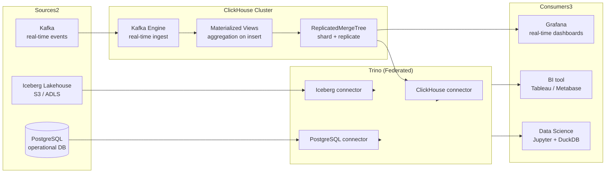

# Analytical Query Engines & OLAP

## Category

Data Solutions, OLAP, ClickHouse, Apache Druid, Trino, DuckDB, Presto, Columnar Storage, Federated Queries, Materialized Views

## Context

**Analytical query engines** are purpose-built for Online Analytical Processing (OLAP) — executing complex, aggregation-heavy SQL over billions of rows in seconds. They differ fundamentally from OLTP databases (PostgreSQL, MySQL) which optimise for fast single-row read/write.

### OLTP vs OLAP comparison

| Aspect                | OLTP (PostgreSQL)                 | OLAP (ClickHouse, Druid)                           |
| --------------------- | --------------------------------- | -------------------------------------------------- |
| **Query pattern**     | Point lookups, short transactions | Full table scans, aggregations                     |
| **Record throughput** | ~10K TPS                          | Millions of rows/second (reads)                    |
| **Latency**           | Milliseconds                      | Seconds (complex) to milliseconds (pre-aggregated) |
| **Data model**        | Normalised rows                   | Denormalised / columnar                            |
| **Concurrency**       | High (thousands of writers)       | Lower (fewer but heavier queries)                  |
| **Storage format**    | Row-based (heap pages)            | Columnar (Parquet, ZSTD-compressed)                |

### OLAP engine comparison

| Engine               | Ingestion model              | Query language        | Sweet spot                                 |
| -------------------- | ---------------------------- | --------------------- | ------------------------------------------ |
| **ClickHouse**       | Push (INSERT, Kafka engine)  | SQL                   | Sub-second analytics; real-time dashboards |
| **Apache Druid**     | Stream (Kafka) + batch       | Druid SQL / native    | High-concurrency, always-on dashboards     |
| **Trino / Presto**   | Federated (reads any source) | ANSI SQL              | Query across S3, Iceberg, PostgreSQL, Hive |
| **Apache Spark SQL** | Batch                        | Spark SQL / DataFrame | Large-scale ETL + interactive SQL          |
| **DuckDB**           | Local file (Parquet, CSV)    | ANSI SQL              | Embedded analytics, local data science     |
| **BigQuery**         | Managed (GCS LOAD)           | Standard SQL          | Serverless; pay-per-query                  |
| **Snowflake**        | Managed (COPY INTO)          | Snowflake SQL         | Cloud DW; auto-scaling compute             |

---

## Pros

- **Columnar compression**: Storing a single column together enables dictionary encoding and delta compression — 5–10× space saving over row storage.
- **Vectorised execution**: SIMD CPU instructions process 256–512 bits per clock cycle — orders-of-magnitude faster than row-by-row iteration.
- **Separation of storage and compute**: Trino and Spark read from object store (S3/ADLS) — scale compute independently of data volume.
- **Federated querying (Trino)**: Single query joining data across Iceberg, PostgreSQL, Elasticsearch, and Kafka — eliminates complex ETL pipelines for ad-hoc analysis.
  | **Materialized views**: Pre-computed aggregates refreshed on ingestion — sub-second dashboard queries on petabyte-scale data.

---

## Cons

- **Eventual consistency**: ClickHouse, Druid, and Spark are not ACID by default — late-arriving data may be processed out of order.
- **No point lookups**: Columnar engines are slow for `SELECT * WHERE id = 'X'` — always use an OLTP database for operational queries.
- **Schema evolution cost**: Altering a ClickHouse table on a petabyte partition requires time and careful merge tree management.
- **High hardware requirements**: ClickHouse recommends NVMe SSDs and high-memory nodes — on-prem deployment is expensive.
- **Trino latency floor**: Federated queries add coordination overhead — minimum latency is ~1–3 seconds regardless of data size.

---

## Design Diagram



---

## Code Sample

### SQL — ClickHouse: MergeTree table + Kafka engine + materialized view pipeline

```sql
-- ClickHouse real-time analytics pipeline
-- Step 1: Target table for payments analytics (ReplicatedMergeTree for HA)

CREATE TABLE IF NOT EXISTS payments_analytics ON CLUSTER '{cluster}'
(
    payment_id      String,
    customer_id     String,
    merchant_id     String,
    amount          Decimal(18, 2),
    currency        LowCardinality(String),   -- LowCardinality = dictionary encoded
    status          LowCardinality(String),
    event_ts        DateTime64(3, 'UTC'),
    processing_date Date MATERIALIZED toDate(event_ts)
)
ENGINE = ReplicatedMergeTree('/clickhouse/{cluster}/tables/{shard}/payments_analytics', '{replica}')
PARTITION BY toYYYYMM(event_ts)      -- Monthly partitions for efficient pruning
ORDER BY (merchant_id, customer_id, event_ts)   -- Primary sort key = frequent filter columns
TTL processing_date + INTERVAL 2 YEAR;          -- Auto-delete data older than 2 years


-- Step 2: Kafka Engine — consumes from Kafka topic into a buffer table

CREATE TABLE payments_kafka ON CLUSTER '{cluster}'
(
    payment_id   String,
    customer_id  String,
    merchant_id  String,
    amount       String,     -- Read as String from JSON; cast in the MV
    currency     String,
    status       String,
    event_ts     String
)
ENGINE = Kafka
SETTINGS
    kafka_broker_list     = 'kafka:9092',
    kafka_topic_list      = 'payments.events',
    kafka_group_name      = 'clickhouse-payments-consumer',
    kafka_format          = 'JSONEachRow',
    kafka_num_consumers   = 4,
    kafka_skip_broken_messages = 100;   -- Skip unparseable messages instead of halting


-- Step 3: Materialized view — routes from Kafka buffer to analytics table with transformation

CREATE MATERIALIZED VIEW payments_kafka_mv ON CLUSTER '{cluster}'
TO payments_analytics AS
SELECT
    payment_id,
    customer_id,
    merchant_id,
    toDecimal64(amount, 2)                               AS amount,
    currency,
    status,
    parseDateTimeBestEffortOrNull(event_ts, 'UTC')       AS event_ts
FROM payments_kafka
WHERE parseDateTimeBestEffortOrNull(event_ts, 'UTC') IS NOT NULL;  -- Discard malformed rows


-- Step 4: Pre-aggregated materialized view for merchant hourly revenue
-- Updated on every INSERT — dashboard queries return in <100ms

CREATE MATERIALIZED VIEW merchant_hourly_revenue ON CLUSTER '{cluster}'
ENGINE = SummingMergeTree()           -- Automatically sums duplicates with same ORDER BY key
PARTITION BY toYYYYMM(hour)
ORDER BY (merchant_id, currency, hour)
AS
SELECT
    merchant_id,
    currency,
    toStartOfHour(event_ts)     AS hour,
    sumIf(amount, status = 'completed')  AS revenue,
    countIf(status = 'completed')        AS tx_count,
    countIf(status = 'failed')           AS failed_count
FROM payments_analytics
GROUP BY merchant_id, currency, hour;
```

### TypeScript — Trino federated query client

```typescript
// src/analytics/federated-query.ts
// Run federated queries across Iceberg + PostgreSQL via Trino REST API

interface TrinoQueryResult {
  columns: { name: string; type: string }[];
  data: unknown[][];
  stats: { elapsedTimeMillis: number; processedRows: number };
}

async function runTrinoQuery(sql: string): Promise<TrinoQueryResult> {
  const baseUrl = process.env.TRINO_URL!;
  const headers = {
    "X-Trino-User": process.env.TRINO_USER ?? "analytics-service",
    "X-Trino-Catalog": "lakehouse",
    "X-Trino-Schema": "gold",
    "Content-Type": "text/plain",
  };

  // Submit query
  const submitRes = await fetch(`${baseUrl}/v1/statement`, {
    method: "POST",
    headers,
    body: sql,
  });
  if (!submitRes.ok)
    throw new Error(`Trino submit failed: ${submitRes.status}`);

  let response = (await submitRes.json()) as {
    id: string;
    nextUri?: string;
    columns?: { name: string; type: string }[];
    data?: unknown[][];
    stats: { elapsedTimeMillis: number; processedRows: number; state: string };
    error?: { message: string };
  };

  // Poll until complete
  const allData: unknown[][] = [];
  while (response.nextUri) {
    await new Promise((r) => setTimeout(r, 200)); // Poll interval
    const pollRes = await fetch(response.nextUri, { headers });
    response = await pollRes.json();

    if (response.error)
      throw new Error(`Trino query error: ${response.error.message}`);
    if (response.data) allData.push(...response.data);
  }

  return {
    columns: response.columns ?? [],
    data: allData,
    stats: response.stats,
  };
}

// Example: federated query joining Iceberg payments with PostgreSQL customer data
export async function revenueByCustomerSegment(
  dateFrom: string,
  dateTo: string,
) {
  const result = await runTrinoQuery(`
    SELECT
        pg.customer_segment,
        SUM(ice.amount)              AS total_revenue,
        COUNT(*)                     AS transaction_count,
        AVG(ice.amount)              AS avg_transaction
    FROM lakehouse.gold.fact_payments AS ice
    -- Cross-catalog join: Iceberg mart + PostgreSQL operational DB
    JOIN postgresql.public.customers AS pg
        ON ice.customer_natural_key = pg.id
    WHERE ice.event_date BETWEEN DATE '${dateFrom}' AND DATE '${dateTo}'
      AND ice.payment_status = 'completed'
    GROUP BY pg.customer_segment
    ORDER BY total_revenue DESC
  `);

  console.log(
    `Query completed in ${result.stats.elapsedTimeMillis}ms, ${result.stats.processedRows} rows scanned`,
  );
  return result;
}
```
