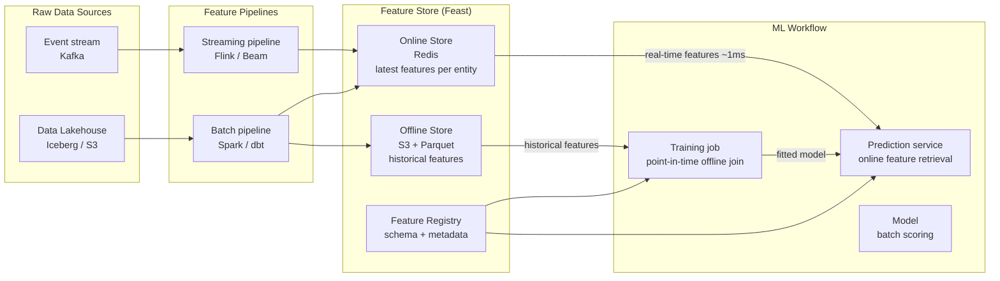

# ML Feature Store & Data for AI

## Category
Data Solutions, Feature Store, MLOps, Feast, Tecton, Feature Engineering, Training/Serving Skew, Online/Offline Store

## Context

A **Feature Store** is a centralised platform for storing, computing, sharing, and serving machine learning features — the engineered signals fed to ML models during both training and serving. Without a feature store, engineering teams repeatedly compute the same features in isolated notebooks and pipelines, and training/serving skew (different feature values at training vs at inference time) becomes a major source of model degradation.

### Core concepts

| Concept | Description |
|---------|-------------|
| **Feature** | A single transformed input signal for a model (e.g., `customer_avg_tx_amount_30d`) |
| **Feature view** | A group of related features with shared entity key and data source |
| **Entity** | The subject the feature describes (customer_id, product_id, session_id) |
| **Offline store** | Historical feature values for model training (S3, BigQuery, Snowflake) |
| **Online store** | Low-latency feature values for real-time inference (Redis, DynamoDB, Bigtable) |
| **Feature pipeline** | The job that computes and materialises features from raw data |
| **Point-in-time join** | Joining features to training labels using the feature value at the label's timestamp — prevents data leakage |

### Training/serving skew

The most common ML reliability failure — the feature computed at training time differs from the feature served at inference time:

| Root cause | Example |
|-----------|---------|
| Different code paths | Python notebook vs production feature pipeline |
| Different data sources | Raw DB for training vs derived column for serving |
| Clock skew | Training uses `NOW()` instead of event timestamp |
| Aggregation window mismatch | 30-day average in training vs 7-day at serving |

A feature store eliminates skew by using **one computation definition** for both offline and online materialisation.

---

## Pros

- **Eliminate training/serving skew**: One feature definition used for both training data generation and real-time serving.
- **Feature reuse**: A `customer_spend_30d` feature computed once can be shared across fraud, recommendations, churn, and credit scoring models.
- **Point-in-time correctness**: Offline store joins historical features at the exact timestamp of each training label — no data leakage.
- **Operational efficiency**: Feature pipelines are monitored, versioned, and observable — not hidden in notebooks.
- **Governance**: Feature lineage tracks which raw data produced which features — essential for model explainability and regulatory audits.

---

## Cons

- **Operational overhead**: Running a feature store (Feast + Redis + S3 + Spark) requires dedicated platform engineering effort.
- **Dual write complexity**: Features must be materialised to both offline (S3/Snowflake) and online (Redis) stores, with sync guarantees.
- **Latency vs freshness trade-off**: Batch materialisation (hourly) is cheap but stale; streaming materialisation (Flink) is fresh but expensive.
- **Schema evolution**: Changing a feature definition requires recomputing historical values — expensive for large datasets.
- **Cold start problem**: New entities (new customer on first transaction) have no historical features — requires default value strategies.

---

## Design Diagram



---

## Code Sample

### Python — Feast feature definitions and materialisation

```python
# feature_store/features/customer_features.py
# Feast feature view definitions: customer transaction aggregates

from datetime import timedelta

from feast import (
    Entity, FeatureView, Field, FileSource,
    KafkaSource, PushSource, FeatureStore,
)
from feast.types import Float64, Int64, String

# ─── Entity definition ────────────────────────────────────────────────────────
customer = Entity(
    name        = "customer",
    join_keys   = ["customer_id"],
    description = "A customer identified by customer_id",
)

# ─── Offline source: Iceberg / Parquet on S3 ─────────────────────────────────
customer_stats_source = FileSource(
    name            = "customer_stats_parquet",
    path            = "s3://myorg-feature-store/features/customer_stats/",
    timestamp_field = "event_timestamp",
    created_timestamp_column = "created",
)

# ─── Feature view: 30-day aggregates (batch materialised) ─────────────────────
customer_stats_30d = FeatureView(
    name         = "customer_stats_30d",
    entities     = [customer],
    ttl          = timedelta(days=2),   # Features stale after 2 days → re-materialise

    schema = [
        Field(name="avg_transaction_amount",   dtype=Float64),
        Field(name="total_transaction_count",  dtype=Int64),
        Field(name="distinct_merchant_count",  dtype=Int64),
        Field(name="failed_transaction_ratio", dtype=Float64),
        Field(name="avg_daily_spend",          dtype=Float64),
    ],

    source = customer_stats_source,
    tags   = {"team": "risk", "model": "fraud-v3"},
)

# ─── Materialise to online store (Redis) ─────────────────────────────────────
# Run in CI or Airflow DAG:
# $ feast materialize-incremental $(date -u +%Y-%m-%dT%H:%M:%S)
```

```python
# feature_store/pipelines/compute_customer_stats.py
# Spark job: compute 30-day customer transaction aggregates and write to feature store

from pyspark.sql         import SparkSession
from pyspark.sql.functions import (
    col, avg, count, countDistinct, sum as _sum,
    when, window, lit, current_timestamp
)

spark = SparkSession.builder.appName("customer_stats_30d").getOrCreate()

transactions = (
    spark.read
    .format("iceberg")
    .load("lakehouse.silver.payments")
    .filter(col("updated_at_utc") >= (current_timestamp() - lit(30 * 24 * 3600).cast("interval")))
)

customer_stats = (
    transactions
    .groupBy("customer_id")
    .agg(
        avg("amount_decimal").alias("avg_transaction_amount"),
        count("*").alias("total_transaction_count"),
        countDistinct("merchant_id").alias("distinct_merchant_count"),
        (count(when(col("payment_status") == "failed", 1)) / count("*"))
            .alias("failed_transaction_ratio"),
        (_sum("amount_decimal") / 30.0).alias("avg_daily_spend"),
    )
    .withColumn("event_timestamp", current_timestamp())
    .withColumn("created",         current_timestamp())
)

(
    customer_stats
    .write
    .mode("overwrite")
    .parquet("s3://myorg-feature-store/features/customer_stats/")
)
```

### TypeScript — Real-time feature retrieval for fraud scoring

```typescript
// src/ml/feature-retrieval.ts
// Retrieves online features from the feature store for real-time fraud scoring

import { createClient } from 'redis';

const redis = createClient({
  url:      process.env.FEATURE_STORE_REDIS_URL!,
  password: process.env.FEATURE_STORE_REDIS_PASSWORD,
  socket:   { tls: true },
});
await redis.connect();

interface CustomerFeatures {
  avgTransactionAmount:    number;
  totalTransactionCount:   number;
  distinctMerchantCount:   number;
  failedTransactionRatio:  number;
  avgDailySpend:           number;
}

// Feature key format: feast:<feature_view>:<entity_key>
const FEATURE_VIEW = 'customer_stats_30d';

export async function getCustomerFeatures(customerId: string): Promise<CustomerFeatures> {
  const key    = `feast:${FEATURE_VIEW}:${customerId}`;
  const stored = await redis.hGetAll(key);

  if (Object.keys(stored).length === 0) {
    // Cold start: no historical features for this customer
    return {
      avgTransactionAmount:   0,
      totalTransactionCount:  0,
      distinctMerchantCount:  0,
      failedTransactionRatio: 0,
      avgDailySpend:          0,
    };
  }

  return {
    avgTransactionAmount:   parseFloat(stored.avg_transaction_amount   ?? '0'),
    totalTransactionCount:  parseInt(stored.total_transaction_count    ?? '0', 10),
    distinctMerchantCount:  parseInt(stored.distinct_merchant_count    ?? '0', 10),
    failedTransactionRatio: parseFloat(stored.failed_transaction_ratio ?? '0'),
    avgDailySpend:          parseFloat(stored.avg_daily_spend          ?? '0'),
  };
}

// Fraud score: combine real-time transaction features with historical features
export async function scoreFraudRisk(
  customerId:   string,
  txAmount:     number,
  merchantId:   string,
): Promise<{ riskScore: number; signals: string[] }> {
  const features = await getCustomerFeatures(customerId);
  const signals: string[] = [];
  let   riskScore = 0;

  // Rule-based scoring (production: replace with ML model inference)
  if (txAmount > features.avgTransactionAmount * 5) {
    riskScore += 40;
    signals.push('AMOUNT_5X_ABOVE_AVERAGE');
  }

  if (features.failedTransactionRatio > 0.3) {
    riskScore += 20;
    signals.push('HIGH_FAILURE_RATE');
  }

  if (features.totalTransactionCount < 3 && txAmount > 500) {
    riskScore += 30;
    signals.push('NEW_CUSTOMER_HIGH_VALUE');
  }

  return { riskScore: Math.min(100, riskScore), signals };
}
```
