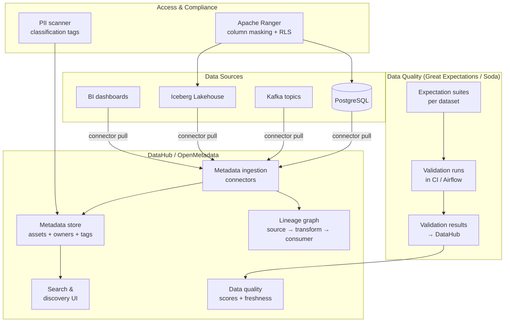

# Data Governance & Data Catalogue

## Category
Data Solutions, Data Governance, Data Catalogue, Data Lineage, Apache Atlas, DataHub, OpenMetadata, Data Quality, PII Classification

## Context

**Data governance** is the framework of policies, processes, and technologies that ensure data is accurate, consistent, discoverable, secure, and compliant. At scale, ungoverned data lakes become "data swamps" — nobody knows what data exists, where it came from, how current it is, or whether it contains PII.

### Governance pillars

| Pillar | What it addresses | Tools |
|--------|-----------------|-------|
| **Discoverability** | Can engineers find the data they need? | DataHub, OpenMetadata, Alation, Collibra |
| **Data lineage** | Where did this data come from? What depends on it? | DataHub, Apache Atlas, dbt lineage |
| **Data quality** | Is the data accurate, complete, and fresh? | Great Expectations, Soda, dbt tests |
| **PII classification** | Which columns contain personal data? | AWS Macie, Azure Purview, custom scanners |
| **Access control** | Who is allowed to see which data? | Apache Ranger, column-level masking, row-level security |
| **Data ownership** | Who is accountable for this dataset? | Catalogue domain metadata |
| **Retention & deletion** | Right to erasure, data lifecycle policies | Iceberg row-level deletes, scheduled purge jobs |

### Metadata model

```
Data Source → Dataset → Schema → Column
    ↳ Owner: engineering_team
    ↳ Domain: payments
    ↳ Sensitivity: CONFIDENTIAL (contains PII)
    ↳ SLO: freshness < 2 hours
    ↳ Quality score: 98.2%
    ↳ Lineage: raw.payments → silver.payments → gold.daily_revenue
```

### Data quality dimensions

| Dimension | Measurement |
|-----------|------------|
| **Completeness** | % of non-null values in mandatory columns |
| **Accuracy** | % of values matching expected format / range |
| **Consistency** | Same value appears in all copies of the data |
| **Timeliness** | Data freshness vs SLO (e.g., updated within 2 hours) |
| **Uniqueness** | % of duplicate rows in a unique-key dimension |
| **Validity** | Values conform to schema constraints and business rules |

---

## Pros

- **Self-service analytics**: Discoverable, well-documented datasets reduce the "who do I ask?" friction for analysts.
- **Impact analysis**: Lineage graph shows all downstream dashboards and models that would break if an upstream source changes.
- **Regulatory compliance**: GDPR/CCPA right-to-erasure requires knowing which tables contain which PII columns — impossible without a catalogue.
- **Shift-left data quality**: dbt tests and Great Expectations run in CI — data quality issues caught before they reach production dashboards.
- **Trust scores**: Datasets with automated freshness and quality monitoring have visible scores — analysts can assess data trustworthiness before using it.

---

## Cons

- **Bootstrap effort**: Documenting existing datasets in a catalogue requires significant upfront engineering and domain expert time.
- **Metadata staleness**: A catalogue only has value if metadata is kept current — requires automated sync from sources rather than manual updates.
- **Organisational friction**: Data ownership and governance require cross-team alignment — engineering resists "extra bureaucracy" without visible value.
- **Complex lineage at scale**: Lineage graphs for large organisations span thousands of assets — visualisation and navigation become challenging.
- **PII false positives/negatives**: Automated PII classifiers are imperfect — column named `notes` might contain PII, but auto-scanners miss it.

---

## Design Diagram



---

## Code Sample

### Python — Great Expectations: data quality suite for the payments dataset

```python
# data_quality/suites/payments_suite.py
# Great Expectations suite: validates payments data before it enters the Silver layer

import great_expectations as gx
from great_expectations.checkpoint import Checkpoint

context = gx.get_context()

# ─── Data source: Iceberg / Spark batch ───────────────────────────────────────
datasource = context.sources.add_spark(name="iceberg_silver")
data_asset  = datasource.add_dataframe_asset(name="payments_silver")

suite = context.add_or_update_expectation_suite("payments_silver_suite")

# ─── Expectations ─────────────────────────────────────────────────────────────

# Completeness
suite.add_expectation(gx.core.ExpectColumnValuesToNotBeNull(column="payment_id"))
suite.add_expectation(gx.core.ExpectColumnValuesToNotBeNull(column="amount_decimal"))
suite.add_expectation(gx.core.ExpectColumnValuesToNotBeNull(column="customer_id"))

# Business validity
suite.add_expectation(gx.core.ExpectColumnValuesToBeBetween(
    column="amount_decimal", min_value=0.01, max_value=1_000_000
))
suite.add_expectation(gx.core.ExpectColumnValuesToBeInSet(
    column="currency_code", value_set=["USD", "EUR", "GBP", "SGD", "AED"]
))
suite.add_expectation(gx.core.ExpectColumnValuesToBeInSet(
    column="payment_status",
    value_set=["pending", "completed", "failed", "refunded"],
))

# Uniqueness
suite.add_expectation(gx.core.ExpectColumnValuesToBeUnique(column="payment_id"))

# Freshness: most recent updated_at should be within the last 2 hours
suite.add_expectation(gx.core.ExpectColumnMaxToBeBetween(
    column="updated_at_utc",
    min_value="NOW() - INTERVAL '2 hours'",  # Handled in custom expectation
    max_value="NOW()",
))

# Referential completeness: >99.5% of customer_ids should resolve
suite.add_expectation(gx.core.ExpectColumnValuesToNotBeNull(
    column="customer_id",
    mostly=0.995,
))

context.save_expectation_suite(suite)
print("Expectation suite saved: payments_silver_suite")
```

### TypeScript — DataHub metadata push: register dataset with lineage

```typescript
// src/governance/datahub-registration.ts
// Registers a new dataset in DataHub with schema, ownership, and lineage metadata

const DATAHUB_GMS_URL = process.env.DATAHUB_GMS_URL!;  // e.g., http://datahub-gms:8080
const DATAHUB_TOKEN   = process.env.DATAHUB_TOKEN!;

interface DatasetMetadata {
  platform:     string;     // 'snowflake', 'iceberg', 'kafka'
  datasetName:  string;     // 'payments.silver.payments'
  env:          'PROD' | 'DEV' | 'STAGING';
  schema:       { name: string; type: string; description?: string; pii?: boolean }[];
  owners:       string[];   // DataHub user URNs
  description:  string;
  upstreamDatasets?: string[];  // URNs of upstream datasets for lineage
}

function toDatasetUrn(platform: string, name: string, env: string): string {
  return `urn:li:dataset:(urn:li:dataPlatform:${platform},${name},${env})`;
}

async function pushToDataHub(metadata: DatasetMetadata): Promise<void> {
  const datasetUrn = toDatasetUrn(metadata.platform, metadata.datasetName, metadata.env);

  // Build schema fields with PII tags
  const schemaFields = metadata.schema.map(f => ({
    fieldPath:   f.name,
    type:        { type: { com_linkedin_schema_StringType: {} } },
    description: f.description ?? '',
    tags:        f.pii ? {
      tags: [{
        tag: 'urn:li:tag:PII',
        context: 'Column contains personally identifiable information',
      }],
    } : undefined,
  }));

  const aspects = [
    // Schema metadata
    {
      entityUrn:  datasetUrn,
      entityType: 'dataset',
      aspect: {
        com_linkedin_schema_SchemaMetadata: {
          schemaName:  metadata.datasetName,
          platform:    `urn:li:dataPlatform:${metadata.platform}`,
          version:     0,
          created:     { time: Date.now(), actor: 'urn:li:corpuser:datahub' },
          lastModified: { time: Date.now(), actor: 'urn:li:corpuser:datahub' },
          hash:        '',
          platformSchema: { com_linkedin_schema_OtherSchema: { rawSchema: '' } },
          fields: schemaFields,
        },
      },
    },
    // Ownership
    {
      entityUrn:  datasetUrn,
      entityType: 'dataset',
      aspect: {
        com_linkedin_common_Ownership: {
          owners: metadata.owners.map(o => ({
            owner:     o,
            type:      'DATAOWNER',
            source:    { type: 'SERVICE' },
          })),
        },
      },
    },
    // Dataset properties (description, tags)
    {
      entityUrn:  datasetUrn,
      entityType: 'dataset',
      aspect: {
        com_linkedin_dataset_DatasetProperties: {
          description:  metadata.description,
          customProperties: { environment: metadata.env },
        },
      },
    },
    // Lineage
    ...(metadata.upstreamDatasets?.length ? [{
      entityUrn:  datasetUrn,
      entityType: 'dataset',
      aspect: {
        com_linkedin_dataset_UpstreamLineage: {
          upstreams: metadata.upstreamDatasets.map(upstream => ({
            dataset:    upstream,
            type:       'TRANSFORMED',
            auditStamp: { time: Date.now(), actor: 'urn:li:corpuser:datahub' },
          })),
        },
      },
    }] : []),
  ];

  const response = await fetch(`${DATAHUB_GMS_URL}/entities/v2`, {
    method: 'POST',
    headers: {
      'Content-Type':  'application/json',
      Authorization:   `Bearer ${DATAHUB_TOKEN}`,
    },
    body: JSON.stringify({ entities: [{ entityUrn: datasetUrn, aspects }] }),
  });

  if (!response.ok) {
    throw new Error(`DataHub push failed: ${response.status} ${await response.text()}`);
  }

  console.log(`Registered dataset in DataHub: ${datasetUrn}`);
}

// Usage example
await pushToDataHub({
  platform:    'iceberg',
  datasetName: 'silver.payments',
  env:         'PROD',
  description: 'Cleaned and deduped payments from the operational database',
  owners:      ['urn:li:corpuser:payments-team'],
  schema: [
    { name: 'payment_id',    type: 'STRING',  description: 'Unique payment identifier' },
    { name: 'customer_id',   type: 'STRING',  description: 'Customer identifier', pii: true },
    { name: 'amount_decimal', type: 'DECIMAL', description: 'Payment amount in full currency units' },
    { name: 'currency_code', type: 'STRING' },
    { name: 'payment_status', type: 'STRING' },
  ],
  upstreamDatasets: ['urn:li:dataset:(urn:li:dataPlatform:kafka,payments.events,PROD)'],
});
```
