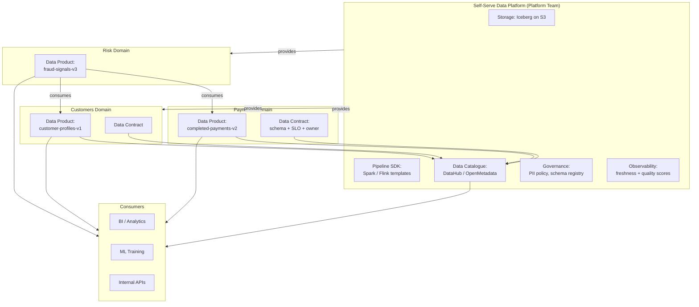

# Data Mesh Architecture

## Category

Data Solutions, Data Mesh, Domain Ownership, Data Product, Data Contract, Federated Governance, Self-Serve Data Infrastructure

## Context

**Data mesh** is a sociotechnical approach to data architecture that treats data as a product, assigns ownership to domain teams, and provides a self-serve data infrastructure platform — moving away from centralised data lakes and dedicated data engineering teams.

Proposed by Zhamak Dehghani (2019), it addresses the scalability failure mode of centralised data platforms: as organisations grow, a central data team becomes a bottleneck, data quality degrades (the team doesn't know the business domain), and pipelines proliferate unmanaged.

### Four data mesh principles

| Principle                              | Description                                                                                                           |
| -------------------------------------- | --------------------------------------------------------------------------------------------------------------------- |
| **Domain ownership**                   | Domain teams own, build, and serve their own data products                                                            |
| **Data as a product**                  | Data is treated with product thinking: discoverable, addressable, trustworthy, self-describing, interoperable, secure |
| **Self-serve data infrastructure**     | Platform team provides reusable infrastructure — pipelines, catalogues, storage — as a product                        |
| **Federated computational governance** | Global standards (schemas, PII policies, SLOs) enforced by platform; domain-level implementation                      |

### Data product qualities (Eight Vs)

| Quality                 | Description                                                               |
| ----------------------- | ------------------------------------------------------------------------- |
| **Discoverable**        | Registered in the central catalogue with description, owner, and tags     |
| **Addressable**         | Has a stable, globally unique URI / endpoint                              |
| **Trustworthy**         | SLO for freshness and quality published and monitored                     |
| **Self-describing**     | Schema, semantics, and lineage metadata attached                          |
| **Interoperable**       | Standard formats (Parquet, Avro, openAPI) for cross-domain consumption    |
| **Natively accessible** | Consumers access directly — no ETL required to consume the product        |
| **Secure**              | Access controlled by policy; PII classified and masked                    |
| **Valuable on its own** | Produces business value independently — not just a copy of another system |

### Data contract

A **data contract** is a machine-readable agreement between a data product owner and its consumers — defining schema, SLOs, semantics, and breaking-change policies:

```yaml
dataContract:
  id:         urn:data:payments:completed-payments:v2
  owner:      payments-domain-team
  version:    2.0.0
  freshness:  < 1 hour
  quality:    completeness > 99.5%, uniqueness: payment_id
  schema:     ...   # Avro / JSON Schema
  breakingChanges:
    policy: 90-day-deprecation-notice
```

---

## Pros

- **Scales with organisational growth**: Each domain team independently builds and evolves their data products — no central bottleneck.
- **Domain expertise**: The payments team knows payments data best — they produce higher-quality, better-documented data products.
- **Accountability**: Pager for a data product SLO breach goes to the domain team — not a separate data engineering team.
- **Reduced duplication**: Published, reusable data products replace 10 different teams each building their own "payment summary" pipeline.
- **Faster experimentation**: Domain teams iterate on their data products without waiting on a central team's sprint queue.

---

## Cons

- **Requires organisational maturity**: Data mesh fails without senior engineering support in domain teams — it is not yet suitable for all organisations.
- **Platform investment**: The self-serve infrastructure platform (the enabling layer) requires significant build effort before domains can be autonomous.
- **Governance tension**: Federated governance is conceptually sound but hard to enforce uniformly — standards drift across domains.
- **Discoverability sprawl**: Many data products across many domains create discovery challenges — strong catalogue tooling is essential.
- **Consumer experience complexity**: Consuming from multiple domain-owned data products (with different SLOs, schemas, and APIs) is more complex than querying one central warehouse.

---

## Design Diagram



---

## Code Sample

### YAML — Data contract definition (OpenDataContract standard)

```yaml
# data-products/payments/completed-payments-v2/datacontract.yaml
# Machine-readable data contract for the "completed-payments-v2" data product

id: urn:data:myorg:payments:completed-payments:v2
name: Completed Payments v2
version: 2.0.0

info:
  owner: payments-domain-team
  contact: payments-data@myorg.com
  description: >
    All successfully completed payment transactions emitted by the Payments
    service. Refreshed hourly from the operational database via CDC pipeline.
    Use for revenue analytics, merchant reconciliation, and fraud analysis.

  tags: [payments, transactions, revenue, pii-contains-customer-token]

# SLOs — published and monitored via DataHub + Grafana
slo:
  freshness: "< 1 hour" # Data is never more than 60 minutes old
  completeness: "> 99.5%" # At most 0.5% nulls on mandatory fields
  uniqueness: payment_id # payment_id is the unique business key
  availability: "99.9%" # Data product endpoint available 99.9% of the time

# Access paths — consumers use these endpoints, no ETL required
servers:
  production:
    type: iceberg
    catalog: glue
    database: gold
    table: completed_payments
    location: s3://myorg-lakehouse/gold/completed_payments/

  streaming:
    type: kafka
    topic: payments.completed.v2
    format: avro
    schema: "https://schema-registry.myorg.com/subjects/payments.completed.v2-value"

# Schema — Avro-compatible field definitions
schema:
  type: object
  fields:
    - name: payment_id
      type: string
      required: true
      description: Unique payment identifier (natural key from operational DB)

    - name: customer_token
      type: string
      required: true
      description: Pseudonymised customer identifier (PII tokenised via vault)
      pii: PSEUDONYMISED

    - name: merchant_id
      type: string
      required: true

    - name: amount
      type: decimal
      precision: 18
      scale: 2
      required: true
      description: Transaction amount in full currency units (not cents)

    - name: currency
      type: string
      enum: [USD, EUR, GBP, SGD]

    - name: completed_at
      type: timestamp
      required: true

# Breaking change policy
breakingChanges:
  policy: 90-day-deprecation-notice
  minorChanges: backward-compatible-only
  contact: payments-data@myorg.com
```

### TypeScript — Data product registration in the catalogue

```typescript
// src/data-mesh/register-data-product.ts
// Reads the datacontract.yaml and registers the data product in DataHub + Grafana SLO monitor

import { readFileSync } from "fs";
import { parse as yaml } from "yaml";

interface DataContract {
  id: string;
  name: string;
  version: string;
  info: { owner: string; contact: string; description: string; tags: string[] };
  slo: { freshness: string; completeness: string; availability: string };
  servers: Record<
    string,
    { type: string; table?: string; topic?: string; location?: string }
  >;
}

async function registerDataProduct(contractPath: string): Promise<void> {
  const contractRaw = readFileSync(contractPath, "utf8");
  const contract = yaml.parse(contractRaw) as DataContract;

  console.log(
    `Registering data product: ${contract.id} (v${contract.version})`,
  );

  // ── Push to DataHub catalogue ──────────────────────────────────────────────
  const datahubPayload = {
    entityUrn: `urn:li:dataset:(urn:li:dataPlatform:iceberg,${contract.id},PROD)`,
    aspects: [
      {
        com_linkedin_dataset_DatasetProperties: {
          name: contract.name,
          description: contract.info.description,
          customProperties: {
            version: contract.version,
            owner: contract.info.owner,
            contact: contract.info.contact,
            slo_freshness: contract.slo.freshness,
          },
          tags: contract.info.tags,
        },
      },
    ],
  };

  const catalogueRes = await fetch(
    `${process.env.DATAHUB_GMS_URL}/entities/v2`,
    {
      method: "POST",
      headers: {
        "Content-Type": "application/json",
        Authorization: `Bearer ${process.env.DATAHUB_TOKEN}`,
      },
      body: JSON.stringify({ entities: [datahubPayload] }),
    },
  );

  if (!catalogueRes.ok)
    throw new Error(`DataHub registration failed: ${catalogueRes.status}`);

  // ── Create Prometheus SLO alert rule for freshness ─────────────────────────
  // (Alertmanager will notify the owner if the data product goes stale)
  const productId = contract.id.replace(/[^a-z0-9]/gi, "_").toLowerCase();
  const sloRule = {
    alert: `DataProductFreshnessViolation_${productId}`,
    expr: `time() - data_product_last_updated_timestamp{product="${productId}"} > 3600`, // 1 hour
    for: "5m",
    labels: { severity: "warning", team: contract.info.owner },
    annotations: {
      summary: `Data product ${contract.name} is stale`,
      description: `${contract.name} has not been updated in over 1 hour. SLO: ${contract.slo.freshness}. Contact: ${contract.info.contact}`,
    },
  };

  console.log("SLO alert rule generated:", JSON.stringify(sloRule, null, 2));
  console.log(`Data product ${contract.id} registered successfully.`);
}

registerDataProduct("./datacontract.yaml");
```
