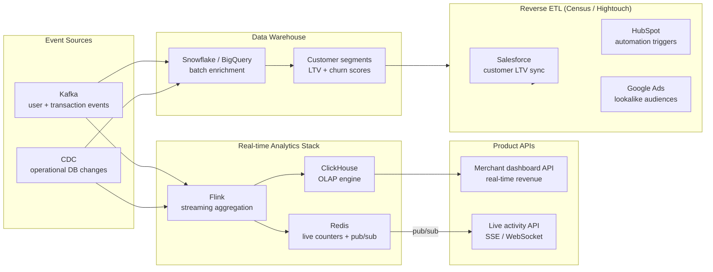

# Real-time Analytics & Reverse ETL

## Category

Data Solutions, Real-time Analytics, Reverse ETL, Operational Analytics, Embedded Analytics, Census, Hightouch, BI-as-Code

## Context

**Real-time analytics** delivers query results within seconds of the underlying events occurring — powering live dashboards, personalised user experiences, and operational decision making. **Reverse ETL** completes the data loop by syncing enriched warehouse data back into operational systems (CRM, marketing automation, customer support tools) — making analytical insights actionable.

### Real-time analytics delivery patterns

| Pattern                                 | Latency          | Best for                                        |
| --------------------------------------- | ---------------- | ----------------------------------------------- |
| **Live dashboard (push)**               | < 1s             | Operations dashboards, trading floors           |
| **Near real-time query**                | 1–30s            | Business KPI dashboards                         |
| **Pre-aggregated materialized views**   | < 100 ms query   | Consumer-facing product analytics               |
| **ClickHouse / Druid OLAP**             | < 1s on raw data | High-concurrency analytical queries             |
| **Streaming aggregation (Flink/Kafka)** | Milliseconds     | Embedded product features (live activity count) |

### Reverse ETL use cases

| Sync target                     | Data product                                  | Business use              |
| ------------------------------- | --------------------------------------------- | ------------------------- |
| **Salesforce CRM**              | Customer LTV, churn probability               | Sales prioritisation      |
| **HubSpot / Marketo**           | Engagement score, product usage segment       | Triggered email campaigns |
| **Zendesk**                     | Customer health score, recent transactions    | Support agent context     |
| **Slack**                       | Daily business KPIs                           | Exec digest notifications |
| **Ad platforms (Google, Meta)** | Lookalike audiences from DW customer segments | Targeted acquisition      |

### Embedded product analytics patterns

| Approach                      | Description                              | Example                             |
| ----------------------------- | ---------------------------------------- | ----------------------------------- |
| **Aggregation API**           | Backend queries OLAP, returns JSON       | Merchant dashboard: today's revenue |
| **Streaming counter**         | Redis sorted set / Flink window → API    | "1,234 active users right now"      |
| **Pre-computed metrics**      | Materialised view queried by product API | User's spend this month             |
| **Event-sourced projections** | Kafka → read model per user              | Transaction history page            |

---

## Pros

- **Operational decision making**: Live dashboards give sales, ops, and customer service teams current information — not yesterday's data.
- **Embedded analytics differentiation**: Showing merchants their real-time revenue in-product is a competitive feature — no BI tool required.
- **Reverse ETL closes the loop**: Analytical insights (churn risk, LTV) flow back into the tools teams already use — no manual exports.
- **Reduced BI tool dependency**: Product teams can query pre-aggregated results directly via API — analytics is a product feature, not a BI report.
- **Audience activation speed**: Updated customer segments in the DW are synced to ad platforms in minutes — not overnight batch jobs.

---

## Cons

- **Infrastructure cost**: Real-time materialisation (Flink) + OLAP cluster (ClickHouse) + streaming aggregation (Redis) adds significant cost vs batch-only.
- **Query complexity at low latency**: Ad-hoc real-time queries on raw events are harder to optimise — require careful pre-aggregation design.
- **Reverse ETL schema coupling**: The warehouse schema must match what CRM/marketing tools expect — schema changes in the DW break syncs.
- **Idempotency in reverse ETL**: Sync failures followed by retries can duplicate records in the target system — requires upsert logic and dedup keys.
- **Observability gap**: Real-time pipelines are harder to debug than batch — a dropped message may not surface until a SLO breach is detected.

---

## Design Diagram



---

## Code Sample

### TypeScript — Real-time merchant dashboard API (ClickHouse + SSE)

```typescript
// src/analytics/merchant-dashboard.ts
// Real-time merchant revenue API: queries ClickHouse + streams live counter via SSE

import express, { Request, Response } from "express";
import { createClient as createClickHouseClient } from "@clickhouse/client";
import { createClient as createRedisClient } from "redis";

const app = express();
const ch = createClickHouseClient({
  url: process.env.CLICKHOUSE_URL!,
  username: process.env.CLICKHOUSE_USER!,
  password: process.env.CLICKHOUSE_PASSWORD!,
});

const redis = createRedisClient({ url: process.env.REDIS_URL! });
await redis.connect();

// ─── REST endpoint: merchant revenue summary ──────────────────────────────────
app.get(
  "/api/merchants/:merchantId/revenue",
  async (req: Request, res: Response) => {
    const { merchantId } = req.params;
    const { period = "today" } = req.query;

    const dateFilter =
      period === "today"
        ? `toDate(event_ts) = today()`
        : `event_ts >= now() - INTERVAL 7 DAY`;

    try {
      const result = await ch.query({
        query: `
        SELECT
            toStartOfHour(event_ts)    AS hour,
            sum(revenue)               AS revenue,
            sum(tx_count)              AS transactions,
            currency
        FROM merchant_hourly_revenue
        WHERE merchant_id = {merchantId: String}
          AND ${dateFilter}
          AND currency IN ('USD', 'EUR', 'GBP')
        GROUP BY hour, currency
        ORDER BY hour ASC
      `,
        query_params: { merchantId },
        format: "JSONEachRow",
      });

      const rows = await result.json();
      res.json({ merchantId, period, data: rows });
    } catch (err) {
      console.error("ClickHouse query error:", err);
      res.status(500).json({ error: "Analytics query failed" });
    }
  },
);

// ─── SSE endpoint: live transaction counter ───────────────────────────────────
// Pushed from Kafka consumer → Redis pub/sub → SSE to browser
app.get("/api/merchants/:merchantId/live", (req: Request, res: Response) => {
  const { merchantId } = req.params;

  res.setHeader("Content-Type", "text/event-stream");
  res.setHeader("Cache-Control", "no-cache");
  res.setHeader("Connection", "keep-alive");
  res.setHeader("Access-Control-Allow-Origin", "*");

  // Send initial state from Redis counter
  redis.get(`merchant:${merchantId}:tx_count_today`).then((count) => {
    res.write(
      `data: ${JSON.stringify({ txCount: parseInt(count ?? "0", 10) })}\n\n`,
    );
  });

  // Subscribe to Redis pub/sub for live updates
  const subscriber = redis.duplicate();
  subscriber.connect().then(() => {
    subscriber.subscribe(`merchant:${merchantId}:events`, (message) => {
      res.write(`data: ${message}\n\n`);
    });
  });

  req.on("close", () => {
    subscriber.unsubscribe().then(() => subscriber.disconnect());
  });
});

app.listen(3000, () => console.log("Dashboard API listening on :3000"));
```

### Python — Reverse ETL: sync customer segments from Snowflake to Salesforce

```python
# reverse_etl/sync_customer_ltv_to_salesforce.py
# Syncs customer LTV + churn probability from Snowflake to Salesforce Contact records

import os
import snowflake.connector
from simple_salesforce import Salesforce
from typing import Iterator

SNOWFLAKE_BATCH_SIZE = 1000

def fetch_customer_segments(cursor) -> Iterator[list[dict]]:
    """Stream customer segments from Snowflake in batches."""
    cursor.execute("""
        SELECT
            customer_id,
            lifetime_value,
            churn_probability,
            customer_segment,
            DATEDIFF('day', last_purchase_date, CURRENT_DATE) AS days_since_last_purchase
        FROM gold.customer_ltv_scores
        WHERE updated_at >= DATEADD('hour', -24, CURRENT_TIMESTAMP)   -- Incremental: only updated rows
        ORDER BY customer_id
    """)

    while True:
        rows = cursor.fetchmany(SNOWFLAKE_BATCH_SIZE)
        if not rows:
            break
        yield [
            {
                "customer_id":            row[0],
                "lifetime_value":         float(row[1]),
                "churn_probability":      float(row[2]),
                "customer_segment":       row[3],
                "days_since_last_purchase": int(row[4]),
            }
            for row in rows
        ]

def sync_to_salesforce(sf: Salesforce, batch: list[dict]) -> None:
    """Upsert customer segment data into Salesforce Contact records."""
    records = [
        {
            # Salesforce External ID field mapped to our customer_id
            "Customer_ID__c":              r["customer_id"],
            "LTV_Score__c":               r["lifetime_value"],
            "Churn_Probability__c":       r["churn_probability"],
            "Customer_Segment__c":        r["customer_segment"],
            "Days_Since_Last_Purchase__c": r["days_since_last_purchase"],
        }
        for r in batch
    ]

    # Salesforce bulk upsert on the external ID field
    result = sf.bulk.Contact.upsert(records, "Customer_ID__c", batch_size=200)

    success = sum(1 for r in result if r["success"])
    failed  = [r for r in result if not r["success"]]

    print(f"Batch synced: {success} success, {len(failed)} failed")
    if failed:
        for f in failed[:3]:
            print(f"  Error: {f.get('errors')}")

def run_sync() -> None:
    sf_conn = Salesforce(
        username       = os.environ["SF_USERNAME"],
        password       = os.environ["SF_PASSWORD"],
        security_token = os.environ["SF_SECURITY_TOKEN"],
        domain         = "login",
    )

    with snowflake.connector.connect(
        account   = os.environ["SNOWFLAKE_ACCOUNT"],
        user      = os.environ["SNOWFLAKE_USER"],
        password  = os.environ["SNOWFLAKE_PASSWORD"],
        warehouse = os.environ["SNOWFLAKE_WAREHOUSE"],
        database  = "ANALYTICS",
        schema    = "GOLD",
    ) as conn:
        cursor = conn.cursor()
        total  = 0
        for batch in fetch_customer_segments(cursor):
            sync_to_salesforce(sf_conn, batch)
            total += len(batch)
        print(f"Reverse ETL complete: {total} records synced to Salesforce")

if __name__ == "__main__":
    run_sync()
```
